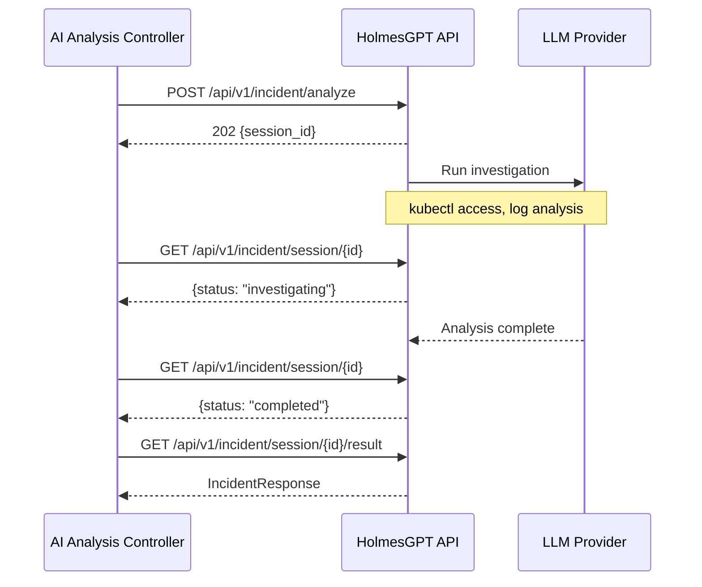

# HolmesGPT API

HolmesGPT is a **Python FastAPI** service that wraps LLM calls with live Kubernetes access for root cause analysis. The AI Analysis controller communicates with it using a **session-based asynchronous** pattern.

!!! note "OpenAPI Spec"
    The full OpenAPI 3.1.0 specification is available at [`holmesgpt-api/api/openapi.json`](https://github.com/jordigilh/kubernaut/blob/main/holmesgpt-api/api/openapi.json) in the main repository. The Go client (`pkg/holmesgpt/client/`) uses the generated ogen client for all endpoints, including session management (DD-HAPI-003).

## Base URL

```
http://holmesgpt-api.kubernaut-system.svc.cluster.local:8080
```

Internal services use the short form `http://holmesgpt-api:8080` when communicating within the same namespace.

## Session-Based Async Pattern

The API uses a submit-poll-result pattern to handle long-running LLM investigations:



## Endpoints

### Incident Analysis

#### Submit Investigation

```
POST /api/v1/incident/analyze
```

Starts an asynchronous investigation session.

**Request**: `IncidentRequest` — enriched signal data, target resource, analysis parameters

**Response**: `202 Accepted`

```json
{
  "session_id": "550e8400-e29b-41d4-a716-446655440000"
}
```

#### Poll Session Status

```
GET /api/v1/incident/session/{session_id}
```

Returns the current status of an investigation session.

**Response**: `200 OK`

```json
{
  "status": "investigating",
  "progress": "Analyzing pod logs..."
}
```

Session statuses: `pending`, `investigating`, `completed`, `failed`

**Response**: `404 Not Found` — Session does not exist (e.g., after pod restart). The AI Analysis controller handles this by regenerating the session (up to 5 attempts per BR-AA-HAPI-064.5/064.6).

#### Get Session Result

```
GET /api/v1/incident/session/{session_id}/result
```

Returns the analysis result when the session is complete.

**Response**: `200 OK` — `IncidentResponse` with RCA, selected workflow, and confidence score

**Response**: `409 Conflict` — Session not yet complete

### Health

| Method | Path | Description |
|---|---|---|
| `GET` | `/health` | Liveness probe |
| `GET` | `/ready` | Readiness probe (includes LLM connectivity) |
| `GET` | `/config` | Configuration snapshot (dev mode only) |
| `GET` | `/metrics` | Prometheus metrics |

## Session Management

- Sessions are stored **in-memory** in the HolmesGPT API pod
- If the pod restarts, sessions are lost — the AI Analysis controller handles this by regenerating sessions (up to 5 attempts)
- Session results are available until the pod restarts or the session is garbage-collected

## LLM Providers

HolmesGPT uses **LiteLLM** under the hood, supporting any compatible provider:

| Provider | Configuration |
|---|---|
| OpenAI | `provider: openai`, `model: gpt-4o` |
| Vertex AI | `provider: vertex_ai`, `model: gemini-2.5-pro`, `gcpProjectId`, `gcpRegion` |
| Azure OpenAI | `provider: azure`, `model: gpt-4o`, `endpoint` |
| Any LiteLLM provider | See [LiteLLM documentation](https://docs.litellm.ai/docs/providers) |

## Next Steps

- [AI Analysis Architecture](../architecture/ai-analysis.md) — How the controller uses this API
- [DataStorage API](datastorage-api.md) — Audit and workflow APIs
- [Configuration Reference](../user-guide/configuration.md) — LLM provider settings
