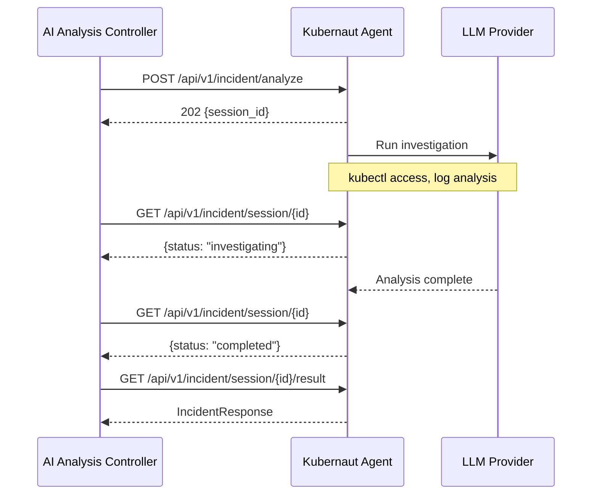

# Kubernaut Agent API

The Kubernaut Agent is a **Go** service that wraps LLM calls with live Kubernetes access for root cause analysis. The AI Analysis controller communicates with it using a **session-based asynchronous** pattern.

!!! note "OpenAPI Spec"
    The full OpenAPI 3.1.0 specification is available at [`internal/kubernautagent/api/openapi.json`](https://github.com/jordigilh/kubernaut/blob/main/internal/kubernautagent/api/openapi.json) in the main repository. The Go client (`pkg/kubernautagent/client/`) uses the generated ogen client for all endpoints, including session management (DD-HAPI-003).

!!! note "OpenAPI enum values"
    Kubernaut Agent API enums are defined per schema and include lowercase and snake_case values. Always follow the enum values declared in the OpenAPI spec for each field.

## Base URL

```
https://kubernaut-agent.kubernaut-system.svc.cluster.local:8080
```

Internal services use the short form `https://kubernaut-agent:8080` when communicating within the same namespace (HTTPS when inter-service TLS is enabled).

## Session-Based Async Pattern

The API uses a submit-poll-result pattern to handle long-running LLM investigations:



## Endpoints

### Incident Analysis

#### Submit Investigation

```
POST /api/v1/incident/analyze
```

Starts an asynchronous investigation session.

**Request**: `IncidentRequest` — enriched signal data, target resource, analysis parameters

**Response**: `202 Accepted`

```json
{
  "session_id": "550e8400-e29b-41d4-a716-446655440000"
}
```

#### Poll Session Status

```
GET /api/v1/incident/session/{session_id}
```

Returns the current status of an investigation session.

**Response**: `200 OK`

```json
{
  "status": "investigating",
  "progress": "Analyzing pod logs..."
}
```

Session statuses: `pending`, `investigating`, `completed`, `failed`

**Response**: `404 Not Found` — Session does not exist (e.g., after pod restart). The AI Analysis controller handles this by regenerating the session (up to 5 attempts per BR-AA-HAPI-064.5/064.6).

#### Get Session Result

```
GET /api/v1/incident/session/{session_id}/result
```

Returns the analysis result when the session is complete.

**Response**: `200 OK` — `IncidentResponse` with RCA, selected workflow, confidence score, and `actionable` flag

Key response fields:

| Field | Type | Description |
|---|---|---|
| `root_cause` | string | Natural language root cause explanation |
| `confidence` | float | Investigation confidence (0.0--1.0) |
| `investigation_outcome` | string | Outcome classification (e.g., `resolved`, `workflow_selected`) |
| `selected_workflow` | object | Workflow recommendation (name, action type, parameters) |
| `actionable` | boolean | Whether the investigation identified a concrete remediation action |
| `remediation_target` | object | Target resource (kind, name, namespace) — constructed by the AA controller from KA's `root_owner` tool result, not a direct KA response field |
| `detected_labels` | object | Infrastructure labels detected during investigation |

**Response**: `409 Conflict` — Session not yet complete

#### Runtime Configuration

```
GET /config
```

Returns the current runtime configuration snapshot (available on the API port).

### Audit: investigation completion

Audit events of type `aiagent.response.complete` include LLM token totals on the payload: **`total_prompt_tokens`** and **`total_completion_tokens`**, for cost and usage tracking in the audit trail.

### Health and metrics (v1.3+)

Liveness and readiness are on **port 8081** (plain HTTP): `GET /healthz`, `GET /readyz` (readiness checks SDK, context API, and Prometheus client). **Prometheus** metrics are on **port 9090** (`GET /metrics`, plain HTTP). The primary REST API remains on **port 8080** (**HTTPS** when inter-service TLS is configured).

| Method | Port | Path | Description |
|---|---|---|---|
| `GET` | 8081 | `/healthz` | Liveness |
| `GET` | 8081 | `/readyz` | Readiness |
| `GET` | 8080 | `/config` | Configuration snapshot (dev mode only) |
| `GET` | 9090 | `/metrics` | Prometheus metrics |

## Error Responses

All error responses (4xx, 5xx) use [RFC 7807 Problem Details](index.md#error-responses-rfc-7807) format with `Content-Type: application/problem+json`. See the [error type catalog](index.md#error-type-catalog) for the full list of error types.

**Example** (session not ready):

```json
{
  "type": "https://kubernaut.ai/problems/conflict",
  "title": "Conflict",
  "detail": "Session is still investigating, result not yet available",
  "status": 409
}
```

## Session Management

- Sessions are stored **in-memory** in the Kubernaut Agent pod
- If the pod restarts, sessions are lost — the AI Analysis controller handles this by regenerating sessions (up to 5 attempts)
- Session results are available until the pod restarts or the session is garbage-collected

## LLM Providers

The Kubernaut Agent uses **LangChainGo** for LLM integration, supporting the following providers:

| Provider | Config `llm.provider` | Implementation |
|---|---|---|
| OpenAI (or compatible) | `openai` | LangChainGo `llms/openai` |
| Ollama | `ollama` | LangChainGo `llms/ollama` |
| Azure OpenAI | `azure` | LangChainGo `llms/openai` (Azure API type) |
| Vertex AI (Gemini) | `vertex` | LangChainGo `llms/googleai/vertex` |
| Claude on Vertex AI | `vertex_ai` | Anthropic Go SDK (not LangChainGo) |
| Anthropic (direct) | `anthropic` | LangChainGo `llms/anthropic` |
| Amazon Bedrock | `bedrock` | LangChainGo `llms/bedrock` |
| Hugging Face | `huggingface` | LangChainGo `llms/huggingface` |
| Mistral | `mistral` | LangChainGo `llms/mistral` |

!!! warning "Vertex AI provider distinction"
    `vertex` = Gemini models on Vertex AI. `vertex_ai` = Anthropic Claude models on Vertex AI. These use separate code paths and different authentication methods.

**OpenAI-compatible endpoints**: Use `provider: "openai"` with `endpoint` set to the server origin **without** `/v1` (the agent appends `/v1` automatically). Works for vLLM, LocalAI, TGI, and any OpenAI-compatible server.

## Next Steps

- [AI Analysis Architecture](../architecture/ai-analysis.md) — How the controller uses this API
- [DataStorage API](datastorage-api.md) — Audit and workflow APIs
- [Kubernaut Agent SDK Config](../user-guide/configmap-kubernaut-agent.md) — SDK configuration reference
- [Configuration Reference](../user-guide/configuration.md) — LLM provider settings
