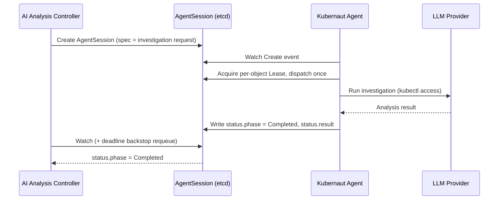

# Kubernaut Agent API

The Kubernaut Agent is a **Go** service that wraps LLM calls with live Kubernetes access for root cause analysis.

!!! warning "v1.6: the REST session API described here through v1.5 is retired"
    Through v1.5, this page documented a submit-poll-result REST API (`POST /api/v1/incident/analyze`, `GET /api/v1/incident/session/{id}`, `GET .../result`). **As of v1.6** (DD-AA-KA-001), none of these endpoints exist anymore — confirmed directly against the route table (`registerAPIRoutes` in `cmd/kubernautagent/routes.go`), which mounts only `/api/v1/mcp` on the primary port (when interactive mode is enabled). The AI Analysis controller and Kubernaut Agent now communicate exclusively through the **`AgentSession` CRD** — see below.

!!! note "OpenAPI Spec"
    The retired REST session API's OpenAPI 3.1.0 spec (`internal/kubernautagent/api/openapi.json`) and its generated ogen client (`pkg/kubernautagent/client/`) are no longer the AA↔KA channel. What remains of the primary port's OpenAPI surface is the interactive MCP endpoint's tool schemas — see [MCP Tool Reference](mcp-tools.md).

## Base URL

```
https://kubernaut-agent.kubernaut-system.svc.cluster.local:8443
```

Internal services use the short form `https://kubernaut-agent:8443` when communicating within the same namespace. **As of v1.6, the only route on this port is `/api/v1/mcp`** (mounted when [`interactive.enabled`](../user-guide/configuration.md) is `true`) — there is no other REST endpoint here. Health, readiness, and metrics are on separate ports (see below).

## AgentSession CRD Channel (v1.6) {: #agentsession-crd-channel-v16 }

The AI Analysis controller and Kubernaut Agent communicate through the **`AgentSession`** custom resource — a Kubernetes-native create/watch/status channel, not HTTP:

1. **Create** — The AI Analysis controller creates an `AgentSession` CRD (owned by the `AIAnalysis` CR) with the investigation request in `spec` — a 1:1, lossless translation of the fields the retired HTTP request body carried.
2. **Dispatch** — Kubernaut Agent runs its own internal `controller-runtime` Manager + Reconciler watching for `AgentSession` Create/Update events. On first observation, it acquires a per-object coordination `Lease` and dispatches the investigation exactly once.
3. **Investigate** — Kubernaut Agent uses live `kubectl` access and (optionally) Prometheus to run the investigation with the LLM.
4. **Write status** — Kubernaut Agent is the **exclusive writer** of `AgentSession.status`: phase (`Pending`/`Investigating`/`Completed`/`Failed`/`Cancelled`), and on `Completed`, the full curated `AgentSessionResult`.
5. **Watch** — The AI Analysis controller watches the `AgentSession` for status changes (a Kubernetes watch, not polling), backstopped by a deadline-driven requeue that catches a hung Kubernaut Agent even if the watch itself is missed.



**Cancellation** is a **delete** of the `AgentSession` object, not a status write — Kubernaut Agent's `Dispatcher.cancelOnDelete` stops the in-flight investigation goroutine when it observes the delete.

**Crash recovery** — If a Kubernaut Agent replica crashes mid-dispatch, its per-object Lease expires and is reclaimed by another (or the restarted) replica, which redispatches the `Pending` `AgentSession`. This replaces the pre-v1.6 model, where the AI Analysis controller itself regenerated lost sessions (up to 5 attempts) because sessions lived only in Kubernaut Agent's process memory.

See [AgentSession CRD Reference](crds.md#agentsession) for the full spec/status schema, and [AI Analysis Architecture](../architecture/ai-analysis.md#agentsession-based-async-pattern) for the controller-side flow.

## Interactive MCP Mode (v1.5+)

v1.5 adds interactive MCP session support to the Kubernaut Agent, layered on top of the same `AgentSession` channel above. Interactive tools are **not exposed as separate REST endpoints** — they are registered on the go-sdk MCP server (`internal/kubernautagent/mcp/`) and accessed via MCP Streamable HTTP, either directly at `POST /api/v1/mcp` or (for external MCP/A2A clients) proxied through the API Frontend's `POST /mcp` endpoint.

Kubernaut Agent's own MCP server registers **4 tools**:

| MCP Tool | Description |
|---|---|
| `kubernaut_investigate` | 8-action tool: start, message, complete, cancel, takeover, status, reconnect, discover_workflows |
| `kubernaut_select_workflow` | Select a workflow from discovery results; triggers enrichment and catalog lookup |
| `kubernaut_complete_no_action` | Close investigation without selecting a workflow |
| `kubernaut_list_workflows` | List the workflow catalog directly, without an active investigation session (v1.6, DD-WORKFLOW-019 — added when the catalog moved from DataStorage to Kubernaut Agent's own in-memory cache) |

See [Interactive Sessions](../user-guide/interactive-sessions.md) for the full tool schemas and operator guide, and [MCP Tool Reference](mcp-tools.md) for how the API Frontend exposes these to external MCP/A2A clients.

### Real-time streaming

Interactive investigation output streams over the **MCP connection itself**, using the Streamable HTTP transport's `text/event-stream` response mode (`Accept: text/event-stream`) — there is no separate REST SSE endpoint. `SSEHeadersMiddleware` sets the proxy anti-buffering headers (`Cache-Control`, `Connection`, `X-Accel-Buffering`) needed for this to work through ingress/reverse proxies. The API Frontend subscribes to the same MCP stream and relays events to its own clients.

## Session Management

- **Both autonomous and interactive investigations are backed by the `AgentSession` CRD** (etcd-durable) plus a Kubernetes **Lease** for dispatch coordination — a crashing Kubernaut Agent replica no longer loses an in-flight investigation the way the pre-v1.6 in-memory session model did (see [Crash recovery](#agentsession-crd-channel-v16) above).
- **Interactive sessions** additionally use a **second** Lease (prefix: `kubernaut-interactive-`) for distributed locking of the human-driver seat. The `LeaseSessionManager` handles session creation, takeover (SEC-TAKEOVER-001), and TTL enforcement. Orphaned Leases are reclaimed on startup. The `SessionDrainer` gracefully drains active sessions on pod shutdown (BR-OPS-013).
- Session results live on the `AgentSession` object until it is garbage-collected (cascades from the owning `AIAnalysis`/`RemediationRequest`).

## LLM Providers

**As of v1.6** (DD-PLATFORM-007), LangChainGo has been removed. Kubernaut Agent uses native SDKs per provider family:

| Provider | Config `llm.provider` | Implementation |
|---|---|---|
| Anthropic (direct) | `anthropic` | `anthropic-sdk-go` (native) |
| Gemini (direct) | `gemini` | `google.golang.org/genai` (native) |
| Vertex AI | `vertex_ai` | Auto-disambiguated by model name — Claude models (`claude-*`) route to the native Anthropic client configured for Vertex; Gemini models (`gemini-*`) route to the native Gemini client configured for Vertex |
| OpenAI | `openai` | OpenAI-compatible client |
| OpenAI-compatible | `openai_compatible` | Same client as `openai` — works for vLLM, Ollama, LlamaStack, DeepSeek, TGI, and any OpenAI-compatible server |

!!! warning "Provider set reduced in v1.6"
    `ollama`, `azure`, `bedrock`, `huggingface`, and `mistral` are **no longer separate provider values**. Ollama, Azure OpenAI, and other OpenAI-compatible servers now use `provider: "openai_compatible"` with `endpoint` set to the server origin. Bedrock, Hugging Face, and Mistral have no v1.6 native equivalent. See [Configuration Reference](../user-guide/configuration.md) for the current `llmProfiles` shape (DD-PLATFORM-007).

!!! warning "Vertex AI model disambiguation"
    `vertex_ai` can host either Claude or Gemini models. Kubernaut Agent inspects the configured `model` to route to the right native client, and fails fast at startup if the model matches neither the `claude-*` nor `gemini-*` family.

**OpenAI-compatible endpoints**: Use `provider: "openai_compatible"` with `endpoint` set to the server origin **without** `/v1` (the agent appends `/v1` automatically).

## Health and metrics (v1.3+)

Liveness and readiness are on **port 8081** (plain HTTP): `GET /healthz`, `GET /readyz` (readiness checks SDK, context API, and Prometheus client). **Prometheus** metrics are on **port 9090** (`GET /metrics`, plain HTTP). The primary port (8443, HTTPS) serves only `/api/v1/mcp` (when enabled) and `/config`.

| Method | Port | Path | Description |
|---|---|---|---|
| `GET` | 8081 | `/healthz` | Liveness |
| `GET` | 8081 | `/readyz` | Readiness |
| `GET` | 8443 | `/config` | Configuration snapshot (dev mode only) |
| `GET` | 9090 | `/metrics` | Prometheus metrics |

## Audit: investigation completion

Audit events of type `aiagent.response.complete` include LLM token totals on the payload: **`total_prompt_tokens`** and **`total_completion_tokens`**, for cost and usage tracking in the audit trail.

## Next Steps

- [AI Analysis Architecture](../architecture/ai-analysis.md) — How the controller uses the `AgentSession` channel
- [AgentSession CRD Reference](crds.md#agentsession) — Full spec/status schema
- [DataStorage API](datastorage-api.md) — Audit API (the workflow catalog REST surface described here through v1.5 is retired — see that page)
- [Kubernaut Agent SDK Config](../user-guide/configmap-kubernaut-agent.md) — SDK configuration reference
- [Configuration Reference](../user-guide/configuration.md) — LLM provider settings
