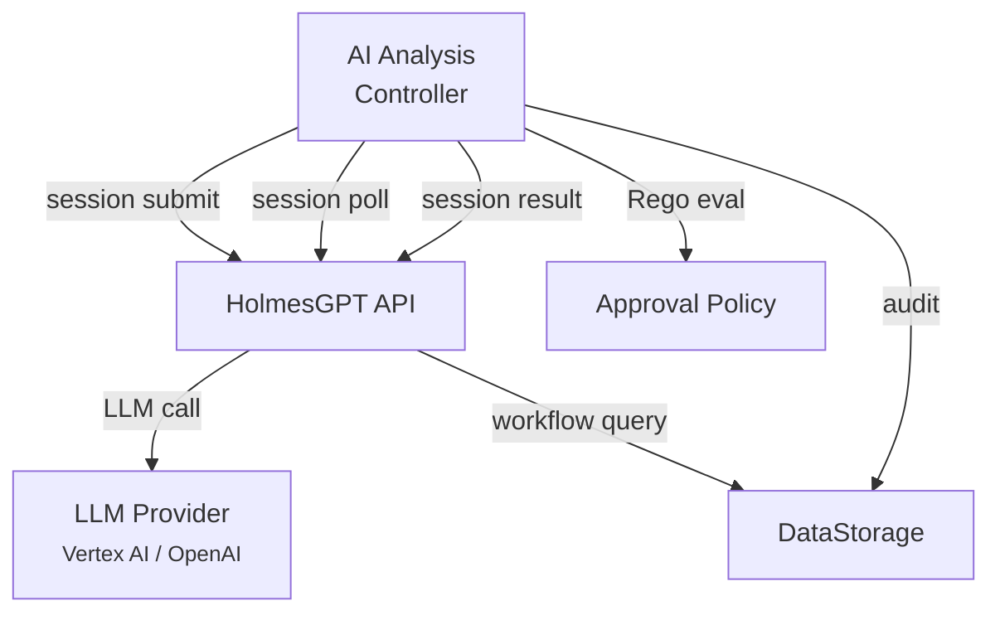
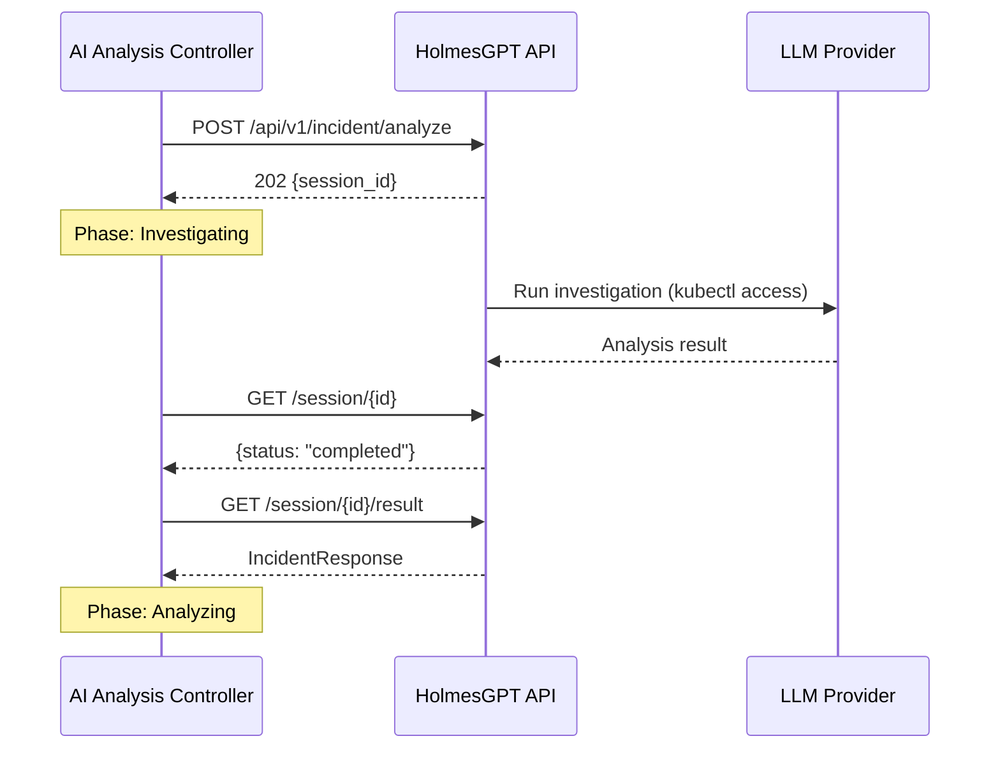

# AI Analysis

The AI Analysis service performs root cause investigation using an LLM (via HolmesGPT) and decides whether the selected workflow should be auto-approved or require human review.

!!! abstract "CRD Reference"
    For the complete AIAnalysis CRD specification, see [API Reference: CRDs](../api-reference/crds.md#aianalysis).

## Architecture

## Session-Based Async Pattern

The AI Analysis controller communicates with HolmesGPT using a **session-based asynchronous** pattern (BR-AA-HAPI-064):

### Flow

1. **Submit** — `POST /api/v1/incident/analyze` → `202 Accepted` + `session_id`
2. **Poll** — `GET /api/v1/incident/session/{session_id}` → status (`pending`, `investigating`, `completed`, `failed`)
3. **Result** — `GET /api/v1/incident/session/{session_id}/result` → full analysis

This pattern avoids long HTTP timeouts and allows the controller to use Kubernetes-native requeue mechanisms (`RequeueAfter`) while the LLM investigation runs. The controller polls at a **constant 15-second interval** (configurable from 1s to 5m via `--session-poll-interval` flag or `WithSessionPollInterval` option).

### Session Recovery

If HolmesGPT API restarts and returns `404` for a session, the controller regenerates the session (up to 5 attempts per BR-AA-HAPI-064.5/064.6).

## Timeout Configuration

The Orchestrator passes per-analysis timeout configuration via the AIAnalysis CRD spec:

| Field | Default | Description |
|---|---|---|
| `investigatingTimeout` | Inherited from RR | Maximum time in the Investigating phase |
| `analyzingTimeout` | Inherited from RR | Maximum time in the Analyzing phase |

If either timeout expires, the AIAnalysis transitions to `Failed`.

## Phases

| Phase | Description |
|---|---|
| `Pending` | CRD created by Orchestrator |
| `Investigating` | Session submitted to HolmesGPT, polling for completion |
| `Analyzing` | Results received, evaluating Rego approval policy |
| `Completed` | Analysis and approval decision recorded |
| `Failed` | Investigation or analysis failed |

## HolmesGPT Investigation

HolmesGPT is a Python FastAPI service that orchestrates LLM-driven investigation with live Kubernetes access and configurable observability toolsets. During investigation, it:

1. **Reads the enriched signal** — Alert details, target resource, namespace context
2. **Investigates using K8s tools** — Inspects pod logs, events, resource state, and live metrics via `kubectl`; optionally queries Prometheus, Grafana Loki/Tempo, and other configured toolsets
3. **Produces a root cause analysis** — Structured explanation of what went wrong
4. **Resolves the target resource** — Calls `get_resource_context` to resolve the owner chain, compute a spec hash, fetch **remediation history** (past outcomes and effectiveness scores from DataStorage), and detect **infrastructure labels** (GitOps, Helm, service mesh, HPA, PDB)
5. **Discovers workflows via DataStorage** — The LLM uses a three-step protocol: `list_available_actions` → `list_workflows` → `get_workflow`. Signal context and detected labels are auto-injected as filters; DataStorage orders results by label-match scoring (scores not exposed to the LLM).
6. **LLM selects a workflow** — Based on workflow descriptions (`what`, `whenToUse`, `whenNotToUse`), detected infrastructure context, and remediation history
7. **Returns `actionable` flag** — Indicates whether the investigation identified a concrete remediation action. Propagated to the `AIAnalysis` CRD status and used downstream for audit and decision filtering.

## Response Processing

When the controller receives the analysis result, it applies two confidence thresholds:

### Investigation Threshold (0.7)

Applied in the response processor during the Investigating phase:

- **Confidence >= 0.7 with no workflow** — Treated as "problem already resolved" (no remediation needed)
- **Confidence < 0.7 with a selected workflow** — Workflow selection rejected as low-confidence

#### Problem Self-Resolved Bypass (#301)

When HolmesGPT reports `investigation_outcome=resolved`, it appends a "Problem self-resolved" warning to the response. The response processor detects this signal and bypasses the substantive RCA check -- even if the LLM produced a root cause analysis with contributing factors, the RCA is treated as documenting a **transient condition** (e.g., a pod that recovered on its own) rather than an active problem.

Without this bypass, a resolved incident with a detailed RCA would be incorrectly escalated to human review (because `hasSubstantiveRCA` would return `true`, preventing the `WorkflowNotNeeded` completion path). The fix ensures that HAPI's authoritative "resolved" signal takes priority over the RCA content check.

### Approval Gate (Rego policy, user-replaceable)

The Analyzing handler evaluates a **user-replaceable Rego policy** (`approval.rego`) to determine whether the remediation requires human approval. The policy receives the full analysis context as input and returns `require_approval` (boolean) and `reason` (string).

The **default shipped policy** gates on environment and affected resource presence:

- **Production** — always requires approval
- **Non-production** — auto-approved when `affected_resource` is present
- **Missing `affected_resource`** — always requires approval (default-deny per ADR-055)

The policy also receives `confidence`, `confidence_threshold`, `detected_labels` (snake_case keys: `"stateful"`, `"pdb_protected"`, `"hpa_enabled"`), `failed_detections`, `custom_labels`, and `business_classification`. Operators can write custom policies that use any combination of these inputs -- for example, confidence-gated approval for production.

The confidence threshold is configurable via Helm (`aianalysis.rego.confidenceThreshold`, default 0.8) and passed as `input.confidence_threshold`. The default policy defines `is_high_confidence` but does not use it in approval rules.

See [Human Approval](../user-guide/approval.md) for the full approval flow and policy customization details.

## Next Steps

- [Investigation Pipeline](hapi-investigation.md) — Deep-dive into the LLM investigation phases, resource context, remediation history, decision outcomes, and approval gate
- [Remediation Routing](remediation-routing.md) — How the Orchestrator routes the result
- [Workflow Selection](workflow-selection.md) — Catalog query and scoring details
- [Human Approval](../user-guide/approval.md) — The approval flow
