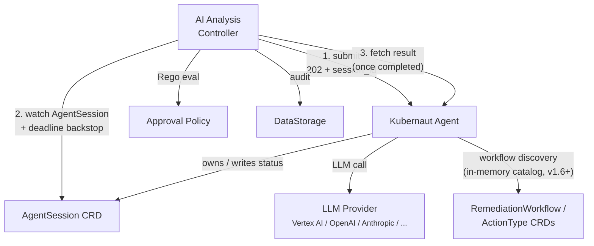
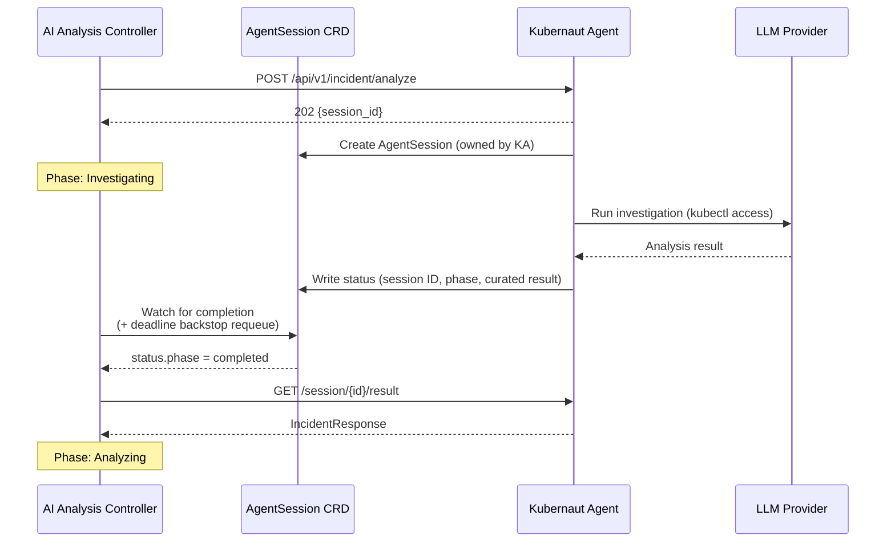

# AI Analysis

The AI Analysis service performs root cause investigation using an LLM (via Kubernaut Agent) and decides whether the selected workflow should be auto-approved or require human review.

!!! abstract "CRD Reference"
    For the complete AIAnalysis CRD specification, see [API Reference: CRDs](../api-reference/crds.md#aianalysis).

## Architecture

```mermaid
graph TB
    AA[AI Analysis<br/>Controller] -->|"1. submit<br/>202 + session_id"| KA[Kubernaut Agent]
    AA -->|"2. watch AgentSession<br/>+ deadline backstop"| AS[AgentSession CRD]
    KA -->|owns / writes status| AS
    AA -->|"3. fetch result<br/>(once completed)"| KA
    KA -->|LLM call| LLM[LLM Provider<br/><small>Vertex AI / OpenAI / Anthropic / ...</small>]
    KA -->|"workflow discovery<br/>(in-memory catalog, v1.6+)"| CRDs[RemediationWorkflow /<br/>ActionType CRDs]
    AA -->|Rego eval| REGO[Approval Policy]
    AA -->|audit| DS[DataStorage]
```

## AgentSession-Based Async Pattern

The AI Analysis controller communicates with Kubernaut Agent using an **`AgentSession` CRD-based asynchronous** pattern (DD-AA-KA-001, v1.6+; supersedes the pre-v1.6 HTTP polling loop from BR-AA-HAPI-064).

### Flow

1. **Submit** — `POST /api/v1/incident/analyze` → `202 Accepted` + `session_id`. Kubernaut Agent creates and owns the `AgentSession` CRD for this session.
2. **Watch** — The controller watches the `AgentSession` CRD for completion, backstopped by a deadline-driven requeue (#2204) that catches a hung KA rather than relying on the watch alone.
3. **Result** — Once `AgentSession.status` reports the session complete, `GET /api/v1/incident/session/{session_id}/result` fetches the full analysis exactly once (no polling loop).

```mermaid
sequenceDiagram
    participant AA as AI Analysis Controller
    participant AS as AgentSession CRD
    participant KA as Kubernaut Agent
    participant LLM as LLM Provider

    AA->>KA: POST /api/v1/incident/analyze
    KA-->>AA: 202 {session_id}
    KA->>AS: Create AgentSession (owned by KA)
    Note over AA: Phase: Investigating

    KA->>LLM: Run investigation (kubectl access)
    LLM-->>KA: Analysis result
    KA->>AS: Write status (session ID, phase, curated result)

    AA->>AS: Watch for completion<br/>(+ deadline backstop requeue)
    AS-->>AA: status.phase = completed

    AA->>KA: GET /session/{id}/result
    KA-->>AA: IncidentResponse
    Note over AA: Phase: Analyzing
```

This pattern avoids long HTTP timeouts and polling overhead by using Kubernetes-native watches: the controller reacts to `AgentSession` status changes instead of polling KA on a fixed interval. The Investigating phase carries a wall-clock cap of 25 minutes (`DefaultMaxInvestigationDuration`); the deadline-driven backstop requeue ensures a hung KA (one that never updates `AgentSession.status`) still gets caught even if the watch itself is missed.

### Session Recovery

If the `AgentSession` reports `failed`/cancelled, or the 25-minute investigation cap is exceeded, the AIAnalysis transitions to `Failed`. See [AgentSession](../api-reference/crds.md#agentsession) for the full CRD reference.

## Timeout Configuration

The Orchestrator passes per-analysis timeout configuration via the AIAnalysis CRD spec:

| Field | Default | Description |
|---|---|---|
| `investigatingTimeout` | Inherited from RR | Maximum time in the Investigating phase |
| `analyzingTimeout` | Inherited from RR | Maximum time in the Analyzing phase |

If either timeout expires, the AIAnalysis transitions to `Failed`.

## Phases

| Phase | Description |
|---|---|
| `Pending` | CRD created by Orchestrator |
| `Investigating` | Session submitted to Kubernaut Agent, polling for completion |
| `Analyzing` | Results received, evaluating Rego approval policy |
| `Completed` | Analysis and approval decision recorded |
| `Failed` | Investigation or analysis failed |

## Kubernaut Agent Investigation

Kubernaut Agent is a Go service that orchestrates LLM-driven investigation with live Kubernetes access and optional Prometheus integration. During investigation, it:

1. **Reads the enriched signal** — Alert details, target resource, namespace context
2. **Investigates using K8s tools** — Inspects pod logs, events, resource state via `kubectl`; optionally queries Prometheus for live metrics when enabled
3. **Produces a root cause analysis** — Structured explanation of what went wrong
4. **Resolves the target resource** — Calls `get_namespaced_resource_context` (or `get_cluster_resource_context` for cluster-scoped resources) to resolve the owner chain, compute a spec hash, fetch **remediation history** (past outcomes and effectiveness scores via internal DataStorage lookup), and detect **infrastructure labels** (GitOps, Helm, service mesh, HPA, PDB)
5. **Discovers workflows via Kubernaut Agent's own catalog (v1.6+)** — The LLM uses a three-step protocol: `list_available_actions` → `list_workflows` → `get_workflow`, served from KA's in-memory, informer-cache-backed watch over the `RemediationWorkflow`/`ActionType` CRDs (no DataStorage round trip; DD-WORKFLOW-019). Signal context and detected labels are auto-injected as filters; the catalog orders results by label-match scoring (scores not exposed to the LLM).
6. **LLM selects a workflow** — Based on workflow descriptions (`what`, `whenToUse`, `whenNotToUse`), detected infrastructure context, and remediation history
7. **Returns `actionable` flag** — Indicates whether the investigation identified a concrete remediation action. Propagated to the `AIAnalysis` CRD status and used downstream for audit and decision filtering.

## Response Processing

When the controller receives the analysis result, it applies two confidence thresholds:

### Investigation Threshold (0.7)

Applied in the response processor during the Investigating phase:

- **Confidence >= 0.7 with no workflow** — Treated as "problem already resolved" (no remediation needed)
- **Confidence < 0.7 with a selected workflow** — Workflow selection rejected as low-confidence

#### Problem Self-Resolved Bypass (#301)

When Kubernaut Agent reports `investigation_outcome=resolved`, it appends a "Problem self-resolved" warning to the response. The response processor detects this signal and bypasses the substantive RCA check -- even if the LLM produced a root cause analysis with contributing factors, the RCA is treated as documenting a **transient condition** (e.g., a pod that recovered on its own) rather than an active problem.

Without this bypass, a resolved incident with a detailed RCA would be incorrectly escalated to human review (because `hasSubstantiveRCA` would return `true`, preventing the `WorkflowNotNeeded` completion path). The fix ensures that KA's authoritative "resolved" signal takes priority over the RCA content check.

### Approval Gate (Rego policy, operator-provided)

The Analyzing handler evaluates a Rego policy to determine whether the remediation requires human approval:

- **Query**: `data.aianalysis.approval`
- **Input**: Full analysis context (see below)
- **Output**: `require_approval` (boolean) and `reason` (string)

!!! warning "Required prerequisite"
    The operator **rejects the Kubernaut CR** if `spec.aiAnalysis.policy.configMapName` is empty. You must create a ConfigMap containing an `approval.rego` key before applying the CR. See [Installation Prerequisites](../getting-started/installation.md#prerequisites).

    With Helm, use `--set-file aianalysis.policies.content=my-approval.rego` or provide `aianalysis.policies.existingConfigMap`.

The **reference policy** (bundled in the chart at `charts/kubernaut/files/defaults/approval.rego`) gates on:

- **Production** — always requires approval
- **Non-production** — auto-approved when `remediation_target` is present
- **Missing `remediation_target`** — always requires approval (default-deny per ADR-055)
- **Sensitive resource kinds** — requires approval for Deployments, StatefulSets, DaemonSets in production

The policy receives `confidence`, `confidence_threshold`, `detected_labels` (snake_case keys: `"stateful"`, `"pdb_protected"`, `"hpa_enabled"`), `failed_detections`, `custom_labels`, and `business_classification`. Operators can write custom policies that use any combination of these inputs — for example, confidence-gated approval for production.

The confidence threshold is configurable via Helm (`aianalysis.rego.confidenceThreshold`, default 0.8) and passed as `input.confidence_threshold`.

See [Human Approval](../user-guide/approval.md) for the full approval flow and policy customization details.

## Next Steps

- [Investigation Pipeline](kubernaut-agent-investigation.md) — Deep-dive into the LLM investigation phases, resource context, remediation history, decision outcomes, and approval gate
- [Remediation Routing](remediation-routing.md) — How the Orchestrator routes the result
- [Workflow Selection](workflow-selection.md) — Catalog query and scoring details
- [Human Approval](../user-guide/approval.md) — The approval flow
