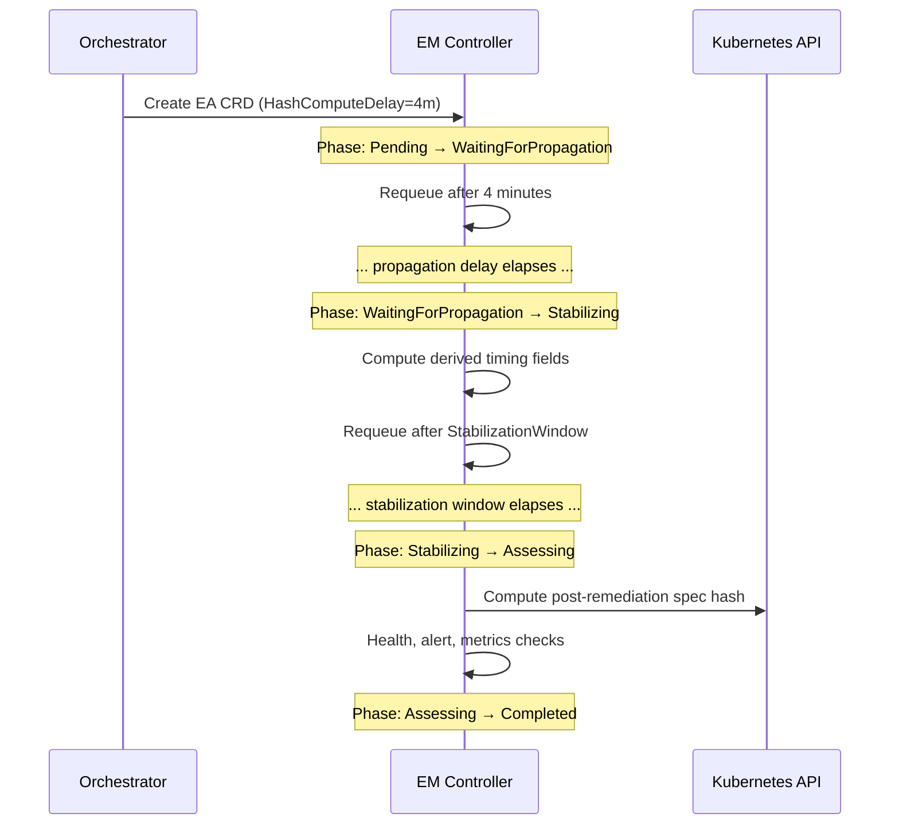

# Async Propagation

Many Kubernetes environments use **GitOps tools** (ArgoCD, Flux) or **operators** that introduce propagation delays between a change being applied and that change taking full effect. Kubernaut accounts for these delays in its effectiveness assessment model.

## The Problem

When Kubernaut patches a Deployment:

1. The patch is applied to the Kubernetes API -- **immediate**
2. ArgoCD detects drift and syncs -- **1-5 minutes**
3. The operator reconciles the new state -- **seconds to minutes**
4. New pods roll out and become ready -- **seconds to minutes**

If the effectiveness assessment runs immediately after the patch, it may see an unhealthy state even though the fix is working -- it just hasn't propagated yet. Worse, computing a spec hash immediately would capture the pre-sync state rather than the final state, producing a false-positive drift detection.

## Target Detection

The Remediation Orchestrator detects whether the remediation target requires propagation delays based on two independent characteristics:

| Characteristic | Detection Method | Source |
|---|---|---|
| **GitOps-managed** | `gitOpsManaged=true` detected label | HAPI `LabelDetector` during post-RCA analysis |
| **Operator-managed CR** | Target resource is a custom resource (CR) with a controlling operator | Kubernetes API resource discovery |

These flags are set during the AI Analysis phase and propagated to the EffectivenessAssessment CRD spec.

## Delay Model

Kubernaut uses configurable propagation delays that are **additive based on detected target characteristics**. The Orchestrator computes the total propagation delay and sets it as `HashComputeDelay` on the EA spec.

| Parameter | Default | Applies When | Configurable Via |
|---|---|---|---|
| `gitOpsSyncDelay` | 3 minutes | Target is GitOps-managed (ArgoCD/Flux) | `remediationorchestrator.config.asyncPropagation.gitOpsSyncDelay` |
| `operatorReconcileDelay` | 1 minute | Target is an operator-managed CR | `remediationorchestrator.config.asyncPropagation.operatorReconcileDelay` |
| `stabilizationWindow` | 5 minutes | Always (all targets) | `remediationorchestrator.config.effectivenessAssessment.stabilizationWindow` |

## When Delays Apply

The propagation delay is computed from two independent flags (`isGitOps`, `isCRD`):

| Target Type | Propagation Delay | Total Wait Before Assessment |
|---|---|---|
| **Sync target** (direct patch) | 0 | `stabilizationWindow` |
| **GitOps-managed** | `gitOpsSyncDelay` | `gitOpsSyncDelay` + `stabilizationWindow` |
| **Operator-managed CR** | `operatorReconcileDelay` | `operatorReconcileDelay` + `stabilizationWindow` |
| **GitOps + operator CR** (both) | `gitOpsSyncDelay` + `operatorReconcileDelay` | Both delays + `stabilizationWindow` |

The delays are additive -- if a target is both GitOps-managed and an operator CR, both delays compound. Setting either delay to `0` disables that stage.

## Integration with Effectiveness Assessment

The propagation delay directly controls when the Effectiveness Monitor computes the spec hash and begins its assessment:



### Hash Compute Deferral (DD-EM-004)

When `HashComputeDelay` is set:

1. The EM enters `WaitingForPropagation` instead of proceeding directly to `Stabilizing`
2. It requeues with the remaining delay duration
3. Once the delay elapses, it transitions to `Stabilizing` and computes derived timing from the **anchor time** (creation + HashComputeDelay), not from creation time
4. The spec hash is computed after the propagation delay, capturing the fully propagated state

### Validity Window Extension

If the total offset (propagation delay + stabilization + alert check delay) exceeds the configured validity window, the deadline is automatically extended to prevent premature expiry.

## Tuning

For environments with faster or slower propagation:

```yaml
# values.yaml
remediationorchestrator:
  config:
    effectivenessAssessment:
      stabilizationWindow: "10m"  # longer for slow rollouts
    asyncPropagation:
      gitOpsSyncDelay: "5m"       # longer for slow ArgoCD sync
      operatorReconcileDelay: "2m" # longer for complex operators
```

### Tuning Guidelines

| Scenario | Recommendation |
|---|---|
| ArgoCD with polling (3-5m cycle) | `gitOpsSyncDelay: 5m` |
| ArgoCD with webhook (near-instant) | `gitOpsSyncDelay: 30s` |
| Flux with short reconciliation interval | `gitOpsSyncDelay: 2m` |
| Complex operator (e.g., database) | `operatorReconcileDelay: 3m` |
| Simple ConfigMap reload | `operatorReconcileDelay: 30s` |
| Fast local cluster (Kind, Minikube) | Both delays `0` |

## Next Steps

- [Effectiveness Assessment](effectiveness.md) -- Full assessment model and scoring
- [Configuration Reference](../user-guide/configuration.md) -- All configurable parameters
