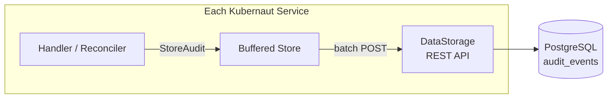

# Audit Pipeline

Kubernaut's audit pipeline provides a complete record of every action taken during remediation — from signal ingestion to effectiveness assessment, including human approval decisions.

## Architecture

Every service includes a **buffered audit store** that batches events and sends them to DataStorage:

### Design Principles

- **Fire-and-forget** — Audit failures never block remediation (DD-AUDIT-002)
- **Buffered batching** — Events are queued in-memory and sent in configurable batches
- **Graceful shutdown** — Buffers flush on pod termination
- **Per-service isolation** — Each service has its own audit client with service-specific event types

## Event Flow

1. A handler or reconciler calls `auditStore.StoreAudit(ctx, event)` with a structured `AuditEvent`
2. The buffered store enqueues the event (non-blocking)
3. A background worker batches events based on `BufferSize`, `BatchSize`, and `FlushInterval`
4. Batches are sent via `POST /api/v1/audit/events/batch` to DataStorage
5. DataStorage inserts into the `audit_events` PostgreSQL table
6. On shutdown, `auditStore.Close()` flushes remaining events

## Emitting Services

All 7 Go services plus the auth webhook emit audit events:

| Service | Event Prefix | Key Events |
|---|---|---|
| **Gateway** | `gateway.*` | Signal received, scope validated, dedup checked |
| **Signal Processing** | `signalprocessing.*` | Enrichment completed, classification results |
| **AI Analysis** | `aianalysis.*` | Investigation submitted, analysis completed, Rego evaluation, approval decision |
| **Remediation Orchestrator** | `orchestrator.*` | Lifecycle created, phase transitions, child CRD creation |
| **Workflow Execution** | `workflowexecution.*` | Workflow selected, execution started, execution completed |
| **Notification** | `notification.*` | Delivery attempted, delivery result |
| **Effectiveness Monitor** | `effectivenessmonitor.*` | Assessment started, assessment result |
| **Auth Webhook** | `webhook.*` | Approval decided, block cleared, timeout modified, notification cancelled |

## Operator Attribution

The **admission webhook** captures human identity for all operator-driven actions:

| Action | Event Type | What's Recorded |
|---|---|---|
| Approve/reject remediation | `webhook.approval_decided` | Actor identity, decision, reason |
| Clear execution block | `webhook.block_cleared` | Actor identity, execution ref |
| Modify timeout | `webhook.remediationrequest.timeout_modified` | Actor identity, old/new values |
| Cancel notification | `webhook.notification.cancelled` | Actor identity, notification ref |

This ensures every human action has a recorded identity, timestamp, and context — critical for SOC2 Type II compliance.

## Buffering Configuration

Each service's audit store is configured with:

| Parameter | Description |
|---|---|
| `BufferSize` | Maximum events in the in-memory buffer |
| `BatchSize` | Number of events per batch POST |
| `FlushInterval` | Maximum time between flushes |
| `MaxRetries` | Retry attempts for failed batches |

## Correlation

All audit events for a single remediation share a `correlation_id` (the RemediationRequest name). This enables:

- **Timeline reconstruction** — Query all events for one remediation in chronological order
- **CRD reconstruction** — Rebuild the full RemediationRequest from audit data
- **Cross-service tracing** — Follow a remediation across all 8 services

See [Data Persistence](data-persistence.md) for the PostgreSQL schema and reconstruction pipeline.

## Next Steps

- [Data Persistence](data-persistence.md) — PostgreSQL schema and reconstruction
- [Audit & Observability](../user-guide/audit-and-observability.md) — User guide for audit features
- [System Overview](overview.md) — How audit fits into the overall architecture
