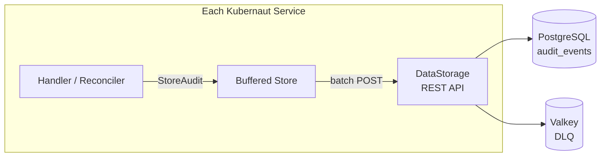

# Audit Pipeline

!!! info "Operator guide"
    For retention policies, observability metrics, and event correlation, see [Audit & Observability](../user-guide/audit-and-observability.md).

Kubernaut's audit pipeline provides a complete record of every action taken during remediation -- from signal ingestion to effectiveness assessment, including human approval decisions. Every service includes a buffered audit store that batches events and sends them to DataStorage for persistent storage.

## Architecture



### Design Principles

- **Fire-and-forget** -- Audit failures never block remediation (DD-AUDIT-002)
- **Buffered batching** -- Events are queued in-memory and sent in configurable batches
- **Graceful shutdown** -- Buffers flush on pod termination (DD-007, ADR-032)
- **Per-service isolation** -- Each service has its own audit client with service-specific event types
- **Hash chain integrity** -- Events are chained via `SHA256(previous_hash + event_json)` for tamper detection

## Buffered Audit Store

Every Go service instantiates a `BufferedAuditStore` from `pkg/audit/store.go`:

### Interface

| Method | Behavior |
|---|---|
| `StoreAudit(ctx, event)` | Non-blocking enqueue. If the buffer is full, the event is **dropped** (not blocking) |
| `Flush(ctx)` | Blocks until all buffered events are written |
| `Close()` | Flushes remaining events and stops the background worker |

### Flush Triggers

Events are flushed in three scenarios:

1. **Batch full** -- When the in-memory batch reaches `BatchSize`, it is sent immediately
2. **Timer** -- Every `FlushInterval`, the current batch is sent regardless of size
3. **Explicit flush** -- `Flush()` drains the buffer and sends all remaining events
4. **Shutdown** -- `Close()` performs a final flush before stopping

### Retry Logic

- **Max retries**: 3 per batch
- **Backoff**: 1s, 4s, 9s (quadratic)
- **4xx errors**: No retry (permanent failure)
- **5xx / network errors**: Retry with backoff

### Configuration

| Parameter | Default | Recommendation |
|---|---|---|
| `BufferSize` | 10,000 | 10k--50k (DD-AUDIT-004) |
| `BatchSize` | 1,000 | 1,000 |
| `FlushInterval` | 1 second | 1s |
| `MaxRetries` | 3 | 3 |

### Observability

The buffered store exposes Prometheus metrics:

| Metric | Description |
|---|---|
| `buffered_count` | Events currently in the buffer |
| `dropped_count` | Events dropped due to full buffer |
| `written_count` | Events successfully written |
| `failed_batch_count` | Batches that failed after all retries |

## Event Flow

1. A handler or reconciler calls `auditStore.StoreAudit(ctx, event)` with a structured `AuditEvent`
2. The buffered store enqueues the event into an in-memory channel (non-blocking)
3. A background goroutine batches events and sends them via `POST /api/v1/audit/events/batch` to DataStorage
4. DataStorage validates, converts, and inserts the batch into the `audit_events` PostgreSQL table within a transaction
5. On PostgreSQL failure, the batch is enqueued to the Valkey DLQ for retry
6. On shutdown, `auditStore.Close()` flushes remaining events

## Event Structure

Every audit event includes:

| Field | Type | Description |
|---|---|---|
| `event_id` | `UUID` | Unique identifier (auto-generated) |
| `event_version` | `string` | Schema version (default: `1.0`) |
| `event_timestamp` | `timestamptz` | When the event occurred |
| `event_type` | `string` | Hierarchical type (e.g., `gateway.signal.received`) |
| `event_category` | `string` | Category (e.g., `signal`, `remediation`) |
| `event_action` | `string` | Action (e.g., `received`, `completed`) |
| `event_outcome` | `string` | `success`, `failure`, `pending` |
| `actor_type` | `string` | `service` or `human` |
| `actor_id` | `string` | Service name or operator identity |
| `resource_type` | `string` | Target resource type |
| `resource_id` | `string` | Target resource identifier |
| `correlation_id` | `string` | Links all events for one remediation |
| `namespace` | `string` | Kubernetes namespace |
| `event_data` | `JSONB` | Service-specific payload |
| `event_hash` | `string` | SHA256 hash chain for integrity |
| `previous_event_hash` | `string` | Previous event's hash |
| `retention_days` | `int` | Default: 2555 (7 years) |
| `is_sensitive` | `bool` | PII flag |

### Hash Chain (Tamper Detection)

Events form a hash chain for integrity verification:

```
event_hash = SHA256(previous_event_hash + canonical_event_json)
```

Fields excluded from the hash: `event_hash`, `previous_event_hash`, `event_date`, `legal_hold` fields. This enables after-the-fact detection of any audit event modification.

## Correlation

All audit events for a single remediation share a `correlation_id` set to the `RemediationRequest` name (DD-AUDIT-CORRELATION-002). This enables:

- **Timeline reconstruction** -- Query all events for one remediation in chronological order
- **CRD reconstruction** -- Rebuild the full RemediationRequest from audit data (see [Data Persistence: Reconstruction](data-persistence.md#remediationrequest-reconstruction))
- **Cross-service tracing** -- Follow a remediation across all services

## Emitting Services

All 7 Go services plus the auth webhook emit audit events:

| Service | Event Prefix | Key Events |
|---|---|---|
| **Gateway** | `gateway.*` | `signal.received`, `signal.deduplicated`, `crd.created`, `crd.failed` |
| **Signal Processing** | `signalprocessing.*` | `enrichment.completed`, `classification.completed`, `phase.transition` |
| **AI Analysis** | `aianalysis.*` | `investigation.submitted`, `analysis.completed`, `rego.evaluation`, `approval.decision` |
| **Remediation Orchestrator** | `orchestrator.*` | `lifecycle.created`, `phase.transition`, `child.created`, `timeout` |
| **Workflow Execution** | `workflowexecution.*` | `selection.completed`, `execution.started`, `execution.completed`, `block.cleared` |
| **Notification** | `notification.*` | `message.sent`, `message.failed`, `message.acknowledged`, `message.escalated` |
| **Effectiveness Monitor** | `effectiveness.*` | `health.assessed`, `hash.computed`, `alert.assessed`, `metrics.assessed`, `assessment.completed` |
| **Auth Webhook** | `webhook.*`, `remediationworkflow.*`, `actiontype.*` | `remediationapprovalrequest.decided`, `remediationrequest.timeout_modified`, `notification.cancelled`, `remediationworkflow.admitted.create`, `remediationworkflow.admitted.delete`, `remediationworkflow.admitted.denied`, `actiontype.admitted.create`, `actiontype.admitted.update`, `actiontype.admitted.delete`, `actiontype.denied.create`, `actiontype.denied.update`, `actiontype.denied.delete` |
| **DataStorage** | `datastorage.*`, `workflow.catalog.*` | `workflow.created`, `workflow.updated`, `actiontype.created`, `actiontype.updated`, `actiontype.disabled`, `actiontype.reenabled`, `actiontype.disable_denied`, `workflow.catalog.actions_listed`, `workflow.catalog.workflows_listed`, `workflow.catalog.workflow_retrieved`, `workflow.catalog.selection_validated` |

## Operator Attribution

The **admission webhook** captures human identity for all operator-driven actions:

| Action | Event Type | What's Recorded |
|---|---|---|
| Approve/reject remediation | `webhook.remediationapprovalrequest.decided` | Actor identity, decision, reason |
| Clear execution block | `workflowexecution.block.cleared` | Actor identity, execution ref |
| Modify timeout | `webhook.remediationrequest.timeout_modified` | Actor identity, old/new values |
| Cancel notification | `webhook.notification.cancelled` | Actor identity, notification ref |
| Register workflow (CRD CREATE) | `remediationworkflow.admitted.create` | Actor identity, workflow name, version |
| Delete workflow (CRD DELETE) | `remediationworkflow.admitted.delete` | Actor identity, workflow name |
| Register action type (CRD CREATE) | `actiontype.admitted.create` | Actor identity, action type name |
| Update action type (CRD UPDATE) | `actiontype.admitted.update` | Actor identity, action type, changed fields |
| Delete action type (CRD DELETE) | `actiontype.admitted.delete` | Actor identity, action type name |

This ensures every human action has a recorded identity, timestamp, and context -- critical for SOC2 Type II readiness.

## Dead Letter Queue

When DataStorage cannot write to PostgreSQL, failed batches are enqueued to Valkey streams for retry:

| Stream | Purpose |
|---|---|
| `audit:dlq:events` | Generic audit event batches |
| `audit:dlq:notifications` | Notification-specific audit events |
| `audit:dead-letter:{type}` | Events that exceeded retry attempts |

The DLQ uses Valkey consumer groups (`XREADGROUP`) for reliable delivery and `XAck` for acknowledgment. Maximum stream length is 10,000 entries.

## Next Steps

- [Data Persistence](data-persistence.md) -- PostgreSQL schema, partitioning, and reconstruction
- [Audit & Observability](../user-guide/audit-and-observability.md) -- User guide for audit features
- [System Overview](overview.md) -- How audit fits into the overall architecture
