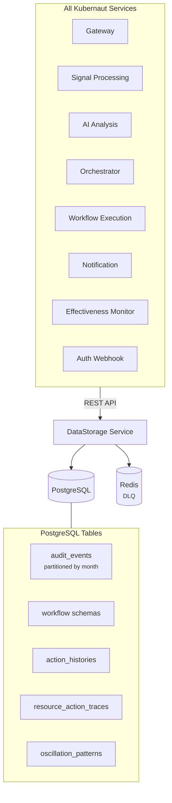
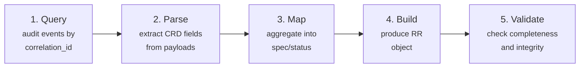

# Data Persistence

Kubernaut uses **PostgreSQL** as its persistent data store, accessed exclusively through the **DataStorage** REST API service. This page covers the database schema, partitioning strategy, and the RemediationRequest reconstruction pipeline.

## Storage Architecture



## Database Schema

### audit_events

The primary audit table, partitioned by month:

| Column | Type | Description |
|---|---|---|
| `event_id` | `UUID` | Primary key |
| `event_version` | `VARCHAR(10)` | Schema version |
| `event_timestamp` | `TIMESTAMPTZ` | When the event occurred |
| `event_date` | `DATE` | Partition key |
| `event_type` | `VARCHAR(100)` | Hierarchical type (e.g., `aianalysis.analysis.completed`) |
| `event_category` | `VARCHAR(50)` | Category (e.g., `signal`, `remediation`) |
| `event_action` | `VARCHAR(50)` | Action (e.g., `received`, `completed`) |
| `event_outcome` | `VARCHAR(20)` | `success`, `failure`, `pending` |
| `actor_type` | `VARCHAR(50)` | Service or human operator |
| `actor_id` | `VARCHAR(255)` | Identity of the actor |
| `resource_type` | `VARCHAR(100)` | Target resource type |
| `resource_id` | `VARCHAR(255)` | Target resource identifier |
| `correlation_id` | `VARCHAR(255)` | Links events for one remediation |
| `namespace` | `VARCHAR(253)` | Kubernetes namespace |
| `event_data` | `JSONB` | Service-specific payload |
| `retention_days` | `INTEGER` | Default: 2555 (7 years) |
| `is_sensitive` | `BOOLEAN` | PII flag |

### Partitioning

The `audit_events` table uses **monthly range partitioning** on `event_date`:

- Partitions: `audit_events_2026_03`, `audit_events_2026_04`, ..., `audit_events_2028_12`
- Default partition: `audit_events_default` (catches events outside defined ranges)

Partitioning provides:

- **Fast queries** — Scoped to relevant months
- **Efficient retention** — Drop old partitions without vacuuming
- **Manageable storage** — Each partition is independently sized

### Other Tables

| Table | Purpose |
|---|---|
| `workflow_schemas` | Workflow catalog (searchable by labels) |
| `action_histories` | Historical action records |
| `resource_action_traces` | Per-resource action tracking |
| `oscillation_patterns` / `oscillation_detections` | Oscillation detection (repeated fail/fix cycles) |
| `action_effectiveness_metrics` | Effectiveness scoring per workflow/incident type |
| `retention_operations` | Retention operation tracking |

## RemediationRequest Reconstruction

The DataStorage service can rebuild a complete `RemediationRequest` from audit events — even after the CRD has expired (24h TTL).

### Endpoint

```
POST /api/v1/audit/remediation-requests/{correlation_id}/reconstruct
```

### Pipeline



### Source Events

| Reconstructed Field | Source Event |
|---|---|
| `spec.signalName`, `signalType`, `signalLabels` | `gateway.signal.received` |
| `spec.originalPayload` | `gateway.signal.received` |
| `spec.signalAnnotations` | `gateway.signal.received` |
| `status.selectedWorkflowRef` | `workflowexecution.selection.completed` |
| `status.executionRef` | `workflowexecution.execution.started` |
| `status.timeoutConfig` | `orchestrator.lifecycle.created` |

### Limitations

- Reconstruction is available for **RemediationRequest** CRDs only (other CRD types planned)
- `status.error` and `OverallPhase` are not reconstructed from current event schema

## Redis (DLQ)

Redis serves as a dead-letter queue for DataStorage:

- Failed audit event batches are queued in Redis for retry
- Prevents data loss during PostgreSQL unavailability

## Next Steps

- [Audit Pipeline](audit-pipeline.md) — How events reach DataStorage
- [Data Lifecycle](../user-guide/data-lifecycle.md) — User-facing data lifecycle documentation
- [API Reference: DataStorage](../api-reference/datastorage-api.md) — REST API endpoints
