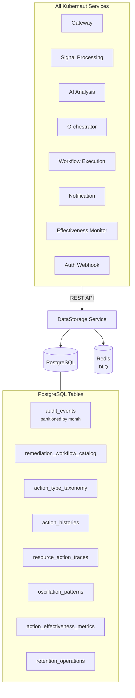
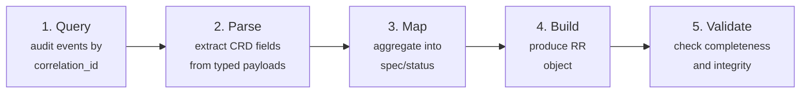
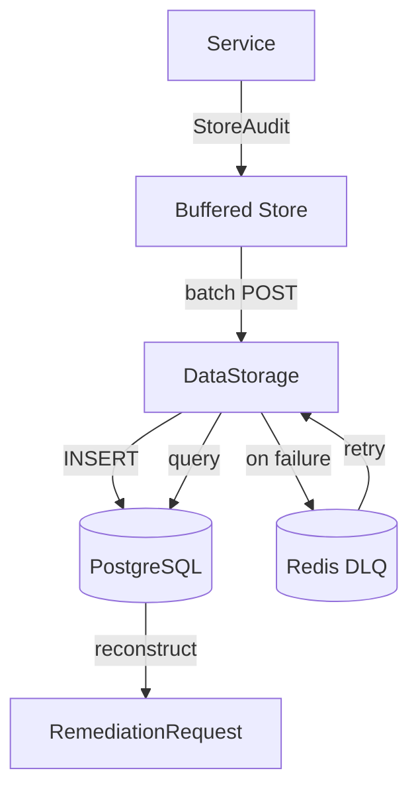

# Data Persistence

!!! info "Operator guide"
    For CRD retention, storage lifetime, and use cases, see [Data Lifecycle](../user-guide/data-lifecycle.md).

Kubernaut uses **PostgreSQL** as its persistent data store, accessed exclusively through the **DataStorage** REST API service. Redis provides a dead-letter queue for audit event resilience. This page covers the database schema, partitioning strategy, indexing, and the RemediationRequest reconstruction pipeline.

## Storage Architecture



## Database Schema

### audit_events

The primary audit table, partitioned by month. This is the largest table in the system, storing the complete remediation history.

| Column | Type | Description |
|---|---|---|
| `event_id` | `UUID` | Primary key (with `event_date`) |
| `event_version` | `VARCHAR(10)` | Schema version (default: `1.0`) |
| `event_timestamp` | `TIMESTAMPTZ` | When the event occurred |
| `event_date` | `DATE` | Partition key |
| `event_type` | `VARCHAR(100)` | Hierarchical type (e.g., `aianalysis.analysis.completed`) |
| `event_category` | `VARCHAR(50)` | Category (e.g., `signal`, `remediation`) |
| `event_action` | `VARCHAR(50)` | Action (e.g., `received`, `completed`) |
| `event_outcome` | `VARCHAR(20)` | `success`, `failure`, `pending` |
| `actor_type` | `VARCHAR(50)` | Service or human operator |
| `actor_id` | `VARCHAR(255)` | Identity of the actor |
| `resource_type` | `VARCHAR(100)` | Target resource type |
| `resource_id` | `VARCHAR(255)` | Target resource identifier |
| `correlation_id` | `VARCHAR(255)` | Links events for one remediation (RR name) |
| `parent_event_id` | `UUID` | Chain to parent event |
| `parent_event_date` | `DATE` | Parent event partition key |
| `namespace` | `VARCHAR(253)` | Kubernetes namespace |
| `cluster_name` | `VARCHAR(255)` | Cluster identifier |
| `event_data` | `JSONB` | Service-specific payload |
| `event_hash` | `TEXT` | SHA256 hash chain for integrity |
| `previous_event_hash` | `TEXT` | Previous event's hash |
| `severity` | `VARCHAR(20)` | Signal severity |
| `duration_ms` | `BIGINT` | Operation duration |
| `error_code` | `VARCHAR(50)` | Error code (if failure) |
| `error_message` | `TEXT` | Error description |
| `retention_days` | `INTEGER` | Default: 2555 (7 years) |
| `is_sensitive` | `BOOLEAN` | PII flag |
| `legal_hold` | `BOOLEAN` | Legal hold flag |
| `legal_hold_reason` | `TEXT` | Reason for hold |
| `legal_hold_placed_by` | `VARCHAR(255)` | Who placed the hold |
| `legal_hold_placed_at` | `TIMESTAMPTZ` | When hold was placed |

### Indexes

| Index | Columns | Purpose |
|---|---|---|
| `idx_audit_events_event_timestamp` | `event_timestamp DESC` | Chronological queries |
| `idx_audit_events_correlation_id` | `correlation_id, event_timestamp DESC` | Remediation timeline reconstruction |
| `idx_audit_events_event_type` | `event_type, event_timestamp DESC` | Event type filtering |
| `idx_audit_events_event_data_gin` | `event_data USING GIN` | JSONB payload queries |
| `idx_audit_events_pre_remediation_spec_hash` | `(event_data->>'pre_remediation_spec_hash'), event_timestamp DESC` | Spec hash history lookups |

### Partitioning

The `audit_events` table uses **monthly range partitioning** on `event_date`:

- Partitions: `audit_events_2026_03`, `audit_events_2026_04`, ..., `audit_events_2028_12`
- Default partition: `audit_events_default` (catches events outside defined ranges)

Partitioning provides:

- **Fast queries** -- Scoped to relevant months via partition pruning
- **Efficient retention** -- Drop old partitions without vacuuming the entire table
- **Manageable storage** -- Each partition is independently sized and can be backed up separately

### remediation_workflow_catalog

The workflow catalog table, used for workflow discovery and scoring.

| Column | Type | Description |
|---|---|---|
| `workflow_id` | `TEXT` | Unique workflow identifier |
| `workflow_name` | `VARCHAR` | Human-readable name |
| `version` | `VARCHAR` | Semantic version |
| `is_latest_version` | `BOOLEAN` | Partial index for discovery queries |
| `action_type` | `TEXT` | FK to `action_type_taxonomy` |
| `status` | `VARCHAR` | `active`, `disabled`, `deprecated`, `archived`, `superseded` |
| `labels` | `JSONB` | Mandatory labels (severity, component, environment, priority) |
| `custom_labels` | `JSONB` | Custom labels from workflow schema |
| `detected_labels` | `JSONB` | Infrastructure-awareness labels |
| `description` | `JSONB` | Workflow description (what, whenToUse, whenNotToUse) |
| `execution_bundle` | `TEXT` | OCI image reference |
| `execution_bundle_digest` | `TEXT` | OCI digest |
| `engine_config` | `JSONB` | Engine-specific config (e.g., AWX `jobTemplateName`, `inventoryName`). NULL for Tekton/Job |
| `content_hash` | `TEXT` | SHA256 hash of normalized workflow content for deduplication (DD-EM-002) |
| `schema_data` | `JSONB` | Full workflow schema |
| `created_at` | `TIMESTAMPTZ` | Creation timestamp |
| `updated_at` | `TIMESTAMPTZ` | Last update |

**Key indexes**:

- GIN index on `labels`, `custom_labels`, `detected_labels` for JSONB containment queries
- Composite index on `(action_type, status, is_latest_version)` for discovery Step 2
- Partial index on `is_latest_version = true` for active workflow queries

### action_type_taxonomy

The action type registry for workflow categorization.

| Column | Type | Description |
|---|---|---|
| `action_type` | `TEXT` | Primary key (PascalCase identifier) |
| `description` | `JSONB` | `{what, whenToUse, whenNotToUse, preconditions}` |
| `status` | `VARCHAR` | `active` or `disabled` |
| `disabled_at` | `TIMESTAMPTZ` | When the action type was disabled (NULL if active) |
| `disabled_by` | `VARCHAR` | Operator identity who disabled it (NULL if active) |
| `created_at` | `TIMESTAMPTZ` | Creation timestamp |
| `updated_at` | `TIMESTAMPTZ` | Last update |

Seeded with 24 built-in action types. User-extensible via `ActionType` CRDs (synced by Auth Webhook). See [Workflow Selection: Action Type Taxonomy](workflow-selection.md#action-type-taxonomy).

### Other Tables

| Table | Purpose |
|---|---|
| `action_histories` | Historical action records per resource |
| `resource_action_traces` | Per-resource action tracking for remediation history queries |
| `oscillation_patterns` | Pattern definitions for oscillation detection (repeated fail/fix cycles) |
| `oscillation_detections` | Detected oscillation instances |
| `action_effectiveness_metrics` | Effectiveness scoring per workflow/incident type |
| `retention_operations` | Retention operation tracking and scheduling |

## RemediationRequest Reconstruction

The DataStorage service can rebuild a complete `RemediationRequest` from audit events -- even after the CRD has been removed from the cluster.

### Endpoint

```
POST /api/v1/audit/remediation-requests/{correlation_id}/reconstruct
```

### Pipeline



### Query

Events are fetched by `correlation_id` filtered to specific event types:

```sql
SELECT event_id, event_type, event_timestamp, event_outcome,
       resource_type, resource_id, actor_type, actor_id,
       event_data, namespace, cluster_name, duration_ms
FROM audit_events
WHERE correlation_id = $1
  AND event_type IN (
    'gateway.signal.received',
    'aianalysis.analysis.completed',
    'workflowexecution.selection.completed',
    'workflowexecution.execution.started',
    'orchestrator.lifecycle.created'
  )
ORDER BY event_timestamp ASC, event_id ASC
```

### Source Event Mapping

| Reconstructed Field | Source Event | Payload Field |
|---|---|---|
| `spec.signalName`, `signalType`, `signalLabels` | `gateway.signal.received` | `GatewayAuditPayload` |
| `spec.originalPayload` | `gateway.signal.received` | `GatewayAuditPayload` |
| `spec.signalAnnotations` | `gateway.signal.received` | `GatewayAuditPayload` |
| `status.selectedWorkflowRef` | `workflowexecution.selection.completed` | `WorkflowExecutionAuditPayload` |
| `status.executionRef` | `workflowexecution.execution.started` | `WorkflowExecutionAuditPayload` |
| `status.timeoutConfig` | `orchestrator.lifecycle.created` | `RemediationOrchestratorAuditPayload` |

Events are ordered by timestamp and mapped into typed payloads (`GatewayAuditPayload`, `RemediationOrchestratorAuditPayload`, `AIAnalysisAuditPayload`, `WorkflowExecutionAuditPayload`) to rebuild the RR.

### Limitations

- Reconstruction is available for **RemediationRequest** CRDs only (other CRD types planned)
- `status.error` and `OverallPhase` are not reconstructed from the current event schema

## Redis (DLQ)

Redis serves as a dead-letter queue for audit event resilience:

### Streams

| Stream | Purpose | Max Length |
|---|---|---|
| `audit:dlq:events` | Failed generic audit batches | 10,000 |
| `audit:dlq:notifications` | Failed notification audit events | 10,000 |
| `audit:dead-letter:{type}` | Events that exceeded all retry attempts | 10,000 |

### Operations

| Operation | Redis Command | Description |
|---|---|---|
| Enqueue | `XADD` | Add failed batch to stream |
| Read | `XREADGROUP` | Consumer group for reliable delivery |
| Acknowledge | `XACK` | Mark message as processed |
| Move to dead letter | `XADD` to dead-letter stream | After max retries |
| Drain | `DrainWithTimeout` | Graceful shutdown flush |

### Message Format

```json
{
  "type": "audit_event",
  "payload": "...",
  "timestamp": "2026-03-04T12:00:00Z",
  "retry_count": 2,
  "last_error": "connection refused"
}
```

## Data Flow Summary



## Next Steps

- [Audit Pipeline](audit-pipeline.md) -- How events reach DataStorage
- [Data Lifecycle](../user-guide/data-lifecycle.md) -- User-facing data lifecycle documentation
- [API Reference: DataStorage](../api-reference/datastorage-api.md) -- REST API endpoints
