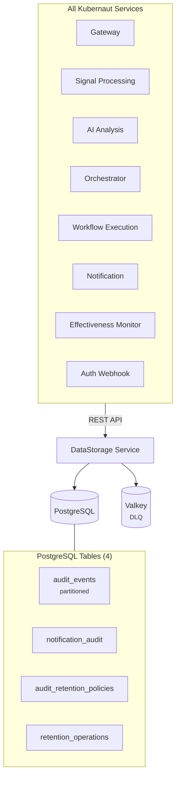
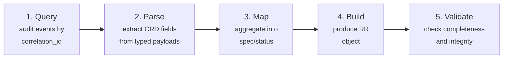
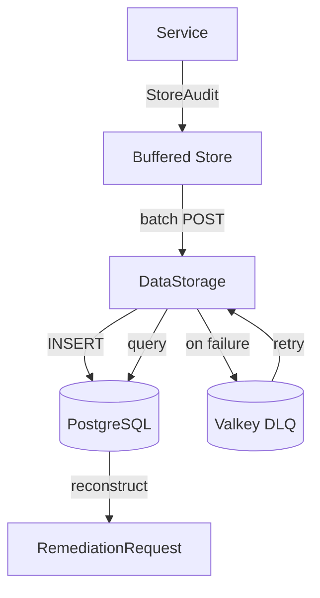

# Data Persistence

!!! info "Operator guide"
    For CRD retention, storage lifetime, and use cases, see [Data Lifecycle](../user-guide/data-lifecycle.md).

Kubernaut uses **PostgreSQL** as its persistent data store, accessed exclusively through the **DataStorage** REST API service. Valkey provides a dead-letter queue for audit event resilience. This page covers the database schema, partitioning strategy, indexing, and the RemediationRequest reconstruction pipeline.

## Storage Architecture


```mermaid
graph TB
    subgraph Services["All Kubernaut Services"]
        S1[Gateway]
        S2[Signal Processing]
        S3[AI Analysis]
        S4[Orchestrator]
        S5[Workflow Execution]
        S6[Notification]
        S7[Effectiveness Monitor]
        S8[Auth Webhook]
    end

    Services -->|REST API| DS[DataStorage Service]

    DS --> PG[(PostgreSQL)]
    DS --> RD[(Valkey<br/><small>DLQ</small>)]

    subgraph Tables["PostgreSQL Tables (4)"]
        direction LR
        AE[audit_events<br/><small>partitioned</small>]
        NAU[notification_audit]
        ARP[audit_retention_policies]
        RO_T[retention_operations]
    end

    PG --- Tables
```

!!! warning "v1.6: down to 4 tables -- 13 dropped"
    Of the original 17-table, 5-view schema this page once documented, only these **4 tables** remain. `remediation_workflow_catalog`, `action_type_taxonomy`, and `resource_action_traces` were dropped by `DROP TABLE`/CASCADE earlier (see [Workflow Catalog Migration (v1.6)](#workflow-catalog-migration-v16)). The remaining 8 tables + `action_effectiveness_metrics` + all 3 surviving views are legacy ML-era schema with zero Go code path, tracked for removal in v1.6 by [kubernaut#2256](https://github.com/jordigilh/kubernaut/issues/2256) -- see [Removed in v1.6: Legacy Schema](#removed-in-v16-legacy-schema-kubernaut2256) below.

## Database Schema

!!! info "Only these 4 tables remain"
    `audit_events`, `notification_audit`, `audit_retention_policies`, and `retention_operations` are the complete DataStorage schema as of v1.6 -- the only tables with active Go readers/writers in `pkg/datastorage`, and (per [kubernaut#2256](https://github.com/jordigilh/kubernaut/issues/2256)) the only ones left standing once the legacy ML-era cluster is dropped. This section covers them in full detail.

### audit_events

The primary audit table, partitioned by month. This is the largest table in the system, storing the complete remediation history.

| Column | Type | Nullable | Description |
|---|---|---|---|
| `event_id` | `UUID` | PK (with `event_date`) | Primary key |
| `event_version` | `VARCHAR(10)` | | Schema version (default: `1.0`) |
| `event_timestamp` | `TIMESTAMPTZ` | | When the event occurred |
| `event_date` | `DATE` | PK | Partition key |
| `event_type` | `VARCHAR(100)` | | Hierarchical type (e.g., `aianalysis.analysis.completed`) |
| `event_category` | `VARCHAR(50)` | | Category (e.g., `signal`, `remediation`) |
| `event_action` | `VARCHAR(50)` | | Action (e.g., `received`, `completed`) |
| `event_outcome` | `VARCHAR(20)` | | `success`, `failure`, `pending` |
| `actor_type` | `VARCHAR(50)` | | Service or human operator |
| `actor_id` | `VARCHAR(255)` | | Identity of the actor |
| `resource_type` | `VARCHAR(100)` | | Target resource type |
| `resource_id` | `VARCHAR(255)` | | Target resource identifier |
| `correlation_id` | `VARCHAR(255)` | | Links events for one remediation (RR name) |
| `parent_event_id` | `UUID` | | Chain to parent event |
| `parent_event_date` | `DATE` | | Parent event partition key |
| `namespace` | `VARCHAR(253)` | | Kubernetes namespace |
| `cluster_name` | `VARCHAR(255)` | | Cluster identifier |
| `event_data` | `JSONB` | | Service-specific payload |
| `event_hash` | `TEXT` | | SHA256 hash chain for integrity |
| `previous_event_hash` | `TEXT` | | Previous event's hash |
| `severity` | `VARCHAR(20)` | | Signal severity |
| `duration_ms` | `BIGINT` | | Operation duration |
| `error_code` | `VARCHAR(50)` | | Error code (if failure) |
| `error_message` | `TEXT` | | Error description |
| `retention_days` | `INTEGER` | | Default: 2555 (7 years) |
| `is_sensitive` | `BOOLEAN` | | PII flag |
| `legal_hold` | `BOOLEAN` | | Legal hold flag |
| `legal_hold_reason` | `TEXT` | | Reason for hold |
| `legal_hold_placed_by` | `VARCHAR(255)` | | Who placed the hold |
| `legal_hold_placed_at` | `TIMESTAMPTZ` | | When hold was placed |

**Indexes**:

| Index | Columns | Purpose |
|---|---|---|
| `idx_audit_events_event_timestamp` | `event_timestamp DESC` | Chronological queries |
| `idx_audit_events_correlation_id` | `correlation_id, event_timestamp DESC` | Remediation timeline reconstruction |
| `idx_audit_events_event_type` | `event_type, event_timestamp DESC` | Event type filtering |
| `idx_audit_events_event_data_gin` | `event_data USING GIN` | JSONB payload queries |
| `idx_audit_events_pre_remediation_spec_hash` | `(event_data->>'pre_remediation_spec_hash'), event_timestamp DESC` | Spec hash history lookups |
| `idx_audit_events_post_remediation_spec_hash` | `(event_data->>'post_remediation_spec_hash'), event_timestamp DESC` | Post-remediation spec hash lookups (migration `004`) |

**Partitioning**: Monthly range on `event_date` (`audit_events_2026_03` through `audit_events_2028_12`, plus `audit_events_default`). Provides fast queries via partition pruning, efficient retention via partition drops, and independent sizing/backup per partition.

**Trigger**: `prevent_legal_hold_deletion` prevents deletion of rows with `legal_hold = true`.

---

### Workflow Catalog Migration (v1.6)

Through v1.5, the workflow catalog lived in two Postgres tables: `remediation_workflow_catalog` (workflow definitions, scoring/discovery columns, UUIDv5 deterministic IDs) and `action_type_taxonomy` (the `action_type` FK target). **As of v1.6** (DD-WORKFLOW-018/019, `migrations/016_drop_workflow_catalog_and_action_type_tables.sql`), both tables were dropped outright:

```sql
DROP TABLE IF EXISTS remediation_workflow_catalog;
DROP TABLE IF EXISTS action_type_taxonomy;
```

The `RemediationWorkflow`/`ActionType` **CRDs (etcd) are now the sole source of truth** — there are zero remaining SQL queries against either table. The Auth Webhook's admission handler validates and admits CRD changes directly (no DataStorage round trip), and **Kubernaut Agent** serves the discovery/scoring protocol (`list_available_actions` → `list_workflows` → `get_workflow`) from its own in-memory, informer-cache-backed catalog. See [Workflow Catalog](../user-guide/concepts.md#workflow-catalog) and [Workflow Search and Scoring](../user-guide/workflows.md#workflow-search-and-scoring) for the current architecture, and [Registration Model](../user-guide/workflows.md#registration-model) for how the Auth Webhook owns the CRD lifecycle locally.

Deterministic UUIDv5 identity and content-hash supersession logic (previously implemented in Postgres) no longer apply — CRD identity is `metadata.name` + `spec.version`, and `catalogStatus` (`Active`/`Disabled`/`Superseded`) lives directly on the CRD's `status`.

!!! info "resource_action_traces was also dropped, independently"
    `resource_action_traces` (the former per-resource action trace table, used by the now-removed model-based action tracking/AI-decision-metadata pipeline) was dropped separately in `migrations/009_drop_resource_action_traces.sql` (Issue #1048, "never exposed via API, aggregation feature removed"). Its `DROP TABLE ... CASCADE` also removed the two views built directly on it (`action_history_summary`, `incident_summary_view`). This predates and is unrelated to the v1.6 workflow-catalog migration above — it's a separate legacy cleanup. See [Removed in v1.6: Legacy Schema](#removed-in-v16-legacy-schema-kubernaut2256) below for the rest of the tables this once left stranded.

---

### notification_audit

Notification-specific audit events with delivery tracking.

| Column | Type | Nullable | Description |
|---|---|---|---|
| `id` | `BIGSERIAL` | PK | |
| `remediation_id` | `VARCHAR(255)` | NOT NULL | |
| `notification_id` | `VARCHAR(255)` | NOT NULL | UNIQUE |
| `recipient` | `VARCHAR(255)` | NOT NULL | |
| `channel` | `VARCHAR(50)` | NOT NULL | Constrained: `email`, `slack`, `pagerduty`, `sms` |
| `message_summary` | `TEXT` | NOT NULL | |
| `status` | `VARCHAR(50)` | NOT NULL | Constrained: `sent`, `failed`, `acknowledged`, `escalated` |
| `sent_at` | `TIMESTAMPTZ` | NOT NULL | |
| `delivery_status` | `TEXT` | | |
| `error_message` | `TEXT` | | |
| `escalation_level` | `INTEGER` | NOT NULL | Default: 0 |
| `created_at` | `TIMESTAMPTZ` | NOT NULL | |
| `updated_at` | `TIMESTAMPTZ` | NOT NULL | |

**Indexes**: btree on `remediation_id`, `notification_id`, `channel`, `status`, `created_at DESC`.

---

### audit_retention_policies

Retention policy definitions per event category.

| Column | Type | Nullable | Description |
|---|---|---|---|
| `policy_id` | `UUID` | PK | `gen_random_uuid()` |
| `event_category` | `TEXT` | NOT NULL | UNIQUE |
| `retention_days` | `INTEGER` | NOT NULL | |
| `legal_hold_override` | `BOOLEAN` | | Default: `false` |
| `created_at` | `TIMESTAMP` | NOT NULL | |
| `updated_at` | `TIMESTAMP` | NOT NULL | |

---

### retention_operations

Retention run history for `audit_events`, written by the retention worker (`pkg/datastorage/retention/worker.go`).

!!! info "Schema replaced by migration 008"
    The original `action_histories`-linked schema (FK, `strategy_used`, `records_*` columns) was dropped and replaced entirely by `migrations/008_retention_enforcement.sql`, which retargeted this table at `audit_events` retention instead. The columns below are the current, post-008 schema.

| Column | Type | Nullable | Description |
|---|---|---|---|
| `id` | `BIGSERIAL` | PK | |
| `run_id` | `UUID` | NOT NULL | Default: `gen_random_uuid()` |
| `scope` | `VARCHAR(50)` | NOT NULL | Default: `audit_events` |
| `period_start` | `DATE` | | |
| `period_end` | `DATE` | | |
| `rows_scanned` | `INTEGER` | NOT NULL | Default: 0 |
| `rows_deleted` | `INTEGER` | NOT NULL | Default: 0 |
| `partitions_dropped` | `TEXT[]` | | Default: `{}` |
| `status` | `VARCHAR(20)` | NOT NULL | Default: `running` |
| `error_message` | `TEXT` | | |
| `operation_start` | `TIMESTAMPTZ` | NOT NULL | Default: `now()` |
| `operation_end` | `TIMESTAMPTZ` | | |
| `operation_duration_ms` | `INTEGER` | | |
| `created_at` | `TIMESTAMPTZ` | | Default: `now()` |

**Indexes**: btree on `run_id`, `operation_start DESC`, `status`.

---

## Removed in v1.6: Legacy Schema (kubernaut#2256)

The following tables and views were part of an earlier ML-style per-action learning/effectiveness design that predates the current CRD-driven `EffectivenessAssessment` flow. They had **zero Go code anywhere in the repository** reading or writing them (confirmed by a repo-wide search) — the live equivalent computes scores on demand from `audit_events` instead (see `GetEffectivenessScore`, ADR-EM-001 Principle 5, DD-017 v2.1 formula). **As of v1.6** ([kubernaut#2256](https://github.com/jordigilh/kubernaut/issues/2256)), all of them are dropped:

| Table | Former purpose |
|---|---|
| `resource_references` | Resource identity FK target for the tables below |
| `action_histories` | Per-resource action history/retention config |
| `action_assessments` | Pending effectiveness assessments, auto-created by a trigger on the (already-dropped) `resource_action_traces` |
| `effectiveness_results` | Effectiveness assessment results for learning feedback |
| `action_confidence_scores` | Dynamic per-action confidence scores |
| `action_outcomes` | Historical outcomes for ML training |
| `action_alternatives` | Alternative-action recommendations for failed patterns |
| `action_effectiveness_metrics` | Aggregated effectiveness metrics by scope/period (flagged dead but not dropped by [kubernaut#623](https://github.com/jordigilh/kubernaut/issues/623); dropped here instead) |
| `oscillation_patterns` | Oscillation (repeated fail/fix cycle) pattern definitions |
| `oscillation_detections` | Detected oscillation instances |

The 3 views built on top of this cluster are dropped along with their source tables: `effectiveness_trends`, `low_confidence_actions`, `oscillation_detection_summary`. (Two further views built on the earlier-dropped `resource_action_traces` -- `action_history_summary`, `incident_summary_view` -- were already removed by `DROP TABLE ... CASCADE` in migration 009.)

This leaves DataStorage with **exactly 4 tables and 0 views**: [`audit_events`](#audit_events), [`notification_audit`](#notification_audit), [`audit_retention_policies`](#audit_retention_policies), and [`retention_operations`](#retention_operations).

---

## Stored Functions

Only 3 procedural functions remain as of v1.6 — the rest existed solely to serve the [legacy schema dropped in kubernaut#2256](#removed-in-v16-legacy-schema-kubernaut2256) and are removed along with it.

| Function | Purpose |
|---|---|
| `create_monthly_partitions()` | Generates monthly partitions for `audit_events` |
| `prevent_legal_hold_deletion()` | Blocks deletion of audit events under legal hold |
| `audit_event_lock_id()` | Generates advisory lock IDs for audit event deduplication |

Removed in v1.6 (kubernaut#2256): `create_assessment_for_action_trace()` (trigger on the already-dropped `resource_action_traces`), `analyze_action_oscillation()`, `detect_cascading_failures()`, `detect_ineffective_loops()`, `detect_resource_thrashing()`, `detect_scale_oscillation()`, `analyze_cascade_effects()`, `store_oscillation_detection()`, `get_action_effectiveness()`, `get_action_traces()`, `get_recent_actions()`, `get_resource_actions_base()`, `get_resource_id()`.

---

## Auth Webhook: local CRD admission (v1.6)

Through v1.5, the Auth Webhook ran a startup **Runnable** that reconciled cluster `ActionType`/`RemediationWorkflow` objects into DataStorage's `remediation_workflow_catalog`/`action_type_taxonomy` tables via idempotent creates, using **deterministic UUIDv5** identity (derived from a content hash of the spec) so catalog rows stayed stable across PVC wipes and database replays.

**As of v1.6** (DD-WORKFLOW-018/019), this entire reconciliation-with-DataStorage step is gone: the `RemediationWorkflow`/`ActionType` CRDs in etcd are the sole source of truth, admitted directly by the webhook at `kubectl apply` time — there's no separate catalog to reconcile into or keep in sync. Identity is `metadata.name` + `spec.version` (CRD-native), and etcd's own backup/restore model replaces the old "stable across PVC wipes" concern.

**Graceful degradation** (#1246) — Individual `RemediationWorkflow` admission failures do not crash the pod. The webhook logs the error, emits a `authwebhook.workflow.registration_failed` audit event, and continues processing. See [Registration Model](../user-guide/workflows.md#registration-model) for the current admission flow.

## Database migrations

Schema changes use an **append-only** migration chain managed by [**goose**](https://github.com/pressly/goose). The strategy is:

- **Append-only chain** — migrations are never rewritten in place; history stays linear.
- **Per-major baselines** — each major release can ship a squashed baseline for **fresh installs**, while upgrades follow the incremental chain from their installed version.
- **Minor release squash** — development incrementals are typically **squashed per minor** at release time to keep the chain maintainable.
- **`db-migrate` migration job** — runs via Helm hook (`post-install,post-upgrade`) and distinguishes **fresh install** vs **upgrade** using the `goose_db_version` table so the correct migration path applies.

Migrations `002`–`005` are part of this chain; **`004` adds** an index on `post_remediation_spec_hash` in `event_data` for audit queries, and **`005` adds** an effectiveness correlation index. Later migrations progressively removed the legacy schema documented above: **`008`** replaced `retention_operations`'s schema (see [retention_operations](#retention_operations)), **`009`** dropped `resource_action_traces` with `CASCADE`, **`016`** dropped `remediation_workflow_catalog`/`action_type_taxonomy` (v1.6, see [Workflow Catalog Migration](#workflow-catalog-migration-v16)), and a further v1.6 migration drops the remaining legacy ML-era cluster (10 tables + 3 views + their stored functions, [kubernaut#2256](https://github.com/jordigilh/kubernaut/issues/2256); see [Removed in v1.6: Legacy Schema](#removed-in-v16-legacy-schema-kubernaut2256)).

## RemediationRequest Reconstruction

The DataStorage service can rebuild a complete `RemediationRequest` from audit events — even after the CRD has been removed from the cluster.

### Endpoint

```
POST /api/v1/audit/remediation-requests/{correlation_id}/reconstruct
```

### Pipeline


```mermaid
graph LR
    Q["1. Query<br/><small>audit events by<br/>correlation_id</small>"]
    P["2. Parse<br/><small>extract CRD fields<br/>from typed payloads</small>"]
    M["3. Map<br/><small>aggregate into<br/>spec/status</small>"]
    B["4. Build<br/><small>produce RR<br/>object</small>"]
    V["5. Validate<br/><small>check completeness<br/>and integrity</small>"]
    Q --> P --> M --> B --> V
```

### Query

Events are fetched by `correlation_id` filtered to specific event types:

```sql
SELECT event_id, event_type, event_timestamp, event_outcome,
       resource_type, resource_id, actor_type, actor_id,
       event_data, namespace, cluster_name, duration_ms
FROM audit_events
WHERE correlation_id = $1
  AND event_type IN (
    'gateway.signal.received',
    'aianalysis.analysis.completed',
    'workflowexecution.selection.completed',
    'workflowexecution.execution.started',
    'orchestrator.lifecycle.created'
  )
ORDER BY event_timestamp ASC, event_id ASC
```

### Source Event Mapping

| Reconstructed Field | Source Event | Payload Field |
|---|---|---|
| `spec.signalName`, `signalType`, `signalLabels` | `gateway.signal.received` | `GatewayAuditPayload` |
| `spec.originalPayload` | `gateway.signal.received` | `GatewayAuditPayload` |
| `spec.signalAnnotations` | `gateway.signal.received` | `GatewayAuditPayload` |
| `status.selectedWorkflowRef` | `workflowexecution.selection.completed` | `WorkflowExecutionAuditPayload` |
| `status.executionRef` | `workflowexecution.execution.started` | `WorkflowExecutionAuditPayload` |
| `status.timeoutConfig` | `orchestrator.lifecycle.created` | `RemediationOrchestratorAuditPayload` |

Events are ordered by timestamp and mapped into typed payloads (`GatewayAuditPayload`, `RemediationOrchestratorAuditPayload`, `AIAnalysisAuditPayload`, `WorkflowExecutionAuditPayload`) to rebuild the RR.

### Limitations

- Reconstruction is available for **RemediationRequest** CRDs only (other CRD types planned)
- `status.error` and `OverallPhase` are not reconstructed from the current event schema

## Valkey (DLQ)

Valkey serves as a dead-letter queue for audit event resilience:

### Streams

| Stream | Purpose | Max Length |
|---|---|---|
| `audit:dlq:events` | Failed generic audit batches | 10,000 |
| `audit:dlq:notifications` | Failed notification audit events | 10,000 |
| `audit:dead-letter:{type}` | Events that exceeded all retry attempts | 10,000 |

### Operations

| Operation | Command | Description |
|---|---|---|
| Enqueue | `XADD` | Add failed batch to stream |
| Read | `XREADGROUP` | Consumer group for reliable delivery |
| Acknowledge | `XACK` | Mark message as processed |
| Move to dead letter | `XADD` to dead-letter stream | After max retries |
| Drain | `DrainWithTimeout` | Graceful shutdown flush |

### Message Format

```json
{
  "type": "audit_event",
  "payload": "...",
  "timestamp": "2026-03-04T12:00:00Z",
  "retry_count": 2,
  "last_error": "connection refused"
}
```

## Data Flow Summary


```mermaid
graph TD
    S[Service] -->|StoreAudit| BS[Buffered Store]
    BS -->|batch POST| DS[DataStorage]
    DS -->|INSERT| PG[(PostgreSQL)]
    DS -->|on failure| RD[(Valkey DLQ)]
    RD -->|retry| DS

    DS -->|query| PG
    PG -->|reconstruct| RR[RemediationRequest]
```

## Next Steps

- [Audit Pipeline](audit-pipeline.md) — How events reach DataStorage
- [Data Lifecycle](../user-guide/data-lifecycle.md) — User-facing data lifecycle documentation
- [API Reference: DataStorage](../api-reference/datastorage-api.md) — REST API endpoints
