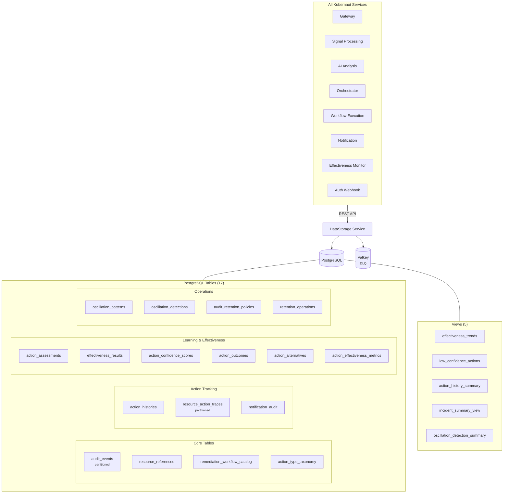
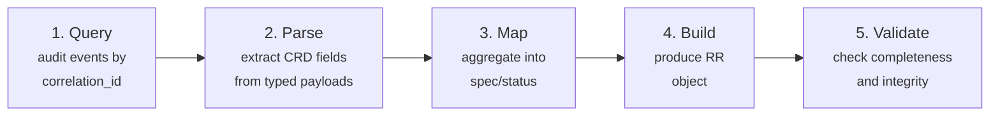
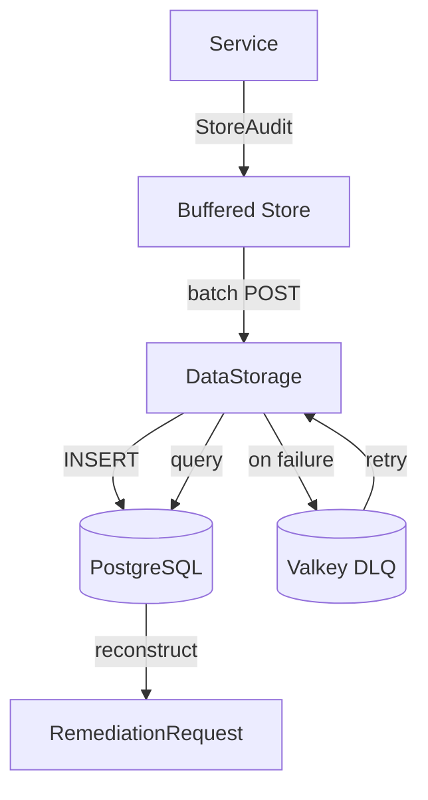

# Data Persistence

!!! info "Operator guide"
    For CRD retention, storage lifetime, and use cases, see [Data Lifecycle](../user-guide/data-lifecycle.md).

Kubernaut uses **PostgreSQL** as its persistent data store, accessed exclusively through the **DataStorage** REST API service. Valkey provides a dead-letter queue for audit event resilience. This page covers the database schema, partitioning strategy, indexing, and the RemediationRequest reconstruction pipeline.

## Storage Architecture


```mermaid
graph TB
    subgraph Services["All Kubernaut Services"]
        S1[Gateway]
        S2[Signal Processing]
        S3[AI Analysis]
        S4[Orchestrator]
        S5[Workflow Execution]
        S6[Notification]
        S7[Effectiveness Monitor]
        S8[Auth Webhook]
    end

    Services -->|REST API| DS[DataStorage Service]

    DS --> PG[(PostgreSQL)]
    DS --> RD[(Valkey<br/><small>DLQ</small>)]

    subgraph Tables["PostgreSQL Tables (17)"]
        direction LR
        subgraph Core["Core Tables"]
            AE[audit_events<br/><small>partitioned</small>]
            RR_T[resource_references]
            WF[remediation_workflow_catalog]
            AT[action_type_taxonomy]
        end
        subgraph Tracking["Action Tracking"]
            AH[action_histories]
            RT[resource_action_traces<br/><small>partitioned</small>]
            NAU[notification_audit]
        end
        subgraph Learning["Learning & Effectiveness"]
            AA[action_assessments]
            ER[effectiveness_results]
            ACS[action_confidence_scores]
            AO[action_outcomes]
            AAlt[action_alternatives]
            AEM[action_effectiveness_metrics]
        end
        subgraph Operations["Operations"]
            OP[oscillation_patterns]
            OD[oscillation_detections]
            ARP[audit_retention_policies]
            RO_T[retention_operations]
        end
    end

    subgraph Views["Views (5)"]
        V1[effectiveness_trends]
        V2[low_confidence_actions]
        V3[action_history_summary]
        V4[incident_summary_view]
        V5[oscillation_detection_summary]
    end

    PG --- Tables
    PG --- Views
```

## Database Schema

### resource_references

Core resource identity table, serving as the FK target for action histories and oscillation detections.

| Column | Type | Nullable | Description |
|---|---|---|---|
| `id` | `BIGSERIAL` | PK | Auto-incrementing primary key |
| `resource_uid` | `VARCHAR(36)` | NOT NULL | Kubernetes resource UID |
| `api_version` | `VARCHAR(100)` | NOT NULL | API version (e.g., `apps/v1`) |
| `kind` | `VARCHAR(100)` | NOT NULL | Resource kind (e.g., `Deployment`) |
| `name` | `VARCHAR(253)` | NOT NULL | Resource name |
| `namespace` | `VARCHAR(63)` | | Kubernetes namespace (NULL for cluster-scoped) |
| `created_at` | `TIMESTAMPTZ` | | Default: `now()` |
| `deleted_at` | `TIMESTAMPTZ` | | Soft-delete timestamp |
| `last_seen` | `TIMESTAMPTZ` | | Default: `now()` |

**Indexes**: PK, UNIQUE on `resource_uid`, UNIQUE on `(namespace, kind, name)`, btree on `kind`, `namespace`, `last_seen`.

**Referenced by**: `action_histories.resource_id`, `oscillation_detections.resource_id` (both CASCADE on delete).

---

### audit_events

The primary audit table, partitioned by month. This is the largest table in the system, storing the complete remediation history.

| Column | Type | Nullable | Description |
|---|---|---|---|
| `event_id` | `UUID` | PK (with `event_date`) | Primary key |
| `event_version` | `VARCHAR(10)` | | Schema version (default: `1.0`) |
| `event_timestamp` | `TIMESTAMPTZ` | | When the event occurred |
| `event_date` | `DATE` | PK | Partition key |
| `event_type` | `VARCHAR(100)` | | Hierarchical type (e.g., `aianalysis.analysis.completed`) |
| `event_category` | `VARCHAR(50)` | | Category (e.g., `signal`, `remediation`) |
| `event_action` | `VARCHAR(50)` | | Action (e.g., `received`, `completed`) |
| `event_outcome` | `VARCHAR(20)` | | `success`, `failure`, `pending` |
| `actor_type` | `VARCHAR(50)` | | Service or human operator |
| `actor_id` | `VARCHAR(255)` | | Identity of the actor |
| `resource_type` | `VARCHAR(100)` | | Target resource type |
| `resource_id` | `VARCHAR(255)` | | Target resource identifier |
| `correlation_id` | `VARCHAR(255)` | | Links events for one remediation (RR name) |
| `parent_event_id` | `UUID` | | Chain to parent event |
| `parent_event_date` | `DATE` | | Parent event partition key |
| `namespace` | `VARCHAR(253)` | | Kubernetes namespace |
| `cluster_name` | `VARCHAR(255)` | | Cluster identifier |
| `event_data` | `JSONB` | | Service-specific payload |
| `event_hash` | `TEXT` | | SHA256 hash chain for integrity |
| `previous_event_hash` | `TEXT` | | Previous event's hash |
| `severity` | `VARCHAR(20)` | | Signal severity |
| `duration_ms` | `BIGINT` | | Operation duration |
| `error_code` | `VARCHAR(50)` | | Error code (if failure) |
| `error_message` | `TEXT` | | Error description |
| `retention_days` | `INTEGER` | | Default: 2555 (7 years) |
| `is_sensitive` | `BOOLEAN` | | PII flag |
| `legal_hold` | `BOOLEAN` | | Legal hold flag |
| `legal_hold_reason` | `TEXT` | | Reason for hold |
| `legal_hold_placed_by` | `VARCHAR(255)` | | Who placed the hold |
| `legal_hold_placed_at` | `TIMESTAMPTZ` | | When hold was placed |

**Indexes**:

| Index | Columns | Purpose |
|---|---|---|
| `idx_audit_events_event_timestamp` | `event_timestamp DESC` | Chronological queries |
| `idx_audit_events_correlation_id` | `correlation_id, event_timestamp DESC` | Remediation timeline reconstruction |
| `idx_audit_events_event_type` | `event_type, event_timestamp DESC` | Event type filtering |
| `idx_audit_events_event_data_gin` | `event_data USING GIN` | JSONB payload queries |
| `idx_audit_events_pre_remediation_spec_hash` | `(event_data->>'pre_remediation_spec_hash'), event_timestamp DESC` | Spec hash history lookups |
| `idx_audit_events_post_remediation_spec_hash` | `(event_data->>'post_remediation_spec_hash'), event_timestamp DESC` | Post-remediation spec hash lookups (migration `004`) |

**Partitioning**: Monthly range on `event_date` (`audit_events_2026_03` through `audit_events_2028_12`, plus `audit_events_default`). Provides fast queries via partition pruning, efficient retention via partition drops, and independent sizing/backup per partition.

**Trigger**: `prevent_legal_hold_deletion` prevents deletion of rows with `legal_hold = true`.

---

### remediation_workflow_catalog

The workflow catalog table, used for workflow discovery and scoring.

| Column | Type | Nullable | Description |
|---|---|---|---|
| `workflow_id` | `UUID` | PK | Deterministic UUIDv5 from content hash |
| `workflow_name` | `VARCHAR(255)` | NOT NULL | CRD metadata name |
| `version` | `VARCHAR(50)` | NOT NULL | Semantic version |
| `name` | `VARCHAR(255)` | NOT NULL | Human-readable display name |
| `description` | `JSONB` | NOT NULL | `{what, whenToUse, whenNotToUse, preconditions}` (camelCase keys) |
| `owner` | `VARCHAR(255)` | | Workflow owner |
| `maintainer` | `VARCHAR(255)` | | Workflow maintainer |
| `content` | `TEXT` | NOT NULL | Full workflow content (YAML) |
| `content_hash` | `VARCHAR(64)` | NOT NULL | SHA256 hash of normalized workflow content (DD-EM-002) |
| `labels` | `JSONB` | NOT NULL | Mandatory labels (`signalName` key for semantic signal matching) |
| `parameters` | `JSONB` | | Workflow parameters |
| `execution_engine` | `VARCHAR(50)` | NOT NULL | Default: `tekton`. One of `tekton`, `job`, `ansible` |
| `schema_image` | `TEXT` | | OCI image pulled at registration to extract `/workflow-schema.yaml` |
| `schema_digest` | `VARCHAR(71)` | | SHA256 digest of the schema image |
| `execution_bundle` | `TEXT` | | OCI execution bundle reference (digest-pinned) |
| `execution_bundle_digest` | `VARCHAR(71)` | | SHA256 digest of execution bundle |
| `custom_labels` | `JSONB` | NOT NULL | Custom labels from workflow schema |
| `detected_labels` | `JSONB` | NOT NULL | Infrastructure-awareness labels |
| `engine_config` | `JSONB` | | Engine-specific config (e.g., AWX `jobTemplateName`, `inventoryName`). NULL for Tekton/Job |
| `action_type` | `TEXT` | NOT NULL | FK to `action_type_taxonomy` |
| `status` | `VARCHAR(20)` | NOT NULL | `active`, `disabled`, `deprecated`, `archived`, `superseded` |
| `status_reason` | `TEXT` | | Reason for current status |
| `schema_version` | `VARCHAR(10)` | NOT NULL | Default: `1.0` |
| `disabled_at` | `TIMESTAMPTZ` | | When disabled |
| `disabled_by` | `VARCHAR(255)` | | Who disabled it |
| `disabled_reason` | `TEXT` | | Why disabled |
| `is_latest_version` | `BOOLEAN` | NOT NULL | Partial index for discovery queries |
| `previous_version` | `VARCHAR(50)` | | Previous version reference |
| `deprecation_notice` | `TEXT` | | Deprecation notice text |
| `version_notes` | `TEXT` | | Version release notes |
| `change_summary` | `TEXT` | | Summary of changes from previous version |
| `approved_by` | `VARCHAR(255)` | | Approver identity |
| `approved_at` | `TIMESTAMPTZ` | | Approval timestamp |
| `expected_success_rate` | `NUMERIC(4,3)` | | Expected success rate [0.000–1.000] |
| `expected_duration_seconds` | `INTEGER` | | Expected execution duration |
| `actual_success_rate` | `NUMERIC(4,3)` | | Computed from execution history [0.000–1.000] |
| `total_executions` | `INTEGER` | | Default: 0 |
| `successful_executions` | `INTEGER` | | Default: 0 (constrained ≤ `total_executions`) |
| `created_at` | `TIMESTAMPTZ` | NOT NULL | |
| `updated_at` | `TIMESTAMPTZ` | NOT NULL | Auto-updated via trigger |
| `created_by` | `VARCHAR(255)` | | Creator identity |
| `updated_by` | `VARCHAR(255)` | | Last updater identity |

**Key indexes**: GIN on `labels`, `custom_labels`, `detected_labels`; composite on `(action_type, status, is_latest_version)` for discovery; partial UNIQUE on `(workflow_name, version)` WHERE `status = 'active'`; btree on `created_at DESC`, `status`, `workflow_name`, `schema_digest`, `execution_bundle_digest`, `actual_success_rate DESC` (active only).

**Check constraints**: `status` must be one of `active`/`disabled`/`deprecated`/`archived`/`superseded`. `expected_success_rate`, `actual_success_rate` must be in [0, 1]. `successful_executions` must be ≤ `total_executions`.

**Workflow supersession**: Only one workflow version per `(workflow_name, action_type)` pair can be `active` at a time. When a new version is registered (via `RemediationWorkflow` CRD creation or update), DataStorage marks the previous active entry as `superseded` and activates the new one, enforced by the `GetActiveByWorkflowName` repository method.

**PK collision recovery (SupersedeAndCreate)**: Workflow primary keys are **deterministic** (UUIDv5). A rare re-registration can collide with an existing row. If the colliding row has `status = 'Superseded'`, DataStorage **re-activates** it with reason `reactivated: re-registered via CRD`. The implementation uses a **SAVEPOINT/ROLLBACK** pattern.

---

### action_type_taxonomy

The action type registry for workflow categorization.

| Column | Type | Nullable | Description |
|---|---|---|---|
| `action_type` | `TEXT` | PK | PascalCase identifier (e.g., `ScaleReplicas`, `RestartPod`) |
| `description` | `JSONB` | NOT NULL | `{what, whenToUse, whenNotToUse, preconditions}` (camelCase keys) |
| `status` | `TEXT` | NOT NULL | Default: `active`. Lifecycle: `active`, `disabled`, `deprecated`, `archived`, `superseded` |
| `disabled_at` | `TIMESTAMPTZ` | | When disabled |
| `disabled_by` | `TEXT` | | Who disabled it |
| `created_at` | `TIMESTAMP` | NOT NULL | |
| `updated_at` | `TIMESTAMP` | NOT NULL | Auto-updated via trigger |

**Referenced by**: `remediation_workflow_catalog.action_type` (FK).

The database deploys with a clean schema — no pre-seeded rows. Action types are registered via `kubectl apply -f` on `ActionType` CRDs. The AuthWebhook intercepts the admission request and registers each action type in the DataStorage catalog via its REST API.

---

### resource_action_traces

The **major partitioned trace table** for per-resource action tracking. Stores signal data, AI decision metadata, execution tracking, and effectiveness scoring. Partitioned by month on `action_timestamp`.

| Column | Type | Nullable | Description |
|---|---|---|---|
| `id` | `BIGSERIAL` | PK (with `action_timestamp`) | |
| `action_history_id` | `BIGINT` | NOT NULL | FK to `action_histories.id` |
| `action_id` | `VARCHAR(64)` | NOT NULL | UNIQUE (with `action_timestamp`) |
| `correlation_id` | `VARCHAR(64)` | | Links to RR correlation |
| **Timing** | | | |
| `action_timestamp` | `TIMESTAMPTZ` | NOT NULL | Partition key |
| `execution_start_time` | `TIMESTAMPTZ` | | |
| `execution_end_time` | `TIMESTAMPTZ` | | |
| `execution_duration_ms` | `INTEGER` | | |
| **Signal context** | | | |
| `signal_name` | `VARCHAR(200)` | NOT NULL | Alert/signal name |
| `signal_severity` | `VARCHAR(20)` | NOT NULL | Signal severity |
| `signal_labels` | `JSONB` | | GIN-indexed for containment queries |
| `signal_annotations` | `JSONB` | | |
| `signal_firing_time` | `TIMESTAMPTZ` | | |
| `incident_type` | `VARCHAR(100)` | | |
| `alert_name` | `VARCHAR(255)` | | |
| `incident_severity` | `VARCHAR(20)` | | |
| **Workflow / execution** | | | |
| `workflow_id` | `VARCHAR(64)` | | |
| `workflow_version` | `VARCHAR(20)` | | |
| `workflow_step_number` | `INTEGER` | | |
| `workflow_execution_id` | `VARCHAR(64)` | | |
| `execution_status` | `VARCHAR(20)` | | Default: `pending`. Values: `pending`, `executing`, `completed`, `failed` |
| `execution_error` | `TEXT` | | |
| `kubernetes_operations` | `JSONB` | | |
| **AI decision** | | | |
| `ai_selected_workflow` | `BOOLEAN` | | Default: `false` |
| `ai_chained_workflows` | `BOOLEAN` | | Default: `false` |
| `ai_manual_escalation` | `BOOLEAN` | | Default: `false` |
| `ai_workflow_customization` | `JSONB` | | |
| `model_used` | `VARCHAR(100)` | NOT NULL | LLM model identifier |
| `routing_tier` | `VARCHAR(20)` | | |
| `model_confidence` | `NUMERIC(4,3)` | NOT NULL | [0.000–1.000] |
| `model_reasoning` | `TEXT` | | |
| `alternative_actions` | `JSONB` | | |
| `action_type` | `VARCHAR(50)` | NOT NULL | |
| `action_parameters` | `JSONB` | | GIN-indexed |
| **Resource state** | | | |
| `resource_state_before` | `JSONB` | | GIN-indexed |
| `resource_state_after` | `JSONB` | | |
| **Effectiveness** | | | |
| `effectiveness_score` | `NUMERIC(4,3)` | | [0.000–1.000] when assessed |
| `effectiveness_criteria` | `JSONB` | | |
| `effectiveness_assessed_at` | `TIMESTAMPTZ` | | |
| `effectiveness_assessment_method` | `VARCHAR(20)` | | |
| `effectiveness_assessment_due` | `TIMESTAMPTZ` | | |
| `effectiveness_notes` | `TEXT` | | |
| `follow_up_actions` | `JSONB` | | |
| `created_at` | `TIMESTAMPTZ` | | Default: `now()` |
| `updated_at` | `TIMESTAMPTZ` | | Auto-updated via trigger |

**Key indexes** (22 total): composite indexes for workflow success rates, incident type analysis, AI execution mode queries, alert-based lookups, effectiveness analysis, and multi-dimensional success correlation. Partial indexes on `execution_status IN ('pending','executing')` and `effectiveness_score IS NOT NULL` for targeted queries.

**Triggers**: `create_assessment_for_action_trace` (AFTER UPDATE — auto-creates `action_assessments` entries), `update_resource_action_traces_updated_at` (BEFORE UPDATE).

**Partitioning**: Monthly range on `action_timestamp` (`resource_action_traces_2026_03` through `resource_action_traces_2028_12`, plus `resource_action_traces_default`).

---

### action_histories

Per-resource action history with configurable retention and compaction.

| Column | Type | Nullable | Description |
|---|---|---|---|
| `id` | `BIGSERIAL` | PK | |
| `resource_id` | `BIGINT` | NOT NULL | FK to `resource_references.id` (UNIQUE, CASCADE) |
| `max_actions` | `INTEGER` | | Default: 1000 |
| `max_age_days` | `INTEGER` | | Default: 30 |
| `compaction_strategy` | `VARCHAR(20)` | | Default: `pattern-aware` |
| `oscillation_window_minutes` | `INTEGER` | | Default: 120 |
| `effectiveness_threshold` | `NUMERIC(3,2)` | | Default: 0.70 |
| `pattern_min_occurrences` | `INTEGER` | | Default: 3 |
| `total_actions` | `INTEGER` | | Default: 0 |
| `last_action_at` | `TIMESTAMPTZ` | | |
| `last_analysis_at` | `TIMESTAMPTZ` | | |
| `next_analysis_at` | `TIMESTAMPTZ` | | |
| `created_at` | `TIMESTAMPTZ` | | Default: `now()` |
| `updated_at` | `TIMESTAMPTZ` | | Auto-updated via trigger |

**Referenced by**: `resource_action_traces.action_history_id`, `retention_operations.action_history_id` (both CASCADE).

---

### notification_audit

Notification-specific audit events with delivery tracking.

| Column | Type | Nullable | Description |
|---|---|---|---|
| `id` | `BIGSERIAL` | PK | |
| `remediation_id` | `VARCHAR(255)` | NOT NULL | |
| `notification_id` | `VARCHAR(255)` | NOT NULL | UNIQUE |
| `recipient` | `VARCHAR(255)` | NOT NULL | |
| `channel` | `VARCHAR(50)` | NOT NULL | Constrained: `email`, `slack`, `pagerduty`, `sms` |
| `message_summary` | `TEXT` | NOT NULL | |
| `status` | `VARCHAR(50)` | NOT NULL | Constrained: `sent`, `failed`, `acknowledged`, `escalated` |
| `sent_at` | `TIMESTAMPTZ` | NOT NULL | |
| `delivery_status` | `TEXT` | | |
| `error_message` | `TEXT` | | |
| `escalation_level` | `INTEGER` | NOT NULL | Default: 0 |
| `created_at` | `TIMESTAMPTZ` | NOT NULL | |
| `updated_at` | `TIMESTAMPTZ` | NOT NULL | |

**Indexes**: btree on `remediation_id`, `notification_id`, `channel`, `status`, `created_at DESC`.

---

### action_assessments

Pending effectiveness assessments for completed actions. Auto-created by the `create_assessment_for_action_trace` trigger.

| Column | Type | Nullable | Description |
|---|---|---|---|
| `id` | `UUID` | PK | `gen_random_uuid()` |
| `trace_id` | `VARCHAR(255)` | NOT NULL | |
| `action_type` | `VARCHAR(100)` | NOT NULL | |
| `context_hash` | `VARCHAR(64)` | NOT NULL | |
| `alert_name` | `VARCHAR(255)` | NOT NULL | |
| `namespace` | `VARCHAR(255)` | NOT NULL | |
| `resource_name` | `VARCHAR(255)` | NOT NULL | |
| `executed_at` | `TIMESTAMPTZ` | NOT NULL | |
| `scheduled_for` | `TIMESTAMPTZ` | NOT NULL | Default: `now() + 5 minutes` |
| `status` | `VARCHAR(50)` | NOT NULL | Default: `pending`. Constrained: `pending`, `processing`, `completed`, `failed`, `skipped` |
| `created_at` | `TIMESTAMPTZ` | NOT NULL | |
| `completed_at` | `TIMESTAMPTZ` | | |

**Indexes**: partial index on `(status, scheduled_for)` WHERE `status = 'pending'` for scheduler queries.

---

### effectiveness_results

Results of effectiveness assessments for learning feedback.

| Column | Type | Nullable | Description |
|---|---|---|---|
| `id` | `UUID` | PK | |
| `trace_id` | `VARCHAR(255)` | NOT NULL | UNIQUE |
| `action_type` | `VARCHAR(100)` | NOT NULL | |
| `overall_score` | `FLOAT8` | NOT NULL | [0.0–1.0] |
| `alert_resolved` | `BOOLEAN` | NOT NULL | |
| `metric_delta` | `JSONB` | | |
| `side_effects` | `INTEGER` | | Default: 0 |
| `confidence` | `FLOAT8` | NOT NULL | [0.0–1.0] |
| `assessed_at` | `TIMESTAMPTZ` | NOT NULL | |
| `recommended_adjustments` | `JSONB` | | |
| `learning_contribution` | `FLOAT8` | NOT NULL | Default: 0.5. [0.0–1.0] |
| `created_at` | `TIMESTAMPTZ` | NOT NULL | |

**Indexes**: btree on `action_type`, `assessed_at`, `overall_score`; composite on `(action_type, assessed_at DESC)` for learning queries.

---

### action_confidence_scores

Dynamic confidence scores that improve through learning.

| Column | Type | Nullable | Description |
|---|---|---|---|
| `id` | `UUID` | PK | |
| `action_type` | `VARCHAR(100)` | NOT NULL | |
| `context_hash` | `VARCHAR(64)` | NOT NULL | |
| `base_confidence` | `FLOAT8` | NOT NULL | [0.0–1.0] |
| `adjusted_confidence` | `FLOAT8` | NOT NULL | [0.0–1.0] |
| `adjustment_reason` | `TEXT` | | |
| `effectiveness_samples` | `INTEGER` | | Default: 0 |
| `last_updated` | `TIMESTAMPTZ` | NOT NULL | |
| `created_at` | `TIMESTAMPTZ` | NOT NULL | |

**Unique constraint**: `(action_type, context_hash)`.

---

### action_outcomes

Historical outcomes for ML training.

| Column | Type | Nullable | Description |
|---|---|---|---|
| `id` | `UUID` | PK | |
| `trace_id` | `VARCHAR(255)` | NOT NULL | |
| `action_type` | `VARCHAR(100)` | NOT NULL | |
| `context_hash` | `VARCHAR(64)` | NOT NULL | |
| `success` | `BOOLEAN` | NOT NULL | |
| `alert_resolved` | `BOOLEAN` | NOT NULL | |
| `side_effects` | `INTEGER` | | Default: 0 |
| `effectiveness_score` | `FLOAT8` | NOT NULL | [0.0–1.0] |
| `execution_time` | `BIGINT` | | Duration in ms |
| `metrics_before` | `JSONB` | | |
| `metrics_after` | `JSONB` | | |
| `failure_reason` | `TEXT` | | |
| `executed_at` | `TIMESTAMPTZ` | NOT NULL | |
| `assessed_at` | `TIMESTAMPTZ` | NOT NULL | |
| `created_at` | `TIMESTAMPTZ` | NOT NULL | |

**Indexes**: composite on `(action_type, context_hash, executed_at DESC)` for learning queries; btree on `effectiveness_score`, `success`, `executed_at`.

---

### action_alternatives

Alternative action recommendations for failed patterns.

| Column | Type | Nullable | Description |
|---|---|---|---|
| `id` | `UUID` | PK | |
| `failed_action_type` | `VARCHAR(100)` | NOT NULL | |
| `context_hash` | `VARCHAR(64)` | NOT NULL | |
| `alternative_action_type` | `VARCHAR(100)` | NOT NULL | |
| `success_rate` | `FLOAT8` | NOT NULL | Default: 0.5. [0.0–1.0] |
| `sample_size` | `INTEGER` | NOT NULL | Default: 0 |
| `last_success_at` | `TIMESTAMPTZ` | | |
| `created_at` | `TIMESTAMPTZ` | NOT NULL | |
| `updated_at` | `TIMESTAMPTZ` | NOT NULL | |

**Unique constraint**: `(failed_action_type, context_hash, alternative_action_type)`.

---

### action_effectiveness_metrics

Aggregated effectiveness metrics by scope, period, and action type.

| Column | Type | Nullable | Description |
|---|---|---|---|
| `id` | `BIGSERIAL` | PK | |
| `scope_type` | `VARCHAR(50)` | NOT NULL | e.g., `namespace`, `cluster`, `action_type` |
| `scope_value` | `VARCHAR(200)` | | |
| `metric_period` | `VARCHAR(20)` | NOT NULL | e.g., `daily`, `weekly` |
| `period_start` | `TIMESTAMPTZ` | NOT NULL | |
| `period_end` | `TIMESTAMPTZ` | NOT NULL | |
| `action_type` | `VARCHAR(50)` | NOT NULL | |
| `sample_size` | `INTEGER` | NOT NULL | |
| `average_score` | `NUMERIC(4,3)` | NOT NULL | |
| `median_score` | `NUMERIC(4,3)` | | |
| `std_deviation` | `NUMERIC(4,3)` | | |
| `confidence_interval_lower` | `NUMERIC(4,3)` | | |
| `confidence_interval_upper` | `NUMERIC(4,3)` | | |
| `trend_direction` | `VARCHAR(20)` | | |
| `trend_confidence` | `NUMERIC(4,3)` | | |
| `min_sample_size_met` | `BOOLEAN` | | |
| `statistical_significance` | `NUMERIC(4,3)` | | |
| `created_at` | `TIMESTAMPTZ` | | |

**Unique constraint**: `(scope_type, scope_value, metric_period, period_start, action_type)`.

---

### oscillation_patterns

Pattern definitions for oscillation detection (repeated fail/fix cycles).

| Column | Type | Nullable | Description |
|---|---|---|---|
| `id` | `BIGSERIAL` | PK | |
| `pattern_type` | `VARCHAR(50)` | NOT NULL | |
| `pattern_name` | `VARCHAR(200)` | NOT NULL | |
| `description` | `TEXT` | | |
| `min_occurrences` | `INTEGER` | NOT NULL | Default: 3 |
| `time_window_minutes` | `INTEGER` | NOT NULL | Default: 120 |
| `action_sequence` | `JSONB` | | |
| `threshold_config` | `JSONB` | | |
| `resource_types` | `TEXT[]` | | |
| `namespaces` | `TEXT[]` | | |
| `label_selectors` | `JSONB` | | |
| `prevention_strategy` | `VARCHAR(50)` | NOT NULL | |
| `prevention_parameters` | `JSONB` | | |
| `alerting_enabled` | `BOOLEAN` | | Default: `true` |
| `alert_severity` | `VARCHAR(20)` | | Default: `warning` |
| `alert_channels` | `TEXT[]` | | |
| `total_detections` | `INTEGER` | | Default: 0 |
| `prevention_success_rate` | `NUMERIC(4,3)` | | |
| `false_positive_rate` | `NUMERIC(4,3)` | | |
| `last_detection_at` | `TIMESTAMPTZ` | | |
| `active` | `BOOLEAN` | | Default: `true` |
| `created_at` | `TIMESTAMPTZ` | | |
| `updated_at` | `TIMESTAMPTZ` | | Auto-updated via trigger |

**Referenced by**: `oscillation_detections.pattern_id` (CASCADE).

---

### oscillation_detections

Detected oscillation instances.

| Column | Type | Nullable | Description |
|---|---|---|---|
| `id` | `BIGSERIAL` | PK | |
| `pattern_id` | `BIGINT` | NOT NULL | FK to `oscillation_patterns.id` (CASCADE) |
| `resource_id` | `BIGINT` | NOT NULL | FK to `resource_references.id` (CASCADE) |
| `detected_at` | `TIMESTAMPTZ` | NOT NULL | Default: `now()` |
| `confidence` | `NUMERIC(4,3)` | NOT NULL | |
| `action_count` | `INTEGER` | NOT NULL | |
| `time_span_minutes` | `INTEGER` | NOT NULL | |
| `matching_actions` | `BIGINT[]` | | Array of `resource_action_traces.id` values |
| `pattern_evidence` | `JSONB` | | |
| `prevention_applied` | `BOOLEAN` | | Default: `false` |
| `prevention_action` | `VARCHAR(50)` | | |
| `prevention_details` | `JSONB` | | |
| `prevention_successful` | `BOOLEAN` | | |
| `resolved` | `BOOLEAN` | | Default: `false` |
| `resolved_at` | `TIMESTAMPTZ` | | |
| `resolution_method` | `VARCHAR(50)` | | |
| `resolution_notes` | `TEXT` | | |
| `created_at` | `TIMESTAMPTZ` | | |

**Indexes**: btree on `(pattern_id, resource_id)`, `detected_at`; partial on `resolved = false` for active detections.

---

### audit_retention_policies

Retention policy definitions per event category.

| Column | Type | Nullable | Description |
|---|---|---|---|
| `policy_id` | `UUID` | PK | `gen_random_uuid()` |
| `event_category` | `TEXT` | NOT NULL | UNIQUE |
| `retention_days` | `INTEGER` | NOT NULL | |
| `legal_hold_override` | `BOOLEAN` | | Default: `false` |
| `created_at` | `TIMESTAMP` | NOT NULL | |
| `updated_at` | `TIMESTAMP` | NOT NULL | |

---

### retention_operations

Retention operation tracking and scheduling.

| Column | Type | Nullable | Description |
|---|---|---|---|
| `id` | `BIGSERIAL` | PK | |
| `action_history_id` | `BIGINT` | NOT NULL | FK to `action_histories.id` (CASCADE) |
| `operation_type` | `VARCHAR(30)` | NOT NULL | |
| `strategy_used` | `VARCHAR(30)` | NOT NULL | |
| `records_before` | `INTEGER` | NOT NULL | |
| `records_after` | `INTEGER` | NOT NULL | |
| `records_deleted` | `INTEGER` | NOT NULL | |
| `records_archived` | `INTEGER` | | |
| `retention_criteria` | `JSONB` | | |
| `preserved_criteria` | `JSONB` | | |
| `operation_start` | `TIMESTAMPTZ` | NOT NULL | |
| `operation_end` | `TIMESTAMPTZ` | | |
| `operation_duration_ms` | `INTEGER` | | |
| `operation_status` | `VARCHAR(20)` | | Default: `running` |
| `error_message` | `TEXT` | | |
| `created_at` | `TIMESTAMPTZ` | | |

---

## Views

### effectiveness_trends

Daily aggregation of effectiveness results by action type.

| Column | Type | Source |
|---|---|---|
| `action_type` | `VARCHAR(100)` | `effectiveness_results.action_type` |
| `assessment_date` | `TIMESTAMPTZ` | `date_trunc('day', assessed_at)` |
| `total_assessments` | `BIGINT` | `count(*)` |
| `avg_effectiveness` | `FLOAT8` | `avg(overall_score)` |
| `avg_confidence` | `FLOAT8` | `avg(confidence)` |
| `alerts_resolved` | `BIGINT` | Count where `alert_resolved = true` |
| `resolution_rate` | `FLOAT8` | `alerts_resolved / total_assessments` |

### low_confidence_actions

Actions requiring attention due to poor performance (adjusted confidence < 0.5).

| Column | Type | Source |
|---|---|---|
| `action_type` | `VARCHAR(100)` | `action_confidence_scores` |
| `context_hash` | `VARCHAR(64)` | `action_confidence_scores` |
| `adjusted_confidence` | `FLOAT8` | Below 0.5 threshold |
| `adjustment_reason` | `TEXT` | |
| `effectiveness_samples` | `INTEGER` | |
| `last_updated` | `TIMESTAMPTZ` | |
| `recent_success_rate` | `NUMERIC` | From `action_outcomes` (last 7 days) |
| `recent_samples` | `BIGINT` | From `action_outcomes` (last 7 days) |

### action_history_summary

Per-resource action summary joining `resource_references`, `action_histories`, and `resource_action_traces`.

| Column | Type | Source |
|---|---|---|
| `namespace` | `VARCHAR(63)` | `resource_references` |
| `kind` | `VARCHAR(100)` | `resource_references` |
| `name` | `VARCHAR(253)` | `resource_references` |
| `total_actions` | `INTEGER` | `action_histories` |
| `last_action_at` | `TIMESTAMPTZ` | `action_histories` |
| `recent_actions_24h` | `BIGINT` | Count from `resource_action_traces` (last 24h) |
| `avg_effectiveness_24h` | `NUMERIC` | Avg `effectiveness_score` (last 24h) |
| `action_types_used` | `BIGINT` | Distinct `action_type` count (last 24h) |

### incident_summary_view

Incident counts grouped by signal severity (ordered critical → info).

### oscillation_detection_summary

Oscillation detection statistics grouped by pattern type, including total detections, preventions applied/successful, average confidence, and last detection timestamp.

---

## Stored Functions

The database includes procedural functions for automated analysis:

| Function | Purpose |
|---|---|
| `create_assessment_for_action_trace()` | Trigger: auto-creates `action_assessments` entries after trace updates |
| `create_monthly_partitions()` | Generates monthly partitions for `audit_events` and `resource_action_traces` |
| `analyze_action_oscillation()` | Detects oscillation patterns in action histories |
| `detect_cascading_failures()` | Identifies cascading failure sequences |
| `detect_ineffective_loops()` | Finds repeated ineffective remediation loops |
| `detect_resource_thrashing()` | Detects resource thrashing (rapid scale up/down) |
| `detect_scale_oscillation()` | Detects scale oscillation patterns |
| `analyze_cascade_effects()` | Analyzes the scope of cascading failures |
| `store_oscillation_detection()` | Persists a detected oscillation to `oscillation_detections` |
| `prevent_legal_hold_deletion()` | Blocks deletion of audit events under legal hold |
| `audit_event_lock_id()` | Generates advisory lock IDs for audit event deduplication |
| `get_action_effectiveness()` | Retrieves computed effectiveness scores |
| `get_action_traces()` | Queries `resource_action_traces` with filters |
| `get_recent_actions()` | Returns recent actions for a resource |
| `get_resource_actions_base()` | Base query for resource action retrieval |
| `get_resource_id()` | Resolves or creates `resource_references` entries |

---

## Deterministic catalog IDs (UUIDv5)

`RemediationWorkflow` resources use **deterministic UUIDs** (UUIDv5 derived from a content hash of the spec). The same workflow specification always yields the same UUID, so workflow catalog rows and cross-references stay stable across **PVC wipes** and database replays as long as the spec is unchanged. `ActionType` entries are keyed by their `actionType` identifier string.

## Auth Webhook startup reconciliation

On startup, the Auth Webhook runs a **Runnable** that lists cluster `ActionType` objects, then `RemediationWorkflow` objects, and **reconciles** them with DataStorage through **idempotent creates**. This repopulates the catalog after storage loss or drift without duplicating rows.

**Graceful degradation** (#1246) — Individual `RemediationWorkflow` registration failures do not crash the pod. The reconciler logs the error, emits a `authwebhook.workflow.registration_failed` audit event, and continues with the remaining workflows. The webhook starts serving admission requests as soon as the reconciler completes, regardless of individual failures.

## Database migrations

Schema changes use an **append-only** migration chain managed by [**goose**](https://github.com/pressly/goose). The strategy is:

- **Append-only chain** — migrations are never rewritten in place; history stays linear.
- **Per-major baselines** — each major release can ship a squashed baseline for **fresh installs**, while upgrades follow the incremental chain from their installed version.
- **Minor release squash** — development incrementals are typically **squashed per minor** at release time to keep the chain maintainable.
- **`db-migrate` migration job** — runs via Helm hook (`post-install,post-upgrade`) and distinguishes **fresh install** vs **upgrade** using the `goose_db_version` table so the correct migration path applies.

Migrations `002`–`005` are part of this chain; **`004` adds** an index on `post_remediation_spec_hash` in `event_data` for audit queries, and **`005` adds** an effectiveness correlation index.

## RemediationRequest Reconstruction

The DataStorage service can rebuild a complete `RemediationRequest` from audit events — even after the CRD has been removed from the cluster.

### Endpoint

```
POST /api/v1/audit/remediation-requests/{correlation_id}/reconstruct
```

### Pipeline


```mermaid
graph LR
    Q["1. Query<br/><small>audit events by<br/>correlation_id</small>"]
    P["2. Parse<br/><small>extract CRD fields<br/>from typed payloads</small>"]
    M["3. Map<br/><small>aggregate into<br/>spec/status</small>"]
    B["4. Build<br/><small>produce RR<br/>object</small>"]
    V["5. Validate<br/><small>check completeness<br/>and integrity</small>"]
    Q --> P --> M --> B --> V
```

### Query

Events are fetched by `correlation_id` filtered to specific event types:

```sql
SELECT event_id, event_type, event_timestamp, event_outcome,
       resource_type, resource_id, actor_type, actor_id,
       event_data, namespace, cluster_name, duration_ms
FROM audit_events
WHERE correlation_id = $1
  AND event_type IN (
    'gateway.signal.received',
    'aianalysis.analysis.completed',
    'workflowexecution.selection.completed',
    'workflowexecution.execution.started',
    'orchestrator.lifecycle.created'
  )
ORDER BY event_timestamp ASC, event_id ASC
```

### Source Event Mapping

| Reconstructed Field | Source Event | Payload Field |
|---|---|---|
| `spec.signalName`, `signalType`, `signalLabels` | `gateway.signal.received` | `GatewayAuditPayload` |
| `spec.originalPayload` | `gateway.signal.received` | `GatewayAuditPayload` |
| `spec.signalAnnotations` | `gateway.signal.received` | `GatewayAuditPayload` |
| `status.selectedWorkflowRef` | `workflowexecution.selection.completed` | `WorkflowExecutionAuditPayload` |
| `status.executionRef` | `workflowexecution.execution.started` | `WorkflowExecutionAuditPayload` |
| `status.timeoutConfig` | `orchestrator.lifecycle.created` | `RemediationOrchestratorAuditPayload` |

Events are ordered by timestamp and mapped into typed payloads (`GatewayAuditPayload`, `RemediationOrchestratorAuditPayload`, `AIAnalysisAuditPayload`, `WorkflowExecutionAuditPayload`) to rebuild the RR.

### Limitations

- Reconstruction is available for **RemediationRequest** CRDs only (other CRD types planned)
- `status.error` and `OverallPhase` are not reconstructed from the current event schema

## Valkey (DLQ)

Valkey serves as a dead-letter queue for audit event resilience:

### Streams

| Stream | Purpose | Max Length |
|---|---|---|
| `audit:dlq:events` | Failed generic audit batches | 10,000 |
| `audit:dlq:notifications` | Failed notification audit events | 10,000 |
| `audit:dead-letter:{type}` | Events that exceeded all retry attempts | 10,000 |

### Operations

| Operation | Command | Description |
|---|---|---|
| Enqueue | `XADD` | Add failed batch to stream |
| Read | `XREADGROUP` | Consumer group for reliable delivery |
| Acknowledge | `XACK` | Mark message as processed |
| Move to dead letter | `XADD` to dead-letter stream | After max retries |
| Drain | `DrainWithTimeout` | Graceful shutdown flush |

### Message Format

```json
{
  "type": "audit_event",
  "payload": "...",
  "timestamp": "2026-03-04T12:00:00Z",
  "retry_count": 2,
  "last_error": "connection refused"
}
```

## Data Flow Summary


```mermaid
graph TD
    S[Service] -->|StoreAudit| BS[Buffered Store]
    BS -->|batch POST| DS[DataStorage]
    DS -->|INSERT| PG[(PostgreSQL)]
    DS -->|on failure| RD[(Valkey DLQ)]
    RD -->|retry| DS

    DS -->|query| PG
    PG -->|reconstruct| RR[RemediationRequest]
```

## Next Steps

- [Audit Pipeline](audit-pipeline.md) — How events reach DataStorage
- [Data Lifecycle](../user-guide/data-lifecycle.md) — User-facing data lifecycle documentation
- [API Reference: DataStorage](../api-reference/datastorage-api.md) — REST API endpoints
