# Effectiveness Assessment

The Effectiveness Monitor evaluates whether a remediation actually resolved the issue. It operates as a CRD controller watching `EffectivenessAssessment` resources created by the Orchestrator on terminal phases.

## Timing Model

```mermaid
gantt
    title Effectiveness Assessment Timeline
    dateFormat HH:mm
    axisFormat %H:%M

    section Remediation
    Workflow Execution   :done, we, 00:00, 2m

    section Propagation
    GitOps Sync Delay    :active, git, after we, 3m
    Operator Reconcile   :active, op, after git, 1m

    section Assessment
    Stabilization Window :crit, stab, after op, 5m
    Effectiveness Check  :milestone, check, after stab, 0m
```

### Delay Model

| Phase | Default Duration | Purpose |
|---|---|---|
| **GitOps Sync Delay** | 3 minutes | Time for ArgoCD/Flux to sync changes to the cluster |
| **Operator Reconcile Delay** | 1 minute | Time for an operator to reconcile after a CR update |
| **Stabilization Window** | 5 minutes | Time for the system to settle before assessment |

These delays account for **asynchronous propagation** — not all changes take effect immediately.

## Assessment Components

The EM evaluates four independent components, each with its own scorer:

| Component | Method | Score | Source |
|---|---|---|---|
| **Health** | K8s pod readiness, restarts, CrashLoopBackOff, OOMKilled | 0.0–1.0 (decision tree) | Kubernetes API |
| **Alert** | Check if the triggering alert is resolved | 0.0 or 1.0 (binary) | AlertManager API |
| **Metrics** | Pre/post metric comparison (improvement ratio) | 0.0–1.0 (average per metric) | Prometheus |
| **Hash** | Compare pre/post spec hash of target resource | Drift detection (no numeric score) | Kubernetes API + DataStorage |

DataStorage computes a **weighted overall score**: health 40%, alert 35%, metrics 25% (missing components have their weight redistributed).

A **validity window** constrains the assessment timeline — all checks must complete before the `ValidityDeadline` (derived from stabilization and propagation delays). If the deadline passes, the assessment completes with partial results.

## Data Sources

- **Pre-remediation hash** — Fetched from DataStorage (stored before workflow execution)
- **Post-remediation state** — Queried live from Kubernetes API
- **Metrics** — Queried from Prometheus/AlertManager (when configured)

## Phases

| Phase | Description |
|---|---|
| `Pending` | CRD created, EM has not yet reconciled |
| `WaitingForPropagation` | Waiting for async changes (GitOps sync, operator reconcile) to propagate before computing spec hash. Only entered when `hashComputeDelay` is set. |
| `Stabilizing` | Waiting for the stabilization window to elapse. Derived timing fields (`ValidityDeadline`, `PrometheusCheckAfter`, `AlertManagerCheckAfter`) are computed and persisted in this phase. |
| `Assessing` | Actively evaluating effectiveness dimensions (health, hash, alerts, metrics) |
| `Completed` | Assessment complete, results recorded |
| `Failed` | Assessment could not be completed (e.g., target not found) |

## Next Steps

- [Async Propagation](async-propagation.md) — The propagation delay model in detail
- [Effectiveness Monitoring](../user-guide/effectiveness.md) — User guide for operators
- [Configuration](../user-guide/configuration.md) — Tuning stabilization and propagation delays
