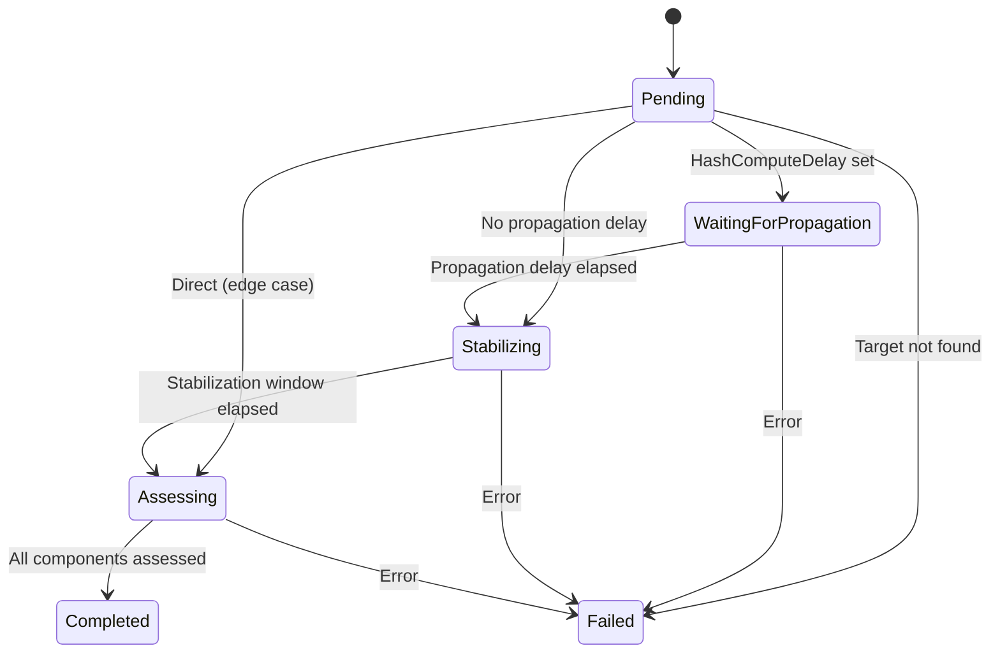

# Effectiveness Assessment

!!! info "Operator guide"
    For configuration, async propagation setup, and the feedback loop, see [Effectiveness Monitoring](../user-guide/effectiveness.md).

!!! abstract "CRD Reference"
    For the complete EffectivenessAssessment CRD specification, see [API Reference: CRDs](../api-reference/crds.md#effectivenessassessment).

The Effectiveness Monitor evaluates whether a remediation actually resolved the issue. It operates as a CRD controller watching `EffectivenessAssessment` resources created by the Orchestrator after workflow execution completes (or fails).

## CRD Specification

### Spec (Immutable)

| Field | Type | Description |
|---|---|---|
| `CorrelationID` | `string` | Parent RemediationRequest name; audit correlation key |
| `RemediationRequestPhase` | `string` | RR phase at EA creation: `Verifying`, `Completed`, `Failed`, `TimedOut` |
| `SignalTarget` | `TargetResource` | Resource that triggered the alert (from RR spec) |
| `RemediationTarget` | `TargetResource` | Resource modified by the workflow (from AA RCA) |
| `Config.StabilizationWindow` | `metav1.Duration` | Wait period before assessment (default: 5m) |
| `Config.HashComputeDelay` | `*metav1.Duration` | Propagation delay before hash computation (async targets) |
| `Config.AlertCheckDelay` | `*metav1.Duration` | Extra delay for proactive alert resolution |
| `RemediationCreatedAt` | `*metav1.Time` | RR creation time (for resolution time calculation) |
| `SignalName` | `string` | Original alert name |
| `PreRemediationSpecHash` | `string` | Spec hash captured before workflow execution |

### Status

| Field | Type | Description |
|---|---|---|
| `Phase` | `string` | Current phase |
| `ValidityDeadline` | `*metav1.Time` | Assessment must complete before this time |
| `PrometheusCheckAfter` | `*metav1.Time` | Earliest time for Prometheus metrics check |
| `AlertManagerCheckAfter` | `*metav1.Time` | Earliest time for AlertManager check |
| `Components` | `EAComponents` | Per-component assessment results |
| `AssessmentReason` | `string` | `full`, `partial`, `no_execution`, `metrics_timed_out`, `expired`, `spec_drift` |
| `CompletedAt` | `*metav1.Time` | When assessment completed |
| `Message` | `string` | Human-readable status |
| `Conditions` | `[]metav1.Condition` | Standard conditions |

### Component Results

| Field | Type | Description |
|---|---|---|
| `HealthAssessed` | `bool` | Health check completed |
| `HealthScore` | `*float64` | 0.0--1.0 (decision tree) |
| `HashComputed` | `bool` | Hash comparison completed |
| `PostRemediationSpecHash` | `string` | Hash after remediation |
| `CurrentSpecHash` | `string` | Latest hash (for drift detection) |
| `AlertAssessed` | `bool` | Alert check completed |
| `AlertScore` | `*float64` | 0.0 or 1.0 (binary) |
| `MetricsAssessed` | `bool` | Metrics check completed |
| `MetricsScore` | `*float64` | 0.0--1.0 (improvement ratio) |

## Phase State Machine

| Phase | Description |
|---|---|
| **Pending** | CRD created, EM has not yet reconciled |
| **WaitingForPropagation** | Waiting for async changes (GitOps sync, operator reconcile) to propagate. Only entered when `HashComputeDelay` is set. |
| **Stabilizing** | Waiting for the stabilization window. Derived timing fields (`ValidityDeadline`, `PrometheusCheckAfter`, `AlertManagerCheckAfter`) are computed and persisted. |
| **Assessing** | Actively running component scorers (health, hash, alerts, metrics) |
| **Completed** | Assessment complete, results stored in status |
| **Failed** | Assessment could not be completed (e.g., target not found) |

## Timing Model

```mermaid
gantt
    title Effectiveness Assessment Timeline
    dateFormat HH:mm
    axisFormat %H:%M

    section Remediation
    Workflow Execution   :done, we, 00:00, 2m

    section Propagation
    GitOps Sync Delay    :active, git, after we, 3m
    Operator Reconcile   :active, op, after git, 1m

    section Assessment
    Stabilization Window :crit, stab, after op, 5m
    Effectiveness Check  :milestone, check, after stab, 0m
```

### Derived Timing

The EM computes assessment windows from the CRD creation timestamp and configuration:

**Sync targets** (no propagation delay):

- `PrometheusCheckAfter` = creation + StabilizationWindow
- `AlertManagerCheckAfter` = PrometheusCheckAfter + AlertCheckDelay
- `ValidityDeadline` = creation + ValidityWindow (default: 30m)

**Async targets** (GitOps/operator-managed, `HashComputeDelay` set):

- `anchor` = creation + HashComputeDelay
- `PrometheusCheckAfter` = anchor + StabilizationWindow
- `AlertManagerCheckAfter` = PrometheusCheckAfter + AlertCheckDelay
- `ValidityDeadline` = anchor + StabilizationWindow + AlertCheckDelay + ValidityWindow

If the total check offset exceeds the ValidityWindow, the deadline is automatically extended.

### Validity Window

The validity window constrains the assessment timeline. If the deadline passes before all components are assessed, the assessment completes with partial results (`AssessmentReason: expired`).

| Parameter | Default |
|---|---|
| `ValidityWindow` | 30 minutes |
| `StabilizationWindow` | 5 minutes |
| `PrometheusEnabled` | true |
| `AlertManagerEnabled` | true |

## Assessment Components

The EM evaluates four independent components, each with its own scorer. Components are assessed in order: **hash first**, then health, alert, metrics.

### Health Scorer

Evaluates Kubernetes pod health using a decision tree:

| Condition | Score |
|---|---|
| Target not found | 0.0 |
| TotalReplicas == 0 | 0.0 |
| CrashLoopBackOff detected | 0.0 |
| ReadyReplicas == 0 | 0.0 |
| Partial readiness (some pods not ready) | 0.5 |
| All ready but OOMKilled detected | 0.25 |
| All ready but restarts detected | 0.75 |
| All ready, no restarts | 1.0 |
| Health not applicable (non-pod target) | nil (assessed=true, not scored) |

### Alert Scorer

Binary check against AlertManager:

| Condition | Score |
|---|---|
| No active alerts for the signal | 1.0 |
| Active alerts still firing | 0.0 |
| AlertManager unavailable | nil (skipped) |

The alert check respects `AlertManagerCheckAfter` -- it is not evaluated before this deadline.

### Metrics Scorer

Compares pre-remediation and post-remediation metrics from Prometheus:

- Per-metric: `improvement = (pre - post) / pre` (LowerIsBetter) or `(post - pre) / pre` (HigherIsBetter)
- Clamped to [0.0, 1.0]
- Overall score: average of per-metric improvements

Respects `PrometheusCheckAfter` deadline and uses `PrometheusLookback` (default: 10m) for the query range.

### Spec Hash Comparison (DD-EM-002)

Compares the resource specification before and after remediation to detect drift:

1. **Pre-remediation hash**: From `EA.Spec.PreRemediationSpecHash` (captured by RO before execution) or queried from DataStorage
2. **Post-remediation hash**: Computed live via `CanonicalSpecHash(target.Spec)`
3. **Comparison**: `postHash == preHash` → `Match=true` (no drift, remediation didn't change the spec)

#### Canonical Hash Algorithm

- Maps: keys sorted alphabetically, values normalized recursively
- Slices: sorted by canonical JSON representation
- Scalars: unchanged
- Output format: `"sha256:<64-lowercase-hex>"` (71 characters)

#### Hash Deferral

When `HashComputeDelay` is set (async targets), the hash is not computed until the propagation delay elapses. The controller enters `WaitingForPropagation` and requeues with the remaining duration.

If spec drift is detected (`postHash != preHash`), DataStorage short-circuits the weighted score to **0.0** regardless of other component results.

## Weighted Scoring

DataStorage computes a weighted overall score when the EA results are stored:

| Component | Weight |
|---|---|
| Health | 40% |
| Alert | 35% |
| Metrics | 25% |

Only assessed components with non-nil scores are included. Weights are redistributed proportionally when components are missing (e.g., if AlertManager is unavailable, health gets ~62% and metrics ~38%).

**Spec drift override**: If the hash comparison detects drift, the overall score is set to 0.0.

## Feedback Loop

EA results feed back into the remediation pipeline through the [Investigation Pipeline](hapi-investigation.md):

1. **Audit storage** -- EA completion events are stored in DataStorage with the correlation ID
2. **Remediation history** -- DataStorage indexes EA results by spec hash and target resource
3. **HAPI retrieval** -- During future investigations, HAPI queries remediation history using the tiered strategy (24h recent, then 90d historical)
4. **LLM prompt** -- History entries include effectiveness scores and outcomes, formatted as warnings in the LLM prompt
5. **Decision influence** -- The LLM uses history to avoid repeating ineffective workflows and prefer historically successful ones

See [Investigation Pipeline: Remediation History](hapi-investigation.md) for details on how the three-way hash comparison and formatted warnings work.

## Next Steps

- [Async Propagation](async-propagation.md) -- The propagation delay model in detail
- [Effectiveness Monitoring](../user-guide/effectiveness.md) -- User guide for operators
- [Investigation Pipeline](hapi-investigation.md) -- How EA results influence future investigations
- [Configuration](../user-guide/configuration.md) -- Tuning stabilization and propagation delays
