# Effectiveness Assessment

The Effectiveness Monitor evaluates whether a remediation actually resolved the issue. It operates as a CRD controller watching `EffectivenessAssessment` resources created by the Orchestrator on terminal phases.

## Timing Model

```mermaid
gantt
    title Effectiveness Assessment Timeline
    dateFormat HH:mm
    axisFormat %H:%M

    section Remediation
    Workflow Execution   :done, we, 00:00, 2m

    section Propagation
    GitOps Sync Delay    :active, git, after we, 3m
    Operator Reconcile   :active, op, after git, 1m

    section Assessment
    Stabilization Window :crit, stab, after op, 5m
    Effectiveness Check  :milestone, check, after stab, 0m
```

### Delay Model

| Phase | Default Duration | Purpose |
|---|---|---|
| **GitOps Sync Delay** | 3 minutes | Time for ArgoCD/Flux to sync changes to the cluster |
| **Operator Reconcile Delay** | 1 minute | Time for an operator to reconcile after a CR update |
| **Stabilization Window** | 5 minutes | Time for the system to settle before assessment |

These delays account for **asynchronous propagation** — not all changes take effect immediately.

## Assessment Dimensions

| Dimension | Method | Outcome |
|---|---|---|
| **Spec Hash** | Compare pre/post hash of target resource spec | Changed (expected) vs unchanged |
| **Health Status** | Check Kubernetes conditions | Healthy / degraded / unhealthy |
| **Metric Recovery** | Query Prometheus/AlertManager (optional) | Alert resolved / still firing |
| **Validity Window** | Time-based check | Assessment within valid window |

## Data Sources

- **Pre-remediation hash** — Fetched from DataStorage (stored before workflow execution)
- **Post-remediation state** — Queried live from Kubernetes API
- **Metrics** — Queried from Prometheus/AlertManager (when configured)

## Phases

| Phase | Description |
|---|---|
| `Pending` | CRD created, waiting for stabilization window |
| `Assessing` | Evaluating effectiveness dimensions |
| `Completed` | Assessment complete, results recorded |
| `Failed` | Assessment could not be completed |

## Next Steps

- [Async Propagation](async-propagation.md) — The propagation delay model in detail
- [Effectiveness Monitoring](../user-guide/effectiveness.md) — User guide for operators
- [Configuration](../user-guide/configuration.md) — Tuning stabilization and propagation delays
