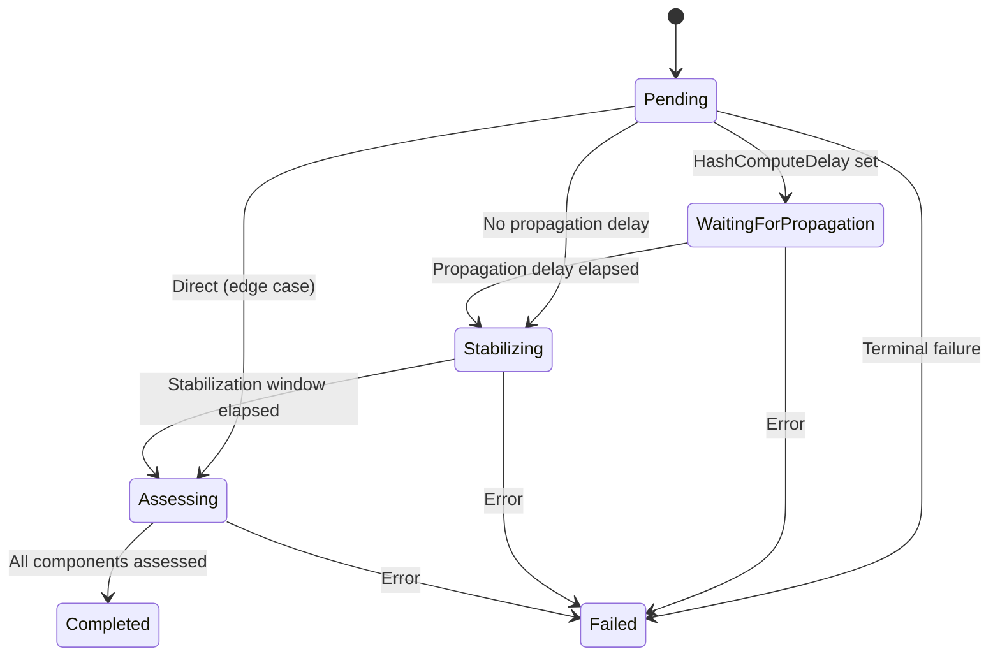

# Effectiveness Assessment

!!! info "Operator guide"
    For configuration, async propagation setup, and the feedback loop, see [Effectiveness Monitoring](../user-guide/effectiveness.md).

!!! abstract "CRD Reference"
    For the complete EffectivenessAssessment CRD specification, see [API Reference: CRDs](../api-reference/crds.md#effectivenessassessment).

The Effectiveness Monitor evaluates whether a remediation actually resolved the issue. It operates as a CRD controller watching `EffectivenessAssessment` resources created by the Orchestrator after workflow execution completes (or fails).

## CRD Specification

For the complete field specification, see [EffectivenessAssessment in the CRD Reference](../api-reference/crds.md#effectivenessassessment).

## Phase State Machine

```mermaid
stateDiagram-v2
    [*] --> Pending
    Pending --> WaitingForPropagation : HashComputeDelay set
    Pending --> Stabilizing : No propagation delay
    Pending --> Assessing : Direct (edge case)
    Pending --> Failed : Terminal failure
    WaitingForPropagation --> Stabilizing : Propagation delay elapsed
    WaitingForPropagation --> Failed : Error
    Stabilizing --> Assessing : Stabilization window elapsed
    Stabilizing --> Failed : Error
    Assessing --> Completed : All components assessed
    Assessing --> Failed : Error
```

| Phase | Description |
|---|---|
| **Pending** | CRD created, EM has not yet reconciled |
| **WaitingForPropagation** | Waiting for async changes (GitOps sync, operator reconcile) to propagate. Only entered when `HashComputeDelay` is set. |
| **Stabilizing** | Waiting for the stabilization window. Derived timing fields (`ValidityDeadline`, `PrometheusCheckAfter`, `AlertManagerCheckAfter`) are computed and persisted. |
| **Assessing** | Actively running component scorers (health, hash, alerts, metrics) |
| **Completed** | Assessment complete, results stored in status |
| **Failed** | Terminal failure: the assessment could not be completed. Examples include the target resource no longer existing, unrecoverable errors during reconciliation, or dependencies such as Prometheus remaining unavailable after the configured retry budget. |

On relevant phase transitions, the Effectiveness Monitor emits an `effectiveness.assessment.scheduled` audit event so operators and automation can observe when the next assessment step is expected.

### EM controller assessment tuning

The EM controller exposes assessment timing and concurrency knobs:

| Parameter | Purpose |
|---|---|
| `stabilizationWindow` | Wait time before starting assessment scorers after EA creation. |
| `validityWindow` | Total window before the assessment expires. |
| `maxConcurrentReconciles` | Maximum number of EA reconciliations processed in parallel by the controller. |

### Assessment paths

Each completed assessment is classified with an **AssessmentReason** (PascalCase), reflecting how fully the EM could run the configured scorers within the validity window:

| AssessmentReason | Meaning |
|---|---|
| `NoExecution` | No meaningful assessment run (e.g., prerequisites not met). |
| `Partial` | Some components assessed; others skipped or incomplete before the deadline. |
| `Full` | All applicable components assessed successfully within the window. |
| `SpecDrift` | The spec changed *during* the assessment window, invalidating the evaluation (not the same as a deliberate remediation change). |
| `Expired` | The validity window expired before all components could be assessed. |
| `MetricsTimedOut` | Metrics scoring did not complete within the allowed window. |
| `AlertDecayTimeout` | Alert decay handling exceeded the time budget. |
| `Unrecoverable` | Assessment cannot proceed (e.g., dependencies unavailable after retries, target gone). |

## Timing Model

```mermaid
gantt
    title Effectiveness Assessment Timeline
    dateFormat HH:mm
    axisFormat %H:%M

    section Remediation
    Workflow Execution   :done, we, 00:00, 2m

    section Propagation
    GitOps Sync Delay    :active, git, after we, 3m
    Operator Reconcile   :active, op, after git, 1m

    section Assessment
    Stabilization Window :crit, stab, after op, 5m
    Effectiveness Check  :milestone, check, after stab, 0m
```

### Derived Timing

The EM computes assessment windows from the CRD creation timestamp and configuration:

**Sync targets** (no propagation delay):

- `PrometheusCheckAfter` = creation + StabilizationWindow
- `AlertManagerCheckAfter` = PrometheusCheckAfter + AlertCheckDelay
- `ValidityDeadline` = creation + ValidityWindow (default: 30m)

**Async targets** (GitOps/operator-managed, `HashComputeDelay` set):

- `anchor` = creation + HashComputeDelay
- `PrometheusCheckAfter` = anchor + StabilizationWindow
- `AlertManagerCheckAfter` = PrometheusCheckAfter + AlertCheckDelay
- `ValidityDeadline` = anchor + StabilizationWindow + AlertCheckDelay + ValidityWindow

If the total check offset exceeds the ValidityWindow, the deadline is automatically extended.

### Validity Window

The validity window constrains the assessment timeline. If the deadline passes before all components are assessed, the assessment completes with partial results (`AssessmentReason: Expired`).

| Parameter | Default |
|---|---|
| `ValidityWindow` | 30 minutes |
| `StabilizationWindow` | 5 minutes |
| `PrometheusEnabled` | true |
| `AlertManagerEnabled` | true |

## Assessment Components

The EM evaluates four independent components, each with its own scorer. Components are assessed in order: **hash first**, then health, alert, metrics.

### Health Scorer

Evaluates Kubernetes pod health using a decision tree:

| Condition | Score |
|---|---|
| Target not found | 0.0 |
| TotalReplicas == 0 | 0.0 |
| CrashLoopBackOff detected | 0.0 |
| ReadyReplicas == 0 | 0.0 |
| Partial readiness (some pods not ready) | 0.5 |
| All ready but OOMKilled detected | 0.25 |
| All ready but restarts detected | 0.75 |
| All ready, no restarts | 1.0 |
| Health not applicable (non-pod target) | nil (assessed=true, not scored) |

### Alert Scorer

Binary check against AlertManager:

| Condition | Score |
|---|---|
| No active alerts for the signal | 1.0 |
| Active alerts still firing | 0.0 |
| AlertManager unavailable | nil (skipped) |

The alert check respects `AlertManagerCheckAfter` -- it is not evaluated before this deadline.

#### Alert Decay Detection (DD-EM-003)

When a Prometheus alert transitions from **firing** to **resolved**, there is a decay window during which the alert may still appear active in AlertManager (due to the Prometheus lookback window). The EM detects this situation during reconciliation:

1. The EM queries AlertManager for the alert's current state
2. If the target resource is healthy (pod ready, no crash loops) but the alert persists, the EM recognizes this as **alert decay** rather than a genuine ongoing issue
3. The `alertDecayRetries` field on the `EffectivenessAssessment` status tracks the number of re-checks during decay monitoring
4. The EM re-queues the assessment and re-checks until the alert clears or the validity deadline expires

This prevents premature effectiveness assessments that would incorrectly report "alert still firing" when the underlying issue has actually been resolved but the alert hasn't cleared yet.

### Metrics Scorer

Compares pre-remediation and post-remediation metrics from Prometheus:

- Per-metric: `improvement = (pre - post) / pre` (LowerIsBetter) or `(post - pre) / pre` (HigherIsBetter)
- Clamped to [0.0, 1.0]
- Overall score: average of per-metric improvements

Respects `PrometheusCheckAfter` deadline and uses `PrometheusLookback` (default: 30m) for the query range.

**Reliability (v1.2+)**: The interaction between `ValidityWindow` and alert duration was corrected so metrics windows align with the assessment timeline. Metrics scoring is now reliable when both are configured.

### Spec Hash Comparison (DD-EM-002)

Compares the resource specification before and after remediation to detect drift:

1. **Pre-remediation hash**: From `EA.Spec.PreRemediationSpecHash` (captured by RO before execution) or queried from DataStorage
2. **Post-remediation hash**: Computed live via `CanonicalSpecHash(target.Spec)`
3. **Comparison**: `postHash == preHash` → `Match=true` (spec unchanged). `postHash != preHash` can mean the remediation intentionally changed the spec (normal) or an external actor modified it during the assessment window (spec drift). The assessment distinguishes these by tracking whether the spec changed *after* the stabilization window began.

**ConfigMap content (v1.2+)**: The RO and EM spec hash includes content from mounted ConfigMaps — specifically `.data` and `.binaryData` — while excluding Secret material. If a referenced ConfigMap changes between pre-capture and post-capture, the hash will differ, which is expected for effectiveness comparisons that include configuration mounted from ConfigMaps.

#### Canonical Hash Algorithm

- Maps: keys sorted alphabetically, values normalized recursively
- Slices: sorted by canonical JSON representation
- Scalars: unchanged
- Output format: `"sha256:<64-lowercase-hex>"` (71 characters)

#### Hash Deferral

When `HashComputeDelay` is set (async targets), the hash is not computed until the propagation delay elapses. The controller enters `WaitingForPropagation` and requeues with the remaining duration.

If spec drift is detected (assessment classifies as `SpecDrift` — the spec changed *during* the assessment window, invalidating the evaluation), DataStorage short-circuits the weighted score to **0.0** regardless of other component results. Note: `postHash != preHash` alone is **normal** for a successful remediation (the workflow intentionally changed the spec). The score-0 override triggers only when the spec is modified by an external actor during the assessment window, making the effectiveness data inconclusive.

## Weighted Scoring

DataStorage computes a weighted overall score when the EA results are stored:

| Component | Weight |
|---|---|
| Health | 40% |
| Alert | 35% |
| Metrics | 25% |

Only assessed components with non-nil scores are included. Weights are redistributed proportionally when components are missing (e.g., if AlertManager is unavailable, health gets ~62% and metrics ~38%).

**Spec drift override**: If the hash comparison detects drift, the overall score is set to 0.0.

## Remediation outcome: Inconclusive (not an assessment reason) {: #remediation-outcome-inconclusive-not-an-assessment-reason }

`Inconclusive` is a **RemediationRequest outcome** set by the **Remediation Orchestrator** when deriving the final RR result from the Effectiveness Assessment (EA). It is **not** an `AssessmentReason` from the Effectiveness Monitor.

The RO uses `DeriveOutcomeFromEA` (post-verification) with this logic:

- **AlertAssessed=true** and **AlertScore=0** (alert still firing) → **Inconclusive** (remediation did not clear the signal).
- **AlertAssessed=true** and **AlertScore>0** (alert resolved) → **Remediated**.
- **AlertAssessed=false** (AlertManager unavailable) → **Remediated** (fail-open; **not** Inconclusive).
- **AlertManager disabled** in the EffectivenessMonitor config: **AlertAssessed=true**, **AlertScore=nil** → **Remediated**.

## Spec hash: root owner vs direct resource (v1.3) {: #spec-hash-root-owner-vs-direct-resource-v13 }

**Effectiveness (EM) path:** The **generic enricher** computes the canonical spec hash on the **direct remediation target** resource.

**Investigation (HAPI) path:** The `get_namespaced_resource_context` tool resolves the **owner chain to the root owner first**, then computes `specHash` for that **root** resource. This keeps remediation history and configuration fingerprints aligned with the stable workload (e.g., Deployment) rather than an intermediate object.

## Feedback Loop

EA results feed back into the remediation pipeline through the [Investigation Pipeline](kubernaut-agent-investigation.md):

1. **Audit storage** -- EA completion events are stored in DataStorage with the correlation ID
2. **Remediation history** -- DataStorage indexes EA results by spec hash and target resource
3. **KA retrieval** -- During future investigations, KA queries remediation history using the tiered strategy (24h recent, then 90d historical)
4. **LLM prompt** -- History entries include effectiveness scores and outcomes, formatted as warnings in the LLM prompt
5. **Decision influence** -- The LLM uses history to avoid repeating ineffective workflows and prefer historically successful ones

See [Investigation Pipeline: Remediation History](kubernaut-agent-investigation.md) for details on how the three-way hash comparison and formatted warnings work.

## OCP Monitoring RBAC

On OpenShift clusters with `effectivenessmonitor.external.ocpMonitoringRbac: true`, the Helm chart creates additional RBAC resources to allow the Effectiveness Monitor to query the cluster monitoring stack through `kube-rbac-proxy`. See [Security & RBAC: OCP Monitoring RBAC](security-rbac.md#ocp-monitoring-rbac) for details.

## Next Steps

- [Async Propagation](async-propagation.md) -- The propagation delay model in detail
- [Effectiveness Monitoring](../user-guide/effectiveness.md) -- User guide for operators
- [Investigation Pipeline](kubernaut-agent-investigation.md) -- How EA results influence future investigations
- [Configuration](../user-guide/configuration.md) -- Tuning stabilization and propagation delays
