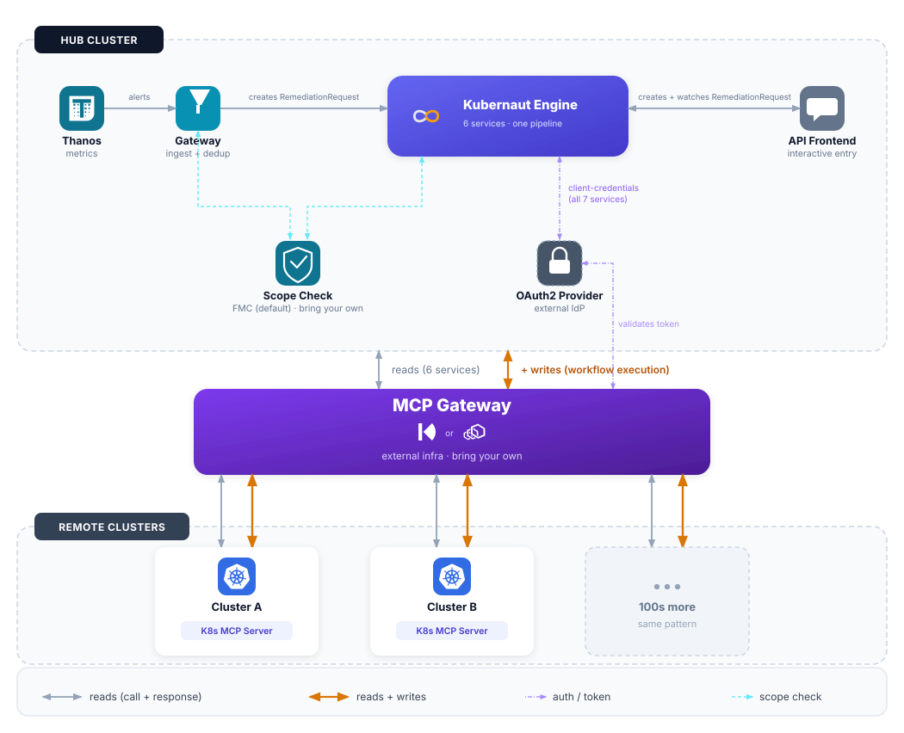

# Fleet Management

_Introduced in v1.6 (ADR-068). Status: Implemented (MVP)._

Fleet mode extends Kubernaut's single-cluster architecture to **multi-cluster federation**: signals from remote clusters, scope validation against a federated control plane, LLM investigation using remote cluster tools, and remediation execution on remote clusters -- all through a single external **MCP Gateway**, with zero regression for single-cluster deployments (fleet is disabled by default).

!!! info "Not the AWX/OCM hub-and-spoke design from earlier roadmap drafts"
    Earlier planning docs described a hub-and-spoke model built on Open Cluster Management (OCM) and remote execution via AWX/AAP. The architecture that actually shipped in v1.6 is a **read-side federation** built on an MCP Gateway (Kuadrant or Envoy AI Gateway) plus a pluggable scope-check backend -- remote execution runs through the same MCP Gateway using Kubernetes-native primitives (Jobs, Tekton PipelineRuns), not AWX. See [DD-FLEET-007](#we-remote-execution) for why the Ansible/AAP engine specifically is not supported for remote clusters.

## When Fleet Is Used

Fleet is opt-in per deployment (`fleet.enabled: true` in Helm values / `spec.fleet` on the operator's `Kubernaut` CR). When disabled, every Fleet-dependent service falls back to its existing local-only behavior with no new dependencies.

## Architecture



**Kubernaut Engine** in the diagram above is a single box standing in for the six services that already communicate intra-cluster via CRD watches, regardless of Fleet mode: the **Remediation Orchestrator** (creates and sequences the other five), **Signal Processing**, **AI Analysis** (plus the **Kubernaut Agent** it delegates investigation and workflow selection to), **Workflow Execution** (the only one of the six with MCP Gateway *write* access -- everything else is read-only), **Effectiveness Monitor**, and **Notification**. Their internal call graph doesn't change under Fleet mode, so it's intentionally left out of this diagram; see [Remediation Routing](remediation-routing.md) for that detail, or expand the flowchart below for the fully expanded, edge-level version scoped to Fleet.

The **MCP Gateway is external infrastructure** -- like PostgreSQL or Prometheus, it must be deployed before Kubernaut. The Helm chart does not install it; platform teams choose and deploy their preferred implementation (Kuadrant MCP Gateway or Envoy AI Gateway) and register per-cluster K8s MCP Server backends with it.

??? note "Full detailed flowchart (Mermaid)"
    The diagram above simplifies the exact edge-level relationships for readability. For the complete, precise call graph including every scope-check and MCP Gateway read/write edge:

    ```mermaid
    flowchart TB
        subgraph Mgmt["Hub Cluster"]
            Thanos["Thanos Querier<br/><small>multi-cluster Prometheus</small>"] -->|alerts, cluster label| GW["Gateway"]
            GW --> RO["Remediation<br/>Orchestrator"]
            RO --> SP["Signal<br/>Processing"]
            RO --> AA["AI Analysis"]
            AA --> KA["Kubernaut Agent"]
            RO --> WE["Workflow<br/>Execution"]
            AF["API Frontend"] -->|creates RemediationRequest| RO
            RO -->|creates EffectivenessAssessment| EM["Effectiveness<br/>Monitor"]
            FMC["FMC<br/><small>Fleet Metadata Cache</small>"]

            GW -.->|"scope check<br/>p95 &lt; 50ms"| FSC["FederatedScopeChecker"]
            RO -.->|scope check| FSC
            FSC -->|local| K8sAPI["local K8s API"]
            FSC -->|remote| Backend["scope.ScopeChecker<br/>backend adapter"]
            Backend --> Valkey[("Valkey<br/>(FMC default)")]
            FMC -->|polls, writes| Valkey

            GW -.->|read| GWY
            KA -.->|read| GWY
            RO -.->|read| GWY
            SP -.->|read| GWY
            AF -.->|read| GWY
            EM -.->|read| GWY
            FMC -.->|read: cluster registry| GWY
            WE -->|"read + write<br/>(remediation)"| GWY["MCP Gateway<br/><small>Kuadrant or Envoy AI Gateway</small>"]

            IdP["OAuth2 Provider<br/><small>e.g. Keycloak, DEX</small>"]
            GW -.->|"client-credentials<br/>(all 7 Fleet-dependent services)"| IdP
            GWY -.->|validates token| IdP
        end

        GWY --> MCPa["K8s MCP Server<br/>Cluster A"]
        GWY --> MCPb["K8s MCP Server<br/>Cluster B"]
        GWY --> MCPc["K8s MCP Server<br/>Cluster C"]

        MCPa -.->|"requests token exchange<br/>RFC 8693"| IdP
        MCPb -.->|"requests token exchange<br/>RFC 8693"| IdP
        MCPc -.->|"requests token exchange<br/>RFC 8693"| IdP

        MCPa --> ClusterA[("Cluster A")]
        MCPb --> ClusterB[("Cluster B")]
        MCPc --> ClusterC[("Cluster C")]
    ```

    Two distinct OAuth2 interactions happen against the same IdP, and the Gateway is not involved in either: the MCP Gateway only **validates** the caller's client-credentials token at the edge. The actual **RFC 8693 Standard Token Exchange** is performed by the **OAuth2 Provider itself** -- it is the only party that holds both the caller's identity (the passthrough token it already issued) and the target audience's requirements (the client-scope/audience-mapper assignment for `kube-mcp-server`), so only it can validate the old token and mint the new one. Each remote cluster's `kube-mcp-server` merely **requests** this exchange (`POST .../protocol/openid-connect/token` with `grant_type=urn:ietf:params:oauth:grant-type:token-exchange`, per its `keycloak-v1` exchange strategy) and receives back a token newly scoped to its own Kubernetes API server.

## Component Responsibilities

| Component | Role |
|---|---|
| **Gateway (GW)** | Extracts the `cluster` label from Thanos alerts, computes cluster-aware fingerprints (so the same resource on two clusters never deduplicates into one `RemediationRequest`), gates signals via `FederatedScopeChecker` |
| **WorkflowExecution (WE)** | Executes remediation on remote clusters through the MCP Gateway: Jobs and Tekton PipelineRuns. Requires read+write gateway access. |
| **FMC (Fleet Metadata Cache)** | New service (v1.6). Polls the MCP Gateway for `kubernaut.ai/managed=true` resources, caches metadata in Valkey, exposes scope queries over REST -- the default backend for environments with no existing federated control plane |
| **FederatedScopeChecker** | Routes scope checks: `ClusterID == ""` -> local `scope.Manager`; `ClusterID != ""` -> the configured remote backend adapter |
| **GatewayDiscoverer** | Cluster/tool discovery interface, implemented once per supported gateway (Kuadrant, EAIGW). Called **server-side only** -- never LLM-facing (see below) |
| **CRDWatcher** | Discovers clusters from the gateway's own native CRDs (`MCPRoute`/`Backend` for EAIGW, `MCPServerRegistration` for Kuadrant); Kubernaut is a read-only consumer, never creates or modifies these |
| **OAuth2 Provider** | External IdP (Keycloak, DEX, or any OIDC-compliant provider) issuing client-credentials tokens (`pkg/fleet/mcpclient`). All 7 Fleet-dependent services acquire, cache, and auto-refresh a token before calling the MCP Gateway; the Gateway validates it against the same IdP. Independently, each remote cluster's **K8s MCP Server** (`kube-mcp-server`) *requests* an RFC 8693 Standard Token Exchange from the same IdP -- the IdP itself performs the exchange (it alone holds both the caller's identity and the target audience's requirements) and returns a token newly scoped to that cluster's own Kubernetes API server. Not shipped by the Helm chart -- like the MCP Gateway itself, platform teams bring their own. |

Signal Processing, API Frontend, and Effectiveness Monitor also participate as read-only MCP Gateway callers (remote enrichment, `list_clusters`/resource reads, and remote target reads respectively).

## Pluggable Scope Backend

GW and RO depend only on the `scope.ScopeChecker` interface (`pkg/shared/scope/checker.go`) -- a single method, `IsManagedResource(ctx, ResourceIdentity)`, where `ResourceIdentity` carries an optional `ClusterID`. Neither service knows which backend answers the check; the factory (`fleet.NewScopeChecker`) selects an adapter at startup from `fleet.backend` config, and returns the caller's own local checker unchanged when fleet is disabled -- that's what guarantees zero regression for single-cluster deployments, not a special-cased branch.

| Backend | Status | Scope-check latency | Staleness | Best for |
|---|---|---|---|---|
| **FMC (Valkey)** | Implemented, default | < 1ms | 30-45s (poll + TTL) | GitOps environments, no existing fleet platform |
| **ACM (Advanced Cluster Management)** | Implemented | 10-50ms | Near-real-time | Red Hat ACM shops |
| **Rancher** | Planned (v1.6 roadmap item, not yet shipped) | 20-100ms (design target) | Real-time (design target) | SUSE Rancher shops |
| **Clusterpedia** | Planned (v1.6 roadmap item, not yet shipped) | 5-30ms (design target) | Near-real-time (design target) | Lightweight, vendor-neutral |

```yaml
fleet:
  enabled: true
  backend: "fmc"  # "fmc" | "acm" today; "rancher" | "clusterpedia" planned

  fmc:
    endpoint: "http://fmc.kubernaut-system.svc:8080"

  acm:
    endpoint: "https://search-search-api.open-cluster-management.svc:4010"
    # Auth: mounted ServiceAccount token by default

  mcpGatewayEndpoint: "https://mcp-gateway.example.com"
  mcpGatewayType: "eaigw"  # "eaigw" (default) | "kuadrant"

  oauth2:
    enabled: true
    tokenURL: "https://keycloak.example.com/realms/kubernaut-fleet/protocol/openid-connect/token"
    credentialsSecretRef: "fleet-oauth2-credentials"  # Secret with client_id/client_secret keys
    scopes: ["openid", "groups"]  # DefaultFleetScopes if omitted
```

## MCP Gateway Technology

Both **Kuadrant MCP Gateway** and **Envoy AI Gateway (EAIGW)** are supported through the same `GatewayDiscoverer` adapter pattern; Kubernaut's business logic is gateway-agnostic and never needs to know which one is deployed.

| | Envoy AI Gateway | Kuadrant MCP Gateway |
|---|---|---|
| **Components to deploy** | 1 (single Deployment/binary) | 3+ (Kuadrant controller + broker + Istio) |
| **Istio dependency** | None | Requires `istiod` |
| **Tool prefixing** | `{backendName}__{toolName}` | `{toolPrefix}{toolName}` |
| **Auth model** | Built-in OAuth + CEL authorization | Authorino + OPA Rego policies |
| **Maturity** | v1.0 GA | Technology Preview |
| **CRD model** | `MCPRoute` + `Backend` | `MCPServerRegistration` + `MCPGatewayExtension` |

`gatewayType` is a single field (`spec.fleet.gatewayType` on the operator's `Kubernaut` CR), propagated by the operator to both KA's and FMC's config during reconciliation. See the [Kuadrant MCP Gateway install guide](https://github.com/jordigilh/kubernaut-operator/blob/main/docs/installation/04-fleet-mcp-gateway.md) for a worked setup.

## Cluster-Transparent Tool Exposure (DD-FLEET-005)

At fleet scale (100+ clusters, 1800+ tools), presenting every cluster's tools to the LLM would waste context tokens and invite hallucination -- but a single investigation is always scoped to exactly one target cluster (`RemediationRequest.Spec.ClusterID`), so there is never a "pick a cluster" decision for the LLM to make.

**There are no LLM-callable `list_clusters` / `list_tools_for_cluster` tools.** Instead:

1. KA's `FleetOverlayResolver` calls `GatewayDiscoverer.ToolsForCluster(signal.ClusterID)` **server-side, once, before the LLM ever runs** for that investigation
2. The resolved remote tools are merged into the investigation's tool set under the **exact same generic names** as the local K8s equivalents (`resources_get`, never `cluster-a__resources_get`) -- the LLM's tool schema for a fleet-target investigation is byte-identical to a hub-local one
3. If pre-scoping fails (gateway unreachable), the investigation proceeds **without** the remote overlay rather than aborting -- behaving like a hub-local investigation, with the degradation recorded as an `aiagent.fleet.overlay_failed` audit event

Other services (SP, WE, FMC, EM) call `GatewayDiscoverer` the same way -- programmatically, server-side, never through an LLM session.

## Fail-Closed Readiness Gate

Prior to this design, a Fleet-dependent service that lost its MCP Gateway or scope-backend connection *after* startup kept reporting `/readyz=200` while silently serving stale or degraded data. Runtime unreachability now fails closed, matching the existing static-config validation:

- A shared `pkg/fleet/readiness.Gate` periodically probes each service's Fleet dependencies (MCP client, cluster registry, scope-checker backend)
- **Blast radius is pod-wide, not per-request**: if any prober fails, the entire pod's `/readyz` flips to `NotReady` and Kubernetes removes it from Service endpoints until the dependency recovers
- Wired into all 7 Fleet-dependent services: Gateway, Remediation Orchestrator, Effectiveness Monitor, Signal Processing, Workflow Execution, API Frontend, Kubernaut Agent

## WE Remote Execution {: #we-remote-execution }

WorkflowExecution can run remediation on remote clusters through the MCP Gateway for its **Job** and **Tekton PipelineRun** engines. The **Ansible (AWX/AAP) engine is not supported for remote clusters** ([DD-FLEET-007](#we-remote-execution)): live validation against a real Kuadrant gateway found that `MCPServerRegistration.credentialRef` is discovery-only and is not actually injected into `tools/call` requests, so registering an AAP MCP Server as a gateway backend does not give WE a working credential path for Ansible jobs on remote clusters. Rather than build a separate, gateway-bypassing credential path for this one engine, WE's Ansible engine **fails closed** for remote (`ClusterID != ""`) targets instead. This does not affect Ansible execution on the local/hub cluster, or Job/Tekton execution on any cluster.

## Configuration Reference

See [Configuration Reference -- Fleet](../user-guide/configuration.md) for the full Helm values surface, and the [Operator CR Reference](../api-reference/operator-cr.md) for `spec.fleet` on the `Kubernaut` CRD.

## Next Steps

- [System Overview](overview.md) -- Single-cluster service topology and CRD backbone that Fleet extends
- [Custom Resources](../api-reference/crds.md) -- `ClusterID` fields on `RemediationRequest` and related CRDs
- [Operator CR Reference](../api-reference/operator-cr.md) -- `spec.fleet` configuration
