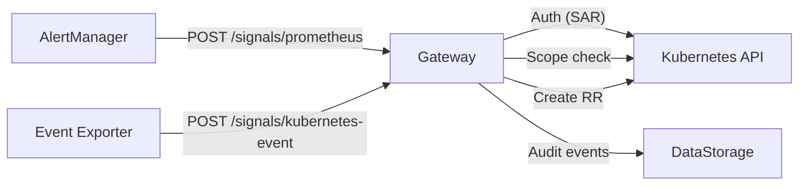
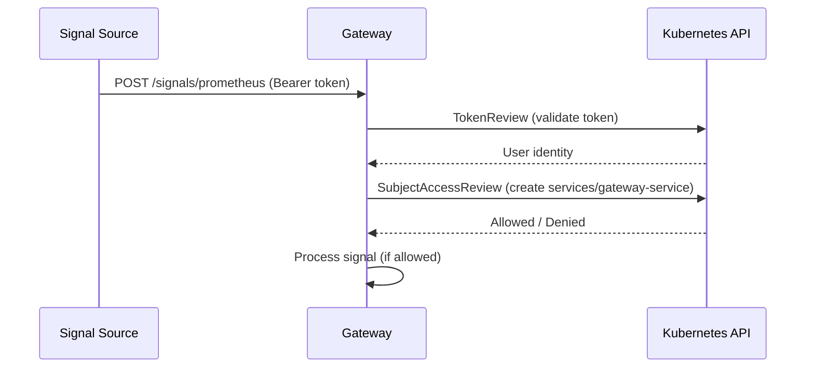
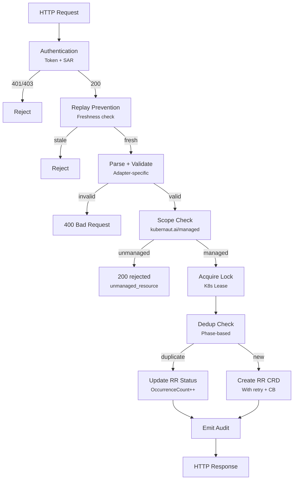

# Gateway

The Gateway is the entry point for all signals into Kubernaut. It accepts alerts from Prometheus AlertManager and Kubernetes Event Exporter, authenticates the source, validates scope, deduplicates against in-flight remediations, and creates `RemediationRequest` CRDs to initiate the remediation pipeline.

## Architecture



## Signal Ingestion Endpoints

| Endpoint | Method | Source | Description |
|---|---|---|---|
| `/api/v1/signals/prometheus` | POST | AlertManager | Prometheus AlertManager webhook receiver |
| `/api/v1/signals/kubernetes-event` | POST | Event Exporter | Kubernetes Event API webhook receiver |
| `/health`, `/healthz` | GET | -- | Liveness probe (always 200) |
| `/ready` | GET | -- | Readiness probe (checks K8s API + shutdown flag) |
| `/metrics` | GET | -- | Prometheus metrics |

Each signal source uses a dedicated **adapter** that parses the source-specific payload format into a common `NormalizedSignal` structure. Adapters are registered at startup via `RegisterAdapter()`.

## Signal Adapters

### Prometheus Adapter

Parses the AlertManager webhook format (`alerts[]`, `commonLabels`, `commonAnnotations`):

1. **Parse** -- Takes the first alert from the `alerts[]` array. Extracts the target resource from labels using a priority list: HPA > PDB > PVC > Deployment > StatefulSet > DaemonSet > Node > Service > Job > CronJob > Pod. Before extraction, a **monitoring metadata filter** strips `service` and `pod` labels that refer to monitoring infrastructure (kube-state-metrics, prometheus-node-exporter, alertmanager, grafana, etc.) to prevent Kubernaut from targeting its own monitoring stack. Merges alert-level and common labels.
2. **Fingerprint** -- Resolves the owner chain (Pod -> ReplicaSet -> Deployment) and computes `SHA256(namespace:kind:name)` of the top-level owner. The alert name is excluded from the fingerprint (Issue #63) so that different alerts for the same resource deduplicate correctly.
3. **Severity** -- Pass-through from `labels["severity"]`. Signal Processing normalizes it later via Rego policy.
4. **Validate** -- Requires non-empty `Fingerprint`, `SignalName`, and `Severity`.

### Kubernetes Event Adapter

Parses the Event Exporter format (`involvedObject`, `reason`, `type`, `lastTimestamp`):

1. **Parse** -- Requires `reason`, `involvedObject.kind`, `involvedObject.name`. Filters out `Normal` events (only Warning/Error are processed). Severity is the event `type` field.
2. **Fingerprint** -- Same owner chain resolution and SHA256 computation as Prometheus.
3. **Validate** -- Requires non-empty `SignalName`, `Fingerprint`, `Severity`, `Resource.Kind`, `Resource.Name`.

### Replay Prevention

Both adapters enforce freshness validation to prevent replayed signals:

- **Prometheus**: Checks `X-Timestamp` header or `alerts[].startsAt` body field
- **Kubernetes Events**: Checks `lastTimestamp` or `firstTimestamp` body field
- **Tolerance**: 5 minutes. Signals older than this are rejected.

### Normalized Output

Both adapters produce a common `NormalizedSignal`:

| Field | Description |
|---|---|
| `Fingerprint` | SHA256 of owner chain (deduplication key) |
| `SignalName` | Alert name or event reason |
| `Severity` | Raw severity (normalized later by SP) |
| `Namespace` | Target resource namespace |
| `Resource` | Target resource (Kind, Name, Namespace) |
| `Labels` | Merged labels from the source |
| `Annotations` | Source annotations |
| `FiringTime` | When the alert started firing |
| `ReceivedTime` | When the Gateway received it |
| `SourceType` | `prometheus` or `kubernetes-event` |
| `RawPayload` | Original payload for audit reconstruction |

## Authentication

Every signal request passes through authentication middleware before reaching the adapter:



1. **Extract** -- Bearer token from `Authorization` header
2. **TokenReview** -- Validates the token against the Kubernetes API, returns the authenticated user identity
3. **SubjectAccessReview** -- Checks if the user has `create` permission on `services/gateway-service` in the controller namespace

| Status Code | Meaning |
|---|---|
| 401 | Missing or invalid token |
| 403 | Valid token but insufficient RBAC |
| 500 | TokenReview or SAR API error |

Signal sources must have a ServiceAccount with the `gateway-signal-source` ClusterRole. See [Configuration Reference](../user-guide/configuration.md#signal-source-authentication) for setup.

## Scope Checking

After authentication, the Gateway checks whether the target resource is in scope for remediation:

1. **Resource label** -- If the resource has `kubernaut.ai/managed=true`, it is managed. If `false`, it is explicitly unmanaged.
2. **Namespace label** -- If the resource label is absent, check the namespace for the same label.
3. **Default** -- If neither label is present, the resource is unmanaged.

Cluster-scoped resources (Node, PersistentVolume, Namespace) only check the resource label.

Unmanaged resources are **not rejected with an error**. The Gateway returns HTTP 200 with `status: "rejected"` and `reason: "unmanaged_resource"`, along with a `kubectl` command the operator can use to opt in:

```json
{
  "status": "rejected",
  "reason": "unmanaged_resource",
  "message": "Resource is not managed by Kubernaut. To enable: kubectl label namespace <ns> kubernaut.ai/managed=true"
}
```

## Phase-Based Deduplication

The Gateway prevents duplicate remediations using a phase-based deduplication system backed by Kubernetes RR status (no Redis dependency).

### Fingerprint

The deduplication key is the signal fingerprint: `SHA256(namespace:kind:name)` of the top-level owning resource. The alert name is **not** part of the fingerprint, so multiple alerts about the same Deployment (e.g., `KubePodCrashLooping` and `KubePodNotReady`) are treated as duplicates.

### Phase-Based Logic

| RR Phase | Behavior |
|---|---|
| **Non-terminal** (Pending, Processing, Analyzing, AwaitingApproval, Executing, Verifying, Blocked) | Signal is **deduplicated** -- occurrence count is incremented, no new RR created |
| **Terminal** (Completed, Failed, TimedOut, Skipped, Cancelled) | A **new RR** is created for the signal |

RRs with `status.nextAllowedExecution` in the future (exponential backoff) are also treated as non-terminal.

### Status Updates on Deduplication

When a signal is deduplicated, the Gateway updates the existing RR's status:

- Increments `OccurrenceCount`
- Updates `LastSeenAt` timestamp
- Uses `retry.RetryOnConflict` for concurrent safety

### Distributed Locking

In multi-replica deployments, the Gateway uses a Kubernetes **Lease** lock to prevent race conditions between dedup check and CRD creation. The lock is acquired with up to 10 retry attempts with exponential backoff.

## RemediationRequest Creation

When a signal passes all checks (authenticated, in scope, not a duplicate), the Gateway creates a `RemediationRequest` CRD:

### Name Format

```
rr-{fingerprint-prefix}-{uuid-suffix}
```

The fingerprint prefix enables field-selector queries for deduplication lookups.

### Spec Fields Populated

| Field | Source |
|---|---|
| `SignalFingerprint` | Computed fingerprint |
| `SignalName` | Adapter-extracted name |
| `Severity` | Raw severity from source |
| `TargetResource` | Kind, Name, Namespace |
| `Labels`, `Annotations` | Merged from source |
| `FiringTime`, `ReceivedTime` | Timestamps |
| `ProviderData` | Source-specific metadata |
| `OriginalPayload` | Raw payload for audit reconstruction |

### Retry and Circuit Breaker

CRD creation uses retry with exponential backoff:

- **Retryable**: 429, 503, 504, timeouts, network errors
- **Non-retryable**: 400, 403, 409, 422
- **Circuit breaker**: Wraps the Kubernetes client to prevent cascading failures during API server instability
- **AlreadyExists**: Treated as idempotent success

## Audit Events

The Gateway emits audit events to DataStorage for every signal processed:

| Event Type | When |
|---|---|
| `gateway.signal.received` | New RR successfully created |
| `gateway.signal.deduplicated` | Signal matched an existing RR |
| `gateway.crd.created` | RR CRD creation confirmed |
| `gateway.crd.failed` | RR CRD creation failed (including retries) |

Audit events include the full `GatewayAuditPayload` with reconstruction fields (labels, annotations, original payload) per BR-AUDIT-005.

## End-to-End Processing Flow



## Handoff to Remediation Orchestrator

The Gateway's responsibility ends with CRD creation. The `RemediationRequest` is picked up by the Remediation Orchestrator, which creates a `SignalProcessing` CRD to begin enrichment:

```
Gateway creates RR → RO watches RR → RO creates SP CRD → SP enriches signal
```

## Next Steps

- [Signals & Alert Routing](../user-guide/signals.md) -- Signal modes, scope management, and alert routing for operators
- [Signal Processing](signal-processing.md) -- How the enrichment pipeline classifies signals
- [Remediation Routing](remediation-routing.md) -- The Orchestrator's state machine and routing engine
- [Configuration: Signal Source Authentication](../user-guide/configuration.md#signal-source-authentication) -- Configuring external signal sources
