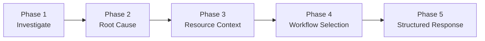
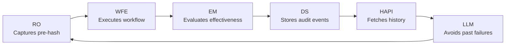
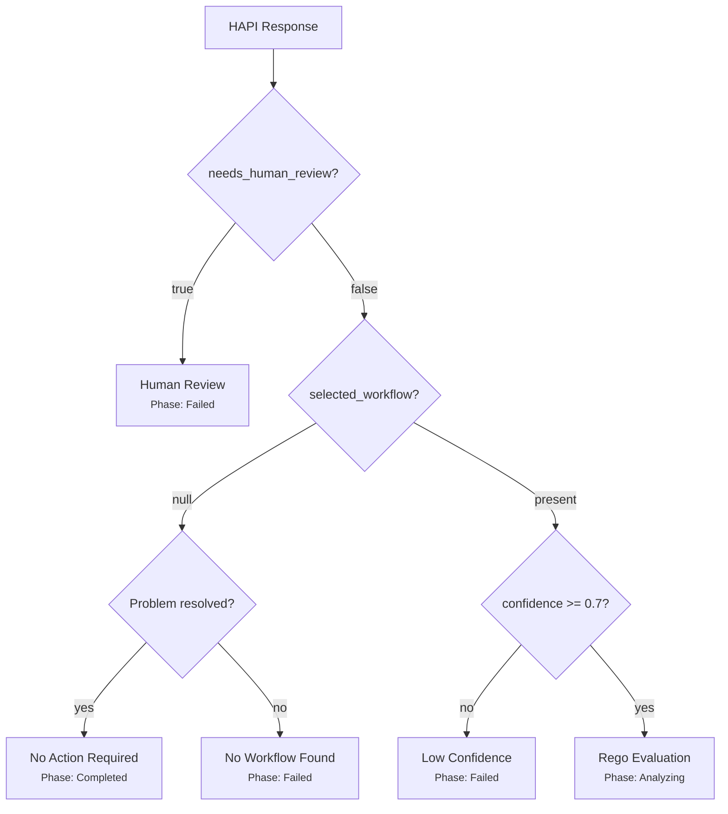

# Investigation Pipeline

The HolmesGPT API (HAPI) is the intelligence core of Kubernaut. It receives an enriched signal from the AI Analysis controller, orchestrates an LLM-driven investigation using live Kubernetes access, identifies the root cause, gathers infrastructure context and remediation history, selects a workflow, and returns a structured recommendation.

This page documents the full investigation pipeline from the LLM's perspective -- what context it receives, what tools it uses, how it makes decisions, and how those decisions flow back through the system.

!!! tip "Related pages"
    - [AI Analysis](ai-analysis.md) covers the **AA controller** (session management, phase transitions, Rego evaluation)
    - [Workflow Selection](workflow-selection.md) covers the **DataStorage scoring algorithm** (label filtering, semantic scoring)
    - This page covers the **HAPI internals** (prompt construction, LLM investigation, resource context, decision outcomes)

## Service Configuration

HAPI uses two ConfigMaps, each mounted at a well-known path:

| ConfigMap | Mount Path | Content |
|---|---|---|
| `holmesgpt-api-config` | `/etc/holmesgpt/` (file: `config.yaml`) | Service config: ports, logging, auth secret references |
| `holmesgpt-sdk-config` | `/etc/holmesgpt/sdk/` | SDK config: LLM settings, toolsets (Prometheus, etc.), GCP project/region |

The SDK ConfigMap controls which HolmesGPT toolsets are available to the investigation agent. The Kubernetes core toolset is always enabled. Additional toolsets (e.g., `prometheus/metrics`) are configured in the SDK config:

```yaml
llm:
  provider: openai
  model: gpt-4o
  endpoint: ""
toolsets:
  prometheus/metrics:
    enabled: true
    config:
      prometheus_url: "http://kube-prometheus-stack-prometheus.monitoring.svc:9090"
```

!!! tip "Token overhead from unused toolsets"
    Each enabled toolset adds its full tool schema to every LLM context turn, even if none of its tools are called. This can add ~30% token overhead and bias the LLM toward irrelevant investigation paths. Enable only the toolsets your workload needs. See [Toolset Optimization](../user-guide/configmap-holmesgpt.md#toolset-optimization-pre-v12) for guidance and an incident-type mapping table.

The Helm chart supports three tiers for providing the SDK config -- see [Configuration Reference: HolmesGPT API](../user-guide/configuration.md#holmesgpt-api-llm-integration).

## Pipeline Overview

The investigation follows a 5-phase pipeline, executed as a single LLM agent session:



| Phase | Reactive Mode | Proactive Mode |
|---|---|---|
| **Phase 1** | Investigate the Incident | Investigate the Anticipated Incident |
| **Phase 2** | Determine Root Cause | Assess Prediction and Determine Prevention Strategy |
| **Phase 3 + 3b** | Identify signal name + call `get_resource_context` | Same |
| **Phase 4** | Discover and Select Workflow (Three-Step Protocol) | Same |
| **Phase 5** | Return Summary + JSON Payload | Same |

The LLM operates as an autonomous agent -- it calls Kubernetes tools iteratively, synthesizes findings, and makes decisions. HAPI provides the prompt framing, tools, and validation; the LLM drives the investigation.

## Pre-RCA: Prompt Construction

Before any tools are called, HAPI assembles the initial prompt from the enriched signal. This context frames the entire investigation:

**Signal metadata:**

- Signal name, severity, namespace, resource kind/name
- Environment, priority, risk tolerance, business category
- Error message and description

**Timing information:**

- Alert firing time and received time
- Cluster name and signal source

**Deduplication context:**

- Whether the signal is a duplicate, occurrence count, first/last seen

**Signal mode** (reactive or proactive) determines the prompt variant -- see [Reactive vs Proactive](#reactive-vs-proactive-mode) below.

No tools are called during prompt construction. All initial context comes from the enriched signal passed by the AI Analysis controller.

## Reactive vs Proactive Mode

The `signal_mode` field determines how the LLM frames its investigation. The toolset is identical for both modes; only the prompt framing differs.

### Reactive Mode (default)

The LLM investigates an **active incident**:

- **Phase 1:** "Use your Kubernetes tools to investigate the incident" -- check pod status, events, logs, resource usage, node conditions
- **Phase 2:** "Identify the root cause" -- determine if the signal is the root cause or a symptom of a deeper issue
- **Phase 5:** Natural language summary + structured JSON with workflow selection

### Proactive Mode

The LLM investigates an **anticipated incident**:

- **Phase 1:** "Assess utilization trends, recent deployments, and whether the prediction is likely to materialize"
- **Phase 2:** "Decide if the anticipated incident is likely and what preventive actions to take" -- **"no action needed" is a valid outcome** if the prediction is unlikely
- **Phase 5:** Same structured output, but the LLM may conclude that no remediation is warranted

The proactive mode distinction is important: it tells the LLM that doing nothing is acceptable, preventing unnecessary remediations for predictions that may not materialize.

## RCA Execution

During Phases 1 and 2, the LLM uses Kubernetes tools to investigate the cluster. It operates autonomously, calling tools iteratively until it reaches a diagnosis:

1. **Inspect the target resource** -- `kubectl describe`, `kubectl get` for the resource mentioned in the signal
2. **Read pod logs** -- Current and previous container logs to identify errors, panics, or OOM events
3. **Check events** -- Kubernetes events for the resource, namespace, or node
4. **Examine live metrics** -- `kubectl top pods` for CPU/memory pressure
5. **Synthesize a root cause** -- The LLM determines what went wrong, whether the signal is the root cause or a symptom, and what resource is actually affected

The RCA phase is unconstrained -- the LLM decides which tools to call and in what order based on what it discovers. A CrashLoopBackOff investigation might start with pod status, move to logs, then check events for OOM signals. A NodePressure investigation might start with `top pods`, then check for pending pods and resource quotas.

## Post-RCA: Resource Context

Once the LLM identifies the affected resource (Phase 3b), it calls `get_resource_context(kind, name, namespace)`. This is the pivotal moment in the pipeline -- it transforms the investigation from "what happened" to "what should we do about it, given what we've tried before."

The tool performs four operations in sequence:

### 1. Owner Chain Resolution

Walks the Kubernetes ownership hierarchy to find the **root managing resource**:

```
Pod → ReplicaSet → Deployment
Pod → StatefulSet
Pod → DaemonSet
Pod → Job
```

All subsequent context (spec hash, history, detected labels) is about the root owner, not the individual pod. This ensures that history is tracked at the right level -- a Deployment, not an ephemeral ReplicaSet.

### 2. Spec Hash Computation

Computes a canonical SHA-256 hash of the root owner's `.spec`:

```
sha256(canonicalize(resource.spec))
```

This fingerprint uniquely identifies the current configuration state. When sent to DataStorage, it enables the history endpoint to distinguish between:

- **Same config, tried before** -- the current spec matches a previous pre-remediation state (regression)
- **Config changed since last remediation** -- the spec was modified (fresh start or different problem)
- **Config unchanged after remediation** -- the spec matches a previous post-remediation state

### 3. Detected Infrastructure Labels

Probes the cluster to detect infrastructure characteristics of the root owner:

| Label | Detection Method |
|---|---|
| `gitOpsManaged` | ArgoCD/Flux annotations or owner references |
| `gitOpsTool` | Which GitOps tool (`argocd`, `flux`) |
| `helmManaged` | Helm release labels |
| `pdbProtected` | PodDisruptionBudget exists for the resource |
| `hpaEnabled` | HorizontalPodAutoscaler targets the resource |
| `stateful` | Resource is StatefulSet or has PersistentVolumeClaims |
| `networkIsolated` | NetworkPolicy exists in the namespace |
| `serviceMesh` | Istio/Linkerd sidecar annotations |

These labels are stored in `session_state` and automatically injected into all subsequent workflow discovery queries. They serve two purposes:

1. **Workflow scoring** -- DataStorage uses detected labels for semantic scoring (see [Workflow Selection](workflow-selection.md))
2. **LLM context** -- The `list_available_actions` tool response includes a `cluster_context` section (e.g., "target is GitOps-managed with ArgoCD") so the LLM can factor infrastructure into its decision

Detection runs once per investigation. If it fails, an empty label set is used (graceful degradation).

### 4. Remediation History

Fetches the tiered remediation history from DataStorage:

```
GET /api/v1/remediation-history/context
  ?targetKind=Deployment
  &targetName=my-app
  &targetNamespace=production
  &currentSpecHash=sha256:abc123...
```

The response contains two tiers of history, each using a different query strategy:

| Tier | Window | Query Filter | Detail Level |
|---|---|---|---|
| **Tier 1** | Last 24 hours | By `target_resource` (namespace/kind/name) | Full: effectiveness score, health checks, metric deltas, hash match |
| **Tier 2** | 24 hours – 90 days | By `pre_remediation_spec_hash` | Summary: effectiveness score, hash match, assessment reason |

**Why the query strategies differ:**

- **Tier 1** queries by target resource to catch **all recent remediation attempts**, regardless of configuration changes. This is critical because a chain of remediations often involves config changes -- the LLM needs to see the full recent chain including transitions between configurations.
- **Tier 2** queries by spec hash to find **older history only when the same configuration recurs**. If a resource's config reverted to a state last seen 60 days ago, Tier 2 surfaces what happened back then.

**How the chain is visible:** Every entry in both tiers carries `preRemediationSpecHash` and `postRemediationSpecHash`. DataStorage annotates each entry with a `hashMatch` field by comparing the caller's `currentSpecHash` against these stored hashes. This lets the LLM trace the full chain of configuration transitions and outcomes.

## How Remediation History Influences the LLM

The history returned by `get_resource_context` is the mechanism by which Kubernaut learns from past remediation outcomes. The LLM receives the full `RemediationHistoryContext` as part of the tool result, and the Phase 3b prompt instructs: *"Use this to avoid repeating recently failed workflows."*

### Three-Way Hash Comparison

For each history entry, DataStorage compares the `currentSpecHash` (from HAPI) against both stored hashes:

| Comparison | `hashMatch` Value | Meaning |
|---|---|---|
| `currentSpecHash == preRemediationHash` | `preRemediation` | **Regression** -- the resource reverted to a previously-remediated configuration |
| `currentSpecHash == postRemediationHash` | `postRemediation` | Config unchanged since the last remediation |
| Neither matches | `none` | Config has changed -- different problem or manual fix applied |

When any entry has `hashMatch = "preRemediation"`, the response sets `regressionDetected: true`. This is a strong signal that a previous fix was undone.

### Tier 1 Example: Chain of Escalating Remediations

Consider a Deployment `my-app` in production that has been failing repeatedly in the last 24 hours. The current spec hash is `sha256:AAA` (the original broken config). Here's what happened:

1. **First attempt**: Config was at `AAA`, `RestartPod` was tried, scored 0.35 (poor), config stayed at `AAA`
2. **Second attempt**: Config still at `AAA`, `IncreaseMemory` was tried, scored 0.60 (moderate), config changed to `BBB`
3. **Third attempt**: Config now at `BBB`, `RollbackDeployment` was tried, scored 0.20 (poor), config changed to `CCC`
4. **GitOps reverted the rollback**, pushing config back to `AAA` -- triggering this new investigation

Tier 1 returns all three entries because they all target the same resource in the last 24 hours:

```json
{
  "targetResource": "production/Deployment/my-app",
  "currentSpecHash": "sha256:AAA",
  "regressionDetected": true,
  "tier1": {
    "window": "24h",
    "chain": [
      {
        "remediationUID": "rr-001",
        "completedAt": "2026-03-04T08:00:00Z",
        "workflowType": "RestartPod",
        "outcome": "completed",
        "effectivenessScore": 0.35,
        "preRemediationSpecHash": "sha256:AAA",
        "postRemediationSpecHash": "sha256:AAA",
        "hashMatch": "preRemediation",
        "signalResolved": false,
        "healthChecks": {
          "podRunning": true,
          "readinessPass": false,
          "restartDelta": 3,
          "crashLoops": true
        }
      },
      {
        "remediationUID": "rr-002",
        "completedAt": "2026-03-04T10:00:00Z",
        "workflowType": "IncreaseMemory",
        "outcome": "completed",
        "effectivenessScore": 0.60,
        "preRemediationSpecHash": "sha256:AAA",
        "postRemediationSpecHash": "sha256:BBB",
        "hashMatch": "preRemediation",
        "signalResolved": false,
        "healthChecks": {
          "podRunning": true,
          "readinessPass": true,
          "restartDelta": 0,
          "crashLoops": false
        }
      },
      {
        "remediationUID": "rr-003",
        "completedAt": "2026-03-04T14:00:00Z",
        "workflowType": "RollbackDeployment",
        "outcome": "completed",
        "effectivenessScore": 0.20,
        "preRemediationSpecHash": "sha256:BBB",
        "postRemediationSpecHash": "sha256:CCC",
        "hashMatch": "none",
        "signalResolved": false
      }
    ]
  }
}
```

The LLM can trace the full chain:

- `rr-001`: `RestartPod` on config `AAA` -> stayed at `AAA`, scored 0.35, crash loops continued. **hashMatch = preRemediation** (current config matches this entry's pre-hash, confirming regression).
- `rr-002`: `IncreaseMemory` on config `AAA` -> changed to `BBB`, scored 0.60, readiness passed but signal wasn't resolved. **hashMatch = preRemediation** (same regression -- started from `AAA`).
- `rr-003`: `RollbackDeployment` on config `BBB` -> changed to `CCC`, scored 0.20, made things worse. **hashMatch = none** (this entry started from `BBB`, not the current config `AAA`).

From this chain, the LLM can reason: *"We're back at config `AAA`. `RestartPod` failed on this config (0.35). `IncreaseMemory` partially helped (0.60) but the signal recurred. The rollback from `BBB` to `CCC` was counterproductive (0.20). The best option is either `IncreaseMemory` again (it was the most effective) or escalating to human review since three attempts have failed."*

### Tier 2 Example: Historical Regression Detection

Now suppose the Deployment was stable for months but a bad release reverted it to a config last seen 45 days ago (spec hash `sha256:XXX`). Tier 1 is empty (no remediations in the last 24 hours), but Tier 2 finds older history by matching `pre_remediation_spec_hash = sha256:XXX`:

```json
{
  "targetResource": "production/Deployment/my-app",
  "currentSpecHash": "sha256:XXX",
  "regressionDetected": true,
  "tier1": { "window": "24h", "chain": [] },
  "tier2": {
    "window": "2160h",
    "chain": [
      {
        "remediationUID": "rr-old-001",
        "completedAt": "2026-01-18T09:00:00Z",
        "workflowType": "RollbackDeployment",
        "outcome": "completed",
        "effectivenessScore": 0.92,
        "hashMatch": "preRemediation",
        "signalResolved": true
      }
    ]
  }
}
```

The LLM sees: *"45 days ago, this exact configuration was remediated with `RollbackDeployment` and it worked well (0.92, signal resolved). This is a regression to a known-bad config. `RollbackDeployment` is a strong candidate."*

Without Tier 2, this historical insight would be invisible -- the LLM would have no context and might try less effective approaches first.

### Formatted History Warnings

HAPI includes a `build_remediation_history_section()` module that converts raw history into structured warnings and reasoning guidance when history context is injected into the system prompt:

| Warning | Trigger | Guidance |
|---|---|---|
| **Configuration regression** | `regressionDetected: true` | "The current resource spec matches a pre-remediation state. Consider a different remediation approach." |
| **Declining effectiveness** | Same `workflowType` used 3+ times with monotonically decreasing scores | "Each successive application is less effective, suggesting the workflow treats the symptom rather than the root cause." |
| **Repeated ineffective remediation** | Same `workflowType` completed N+ times for the same signal but the issue recurs | "Recommend selecting `needs_human_review` or an alternative escalation workflow." |
| **Spec drift (inconclusive)** | `assessmentReason == "spec_drift"` | "The target resource spec was modified during the assessment window, invalidating effectiveness data. Do not treat as a failed remediation." |
| **Spec drift (causal chain)** | Spec drift entry's `postRemediationSpecHash` matches a subsequent entry's `preRemediationSpecHash` | "The outcome was unstable, and a subsequent remediation was triggered from the resulting state." |

The section concludes with explicit reasoning guidance: *"Avoid repeating workflows that previously failed or had poor effectiveness. If a workflow completed successfully multiple times but the same signal keeps recurring, escalate to human review."*

### The Feedback Loop

This history mechanism creates a continuous feedback loop:



1. **RO** captures the pre-remediation spec hash before workflow execution
2. **EM** evaluates the outcome (health, alert, metrics, hash) after stabilization and stores component-level audit events in DataStorage
3. **DataStorage** indexes events by `target_resource` and `pre_remediation_spec_hash`
4. **HAPI** fetches history with the current spec hash when the next incident occurs
5. **LLM** uses the history to avoid repeating failed approaches and favor effective ones

This is Kubernaut's "learning" mechanism -- not model fine-tuning, but contextual memory via the audit trail. The more remediations a resource undergoes, the richer the context available to the LLM for future decisions.

## Workflow Selection: Three-Step Discovery

After resource context is gathered, the LLM enters Phase 4 -- workflow selection. The `session_state["detected_labels"]` from the previous phase are automatically injected into all DataStorage queries as context filters.

### Step 1: List Available Actions

```
list_available_actions(offset=0, limit=20)
```

HAPI sends signal context filters (`severity`, `component`, `environment`, `priority`, `custom_labels`) and `detected_labels` as query parameters to DataStorage. DataStorage uses these to **filter and rank** the action types -- only action types with workflows matching the signal context are returned. The LLM sees the filtered results with structured descriptions:

- `what` -- What the action does
- `whenToUse` -- When this action is appropriate
- `whenNotToUse` -- When to avoid this action
- `workflow_count` -- How many workflows implement this action (within the filtered context)

When detected labels are available, the response also includes a `cluster_context` section (e.g., "Target resource is GitOps-managed with ArgoCD, Helm-managed, PDB-protected"). For GitOps-managed resources, HAPI adds a prescriptive instruction telling the LLM to prefer git-based action types over direct kubectl actions.

### Step 2: List Workflows for Action Type

```
list_workflows(action_type="RollbackDeployment", offset=0, limit=10)
```

For the chosen action type, the LLM sees workflow summaries ordered by DataStorage's internal label-match score. The score itself is not exposed -- the LLM sees workflows in ranked order and selects based on descriptions, parameter requirements, and infrastructure fit.

Pagination is supported (`hasMore` flag) for action types with many workflows.

### Step 3: Get Workflow Details

```
get_workflow(workflow_id="rollback-deployment-v1")
```

The LLM retrieves full details including the parameter schema to confirm the selection and populate execution parameters from its investigation findings.

### What Drives the Final Decision

The LLM makes the final selection based on:

1. **Workflow descriptions** -- `what`, `whenToUse`, `whenNotToUse` from the action type taxonomy
2. **Remediation history** -- Which workflows failed or succeeded on this resource (and with what effectiveness)
3. **Detected infrastructure context** -- GitOps-managed resources need git-based workflows, not direct kubectl rollbacks
4. **Parameter fit** -- Whether the investigation findings provide the data needed for the workflow's parameters

DataStorage's scoring determines the presentation order but not the selection. A workflow ranked #2 by label-match score can still be selected if its description better matches the root cause.

## Investigation Outcomes

The LLM investigation can produce 8 distinct outcomes, each handled differently by the system:



### Outcome 1: Success (Workflow Selected)

The LLM returns a `selected_workflow` with `workflow_id`, `confidence`, `parameters`, and `affectedResource`. This is the only outcome that proceeds to Rego evaluation.

**Fields:** `needs_human_review=false`, `selected_workflow` present, `confidence >= 0.7`
**Next:** AA transitions to `Analyzing` phase → Rego evaluation

### Outcome 2: Problem Self-Resolved

The LLM determines the issue is no longer occurring -- the resource is healthy, no active errors. Sets `investigation_outcome=resolved` with high confidence but no workflow.

**Fields:** `selected_workflow=null`, `confidence >= 0.7`, no warning signals, no substantive RCA
**Next:** AA sets `Reason=WorkflowNotNeeded`, `Outcome=NoActionRequired`. No workflow execution, no approval. Rego is never evaluated.

**Defense-in-depth:** Two checks prevent false "resolved" classification:

- `hasNoWorkflowWarningSignal` -- If HAPI warnings contain "inconclusive", "no workflows matched", or "human review recommended", the response is not treated as resolved
- `hasSubstantiveRCA` -- If the RCA has a non-empty summary with contributing factors, there is a real problem -- route to human review instead

### Outcome 3: Investigation Inconclusive

The LLM cannot determine the root cause or current state. Sets `investigation_outcome=inconclusive`.

**Fields:** `needs_human_review=true`, `human_review_reason=investigation_inconclusive`
**Next:** Routed to human review. Rego is never evaluated.

### Outcome 4: No Matching Workflows

The LLM identified the root cause but no workflow in the catalog matches the required action.

**Fields:** `selected_workflow=null` (without `resolved` outcome), `needs_human_review=true`, `human_review_reason=no_matching_workflows`
**Next:** Routed to human review. Operators should check whether a suitable workflow exists or needs to be authored.

### Outcome 5: RCA Incomplete

The LLM selected a workflow but did not identify the `affectedResource`. This is a defense-in-depth check (BR-HAPI-212) -- a workflow without a confirmed target resource is unsafe.

**Fields:** `needs_human_review=true`, `human_review_reason=rca_incomplete`
**Next:** Routed to human review.

### Outcome 6: Workflow Validation Failed

The LLM selected a workflow that fails catalog validation (wrong ID, image mismatch, invalid parameters). HAPI retries up to 3 times, feeding validation errors back to the LLM as correction prompts. If all retries fail:

**Fields:** `needs_human_review=true`, `human_review_reason` from the validation error (`workflow_not_found`, `image_mismatch`, or `parameter_validation_failed`)
**Next:** Routed to human review. The `validation_attempts_history` field contains the full retry record.

### Outcome 7: Low Confidence

The LLM returns a workflow with `confidence` below the investigation threshold (0.7). HAPI does not enforce this threshold -- it passes the confidence through. The AA controller's response processor detects the low confidence.

**Fields:** `selected_workflow` present, `confidence < 0.7`
**Next:** AA routes to human review via `handleLowConfidenceFailure`. Rego is never evaluated.

### Outcome 8: LLM Explicitly Requests Human Review

The LLM itself determines that the situation requires human judgment and sets `needs_human_review=true` or provides a `human_review_reason`. HAPI preserves these values.

**Next:** Routed to human review.

!!! note "Only Outcome 1 reaches Rego"
    Outcomes 2–8 are all handled by the AA controller's response processor **before** Rego evaluation. The Rego approval policy only runs when the LLM successfully selects a workflow with `needs_human_review=false` and `confidence >= 0.7`.

## Approval Gate: AA Rego Evaluation

When the LLM successfully selects a workflow (Outcome 1), the AA controller transitions to the `Analyzing` phase and evaluates whether human approval is required using a Rego policy.

### When Rego Runs

Rego evaluation is the **last gate** before remediation execution. It only runs when all of these are true:

- HAPI returned `needs_human_review=false`
- A `selected_workflow` is present
- The AA response processor validated `confidence >= 0.7`
- The AA controller transitioned to the `Analyzing` phase

### Rego Input

The `buildPolicyInput()` function assembles the Rego input from the HAPI response and signal context:

| Input Field | Source | Purpose |
|---|---|---|
| `environment` | Signal context (from SP enrichment) | Production vs non-production |
| `confidence` | `SelectedWorkflow.Confidence` | LLM's confidence in the selection |
| `confidence_threshold` | Operator config (Helm), default 0.8 | Configurable threshold |
| `affected_resource` | `RootCauseAnalysis.AffectedResource` | LLM-identified target resource |
| `detected_labels` | `PostRCAContext.DetectedLabels` | Infrastructure characteristics |
| `failed_detections` | `PostRCAContext.DetectedLabels.FailedDetections` | Detection errors |
| `warnings` | `Status.Warnings` | HAPI investigation warnings |
| `business_classification` | SP enrichment | Business unit, SLA tier, criticality |

### Approval Rules

The default policy has two mandatory approval triggers:

1. **Missing affected resource** -- If `affected_resource` is absent or has an empty `kind`, approval is always required. This is a safety net for incomplete RCA.

2. **Production environment** -- All production remediations require human approval, regardless of confidence. Operators control this by setting `kubernaut.ai/environment=production` on the namespace.

Non-production environments (development, staging, qa, test) auto-approve when `affected_resource` is present.

### Confidence Threshold

The default confidence threshold is **0.8** in the Rego policy, overridable via Helm:

```yaml
aianalysis:
  rego:
    confidenceThreshold: 0.9  # Override the default 0.8
```

The `is_high_confidence` helper is defined in the policy but not currently used in the approval rules. It is available for operators to add custom rules (e.g., "require approval when confidence < threshold even in staging").

### Risk Factors

Scored risk factors determine the human-readable approval reason but do not change the approval decision:

| Score | Risk Factor |
|---|---|
| 90 | Missing affected resource |
| 80 | Production environment with sensitive resource kind |
| 70 | Production environment |

The highest-scoring factor becomes the `ApprovalReason` shown in the `RemediationApprovalRequest`.

### Degraded Mode

If the Rego policy fails to load or evaluate, the evaluator returns `Degraded=true` with `ApprovalRequired=true` (safe default). The AA status reflects the degraded state so operators can investigate.

### Downstream

| Rego Result | AA Action | RO Action |
|---|---|---|
| `ApprovalRequired=true` | Stores approval context (investigation summary, recommended workflow, evidence, alternatives) | Creates `RemediationApprovalRequest` + approval `NotificationRequest`, transitions RR to `AwaitingApproval` |
| `ApprovalRequired=false` | Sets `AutoApproved` | Creates `WorkflowExecution` directly, transitions RR to `Executing` |

## LLM Tool Reference

Complete list of tools available during investigation:

### Kubernetes Core

| Tool | Description |
|---|---|
| `kubectl_describe` | Describe a Kubernetes resource |
| `kubectl_get` | Get resource YAML or JSON |
| `kubectl_find_resource` | Find resources by label or name pattern |
| `kubectl_events` | Get events for a resource or namespace |
| `kubectl_get_yaml` | Get raw YAML for a resource |
| `kubectl_count` | Count resources matching criteria |

### Kubernetes Logs

| Tool | Description |
|---|---|
| `kubectl_logs` | Get current container logs |
| `kubectl_previous_logs` | Get logs from previous container instance |

### Kubernetes Live Metrics

| Tool | Description |
|---|---|
| `kubectl_top_pods` | Get CPU/memory usage for pods |

### Resource Context (Custom)

| Tool | Description | Parameters |
|---|---|---|
| `get_resource_context` | Resolve root owner, compute spec hash, detect infrastructure labels, fetch remediation history | `kind`, `name`, `namespace` (optional) |

### Workflow Discovery (Custom)

| Tool | Description | Parameters |
|---|---|---|
| `list_available_actions` | List action types with descriptions and workflow counts | `offset`, `limit` |
| `list_workflows` | List workflows for an action type, ordered by relevance | `action_type`, `offset`, `limit` |
| `get_workflow` | Get full workflow details and parameter schema | `workflow_id` |

!!! info "Tool result sanitization"
    All tool results are sanitized before reaching the LLM (BR-HAPI-211) to prevent credential leakage from Kubernetes secrets, ConfigMaps, or environment variables.

## Next Steps

- [AI Analysis](ai-analysis.md) -- The AA controller that orchestrates HAPI sessions
- [Workflow Selection](workflow-selection.md) -- DataStorage scoring algorithm details
- [Effectiveness Assessment](effectiveness.md) -- How remediations are evaluated after execution
- [Remediation Workflows](../user-guide/workflows.md) -- How to author workflows that the LLM can discover
- [Rego Policies](../user-guide/policies.md) -- Customizing the approval policy
- [Human Approval](../user-guide/approval.md) -- The approval flow for operators
