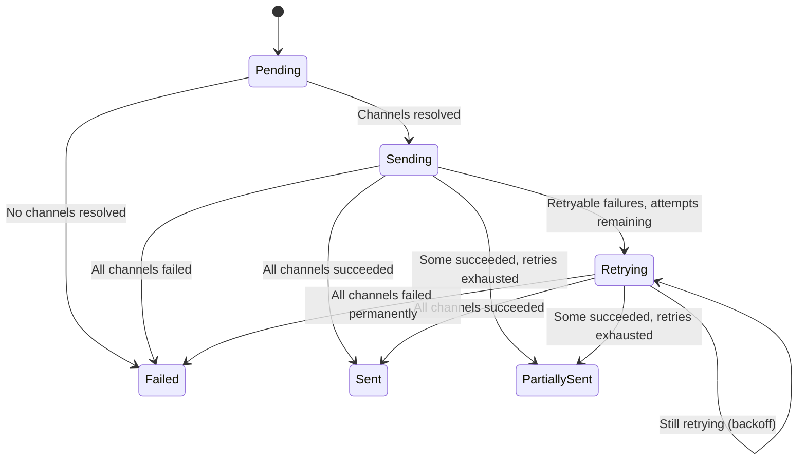

# Notification Pipeline

!!! info "Operator guide"
    For channel setup, Slack configuration, and credential management, see [Notification Channels](../user-guide/notifications.md).

!!! abstract "CRD Reference"
    For the complete NotificationRequest CRD specification, see [API Reference: CRDs](../api-reference/crds.md#notificationrequest).

The Notification controller delivers outcome notifications through multiple channels. It manages routing resolution, per-channel delivery with retry and circuit breaker logic, credential hot-reload, and audit event emission.

## CRD Specification

### Spec (Immutable)

| Field | Type | Description |
|---|---|---|
| `RemediationRequestRef` | `*ObjectReference` | Back-reference to the parent RR |
| `Type` | `NotificationType` | Notification category (see below) |
| `Priority` | `NotificationPriority` | Delivery priority: `critical`, `high`, `medium`, `low` |
| `Subject` | `string` | Notification subject line (1–500 chars) |
| `Body` | `string` | Notification body content |
| `Severity` | `string` | Signal severity (for routing) |
| `Phase` | `string` | RR phase that triggered the notification |
| `ReviewSource` | `string` | Source of manual review (if applicable) |
| `Metadata` | `map[string]string` | Context metadata for routing and formatting |
| `ActionLinks` | `[]ActionLink` | External links (service, URL, label) |
| `RetryPolicy` | `*RetryPolicy` | Override retry behavior (optional) |
| `RetentionDays` | `int` | How long to keep the CRD (default: 7, max: 90) |

### Notification Types

| Type | Description |
|---|---|
| `escalation` | Escalation to human review |
| `simple` | Basic status notification |
| `status-update` | Phase change update |
| `approval` | Approval request |
| `manual-review` | Manual review required |
| `completion` | Remediation outcome (success or failure) |

### Status

| Field | Type | Description |
|---|---|---|
| `Phase` | `NotificationPhase` | Current phase |
| `DeliveryAttempts` | `[]DeliveryAttempt` | Per-channel delivery history |
| `TotalAttempts` | `int` | Total delivery attempts across all channels |
| `SuccessfulDeliveries` | `int` | Unique channels with successful delivery |
| `FailedDeliveries` | `int` | Unique channels with all attempts failed |
| `QueuedAt` | `*metav1.Time` | When the CRD entered Pending |
| `ProcessingStartedAt` | `*metav1.Time` | When delivery began |
| `CompletionTime` | `*metav1.Time` | When terminal phase was reached |
| `ObservedGeneration` | `int64` | For idempotency |
| `Reason` | `string` | Machine-readable reason |
| `Message` | `string` | Human-readable status |
| `Conditions` | `[]metav1.Condition` | Standard conditions |

### DeliveryAttempt

| Field | Type | Description |
|---|---|---|
| `Channel` | `string` | Channel name (e.g., `slack:receiver-name`) |
| `Attempt` | `int` | 1-based attempt number |
| `Timestamp` | `metav1.Time` | When the attempt was made |
| `Status` | `string` | `success`, `failed`, `timeout`, `invalid` |
| `Error` | `string` | Error description (prefixed with `permanent failure:` if non-retryable) |
| `DurationSeconds` | `float64` | Delivery duration |

## Phase State Machine

| Phase | Terminal | Description |
|---|---|---|
| **Pending** | No | CRD created, awaiting processing |
| **Sending** | No | Delivering to resolved channels |
| **Retrying** | No | One or more channels failed, retrying with backoff |
| **Sent** | Yes | All channels delivered successfully |
| **PartiallySent** | Yes | At least one channel succeeded, others exhausted |
| **Failed** | Yes | All channels failed |

### Phase Transition Logic

1. Zero resolved channels → **Failed** (`NoChannelsResolved`)
2. All channels succeeded → **Sent**
3. All channels exhausted retries:
    - At least one succeeded → **PartiallySent**
    - All permanent failures → **Failed** (`AllDeliveriesFailed`)
    - Otherwise → **Failed** (`MaxRetriesExhausted`)
4. Retryable failures with attempts remaining → **Retrying** (requeue with backoff)

## Routing Resolution

When a notification enters the Sending phase, the controller resolves which channels to deliver to.

### Routing Attributes

Attributes are extracted from the notification spec and used for route matching:

| Attribute | Source |
|---|---|
| `type` | `spec.Type` |
| `severity` | `spec.Severity` |
| `phase` | `spec.Phase` |
| `reviewSource` | `spec.ReviewSource` |
| `priority` | `spec.Priority` |
| `environment` | `spec.Metadata["environment"]` |
| `namespace` | `spec.Metadata["namespace"]` |
| `skipReason` | `spec.Metadata["skipReason"]` |
| `investigationOutcome` | `spec.Metadata["investigationOutcome"]` |

### Route Matching

The routing configuration follows an AlertManager-style tree:

1. Build routing attributes from the notification spec
2. Walk the route tree depth-first -- child routes are evaluated before the parent
3. Each route's `Match` map must match **all** specified attributes (AND logic)
4. First matching route identifies the **receiver**
5. The receiver declares which channels to use
6. If `Continue: true`, matching continues for multi-channel fanout (BR-NOT-068)

### Fallback

If no route matches, the notification falls back to the `console` channel. This ensures every notification is delivered somewhere.

### Qualified Channel Names

For channels that support multiple instances (e.g., multiple Slack webhooks), the routing resolver produces qualified names:

- **Slack**: `slack:receiverName` or `slack:receiverName:index`
- **Other channels**: Unqualified names (e.g., `console`, `file`, `log`)

### Configuration

Routing configuration is loaded from a ConfigMap:

| Setting | Default |
|---|---|
| ConfigMap name | `notification-routing-config` |
| ConfigMap namespace | `kubernaut-notifications` (or `POD_NAMESPACE`) |
| ConfigMap key | `routing.yaml` |

## Delivery Orchestration

The delivery orchestrator manages per-channel delivery with deduplication, attempt tracking, and error classification.

### Delivery Flow

For each resolved channel:

1. **Skip** if channel already succeeded (persisted or in-memory)
2. **Skip** if channel has a permanent error
3. **Skip** if attempt count ≥ `MaxAttempts`
4. **Circuit breaker** pre-check (Slack only) -- if open, emit `CircuitBreakerOpen` event and skip
5. **Increment** in-flight attempt counter
6. **Deliver** via singleflight (dedup key: `{notificationUID}:{channel}`)
7. **Decrement** in-flight counter
8. **Classify** error as permanent or retryable
9. **Record** audit event (`message.sent` or `message.failed`)
10. **Append** `DeliveryAttempt` to status

### Singleflight Deduplication

Concurrent reconciles for the same notification + channel are deduplicated via `singleflight.Group`. Only one actual delivery call runs; others share the result.

### In-Memory State (DD-NOT-008)

The orchestrator tracks delivery state in memory to prevent duplicate deliveries between status persistence:

- **In-flight attempts**: Incremented before delivery, decremented after
- **Successful deliveries**: Marked in memory immediately on success
- **Total attempt count** = persisted attempts + in-flight attempts
- **Cleanup**: `ClearInMemoryState(uid)` is called after status is persisted

### Counter Logic

`SuccessfulDeliveries` and `FailedDeliveries` track unique channels, not attempts. A successful delivery for a channel that previously failed **overwrites** the failure count for that channel.

## Retry Policy

### Defaults

| Parameter | Default | Range |
|---|---|---|
| `MaxAttempts` | 5 | 1–10 |
| `InitialBackoffSeconds` | 30 | 1–300 |
| `BackoffMultiplier` | 2 | 1–10 |
| `MaxBackoffSeconds` | 480 | 60–3600 |

### Backoff Calculation

Uses the shared `pkg/shared/backoff` library:

- **Formula**: `BasePeriod × (Multiplier ^ (attempts - 1))`
- **Jitter**: ±10% (BR-NOT-055)
- **Cap**: `MaxBackoffSeconds`

Example with defaults: 30s → 60s → 120s → 240s → 480s

### Backoff Enforcement (NT-BUG-007)

When in `Retrying` phase, the controller computes the next retry time from the last failed attempt. If the current time is before the next retry time, the reconcile is requeued with the remaining backoff duration.

## Error Classification

### Retryable Errors

Wrapped with `NewRetryableError(err)`. Detected via `IsRetryableError(err)`.

### Permanent Errors

Stored with the prefix `permanent failure:` in the `DeliveryAttempt.Error` field.

### Slack Error Classification

| Condition | Classification |
|---|---|
| TLS / x509 errors | Permanent |
| HTTP 5xx | Retryable |
| HTTP 429 (rate limit) | Retryable |
| HTTP 4xx (other) | Permanent |
| Network errors (non-TLS) | Retryable |

## Circuit Breaker (Slack)

The Slack channel uses a Sony gobreaker circuit breaker to prevent hammering a failing webhook:

| Setting | Value |
|---|---|
| **Trip threshold** | 3 consecutive failures |
| **Open duration** | 30 seconds |
| **Half-open requests** | 2 test requests |
| **Reset interval** | 10 seconds |

When the circuit breaker is open, the controller emits a `CircuitBreakerOpen` Kubernetes event and skips delivery to that channel.

## Channel Implementations

| Channel | Description | Error Behavior |
|---|---|---|
| **Console** | Logs to controller-runtime logger. Format: `[Priority] [Type] Subject\nBody` | Always succeeds |
| **Log** | Structured JSON Lines to stdout with notification fields | Always succeeds |
| **File** | Writes JSON/YAML to a directory. Filename: `notification-{name}-{timestamp}.{format}`. Atomic write (temp + rename). E2E/debug use (DD-NOT-002) | Directory/write errors → retryable |
| **Slack** | Webhook POST with Block Kit formatting. Default timeout: 10s | See error classification above |

Channels for `email`, `teams`, `sms`, and `webhook` are defined in the CRD schema but not yet implemented.

## Credential Management

The credential resolver reads secrets from a mounted directory (projected volume):

- Each file: name = credential name, content = secret value
- Hidden files (e.g., `..data` symlinks) are skipped
- **Hot-reload**: `fsnotify` watches the directory; cache is reloaded on file changes
- **Validation**: `ValidateRefs(refs)` ensures all referenced credentials exist before delivery

## Audit Events

| Event Type | When |
|---|---|
| `notification.message.sent` | Per-channel delivery success |
| `notification.message.failed` | Per-channel delivery failure |
| `notification.message.acknowledged` | All channels in Sent phase |
| `notification.message.escalated` | All channels in Failed phase (permanent) |

### Idempotency (NT-BUG-001)

Audit events are tracked in a `sync.Map` with composite keys (`message.sent:{channel}`, `message.failed:{channel}:attempt{N}`). Duplicate events are suppressed. Tracking is cleaned up when the CRD is deleted.

## Duplicate Reconcile Prevention (NT-BUG-008)

The controller skips reconciliation if all of the following are true:

- `Generation == ObservedGeneration`
- `len(DeliveryAttempts) > 0`
- Phase is terminal

This prevents redundant processing when the controller-runtime re-delivers an event for an already-completed notification.

## Next Steps

- [Notification Channels Configuration](../user-guide/notifications.md) -- Operator guide for setting up channels and routing
- [Remediation Routing](remediation-routing.md) -- How the Orchestrator creates notifications
- [Architecture Overview](overview.md) -- System topology
