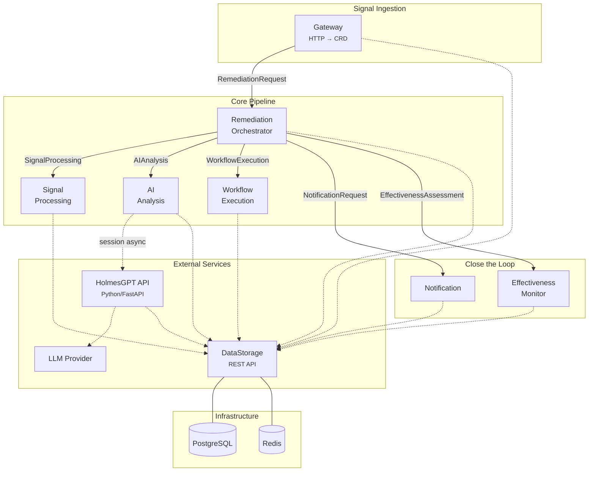

# System Overview

Kubernaut is built as a set of loosely-coupled microservices that communicate through Kubernetes Custom Resources. This page describes the system topology, design principles, and key architectural decisions.

## Design Principles

### CRDs as the Communication Backbone

Every inter-service interaction in the remediation pipeline uses Kubernetes CRDs. The Remediation Orchestrator creates child CRDs; specialized controllers reconcile them. This provides:

- **Crash resilience** — Controllers restart and resume from CRD state
- **Observability** — `kubectl get <crd>` shows the current state of every stage
- **Auditability** — Status transitions are recorded as Kubernetes events and audit trail entries
- **Decoupling** — Services have no direct dependency on each other

The only exceptions are:

- **DataStorage** — Called via REST API for audit events and workflow catalog queries
- **HolmesGPT API** — Called via REST API (session-based async) for LLM interactions

### Orchestrator Pattern

The **Remediation Orchestrator** is the central coordinator. It watches `RemediationRequest` CRDs and drives the lifecycle by creating child CRDs in sequence:

```
RemediationRequest (Gateway)
  └─ SignalProcessing (Orchestrator → SP Controller)
  └─ AIAnalysis (Orchestrator → AA Controller)
  └─ RemediationApprovalRequest (Orchestrator, when approval needed)
  └─ WorkflowExecution (Orchestrator → WE Controller)
  └─ NotificationRequest (Orchestrator → Notification Controller)
  └─ EffectivenessAssessment (Orchestrator → EM Controller)
```

The Orchestrator also watches all child CRDs to detect status changes and advance the parent `RemediationRequest` through its phases.

### Separation of Concerns

Each service has a single responsibility:

| Service | Responsibility |
|---|---|
| Gateway | Signal ingestion and scope validation |
| Signal Processing | Context enrichment and classification |
| AI Analysis | Root cause investigation and workflow selection |
| Workflow Execution | Running remediation actions |
| Notification | Delivering alerts to operators |
| Effectiveness Monitor | Post-remediation health assessment |
| DataStorage | Persistent storage (audit, workflows, history) |
| HolmesGPT API | LLM wrapper with live `kubectl` access |
| Orchestrator | Lifecycle coordination across all services |

## Service Topology



## Namespace Model

All Kubernaut services run in the `kubernaut-system` namespace. Workflow execution (Jobs/Tekton PipelineRuns) runs in a separate execution namespace with a shared ServiceAccount. Per-workflow scoped RBAC is planned for v1.1.

## Configuration

Services are configured via **YAML ConfigMaps** following ADR-030. Each service reads its configuration from a file mounted at `/etc/<service>/config.yaml`.

See [Configuration Reference](../user-guide/configuration.md) for all configurable parameters.

## Security Model

### RBAC

Each service has a dedicated ServiceAccount with minimal permissions:

- CRD controllers get watch/create/update on their specific CRDs
- The Orchestrator has the broadest permissions (creates and watches all child CRDs)
- Workflow execution uses a shared ServiceAccount in the execution namespace (per-workflow scoping in v1.1)

### Admission Webhooks

An internal admission webhook validates and audits:

- WorkflowExecution mutations (block clearance)
- RemediationApprovalRequest mutations (approval/rejection)
- RemediationRequest status mutations (timeout configuration)
- NotificationRequest deletions (attribution)

### Authentication

- **Service-to-service**: SubjectAccessReview middleware authentication
- **Gateway ingress**: Network-level security (NetworkPolicies + TLS)
- **DataStorage**: Kubernetes TokenReview authentication

## Next Steps

- [Signal Processing](signal-processing.md) — How signals are enriched
- [AI Analysis](ai-analysis.md) — The HolmesGPT integration
- [Audit Pipeline](audit-pipeline.md) — How audit events flow through the system
