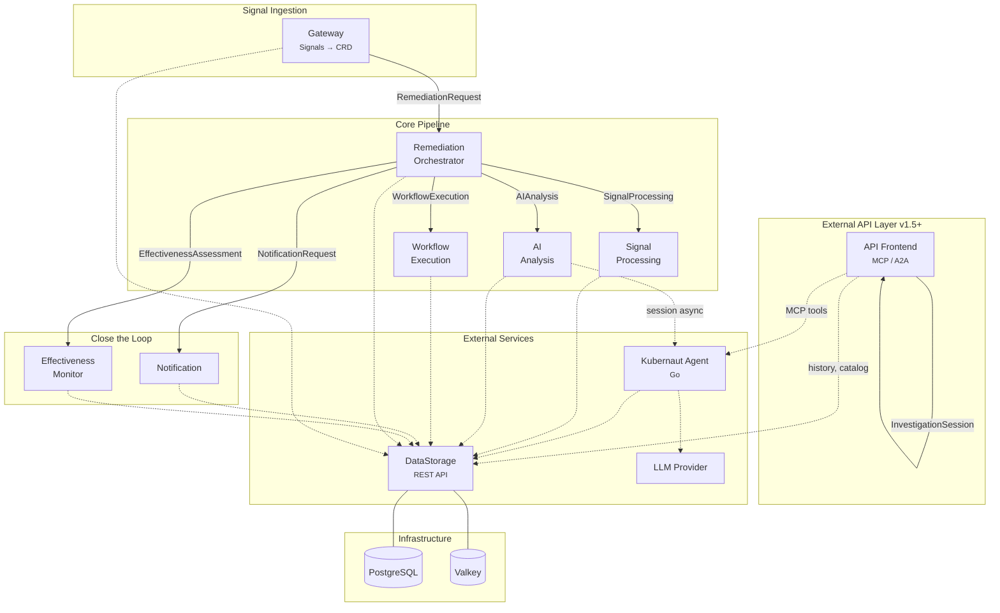

# System Overview

Kubernaut is built as a set of loosely-coupled microservices that communicate through Kubernetes Custom Resources. This page describes the system topology, design principles, and key architectural decisions.

## Design Principles

### CRDs as the Communication Backbone

Every inter-service interaction in the remediation pipeline uses Kubernetes CRDs. The Remediation Orchestrator creates child CRDs; specialized controllers reconcile them. This provides:

- **Crash resilience** -- Controllers restart and resume from CRD state
- **Observability** -- `kubectl get <crd>` shows the current state of every stage
- **Auditability** -- Status transitions are recorded as Kubernetes events and audit trail entries
- **Decoupling** -- Services have no direct dependency on each other

The only exceptions are:

- **DataStorage** -- Called via REST API for audit events, workflow catalog, remediation history, and effectiveness data
- **Kubernaut Agent** -- Called via REST API (session-based async) for LLM-driven root cause analysis, infrastructure label detection, and workflow discovery

### Orchestrator Pattern

The **Remediation Orchestrator** is the central coordinator. It watches `RemediationRequest` CRDs and drives the lifecycle by creating child CRDs in sequence:

```
RemediationRequest (Gateway)
  └─ SignalProcessing (Orchestrator → SP Controller)
  └─ AIAnalysis (Orchestrator → AA Controller → Kubernaut Agent)
  └─ RemediationApprovalRequest (Orchestrator, when approval needed)
  └─ WorkflowExecution (Orchestrator → WE Controller)
  └─ EffectivenessAssessment (Orchestrator → EM Controller)
  └─ NotificationRequest (Orchestrator → Notification Controller)

InvestigationSession (API Frontend — v1.5+, interactive MCP/A2A sessions)
```

Pipeline child CRDs have owner references to the parent RR, enabling cascade deletion when the RR is garbage collected. `InvestigationSession` CRDs are created by the API Frontend independently of the Orchestrator pipeline; they also carry an owner reference to the associated RR for cascade cleanup. The Orchestrator watches all child CRDs to detect status changes and advance the parent through its [phase state machine](remediation-routing.md#phase-state-machine).

??? note "Detailed sub-phase breakdown"

    | Phase | Sub-phase | Details |
    |---|---|---|
    | **Signal Processing** | Ingest | AlertManager webhooks, Kubernetes Events, scope validation |
    | | Enrich | Owner chain resolution, namespace labels, workload metadata |
    | | Classify | OPA/Rego severity, environment, priority, signal mode, business classification |
    | **AI Analysis** | Invocation 1 — RCA | 36 native Go tools (client-go): pod logs, events, resource state, Prometheus metrics, remediation history, config inspection |
    | | Server-side enrichment | Context injection, history lookup, metric baselines |
    | | Invocation 2 — Workflow Selection | LLM selects from declarative workflow catalog with confidence scoring |
    | **Approval** | Policy evaluation | OPA/Rego approval policy (environment, confidence, resource kind) |
    | | Human review | Slack/Console notification, operator approve/reject/override |
    | **Execution** | Engine dispatch | Tekton PipelineRun, Kubernetes Job, or Ansible (AWX/AAP) |
    | | Security | Per-workflow ServiceAccount, short-lived TokenRequest, namespace isolation |
    | **Effectiveness** | Verify | Pre/post spec hash comparison, alert resolution, pod readiness, metric thresholds |
    | | Score | Four-dimensional health score (0–100%), cooldown monitoring |
    | | Learn | Outcomes persisted to remediation history, feed future RCA investigations |

### Separation of Concerns

Each service has a single responsibility:

| Service | Responsibility | Architecture Page |
|---|---|---|
| **Gateway** | Signal ingestion, authentication, scope checking, deduplication, RR creation | [Gateway](gateway.md) |
| **Signal Processing** | Kubernetes context enrichment, Rego-based classification (environment, severity, priority, signal mode), business categorization | [Signal Processing](signal-processing.md) |
| **AI Analysis** | Orchestrates Kubernaut Agent investigation session, evaluates Rego approval policy | [AI Analysis](ai-analysis.md) |
| **Kubernaut Agent** | LLM-driven investigation with K8s tools, infrastructure label detection, tiered remediation history (via DataStorage), three-step LLM-driven workflow discovery | [Investigation Pipeline](kubernaut-agent-investigation.md) |
| **Remediation Orchestrator** | Lifecycle coordination, routing engine, timeout enforcement, child CRD management | [Remediation Routing](remediation-routing.md) |
| **Workflow Execution** | Dependency resolution, Job/Tekton execution, cooldown, deterministic locking | [Workflow Execution](workflow-execution.md) |
| **Notification** | Multi-channel delivery with routing, retry, circuit breaker | [Notification Pipeline](notification.md) |
| **Effectiveness Monitor** | Post-remediation health, alert, metrics, and spec hash assessment | [Effectiveness Assessment](effectiveness.md) |
| **DataStorage** | Persistent storage (audit, workflow catalog, remediation history, effectiveness), workflow scoring | [Data Persistence](data-persistence.md) |
| **API Frontend** | MCP/A2A/REST gateway, SAR-based tool authorization, session management (v1.5+) | [API Frontend](apifrontend.md) |

## Service Topology


```mermaid
graph TB
    subgraph Ingress["Signal Ingestion"]
        GW[Gateway<br/><small>Signals → CRD</small>]
    end

    subgraph External_API["External API Layer v1.5+"]
        AF[API Frontend<br/><small>MCP / A2A</small>]
    end

    subgraph Core["Core Pipeline"]
        RO[Remediation<br/>Orchestrator]
        SP[Signal<br/>Processing]
        AA[AI<br/>Analysis]
        WE[Workflow<br/>Execution]
    end

    subgraph Closing["Close the Loop"]
        NF[Notification]
        EM[Effectiveness<br/>Monitor]
    end

    subgraph External["External Services"]
        KA[Kubernaut Agent<br/><small>Go</small>]
        DS[DataStorage<br/><small>REST API</small>]
        LLM[LLM Provider]
    end

    subgraph Infra["Infrastructure"]
        PG[(PostgreSQL)]
        RD[(Valkey)]
    end

    AF -.->|MCP tools| KA
    AF -.->|history, catalog| DS
    AF -->|InvestigationSession| AF

    GW -->|RemediationRequest| RO
    RO -->|SignalProcessing| SP
    RO -->|AIAnalysis| AA
    RO -->|WorkflowExecution| WE
    RO -->|NotificationRequest| NF
    RO -->|EffectivenessAssessment| EM

    AA -.->|session async| KA
    KA -.-> LLM
    KA -.-> DS

    SP -.-> DS
    AA -.-> DS
    WE -.-> DS
    NF -.-> DS
    EM -.-> DS
    RO -.-> DS
    GW -.-> DS

    DS --- PG
    DS --- RD
```

### CRD Lifecycle

The complete CRD lifecycle for a single remediation follows the natural flow:

| Step | CRD Created | By | Controller | Purpose |
|---|---|---|---|---|
| 1 | `RemediationRequest` | Gateway | Orchestrator | Root lifecycle object |
| 2 | `SignalProcessing` | Orchestrator | SP Controller | Enrichment and classification |
| 3 | `AIAnalysis` | Orchestrator | AA Controller | RCA, workflow selection via KA |
| 4 | `RemediationApprovalRequest` | Orchestrator | (human) | Approval gate (when needed) |
| 5 | `WorkflowExecution` | Orchestrator | WE Controller | Run remediation workflow |
| 6 | `EffectivenessAssessment` | Orchestrator | EM Controller | Post-execution verification |
| 7 | `NotificationRequest` | Orchestrator | NT Controller | Outcome notification |
| — | `InvestigationSession` | API Frontend | AF (SessionCleanup) | Interactive MCP/A2A session state (v1.5+); deferred — materialized only after RR creation |

Each pipeline CRD has its own phase state machine. The Orchestrator monitors child CRD status and advances the parent RR accordingly. The `InvestigationSession` CRD follows its own lifecycle (Active → Disconnected → Completed/TimedOut) managed by the API Frontend's session cleanup reconciler.

## Namespace Model

All Kubernaut services run in the `kubernaut-system` namespace. Workflow execution (Jobs/Tekton PipelineRuns) runs in a separate `kubernaut-workflows` namespace. By default, executions use the execution namespace default ServiceAccount (commonly configured as `kubernaut-workflow-runner` in shared-SA deployments). Starting with v1.2, workflows can declare a dedicated ServiceAccount via `spec.execution.serviceAccountName` on the `RemediationWorkflow` CRD (propagated to `WorkflowExecution.spec.serviceAccountName`), enabling per-workflow least-privilege RBAC. See [Security & RBAC -- Per-Workflow ServiceAccount](security-rbac.md#per-workflow-serviceaccount-v12) for details.

## Configuration

Services are configured via **YAML ConfigMaps** following ADR-030. Each service reads its configuration from a file mounted at `/etc/<service>/config.yaml`. All Rego policies and YAML-based configurations (proactive signal mappings, notification routing) support [hot-reload](../user-guide/configuration.md#hot-reload-and-graceful-shutdown) via `fsnotify` file watchers.

See [Configuration Reference](../user-guide/configuration.md) for all configurable parameters.

## Security Model

### RBAC

Each service runs under a dedicated ServiceAccount with least-privilege permissions. See [Security & RBAC](security-rbac.md) for the full reference including controller permissions, workflow execution RBAC, signal source authentication, and internal service communication.

### Admission Webhooks

An internal admission webhook validates and audits:

- WorkflowExecution mutations (block clearance)
- RemediationApprovalRequest mutations (approval/rejection)
- RemediationRequest status mutations (timeout configuration)
- NotificationRequest deletions (attribution)
- RemediationWorkflow mutations (schema validation via `/validate-remediationworkflow`)
- ActionType mutations (schema validation via `/validate-actiontype`)

### Authentication

- **DataStorage** -- Kubernetes TokenReview + SubjectAccessReview middleware (DD-AUTH-014)
- **Gateway** -- Kubernetes TokenReview + SubjectAccessReview middleware for signal ingestion (see [Security & RBAC](security-rbac.md#signal-ingestion))
- **NetworkPolicies** -- Default-deny ingress posture for all services (v1.4); see [Security & RBAC](security-rbac.md#networkpolicies-v14)
- **TLS (inter-service)** -- v1.3+ supports HTTPS and mutual TLS for internal REST traffic when certificate material is present; see [Configuration Reference -- TLS](../user-guide/configuration.md#tls-and-certificate-management)

## Port model (v1.3+)

Kubernaut uses a **three-port** split on components that serve both an API and operational endpoints:

| Port | Purpose |
|------|---------|
| **8080** | Primary API for Gateway, DataStorage, AIAnalysis. Serves **HTTPS** when TLS certificate files exist under `tls.interService.certDir`; otherwise plain HTTP. |
| **8443** | Primary API for **Kubernaut Agent** and **API Frontend** (v1.5+). Always **HTTPS**. |
| **8081** | **Health probes only**, always **plain HTTP**: `GET /healthz` (liveness), `GET /readyz` (readiness). The path **`/livez` is not registered** — do not configure probes to use it. |
| **9090** | **Prometheus metrics**, always **plain HTTP** at `GET /metrics`. |

**Three-port** behavior applies to **Gateway**, **DataStorage**, **Kubernaut Agent**, the **AIAnalysis** controller, and the **API Frontend** (v1.5+). The Kubernaut Agent and API Frontend default to port **8443** (HTTPS); Gateway, DataStorage, and AIAnalysis default to port **8080**. Other controllers (**Remediation Orchestrator**, **Signal Processing**, **Workflow Execution**, **Notification**, **Effectiveness Monitor**) expose **metrics on 9090** as their Service port; they do not use the API/health split.

**Auth Webhook** is an exception: the Service uses **port 443** with **targetPort 9443** for admission traffic; health checks use **8081** (`/healthz`, `/readyz`) like the other Go components.

## Error Handling Patterns

All controllers share common error handling patterns:

| Pattern | Implementation | Reference |
|---|---|---|
| **Exponential backoff** | `pkg/shared/backoff` -- base × multiplier^(failures-1) ± jitter | DD-SHARED-001 |
| **Transient vs permanent errors** | Transient → retry with backoff; permanent → terminal phase | Per-controller |
| **Consecutive failure tracking** | `ConsecutiveFailures` counter on CRD status; reset on success | DD-SHARED-001 |
| **Graceful shutdown** | Context cancellation → flush audit buffers → stop watchers | DD-007, ADR-032 |
| **Hot-reload** | `fsnotify` file watcher → debounce 200ms → swap config under mutex | DD-INFRA-001 |

## Next Steps

- [Gateway](gateway.md) -- Signal ingestion entry point
- [Signal Processing](signal-processing.md) -- Enrichment and classification
- [AI Analysis](ai-analysis.md) -- Kubernaut Agent integration
- [Remediation Routing](remediation-routing.md) -- Orchestrator lifecycle management
- [Audit Pipeline](audit-pipeline.md) -- How audit events flow through the system
