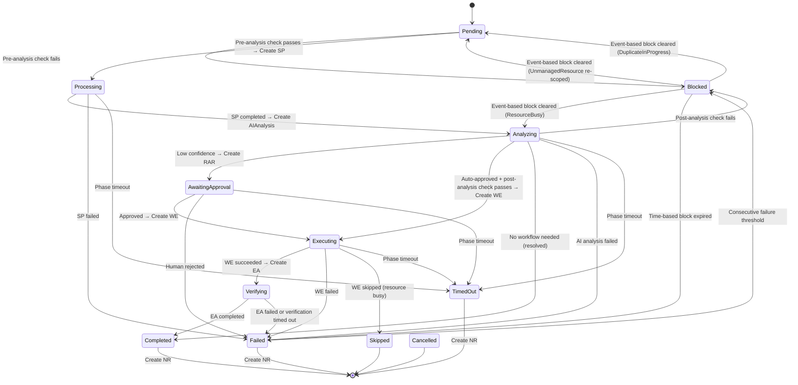

# Remediation Routing

The **Remediation Orchestrator** is the central coordinator that drives the remediation lifecycle. It watches `RemediationRequest` CRDs and routes them through the pipeline by creating child CRDs and monitoring their completion.

## Routing Engine

The Orchestrator maintains a state machine for each `RemediationRequest`. The routing engine evaluates blocking conditions at two checkpoints before allowing the RR to progress.

## Phase Reference

| Phase | Terminal? | Description |
|---|---|---|
| Pending | No | RR created, awaiting pre-analysis routing check |
| Processing | No | SignalProcessing in progress (enrichment, classification) |
| Analyzing | No | AIAnalysis in progress (RCA, workflow selection) |
| AwaitingApproval | No | Human approval required (RemediationApprovalRequest created) |
| Executing | No | WorkflowExecution running |
| Verifying | No | WorkflowExecution succeeded; EffectivenessAssessment in progress |
| Blocked | No | Routing condition prevents progress; requeued with cooldown |
| Completed | Yes | Remediation finished successfully |
| Failed | Yes | Remediation failed at any stage (including approval rejection) |
| TimedOut | Yes | Phase or global timeout exceeded |
| Skipped | Yes | Execution skipped (e.g., resource lock prevented it) |
| Cancelled | Yes | Manually cancelled by an operator |

## Routing Checkpoints

The routing engine evaluates blocking conditions at two points in the lifecycle. If any check fails, the RR enters the **Blocked** phase with the specific `BlockReason` and is requeued after the cooldown expires.

### Pre-Analysis Check (Pending → Processing)

Before creating the SignalProcessing CRD, the engine checks:

| Check | Block Reason | Behavior |
|---|---|---|
| Target not managed by Kubernaut | `UnmanagedResource` | Exponential backoff until label appears |
| 3+ consecutive failures for same signal | `ConsecutiveFailures` | 1-hour cooldown (configurable) |
| Another RR with same fingerprint is active | `DuplicateInProgress` | Inherits outcome when original completes |
| Exponential backoff from prior failures | `ExponentialBackoff` | Backoff = min(base × 2^(failures-1), max) |

### Post-Analysis Check (Analyzing → Executing)

After AI analysis selects a workflow but before creating the WorkflowExecution CRD, the engine runs all pre-analysis checks plus additional execution-specific checks:

| Check | Block Reason | Behavior |
|---|---|---|
| All pre-analysis checks | (same as above) | Same behavior |
| Another WE running on the same target | `ResourceBusy` | Waits until active WE completes |
| Same workflow+target executed recently | `RecentlyRemediated` | 5-minute cooldown (configurable) |
| Consecutive ineffective remediations | `IneffectiveChain` | Escalates to manual review |

### Blocked Phase Lifecycle

Blocked is a **non-terminal** phase. When a blocking condition expires:

- **Time-based blocks** (ConsecutiveFailures, RecentlyRemediated, ExponentialBackoff): the cooldown expires and the RR transitions to **Failed** (terminal). Future RRs for the same signal can then proceed.
- **Event-based blocks** (cleared when the blocking condition resolves):
    - **UnmanagedResource**: The target resource gains the `kubernaut.ai/managed=true` label → RR transitions to **Pending** for re-evaluation.
    - **DuplicateInProgress**: The original RR reaches a terminal phase → duplicate transitions to **Pending**.
    - **ResourceBusy**: The blocking WorkflowExecution completes → RR transitions to **Analyzing**.

The Gateway treats Blocked RRs as "active," preventing creation of new RRs for the same signal fingerprint while the block is in effect.

## Phase Transitions

| Current Phase | Trigger | Next Phase | Child CRD Created |
|---|---|---|---|
| Pending | Pre-analysis check passes | Processing | SignalProcessing |
| Pending | Pre-analysis check fails | Blocked | — |
| Processing | SignalProcessing completes | Analyzing | AIAnalysis |
| Processing | SignalProcessing fails or times out | Failed / TimedOut | — |
| Analyzing | AI auto-approves + post-analysis passes | Executing | WorkflowExecution |
| Analyzing | AI requires approval | AwaitingApproval | RemediationApprovalRequest |
| Analyzing | Post-analysis check fails | Blocked | — |
| Analyzing | No workflow needed (already resolved) | Completed | NotificationRequest |
| Analyzing | AI analysis fails or times out | Failed / TimedOut | — |
| AwaitingApproval | Human approves | Executing | WorkflowExecution |
| AwaitingApproval | Human rejects | Failed | — |
| AwaitingApproval | Times out | TimedOut | — |
| Executing | WorkflowExecution succeeds | Verifying | EffectivenessAssessment |
| Executing | WorkflowExecution fails | Failed | NotificationRequest + EffectivenessAssessment |
| Executing | Times out | TimedOut | NotificationRequest |
| Verifying | EffectivenessAssessment completes | Completed | NotificationRequest |
| Verifying | Verification timed out | Failed | NotificationRequest |
| Blocked | Time-based cooldown expires (ConsecutiveFailures) | Failed | — |
| Blocked | Event-based block cleared — UnmanagedResource re-scoped | Pending | — |
| Blocked | Event-based block cleared — ResourceBusy resolved | Analyzing | — |
| Blocked | Event-based block cleared — DuplicateInProgress completes | Pending | — |
| Failed | Consecutive failure threshold | Blocked | — |

## Terminal Phase Actions

When a `RemediationRequest` reaches a terminal phase, the Orchestrator creates:

1. **NotificationRequest** — Informs the team about the outcome (on all terminal phases: Completed, Failed, TimedOut)
2. **EffectivenessAssessment** — Evaluates whether the fix worked (created when the WE succeeds, triggering the Verifying phase; also for Failed)

If the RR has duplicate RRs (tracked via `DuplicateCount`), a bulk duplicate notification is also created.

## Child CRD Ownership

All child CRDs have an `ownerReference` pointing to the parent `RemediationRequest`. This means if the parent is deleted (e.g., after 24h TTL), Kubernetes garbage collection cleans up all child CRDs automatically.

## Reconciliation

The Orchestrator uses a single reconciler that watches:

- `RemediationRequest` — The parent resource
- `SignalProcessing` — To detect enrichment completion
- `AIAnalysis` — To detect analysis completion
- `WorkflowExecution` — To detect execution completion
- `NotificationRequest` — To track notification delivery
- `EffectivenessAssessment` — To track effectiveness results
- `RemediationApprovalRequest` — To detect approval decisions

Each child CRD status change triggers a reconcile of the parent `RemediationRequest`. The reconciler includes idempotency guards to prevent duplicate phase transitions and audit emissions on retry.

## Escalation

The Orchestrator supports escalation paths:

- **Approval escalation** — When confidence is below the approval threshold, routes to human review via RemediationApprovalRequest
- **Failure notification** — On failure at any stage, creates a notification with error context
- **No-workflow notification** — When AI analysis finds no matching workflow, notifies the team with the RCA
- **Ineffective chain escalation** — When consecutive remediations on the same target fail to fix the issue, escalates to manual review
- **Consecutive failure blocking** — After 3+ consecutive failures for the same signal, blocks future RRs with a cooldown period

## Next Steps

- [Workflow Selection](workflow-selection.md) — How workflows are matched to incidents
- [Workflow Execution](workflow-execution.md) — How remediations are executed
- [System Overview](overview.md) — Full service topology
