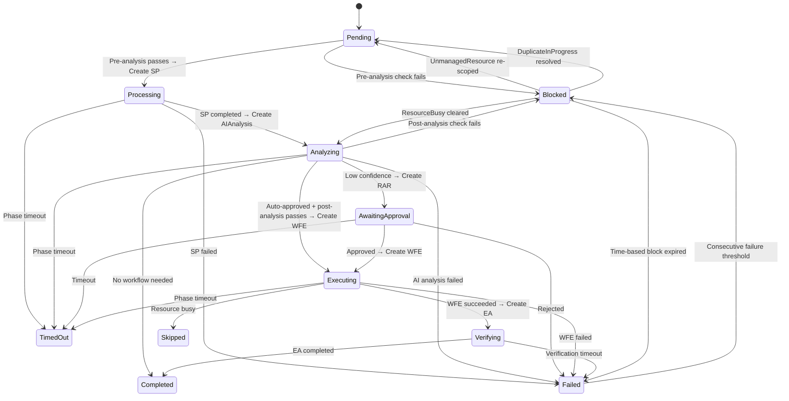

# Remediation Routing

!!! abstract "CRD Reference"
    For the complete RemediationRequest CRD specification, see [API Reference: CRDs](../api-reference/crds.md#remediationrequest).

The **Remediation Orchestrator** is the central coordinator that drives the remediation lifecycle. It watches `RemediationRequest` CRDs created by the Gateway and routes them through the pipeline by creating child CRDs, monitoring their completion, enforcing timeouts, and evaluating routing conditions at every stage.

## CRD Specification

### RemediationRequest Spec

For the complete field specification, see [RemediationRequest in the CRD Reference](../api-reference/crds.md#remediationrequest).

### RemediationRequest Status

For the complete field specification, see [RemediationRequest in the CRD Reference](../api-reference/crds.md#remediationrequest).

## Phase State Machine



### Phase Reference

| Phase | Terminal | Description |
|---|---|---|
| **Pending** | No | Awaiting pre-analysis routing checks |
| **Processing** | No | SignalProcessing in progress (enrichment, classification) |
| **Analyzing** | No | AIAnalysis in progress (RCA, workflow selection) |
| **AwaitingApproval** | No | Human approval required (RAR created) |
| **Executing** | No | WorkflowExecution running |
| **Verifying** | No | EffectivenessAssessment in progress |
| **Blocked** | No | Routing condition prevents progress |
| **Completed** | Yes | Remediation finished successfully |
| **Failed** | Yes | Remediation failed at any stage |
| **TimedOut** | Yes | Phase or global timeout exceeded |
| **Skipped** | Yes | Execution skipped (resource lock) |
| **Cancelled** | Yes | Manually cancelled by operator |

### Valid Transitions

```
Pending     → Processing, Blocked
Processing  → Analyzing, Failed, TimedOut
Analyzing   → AwaitingApproval, Executing, Completed, Failed, TimedOut, Blocked
AwaitingApproval → Executing, Failed, TimedOut
Executing   → Verifying, Failed, TimedOut, Skipped
Verifying   → Completed
Blocked     → Failed, Analyzing, Pending
Failed      → Blocked
```

## Phase Handlers

### Pending → Processing

1. Run **pre-analysis routing checks** (see [Routing Checkpoints](#routing-checkpoints))
2. If blocked → transition to **Blocked** with `BlockReason`, `BlockedUntil`, `RequeueAfter`
3. If clear → create **SignalProcessing** CRD via `spCreator.Create`
4. Set `SignalProcessingRef`, `ProcessingStartTime`
5. Transition to **Processing**

### Processing → Analyzing

1. Fetch SP child CRD
2. If SP `Completed` → create **AIAnalysis** CRD via `aiAnalysisCreator.Create`
3. Set `AIAnalysisRef`, `AnalyzingStartTime`
4. Transition to **Analyzing**
5. If SP `Failed` → transition to **Failed** with SP error details

### Analyzing → (multiple outcomes)

The AI Analysis produces one of four outcomes:

| AA Outcome | RR Action |
|---|---|
| **Normal** (workflow selected, auto-approved) | Run post-analysis checks → create **WFE** → **Executing** |
| **ApprovalRequired** (low confidence) | Create **RemediationApprovalRequest** → **AwaitingApproval** |
| **WorkflowNotNeeded** (issue already resolved) | Transition to **Completed** with `Outcome: NoActionRequired` |
| **Failed** (AI analysis error) | Transition to **Failed** |

For the normal path, the Orchestrator runs **post-analysis routing checks** before creating the WFE. If blocked, the RR enters **Blocked** (returning to Analyzing when the block clears).

### AwaitingApproval → Executing

1. Fetch RAR child CRD
2. If `Approved` → create **WFE** → transition to **Executing**
3. If `Rejected` or `Expired` → transition to **Failed**

### Executing → Verifying

1. Delegates to `weHandler.HandleStatus` which monitors WFE phase
2. If WFE `Completed` → create **EffectivenessAssessment** CRD
3. Set `EffectivenessAssessmentRef`, `VerificationDeadline`
4. Transition to **Verifying**
5. If WFE `Failed` → transition to **Failed** (also creates EA for failure tracking)
6. If WFE `Skipped` → transition to **Skipped**

### Verifying → Completed

1. Wait for EA to reach a terminal phase or `VerificationDeadline` to pass
2. EA completed → transition to **Completed**
3. Deadline exceeded → transition to **Completed** with `Outcome: VerificationTimedOut`

### Blocked → (re-evaluation)

The Blocked phase behaves differently based on the block type:

- **Time-based blocks** (ConsecutiveFailures, RecentlyRemediated, ExponentialBackoff): Check `BlockedUntil`. When expired → transition to **Failed** (terminal). Future RRs for the same signal can then proceed.
- **Event-based blocks**:
    - **UnmanagedResource**: Target gains `kubernaut.ai/managed=true` → **Pending**
    - **DuplicateInProgress**: Original RR reaches terminal → **Pending**
    - **ResourceBusy**: Blocking WFE completes → **Analyzing**

The Gateway treats Blocked RRs as active, preventing new RRs for the same fingerprint.

## Routing Checkpoints

The routing engine evaluates blocking conditions at two points. Checks are evaluated in order; the first blocking condition wins.

### Pre-Analysis Checks (Pending → Processing)

| Order | Check | Block Reason | Requeue After |
|---|---|---|---|
| 1 | Target not managed (`kubernaut.ai/managed`) | `UnmanagedResource` | 5s–5m (exponential) |
| 2 | 3+ consecutive failures for same fingerprint | `ConsecutiveFailures` | 1 hour |
| 3 | Active RR with same fingerprint exists | `DuplicateInProgress` | 30s |
| 4 | `NextAllowedExecution` in the future | `ExponentialBackoff` | Until expiry |

### Post-Analysis Checks (Analyzing → Executing)

Includes all pre-analysis checks plus:

| Order | Check | Block Reason | Requeue After |
|---|---|---|---|
| 5 | Active WFE on same target resource | `ResourceBusy` | 30s |
| 6 | Same workflow+target executed in last 5m | `RecentlyRemediated` | Remaining cooldown |
| 7 | 3+ consecutive ineffective remediations | `IneffectiveChain` | 4 hours |

### Routing Configuration

| Parameter | Default | Description |
|---|---|---|
| `ConsecutiveFailureThreshold` | 3 | Failures before blocking |
| `ConsecutiveFailureCooldown` | 1 hour | How long to block |
| `RecentlyRemediatedCooldown` | 5 minutes | Min interval between same workflow+target |
| `ExponentialBackoffBase` | 60 seconds | Base for backoff calculation |
| `ExponentialBackoffMax` | 10 minutes | Maximum backoff |
| `ExponentialBackoffMaxExponent` | 4 | Cap on exponent |
| `ScopeBackoffBase` | 5 seconds | Unmanaged resource recheck base |
| `ScopeBackoffMax` | 5 minutes | Unmanaged resource recheck max |
| `IneffectiveChainThreshold` | 3 | Consecutive ineffective before blocking |
| `RecurrenceCountThreshold` | 5 | Recurrence count escalation |
| `IneffectiveTimeWindow` | 4 hours | Time window for ineffective chain |
| `RequeueResourceBusy` | 30 seconds | Requeue interval for resource busy |
| `RequeueGenericError` | 5 seconds | Requeue interval for generic errors |
| `NoActionRequiredDelayHours` | 24 hours | Suppression window after a `NoActionRequired` outcome (see below) |

## NoActionRequired Suppression

When an RR completes with `Outcome: NoActionRequired` (the LLM determined no remediation was needed), the Orchestrator sets `NextAllowedExecution` to `now + NoActionRequiredDelayHours` on the completed RR. The Gateway's deduplication logic respects this field on terminal RRs -- any new signal with the same fingerprint is suppressed until the delay expires.

This prevents duplicate RR churn for signals whose underlying condition is unchanged by design (e.g., a `DiskPressure` alert for a PVC that the LLM correctly identified as not requiring automated action). Without this suppression, the same alert would generate a new RR on every AlertManager re-fire interval, each producing the same `NoActionRequired` outcome.

The default delay is **24 hours** (`NoActionRequiredDelayHours: 24`), configurable in the routing config. After the delay expires, a new RR is created if the alert is still firing, allowing the LLM to re-evaluate whether conditions have changed.

## Timeout System

The Orchestrator enforces both global and per-phase timeouts. Per-RR overrides are supported via `TimeoutConfig`.

### Default Timeouts

| Scope | Default | Description |
|---|---|---|
| **Global** | 1 hour | Maximum time from Pending to terminal |
| **Processing** | 5 minutes | Time for SP enrichment/classification |
| **Analyzing** | 10 minutes | Time for AI analysis and workflow selection |
| **AwaitingApproval** | 15 minutes | Time for human approval |
| **Executing** | 30 minutes | Time for workflow execution |
| **Verifying** | 30 minutes | Time for effectiveness assessment |

### Timeout Handling

- **Global timeout**: Transitions the RR to `TimedOut` regardless of current phase, creates a notification
- **Phase timeout**: Transitions to `TimedOut` with `TimeoutPhase` set to the phase that timed out
- **Verification deadline**: A soft timeout -- the RR transitions to `Completed` with `Outcome: VerificationTimedOut` rather than `TimedOut`

Timeout defaults are populated on first reconcile via `populateTimeoutDefaults`. The effective timeout for each phase is resolved by `getEffectivePhaseTimeout`, which checks the per-RR override first, then falls back to controller defaults.

## Child CRD Creation

The Orchestrator creates child CRDs at specific phase transitions:

| Phase Transition | Child CRD | Name Pattern | Description |
|---|---|---|---|
| Pending → Processing | SignalProcessing | `sp-{rr.Name}` | Enrichment and classification |
| Processing → Analyzing | AIAnalysis | `ai-{rr.Name}` | RCA and workflow selection |
| Analyzing → AwaitingApproval | RemediationApprovalRequest | `rar-{rr.Name}` | Human approval gate |
| Analyzing/Approved → Executing | WorkflowExecution | `we-{rr.Name}` | Workflow execution |
| Executing → Verifying | EffectivenessAssessment | `ea-{rr.Name}` | Post-execution verification |
| Terminal phases | NotificationRequest | Various | Outcome notification |

### Owner References

All child CRDs have a `controllerReference` pointing to the parent RR via `controllerutil.SetControllerReference`. This enables cascade deletion -- when the parent RR is garbage collected, all children are automatically cleaned up.

EffectivenessAssessment is created with `BlockOwnerDeletion: false` to allow audit data to persist independently.

## Reconciliation

The Orchestrator uses a single reconciler that watches all resource types in the pipeline:

- **RemediationRequest** -- The parent resource
- **SignalProcessing** -- Enrichment completion
- **AIAnalysis** -- Analysis completion
- **RemediationApprovalRequest** -- Approval decisions
- **WorkflowExecution** -- Execution completion
- **EffectivenessAssessment** -- Verification results
- **NotificationRequest** -- Notification delivery

Each child CRD status change triggers a reconcile of the parent RR. The reconciler includes idempotency guards -- `ObservedGeneration` and phase validation via `CanTransition` -- to prevent duplicate transitions on retry.

## Terminal Phase Actions

When a RR reaches a terminal phase:

1. **NotificationRequest** -- Created for `Completed`, `Failed`, and `TimedOut` outcomes
2. **Duplicate notification** -- If `DuplicateCount > 0`, a bulk notification is created for tracked duplicates
3. **Consecutive failure update** -- `ConsecutiveFailureCount` and `NextAllowedExecution` are updated for backoff calculation

## Escalation Paths

| Trigger | Escalation | Mechanism |
|---|---|---|
| Low AI confidence | Human approval | RemediationApprovalRequest CRD |
| Failure at any stage | Team notification | NotificationRequest with error context |
| No matching workflow | Team notification with RCA | NotificationRequest |
| Consecutive ineffective remediations | Manual review | `IneffectiveChain` block + `RequiresManualReview` |
| 3+ consecutive failures | Cooldown block | `ConsecutiveFailures` block (1h) |

## Handoff to Workflow Execution

When the Orchestrator creates a WorkflowExecution CRD:

1. The WFE spec includes the selected workflow ID, execution bundle, target resource, parameters, and confidence
2. The WFE controller picks up the CRD and begins dependency resolution and execution
3. The Orchestrator monitors WFE status and transitions accordingly

```
RO creates WFE → WFE validates spec → WFE resolves deps → WFE creates Job/PipelineRun → WFE reports status → RO transitions
```

## Next Steps

- [Gateway](gateway.md) -- How signals enter the system
- [Signal Processing](signal-processing.md) -- Enrichment and classification pipeline
- [Workflow Execution](workflow-execution.md) -- How remediations are executed
- [AI Analysis](ai-analysis.md) -- How AI investigates and selects workflows
