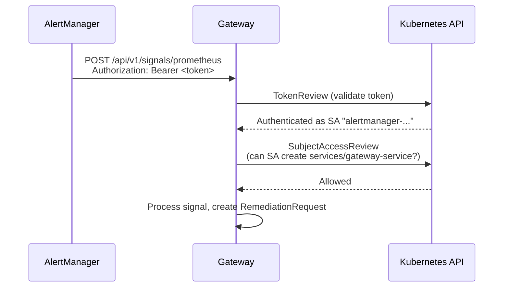

# Security & RBAC

Kubernaut follows a least-privilege model: each service runs under its own ServiceAccount with only the permissions it needs. This page is the consolidated reference for all RBAC resources created by the Helm chart.

## Signal Ingestion

The Gateway authenticates every signal ingestion request using **Kubernetes TokenReview + SubjectAccessReview (SAR)**:



### Gateway RBAC

The Gateway's own ClusterRole (`gateway-role`) includes:

| apiGroup | Resources | Verbs | Purpose |
|---|---|---|---|
| `kubernaut.ai` | `remediationrequests`, `remediationrequests/status` | create, get, list, watch, update, patch | Create and manage RRs from incoming signals |
| (core) | `namespaces` | get, list, watch | Scope label checks (`kubernaut.ai/managed`) |
| (core) | `nodes`, `pods`, `services`, `persistentvolumes` | get, list, watch | Owner chain resolution for fingerprinting |
| `apps` | `deployments`, `replicasets`, `statefulsets`, `daemonsets` | get, list, watch | Owner chain resolution |
| `batch` | `jobs`, `cronjobs` | get, list, watch | Owner chain resolution |
| `authentication.k8s.io` | `tokenreviews` | create | Validate bearer tokens from signal sources |
| `authorization.k8s.io` | `subjectaccessreviews` | create | Check signal source RBAC via SAR |
| `coordination.k8s.io` | `leases` | get, create, update, delete | Leader election |

### Signal Source RBAC

External signal sources (AlertManager, custom webhooks) must satisfy two requirements:

1. **A valid bearer token** -- The source must send its ServiceAccount token in the `Authorization` header. The Gateway validates it via TokenReview.
2. **SAR authorization** -- The ServiceAccount must have `create` permission on `services/gateway-service`. The chart provides the `gateway-signal-source` ClusterRole for this:

    ```yaml
    # gateway-signal-source ClusterRole
    rules:
      - apiGroups: [""]
        resources: ["services"]
        resourceNames: ["gateway-service"]
        verbs: ["create"]
    ```

The Helm value `gateway.auth.signalSources` creates a ClusterRoleBinding for each entry:

```yaml
gateway:
  auth:
    signalSources:
      - name: alertmanager
        serviceAccount: alertmanager-kube-prometheus-stack-alertmanager
        namespace: monitoring
```

The **Event Exporter** is bound automatically by the chart -- no manual configuration needed.

Without the bearer token, the Gateway returns `401 Unauthorized`. Without the ClusterRoleBinding, the Gateway returns `403 Forbidden`.

See [Installation](../getting-started/installation.md#signal-source-authentication) for the complete AlertManager and Event Exporter configuration examples.

## CRD Controllers

Each CRD controller runs under its own ServiceAccount with a dedicated ClusterRole scoped to the CRDs it manages. All controllers also get a namespace-scoped Role for reading ConfigMaps and Secrets in the release namespace (Rego policies, credentials).

Four services (HolmesGPT API, WorkflowExecution, RemediationOrchestrator, EffectivenessMonitor) include read access to `security.istio.io` and `networking.istio.io` resources for service mesh awareness during investigation and remediation.

| Controller | ServiceAccount | CRDs Managed | Additional Access | Notes |
|---|---|---|---|---|
| RemediationOrchestrator | `remediationorchestrator-controller` | All 7 child CRDs (full CRUD) | Pods, nodes, events, namespaces, services, deployments, statefulsets, daemonsets, jobs, cronjobs (read) | Broadest permissions -- creates and watches all child CRDs |
| SignalProcessing | `signalprocessing-controller` | SignalProcessing, RemediationRequest | Pods, services, namespaces, nodes, events, deployments, replicasets, statefulsets, daemonsets, HPAs, PDBs, network policies (read); leases (full) | Owner chain resolution and enrichment |
| AIAnalysis | `aianalysis-controller` | AIAnalysis | Events (create) | Also bound to `holmesgpt-api-client` for HolmesGPT access and `data-storage-client` for DataStorage access |
| WorkflowExecution | `workflowexecution-controller` | WorkflowExecution | Tekton PipelineRuns (full), TaskRuns (read), Jobs (full), events (create); leases (full) | Creates Jobs and PipelineRuns in the execution namespace |
| EffectivenessMonitor | `effectivenessmonitor-controller` | EffectivenessAssessment, RemediationRequest (read) | Pods, nodes, services, PVCs, events, deployments, replicasets, statefulsets, daemonsets, HPAs, PDBs, jobs, cronjobs (read) | Post-remediation health checks |
| Notification | `notification-controller` | NotificationRequest | Events (create) | Minimal scope |
| AuthWebhook | `authwebhook` | All Kubernaut CRDs (read), status subresources (update, patch) | -- | Admission webhook validation, defaulting, and catalog registration. Intercepts CREATE and UPDATE operations on `RemediationWorkflow` CRDs. Uses retry-on-conflict for `ActionType` status updates. |

## Workflow Execution

Remediation workflows (Jobs, Tekton PipelineRuns, Ansible playbooks) execute in the `kubernaut-workflows` namespace under the `kubernaut-workflow-runner` ServiceAccount. This is the broadest ClusterRole in the system because workflows need to act on the cluster to remediate issues.

| apiGroup | Resources | Verbs | Purpose |
|---|---|---|---|
| `apps` | `deployments`, `statefulsets`, `daemonsets` | get, list, patch, update | Scale, restart, or patch workloads |
| `apps` | `replicasets` | get, list, watch | Read replica state |
| (core) | `pods`, `pods/eviction` | get, list, create, delete | Evict pods, read pod state |
| (core) | `configmaps`, `secrets` | get, list, create, update, patch, delete | Read/write configuration |
| (core) | `nodes` | get, list | Read node state for drain/cordon |
| (core) | `namespaces`, `services`, `persistentvolumeclaims` | get, list | Read cluster state |
| `autoscaling` | `horizontalpodautoscalers` | get, list, patch | Scale HPAs |
| `policy` | `poddisruptionbudgets` | get, list, patch | Adjust PDBs during remediation |
| `networking.k8s.io` | `networkpolicies` | get, list, create, update, patch, delete | Manage network policies |
| `argoproj.io` | `applications` | get, list | Read ArgoCD application state |
| `cert-manager.io` | `certificates`, `clusterissuers` | get, list | Read certificate state |
| `policy.linkerd.io` | `authorizationpolicies`, `servers`, `meshtlsauthentications` | get, list, delete | Manage Linkerd policies (legacy) |
| `security.istio.io` | `authorizationpolicies`, `peerauthentications`, `requestauthentications` | get, list, delete | Manage Istio security policies |
| `networking.istio.io` | `virtualservices`, `destinationrules`, `gateways`, `serviceentries` | get, list, create, update, patch, delete | Manage Istio networking resources |

Additionally, a namespace-scoped `workflowexecution-dep-reader` Role grants `get`, `list`, `watch` on Secrets and ConfigMaps in the execution namespace for dependency validation before workflow launch.

!!! info "Per-workflow scoped RBAC"
    All workflows share the `kubernaut-workflow-runner` ServiceAccount. Per-workflow scoped RBAC (restricting each workflow to only the resources it needs) is planned for v1.2.

## Internal Service Communication

### DataStorage Authentication

DataStorage uses the same TokenReview + SAR pattern as the Gateway. The `data-storage-auth-middleware` ClusterRole grants DataStorage permission to validate client tokens:

| apiGroup | Resources | Verbs |
|---|---|---|
| `authentication.k8s.io` | `tokenreviews` | create |
| `authorization.k8s.io` | `subjectaccessreviews` | create |

Clients must have `create` permission on `services/data-storage-service` (via the `data-storage-client` ClusterRole). The chart binds every Kubernaut service to this role:

Gateway, SignalProcessing, RemediationOrchestrator, AIAnalysis, WorkflowExecution, EffectivenessMonitor, Notification, AuthWebhook, HolmesGPT API, and DataStorage itself.

### HolmesGPT API Access

The AIAnalysis controller communicates with HolmesGPT API via the `holmesgpt-api-client` ClusterRole, which grants `create` and `get` on `services/holmesgpt-api`.

HolmesGPT API itself has a broad **read-only** ClusterRole (`holmesgpt-api-investigator`) for its kubectl-based investigation:

| apiGroup | Resources | Verbs | Purpose |
|---|---|---|---|
| (core) | pods, pods/log, events, services, endpoints, configmaps, secrets, nodes, namespaces, replicationcontrollers, PVCs, resourcequotas | get, list, watch | Cluster state investigation |
| `apps` | deployments, replicasets, statefulsets, daemonsets | get, list, watch | Workload investigation |
| `batch` | jobs, cronjobs | get, list, watch | Job investigation |
| `events.k8s.io` | events | get, list, watch | Event investigation |
| `autoscaling` | horizontalpodautoscalers | get, list, watch | HPA investigation |
| `policy` | poddisruptionbudgets | get, list, watch | PDB investigation |
| `networking.k8s.io` | networkpolicies | get, list, watch | Network policy investigation |
| `cert-manager.io` | certificates, clusterissuers, certificaterequests | get, list, watch | Certificate investigation |
| `argoproj.io` | applications | get, list, watch | ArgoCD investigation |
| `policy.linkerd.io` | servers, authorizationpolicies, meshtlsauthentications | get, list, watch | Linkerd mesh investigation (legacy) |
| `security.istio.io` | authorizationpolicies, peerauthentications, requestauthentications | get, list, watch | Istio security policy investigation |
| `networking.istio.io` | virtualservices, destinationrules, gateways, serviceentries | get, list, watch | Istio networking investigation |
| `monitoring.coreos.com` | prometheusrules, servicemonitors, podmonitors, probes | get, list, watch | Monitoring investigation |

This read-only access allows the LLM to investigate root causes using live cluster data without making changes.

## Infrastructure and Hooks

### PostgreSQL and Valkey

Both run with dedicated ServiceAccounts that have `automountServiceAccountToken: false`, preventing unnecessary API token mounting.

### Helm Hooks

The shared hook ServiceAccount (`kubernaut-hook-sa`) and its ClusterRole are used by TLS certificate generation jobs and the database migration job:

| apiGroup | Resources | Verbs | Purpose |
|---|---|---|---|
| (core) | `secrets`, `configmaps` | get, create, update, patch, delete | TLS cert/CA storage, migration state |
| `admissionregistration.k8s.io` | `mutatingwebhookconfigurations`, `validatingwebhookconfigurations` | get, patch | Patch `caBundle` (hook mode only, see [#334](https://github.com/jordigilh/kubernaut/issues/334)) |
| (core) | `pods` | get, list | Post-install verification |
| `apps` | `deployments` | get | Post-install verification |
| `batch` | `jobs` | get, list | Migration job monitoring |

Hook jobs only run during `helm install`, `helm upgrade`, and `helm delete`. They do not have long-lived pods.

## Next Steps

- [Installation](../getting-started/installation.md#signal-source-authentication) -- Configure AlertManager and Event Exporter signal sources
- [Configuration Reference](../user-guide/configuration.md) -- Helm values for all services
- [Troubleshooting](../operations/troubleshooting.md) -- Diagnose RBAC-related issues
