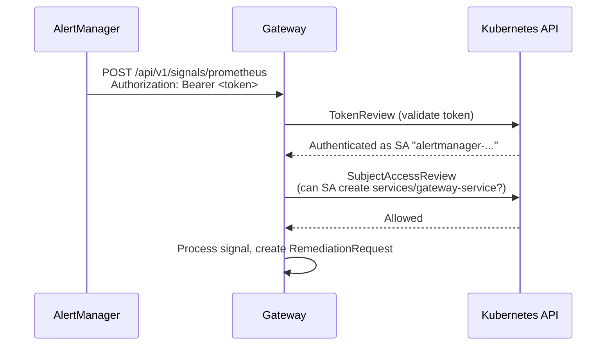

# Security & RBAC

Kubernaut follows a least-privilege model: each service runs under its own ServiceAccount with only the permissions it needs. This page is the consolidated reference for all RBAC resources.

!!! info "Helm vs Operator RBAC"
    The Helm chart and the Kubernaut Operator create the same logical set of ClusterRoles, but the **Operator** prefixes each name with the CR's namespace (e.g., `kubernaut-system-gateway-role`) to prevent collisions when multiple Kubernaut CRs exist. The Operator creates **13** baseline ClusterRoles, plus **2** additional ones (`alertmanager-view`, `gateway-signal-source`) when `spec.monitoring.enabled: true`. An optional `workflowexecution-awx` ClusterRole is created when Ansible integration is enabled.

    The Operator also supports `spec.kubernautAgent.additionalClusterRoleBindings` — a list of pre-existing ClusterRole names to bind to the Kubernaut Agent ServiceAccount (max 64). **Use with caution**: any writable cluster-scoped privileges referenced here are granted to the agent, creating a privilege escalation path. Restrict who may edit the Kubernaut CR via cluster RBAC. See the [Operator threat model](https://github.com/jordigilh/kubernaut-operator/blob/main/docs/security/threat-model.md) for details.

## Signal Ingestion

The Gateway authenticates every signal ingestion request using **Kubernetes TokenReview + SubjectAccessReview (SAR)**:


```mermaid
sequenceDiagram
    participant AM as AlertManager
    participant GW as Gateway
    participant K8s as Kubernetes API

    AM->>GW: POST /api/v1/signals/prometheus<br/>Authorization: Bearer <token>
    GW->>K8s: TokenReview (validate token)
    K8s-->>GW: Authenticated as SA "alertmanager-..."
    GW->>K8s: SubjectAccessReview<br/>(can SA create services/gateway-service?)
    K8s-->>GW: Allowed
    GW->>GW: Process signal, create RemediationRequest
```

### Gateway RBAC

The Gateway's own ClusterRole (`gateway-role`) includes:

| apiGroup | Resources | Verbs | Purpose |
|---|---|---|---|
| `kubernaut.ai` | `remediationrequests`, `remediationrequests/status` | create, get, list, watch, update, patch | Create and manage RRs from incoming signals |
| (core) | `namespaces` | get, list, watch | Scope label checks (`kubernaut.ai/managed`) |
| (core) | `nodes`, `pods`, `services`, `persistentvolumes` | get, list, watch | Owner chain resolution for fingerprinting |
| `apps` | `deployments`, `replicasets`, `statefulsets`, `daemonsets` | get, list, watch | Owner chain resolution |
| `batch` | `jobs`, `cronjobs` | get, list, watch | Owner chain resolution |
| `authentication.k8s.io` | `tokenreviews` | create | Validate bearer tokens from signal sources |
| `authorization.k8s.io` | `subjectaccessreviews` | create | Check signal source RBAC via SAR |
| `coordination.k8s.io` | `leases` | get, create, update, delete | Leader election |

### Signal Source RBAC

External signal sources (AlertManager, custom webhooks) must satisfy two requirements:

1. **A valid bearer token** -- The source must send its ServiceAccount token in the `Authorization` header. The Gateway validates it via TokenReview.
2. **SAR authorization** -- The ServiceAccount must have `create` permission on `services/gateway-service`. The chart provides the `gateway-signal-source` ClusterRole for this:

    ```yaml
    # gateway-signal-source ClusterRole
    rules:
      - apiGroups: [""]
        resources: ["services"]
        resourceNames: ["gateway-service"]
        verbs: ["create"]
    ```

The Helm value `gateway.auth.signalSources` creates a ClusterRoleBinding for each entry:

```yaml
gateway:
  auth:
    signalSources:
      - name: alertmanager
        serviceAccount: alertmanager-kube-prometheus-stack-alertmanager
        namespace: monitoring
```

If you deploy a Kubernetes Event Exporter separately (not included in the chart since v1.1), its ServiceAccount must also be registered as a signal source in the same `signalSources` list.

Without the bearer token, the Gateway returns `401 Unauthorized`. Without the ClusterRoleBinding, the Gateway returns `403 Forbidden`.

See [Installation](../getting-started/installation.md#signal-source-authentication) for the complete AlertManager configuration example.

## CRD Controllers

Each CRD controller runs under its own ServiceAccount with a dedicated ClusterRole scoped to the CRDs it manages. All controllers also get a namespace-scoped Role for reading ConfigMaps and Secrets in the release namespace (Rego policies, credentials).

Four services (Kubernaut Agent, WorkflowExecution, RemediationOrchestrator, EffectivenessMonitor) include read access to `security.istio.io` and `networking.istio.io` resources for service mesh awareness during investigation and remediation.

| Controller | ServiceAccount | CRDs Managed | Additional Access | Notes |
|---|---|---|---|---|
| RemediationOrchestrator | `remediationorchestrator-controller` | All 7 child CRDs (full CRUD) | Pods, nodes, events, namespaces, services, deployments, statefulsets, daemonsets, jobs, cronjobs (read) | Broadest permissions -- creates and watches all child CRDs |
| SignalProcessing | `signalprocessing-controller` | SignalProcessing, RemediationRequest | Pods, services, namespaces, nodes, events, deployments, replicasets, statefulsets, daemonsets, HPAs, PDBs, network policies (read); leases (full) | Owner chain resolution and enrichment |
| AIAnalysis | `aianalysis-controller` | AIAnalysis | Events (create) | Also bound to `kubernaut-agent-client` for Kubernaut Agent access and `data-storage-client` for DataStorage access |
| WorkflowExecution | `workflowexecution-controller` | WorkflowExecution | Tekton PipelineRuns (full), TaskRuns (read), Jobs (full), events (create); leases (full) | Creates Jobs and PipelineRuns in the execution namespace. When the ansible engine is enabled, also requires `get` on the AWX API token Secret -- see [Ansible Engine Setup](../user-guide/configuration.md#ansible-engine-awxaap). |
| EffectivenessMonitor | `effectivenessmonitor-controller` | EffectivenessAssessment, RemediationRequest (read) | Pods, nodes, services, PVCs, events, deployments, replicasets, statefulsets, daemonsets, HPAs, PDBs, jobs, cronjobs (read) | Post-remediation health checks |
| Notification | `notification-controller` | NotificationRequest | Events (create) | Minimal scope |
| AuthWebhook | `authwebhook` | All Kubernaut CRDs (read), status subresources (update, patch) | -- | Admission webhook validation, defaulting, and catalog registration. Intercepts CREATE and UPDATE operations on `RemediationWorkflow` CRDs. Uses retry-on-conflict for `ActionType` status updates. |

### Broad Read Access via `view` ClusterRole

The RemediationOrchestrator and EffectivenessMonitor are additionally bound to the Kubernetes built-in `view` ClusterRole via `remediationorchestrator-view` and `effectivenessmonitor-view` ClusterRoleBindings. This provides broad read access to CRD types not individually enumerated in their dedicated ClusterRoles -- for example, cert-manager `Certificate` resources and Istio networking resources -- which is required for pre- and post-remediation hash capture (DD-EM-002).

If the `view` ClusterRole lacks read permission for a particular resource type (e.g., a third-party CRD), the **Remediation Orchestrator** emits a `HashCaptureDegraded` Kubernetes event on the `RemediationRequest` when `CapturePreRemediationHash` returns a degraded reason. The EffectivenessAssessment then proceeds in **degraded mode** — the EA skips the hash comparison component and relies on the remaining health-check signals (alert state, metric thresholds, pod readiness) to determine effectiveness.

## Workflow Execution

Remediation workflows (Jobs, Tekton PipelineRuns, Ansible playbooks) execute in the `kubernaut-workflows` namespace. By default, workflow executions run with the execution namespace default ServiceAccount. Many deployments bind that default to `kubernaut-workflow-runner`, which carries the broadest ClusterRole in the system because workflows need to act on the cluster to remediate issues.

| apiGroup | Resources | Verbs | Purpose |
|---|---|---|---|
| `apps` | `deployments`, `statefulsets`, `daemonsets` | get, list, patch, update | Scale, restart, or patch workloads |
| `apps` | `replicasets` | get, list, watch | Read replica state |
| (core) | `pods`, `pods/eviction` | get, list, create, delete | Evict pods, read pod state |
| (core) | `configmaps`, `secrets` | get, list, create, update, patch, delete | Read/write configuration |
| (core) | `nodes` | get, list | Read node state for drain/cordon |
| (core) | `namespaces`, `services`, `persistentvolumeclaims` | get, list | Read cluster state |
| `autoscaling` | `horizontalpodautoscalers` | get, list, patch | Scale HPAs |
| `policy` | `poddisruptionbudgets` | get, list, patch | Adjust PDBs during remediation |
| `networking.k8s.io` | `networkpolicies` | get, list, create, update, patch, delete | Manage network policies |
| `argoproj.io` | `applications` | get, list | Read ArgoCD application state |
| `cert-manager.io` | `certificates`, `clusterissuers` | get, list | Read certificate state |
| `policy.linkerd.io` | `authorizationpolicies`, `servers`, `meshtlsauthentications` | get, list, delete | Manage Linkerd policies (legacy) |
| `security.istio.io` | `authorizationpolicies`, `peerauthentications`, `requestauthentications` | get, list, delete | Manage Istio security policies |
| `networking.istio.io` | `virtualservices`, `destinationrules`, `gateways`, `serviceentries` | get, list, create, update, patch, delete | Manage Istio networking resources |
| `kubernaut.ai` | `workflowexecutions` | get | Ansible playbooks read WFE ownerReferences for RR correlation |
| `storage.k8s.io` | `storageclasses` | get, list | Discover default StorageClass for PVC migration |
| (core) | `endpoints` | get, list | Check service endpoint health |
| `batch` | `jobs` | get, list, create, delete | pg_dump/pg_restore Job lifecycle (disk-pressure-emptydir scenario) |

The last four rules were added for production Ansible playbooks (DD-WE-007).

Additionally, a namespace-scoped `workflowexecution-dep-reader` Role grants `get`, `list`, `watch` on Secrets and ConfigMaps in the execution namespace for dependency validation before workflow launch.

### Per-Workflow ServiceAccount (v1.2)

Starting with v1.2, workflows can declare a dedicated ServiceAccount via the `spec.execution.serviceAccountName` field on the `RemediationWorkflow` CRD. This value is propagated into `WorkflowExecution.spec.serviceAccountName`.

- **Job/Tekton execution**: the service account name is set directly on the created Job or PipelineRun.
- **Ansible execution**: the WE controller requests a short-lived token via the Kubernetes [TokenRequest API](https://kubernetes.io/docs/reference/kubernetes-api/authentication-resources/token-request-v1/) and injects it into AWX credentials.

This enables least-privilege RBAC per workflow — each SA needs only the permissions required by its specific remediation.

The WE controller's ClusterRole includes the following permissions for TokenRequest:

| apiGroup | Resources | Verbs | Purpose |
|---|---|---|---|
| (core) | `serviceaccounts` | get | Look up the per-workflow SA |
| (core) | `serviceaccounts/token` | create | Create short-lived tokens via TokenRequest |

**TTL validation (Ansible path):** The controller requests tokens with a **3600s (1 hour)** TTL by default. When an execution timeout is configured, the controller validates that the requested token TTL covers the execution window. If the TTL is insufficient, it sets `TokenTTLInsufficient` on the WorkflowExecution and emits a warning event (`TokenTTLShortened`).

!!! warning "Cluster-level TTL constraints"
    The Kubernetes API server flag `--service-account-max-token-expiration` (or OpenShift `ServiceAccountTokenMaxExpiration`) can silently cap token TTLs below the requested duration. If the cap is lower than the workflow execution timeout, Ansible jobs may receive **401 Unauthorized** errors mid-execution. Ensure the cluster-level maximum is at least **3600s** (or greater than your longest workflow execution timeout). Check for `TokenTTLShortened` warning events on WorkflowExecution CRDs if Ansible jobs fail unexpectedly with authentication errors.

**Fallback behavior:** If `serviceAccountName` is not set:

- Job/Tekton run with the execution namespace default ServiceAccount.
- Ansible falls back to controller in-cluster credentials for AWX credential injection.

For the Ansible executor (#501), TokenRequest tokens replace the controller's own in-cluster SA token for AWX credential injection, ensuring each playbook runs with the minimum permissions declared by the workflow author.

## OCP Monitoring RBAC

When `effectivenessmonitor.external.ocpMonitoringRbac` is `true`, the chart creates additional RBAC resources for EM to access OCP's monitoring stack through `kube-rbac-proxy`:

| Resource | Kind | Purpose |
|---|---|---|
| `effectivenessmonitor-monitoring-view` | ClusterRoleBinding | Binds EM ServiceAccount to the built-in `cluster-monitoring-view` ClusterRole for Prometheus API access |
| `kubernaut-alertmanager-view` | ClusterRole | Grants `get` on `monitoring.coreos.com/alertmanagers/api` for AlertManager API access through `kube-rbac-proxy` |
| `effectivenessmonitor-alertmanager-view` | ClusterRoleBinding | Binds EM ServiceAccount to `kubernaut-alertmanager-view` |

The AlertManager ClusterRole and ClusterRoleBinding are only created when **both** `ocpMonitoringRbac` and `alertManagerEnabled` are `true`.

OCP's `kube-rbac-proxy` requires **resource-level** RBAC (`monitoring.coreos.com/alertmanagers/api`) rather than `nonResourceURLs` for AlertManager API access. Standard `nonResourceURLs` rules are silently ignored by `kube-rbac-proxy`, causing EM AlertManager queries to fail with `403 Forbidden`.

### Ansible Credential Injection

When the Ansible/AWX execution engine is enabled, the WorkflowExecution controller injects the cluster's Kubernetes API credentials into AWX Job Templates so that `kubernetes.core` Ansible modules can authenticate against the target cluster. The v2 custom credential type (`kubernaut-k8s-bearer-token-v2`) uses **kubeconfig-file injection** rather than environment variables, because in-cluster ServiceAccount config inside AAP execution environments takes precedence over `K8S_AUTH_*` env vars. If resolution picks a built-in or kind-matched type, the injector may differ.

The credential type resolution follows a 6-step process:

1. Look for the built-in AWX type ("OpenShift or Kubernetes API Bearer Token")
2. Look up a credential type by kind (`FindCredentialTypeByKind("kubernetes", true)`)
3. Fall back to `kubernaut-k8s-bearer-token` (custom type from earlier versions)
4. Fall back to `kubernaut-k8s-bearer-token-v2` (kubeconfig-based type)
5. If none exist, create the v2 type with a Jinja2 kubeconfig template that AWX renders at job launch
6. Create an ephemeral credential populated with the controller's in-cluster SA token, API server host, and CA certificate

The v2 kubeconfig template conditionally includes `certificate-authority-data` when the cluster CA is available, or sets `insecure-skip-tls-verify: true` otherwise. AWX injects the rendered kubeconfig as a temp file and sets `K8S_AUTH_KUBECONFIG` to point to it, ensuring `kubernetes.core` modules use the injected credentials instead of in-cluster config.

Ephemeral credentials are cleaned up after the AWX job completes. See [BR-WE-017](https://github.com/jordigilh/kubernaut/blob/main/docs/requirements/BR-WE-017-shared-sa-execution-model.md) for the full shared SA model. In v1.2, workflows can declare a dedicated ServiceAccount via `spec.execution.serviceAccountName` — see [Per-Workflow ServiceAccount](#per-workflow-serviceaccount-v12) above.

## Internal Service Communication

### DataStorage Authentication

DataStorage uses the same TokenReview + SAR pattern as the Gateway. The `data-storage-auth-middleware` ClusterRole grants DataStorage permission to validate client tokens:

| apiGroup | Resources | Verbs |
|---|---|---|
| `authentication.k8s.io` | `tokenreviews` | create |
| `authorization.k8s.io` | `subjectaccessreviews` | create |

Clients must have `create` permission on `services/data-storage-service` (via the `data-storage-client` ClusterRole). The chart binds every Kubernaut service to this role:

Gateway, SignalProcessing, RemediationOrchestrator, AIAnalysis, WorkflowExecution, EffectivenessMonitor, Notification, AuthWebhook, Kubernaut Agent, and DataStorage itself.

### Kubernaut Agent Access

The AIAnalysis controller communicates with Kubernaut Agent via the `kubernaut-agent-client` ClusterRole, which grants `create` and `get` on `services/kubernaut-agent`.

Kubernaut Agent itself has a broad **read-only** ClusterRole (`kubernaut-agent-investigator`) for its kubectl-based investigation:

| apiGroup | Resources | Verbs | Purpose |
|---|---|---|---|
| (core) | pods, pods/log, events, services, endpoints, configmaps, secrets, nodes, namespaces, replicationcontrollers, PVCs, resourcequotas | get, list, watch | Cluster state investigation |
| `apps` | deployments, replicasets, statefulsets, daemonsets | get, list, watch | Workload investigation |
| `batch` | jobs, cronjobs | get, list, watch | Job investigation |
| `events.k8s.io` | events | get, list, watch | Event investigation |
| `autoscaling` | horizontalpodautoscalers | get, list, watch | HPA investigation |
| `policy` | poddisruptionbudgets | get, list, watch | PDB investigation |
| `networking.k8s.io` | networkpolicies | get, list, watch | Network policy investigation |
| `cert-manager.io` | certificates, clusterissuers, certificaterequests | get, list, watch | Certificate investigation |
| `argoproj.io` | applications | get, list, watch | ArgoCD investigation |
| `policy.linkerd.io` | servers, authorizationpolicies, meshtlsauthentications | get, list, watch | Linkerd mesh investigation (legacy) |
| `security.istio.io` | authorizationpolicies, peerauthentications, requestauthentications | get, list, watch | Istio security policy investigation |
| `networking.istio.io` | virtualservices, destinationrules, gateways, serviceentries | get, list, watch | Istio networking investigation |
| `monitoring.coreos.com` | prometheusrules, servicemonitors, podmonitors, probes | get, list, watch | Monitoring investigation |

This read-only access allows the LLM to investigate root causes using live cluster data without making changes.

### Lease RBAC for Interactive Sessions (v1.5+)

Interactive MCP sessions use Kubernetes Leases for distributed locking. The Kubernaut Agent ServiceAccount requires Lease permissions in addition to its existing investigator role:

| apiGroup | Resources | Verbs | Purpose |
|---|---|---|---|
| `coordination.k8s.io` | `leases` | get, create, update, delete, **list** | Session locking + orphan reclamation |

The `list` verb (new in v1.5) is required for `ReconcileOrphanedLeases` — on startup, KA scans for Leases whose holder identity no longer exists and reclaims them.

!!! note "Automatic provisioning"
    Both the Helm chart and the Kubernaut Operator provision this permission automatically. Only custom RBAC configurations need manual updating.

### API Frontend RBAC (v1.5+)

The API Frontend ServiceAccount requires:

| apiGroup | Resources | Verbs | Purpose |
|---|---|---|---|
| `kubernaut.ai` | `investigationsessions`, `investigationsessions/status` | get, list, watch, create, update, patch, delete | Session CRD management (PR #1224) |
| `kubernaut.ai` | `remediationrequests` | get, list, create | RR access for interactive sessions |
| `authorization.k8s.io` | `subjectaccessreviews` | create | SAR-based tool authorization |
| _(core)_ | `users`, `groups` | impersonate | Triage tool delegation (default mode; `serviceaccounts` removed in PR #1227) |

## Infrastructure and Hooks

### PostgreSQL and Valkey

Both run with dedicated ServiceAccounts that have `automountServiceAccountToken: false`, preventing unnecessary API token mounting.

### Helm Hooks

The shared hook ServiceAccount (`kubernaut-hook-sa`) and its ClusterRole are used by TLS certificate generation jobs, the database migration job, and the CRD upgrade job:

| apiGroup | Resources | Verbs | Purpose |
|---|---|---|---|
| (core) | `secrets`, `configmaps` | get, create, update, patch, delete | TLS cert/CA storage, migration state |
| `admissionregistration.k8s.io` | `mutatingwebhookconfigurations`, `validatingwebhookconfigurations` | get, patch | Patch `caBundle` (hook mode only, see [#334](https://github.com/jordigilh/kubernaut/issues/334)) |
| `apiextensions.k8s.io` | `customresourcedefinitions` | get, list, create, update, patch | CRD pre-upgrade server-side apply ([#521](https://github.com/jordigilh/kubernaut/issues/521)) |
| (core) | `pods` | get, list | Post-install verification |
| `apps` | `deployments` | get | Post-install verification |
| `batch` | `jobs` | get, list | Migration job monitoring |

Hook jobs only run during `helm install`, `helm upgrade`, and `helm delete`. They do not have long-lived pods.

## Prompt Injection Defense — Shadow Agent (v1.4) {: #shadow-agent }

Kubernaut v1.4 introduces a **shadow agent** that evaluates every LLM tool output for prompt injection attacks. The shadow agent runs as a fail-closed defense layer inside Kubernaut Agent.

### Architecture

The shadow agent operates at two levels:

1. **Per-step evaluation** — After each tool call, the shadow agent scans the tool output using random boundary markers, head+tail truncation, and data exfiltration detection patterns. This catches injection attempts embedded in Kubernetes resource data (ConfigMaps, Secrets, annotations).

2. **Full-context grounding review** — At the RCA-to-workflow boundary, a second evaluation layer reviews the entire investigation conversation through the shadow LLM. This detects distributed injection ("boiling frog" attacks) where individually benign tool outputs combine into a malicious instruction. Runs in parallel with workflow discovery for zero added latency.

### Enforcement modes

The shadow agent supports two modes controlled by the Kubernaut Agent configuration:

| Mode | Behavior |
|---|---|
| **Monitor** | Log alignment verdicts and emit audit events, but do not block investigations |
| **Enforce** | Cancel the investigation via circuit breaker when suspicious content is detected |

In enforce mode, a positive detection triggers `context.WithCancelCause(ErrCircuitBreaker)`, immediately terminating the primary investigation. The `kubernaut_alignment_circuit_breaker_total` Prometheus counter tracks activations.

### Alignment verdicts

Shadow agent results are propagated through the system:

- **`alignment_verdict`** field on the Kubernaut Agent `IncidentResponse` (OpenAPI) and `AIAnalysisStatus` (CRD) carrying the verdict (`result`, `circuit_breaker_activated`, `summary`, `findings`)
- **NotificationRequest `ReviewContext`** includes `alignmentVerdict` and `circuitBreakerActivated` fields for routing rule support
- **Manual review notifications** render shadow agent findings prominently when `alignment_check_failed` SubReason escalates to `NotificationPriorityCritical`

### Observability

| Metric | Type | Description |
|---|---|---|
| `kubernaut_alignment_grounding_total` | Counter | Grounding review invocations |
| `kubernaut_alignment_grounding_duration_seconds` | Histogram | Grounding review latency |
| `kubernaut_alignment_circuit_breaker_total` | Counter | Circuit breaker activations |

Per-step audit events include shadow LLM request/response payloads and token counts for cost tracking (`aiagent.alignment.step`).

### False positive handling

v1.4 includes targeted fixes to reduce false positives:

- Well-known Kubernetes/OpenShift annotation namespaces, container commands, probe commands, event messages, RBAC verbs, and registry URLs are whitelisted (CLEAN classification)
- The shadow agent evaluates **raw** tool output (post-sanitizer, pre-summarizer) to avoid false positives from LLM-generated analysis content

## NetworkPolicies (v1.4)

Kubernaut v1.4 deploys **12 NetworkPolicy templates** covering all services with a **default-deny** ingress posture. Each policy restricts ingress to only the expected callers.

### Default behavior

The default depends on your deployment method:

| Deployment | Default | How to change |
|---|---|---|
| **Helm** | Enabled for all services | Set `networkPolicies.<service>.enabled: false` per service |
| **Operator** | **Disabled** (`spec.networkPolicies.enabled: false`) | Set `spec.networkPolicies.enabled: true` in the Kubernaut CR |

!!! warning "Operator users: NetworkPolicies are off by default"
    If you deploy via the Kubernaut Operator and expect network segmentation, you must explicitly enable it. The Operator uses a single toggle (`spec.networkPolicies.enabled`) rather than per-service toggles.

Verify your cluster's CNI plugin supports NetworkPolicy enforcement (Calico, Cilium, etc.) — clusters with CNI plugins that do not enforce NetworkPolicies silently ignore them.

### Configuration

=== "Helm"

    Per-service toggle via Helm values:

    ```yaml
    networkPolicies:
      gateway:
        enabled: true
      dataStorage:
        enabled: true
      kubernautAgent:
        enabled: true
      # ... per-service toggle for all 12 services
    ```

=== "Operator"

    Global toggle in the Kubernaut CR:

    ```yaml
    apiVersion: kubernaut.ai/v1alpha1
    kind: Kubernaut
    spec:
      networkPolicies:
        enabled: true
        apiServerCIDR: "10.0.0.0/16"
        monitoringNamespace: "openshift-monitoring"
        gatewayIngressNamespaces:
          - "openshift-monitoring"
    ```

Custom CIDR ranges can be configured for services that need external access (e.g., Gateway ingress from AlertManager).

## Tool Authorization {: #tool-authorization-v15 }

### SAR-based tool authorization (v1.5)

v1.5 replaces the API Frontend's file-based `rbac_roles.yaml` with **Kubernetes-native SubjectAccessReview (SAR)** authorization (PR #1222). Every MCP `tools/call` invocation triggers a SAR check before execution. `tools/list` is unfiltered (ADR-020) — authorization is enforced only at call time.

### How it works

1. Client authenticates via OIDC — the API Frontend extracts the user identity from the JWT
2. On each tool invocation, AF issues a SAR: `can <user> use tools/<tool-name> in apiGroup kubernaut.ai?`
3. The Kubernetes API server evaluates the user's ClusterRoleBindings
4. If denied (or if the SAR API is unreachable), the tool call is rejected — **fail-closed**

All 3 AF RBAC code paths (MCP bridge `checkRBAC()`, A2A agent `newRBACGuard()`, and main wiring) delegate to the `SARChecker`.

### Per-persona ClusterRoles

The Helm chart ships 6 per-persona ClusterRoles via a data-driven template (`apifrontend.config.rbac.personas`):

| ClusterRole | Persona | Tools |
|---|---|---|
| `kubernaut-tool-sre` | Full SRE access | All 20 tools |
| `kubernaut-tool-ai-orchestrator` | Automated agent orchestration | Orchestration + triage + cluster context |
| `kubernaut-tool-cicd` | CI/CD pipeline integration | list, get, watch |
| `kubernaut-tool-observability` | Read-only observability | Read-only tools |
| `kubernaut-tool-l3-audit` | Compliance and auditing | Audit, history, effectiveness |
| `kubernaut-tool-remediation-approver` | Human approval workflows | Approve + read |

### Binding example

```yaml
apiVersion: rbac.authorization.k8s.io/v1
kind: ClusterRoleBinding
metadata:
  name: sre-team-kubernaut-tools
subjects:
  - kind: Group
    name: sre-team
    apiGroup: rbac.authorization.k8s.io
roleRef:
  kind: ClusterRole
  name: kubernaut-tool-sre
  apiGroup: rbac.authorization.k8s.io
```

### SAR caching

Authorization results are cached with a SHA256-keyed TTL cache (default 30s) to avoid per-call SAR overhead:

```yaml
apifrontend:
  config:
    rbac:
      sarCacheTTL: 30s
```

### Migration from rbac_roles.yaml

!!! warning "Breaking change"
    The `rbac_roles.yaml` ConfigMap and `RBACConfig.GroupMapping` are removed in v1.5. Customers who customized file-based RBAC must create equivalent ClusterRoleBindings.

1. Identify which tools each role had access to
2. Map those to the closest per-persona ClusterRole (or create a custom one with `verb: use` on `resource: tools` in `apiGroup: kubernaut.ai`)
3. Create ClusterRoleBindings for your OIDC groups
4. The `rbac_roles.yaml` ConfigMap is no longer read

### OIDC-direct mode — eliminating impersonation (v1.5)

The AF's 4 read-only triage tools (`af_list_events`, `af_get_pods`, `af_get_workloads`, `af_resolve_owner`) make K8s API calls as the authenticated user. By default, this uses **impersonation** (`Impersonate-User` / `Impersonate-Group` headers), which requires the AF ClusterRole to have `impersonate` on `users` and `groups`.

v1.5 adds an opt-in **OIDC-direct mode** (PR #1227) that forwards the user's raw OIDC JWT as a bearer token instead of impersonating. This eliminates impersonation privileges entirely, addressing CIS benchmark and SOC 2 audit concerns.

```yaml
apifrontend:
  config:
    rbac:
      useOIDCDirect: true   # default: false (impersonation)
```

**How it works:** The `NewOIDCDirectDynamicFactory` creates a `rest.Config` with `BearerToken: identity.RawToken` instead of `Impersonate` headers. The base config is deep-copied via `rest.CopyConfig`; `BearerTokenFile` is cleared and `Impersonate` config zeroed. Fail-closed: missing identity, empty token, or expired token all return errors.

**Compatible deployments** (K8s API server trusts the same OIDC provider as AF):

- Self-managed K8s / kubeadm
- OpenShift (integrated OAuth)
- EKS with OIDC identity provider association
- AKS with OIDC issuer

**Not compatible** (impersonation remains the default):

- GKE (only trusts Google IAM)
- EKS without OIDC association
- Any deployment where K8s and AF use different identity providers

!!! tip "Quick win: `serviceaccounts` removed"
    PR #1227 also removes `serviceaccounts` from the impersonation resources in the AF ClusterRole — no AF code path impersonates a service account, so this eliminates the highest-risk vector immediately, regardless of whether OIDC-direct is enabled.

## Next Steps

- [Installation](../getting-started/installation.md#signal-source-authentication) -- Configure AlertManager and other signal sources
- [Configuration Reference](../user-guide/configuration.md) -- Helm values for all services
- [Troubleshooting](../operations/troubleshooting.md) -- Diagnose RBAC-related issues
