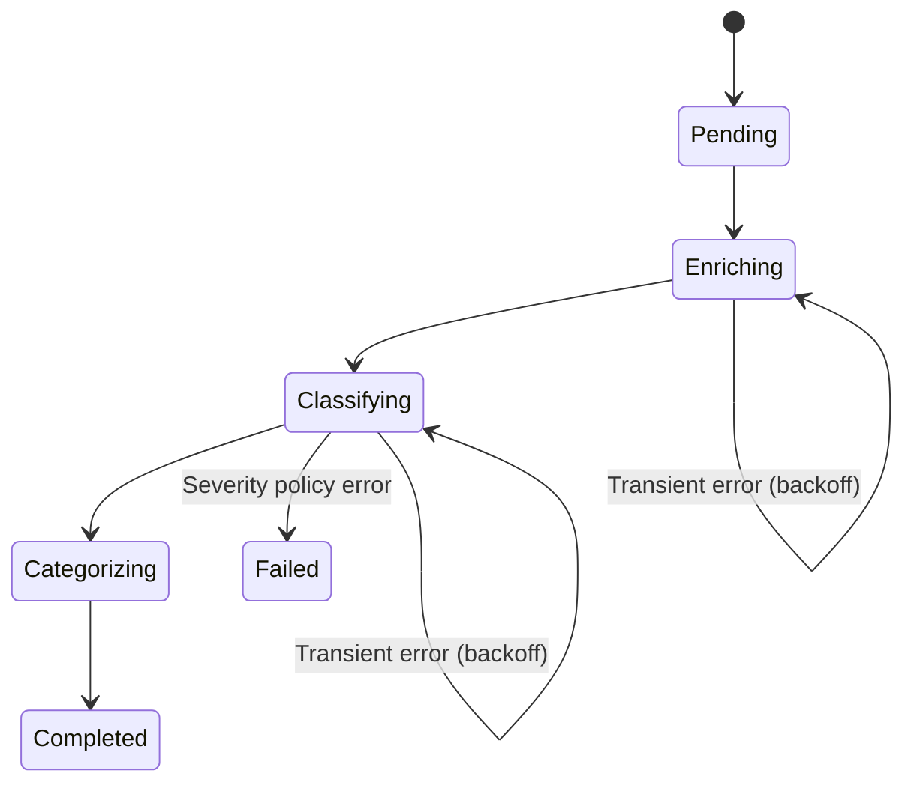
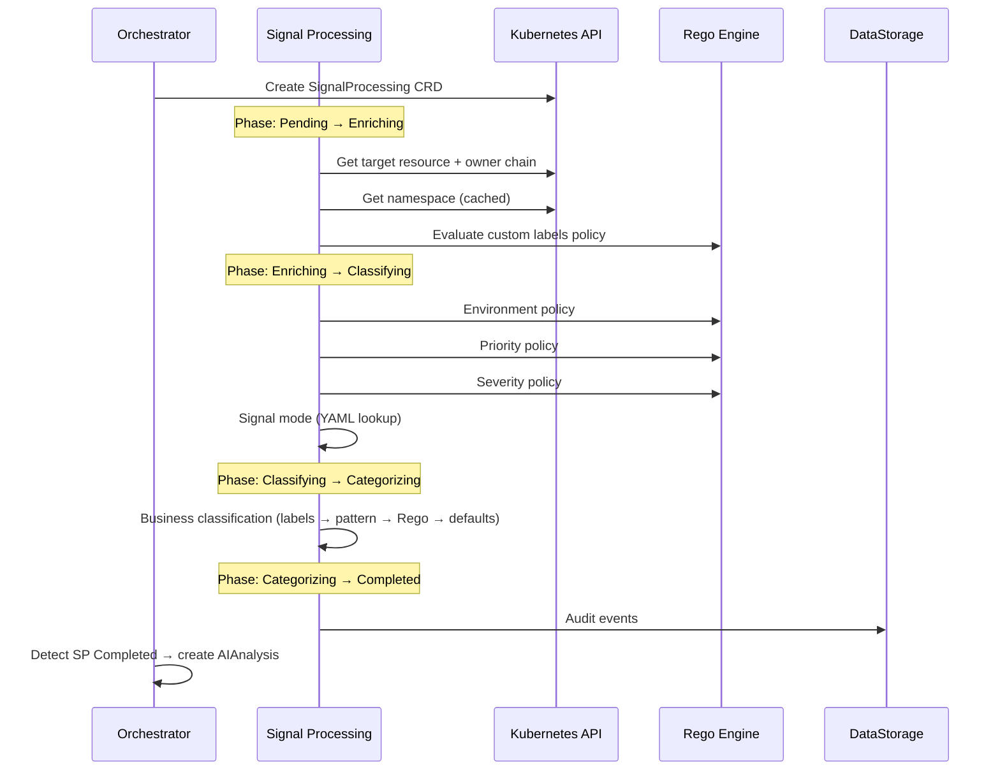

# Signal Processing

The Signal Processing controller transforms raw signals into enriched, classified data ready for AI analysis. It operates as a Kubernetes controller that watches `SignalProcessing` CRDs created by the Remediation Orchestrator.

## CRD Specification

### Spec

| Field | Type | Description |
|---|---|---|
| `RemediationRequestRef` | `ObjectReference` | Back-reference to the parent RemediationRequest |
| `Signal.Fingerprint` | `string` | SHA256 fingerprint from Gateway (max 64 chars, hex) |
| `Signal.Name` | `string` | Signal name (alert name or event reason) |
| `Signal.Severity` | `string` | Raw severity from the source (not yet normalized) |
| `Signal.Type` | `string` | Signal type (e.g., `alert`) |
| `Signal.Source` | `string` | Source system identifier |
| `Signal.TargetType` | `string` | Target platform: `kubernetes`, `aws`, `azure`, `gcp`, `datadog` |
| `Signal.TargetResource` | `ResourceIdentifier` | Kind, Name, Namespace of the target |
| `Signal.Labels` | `map[string]string` | Merged labels from the signal source |
| `Signal.Annotations` | `map[string]string` | Merged annotations |
| `Signal.FiringTime` | `*metav1.Time` | When the alert started firing |
| `Signal.ReceivedTime` | `metav1.Time` | When the Gateway received it |
| `Signal.ProviderData` | `string` | Raw JSON from the source |
| `EnrichmentConfig` | `EnrichmentConfig` | Processing configuration (timeouts, feature flags) |

### Status

| Field | Type | Description |
|---|---|---|
| `Phase` | `SignalProcessingPhase` | Current phase in the state machine |
| `ObservedGeneration` | `int64` | Set on completion/failure for idempotency |
| `StartTime` | `*metav1.Time` | When processing started |
| `CompletionTime` | `*metav1.Time` | When processing completed |
| `KubernetesContext` | `*KubernetesContext` | Enrichment results (namespace, workload, owner chain, custom labels) |
| `EnvironmentClassification` | `*EnvironmentClassification` | Environment + source + timestamp |
| `PriorityAssignment` | `*PriorityAssignment` | Priority + source + policy name + timestamp |
| `BusinessClassification` | `*BusinessClassification` | Business unit, owner, criticality, SLA |
| `Severity` | `string` | Normalized severity: `critical`, `high`, `medium`, `low`, `unknown` |
| `PolicyHash` | `string` | SHA256 of the Rego policy used for classification |
| `SignalMode` | `string` | `reactive` or `proactive` |
| `SignalName` | `string` | Normalized signal name (base name for proactive signals) |
| `SourceSignalName` | `string` | Original signal name (differs for proactive signals) |
| `ConsecutiveFailures` | `int32` | Transient failure count for backoff |
| `LastFailureTime` | `*metav1.Time` | Last transient failure |
| `Conditions` | `[]metav1.Condition` | Standard conditions (see below) |
| `Error` | `string` | Error description when Failed |

### Condition Types

| Condition | Phases | Meanings |
|---|---|---|
| `EnrichmentComplete` | Enriching → Classifying | K8s context gathered, custom labels evaluated |
| `ClassificationComplete` | Classifying → Categorizing | Environment, priority, severity, signal mode determined |
| `CategorizationComplete` | Categorizing → Completed | Business classification assigned |
| `ProcessingComplete` | Completed | All phases finished successfully |
| `Ready` | Completed | CRD is ready for consumption by the Orchestrator |

## Phase State Machine



| Phase | Description | Requeue |
|---|---|---|
| **Pending** | CRD just created, set `StartTime` | 100ms |
| **Enriching** | Gather Kubernetes context and custom labels | 100ms |
| **Classifying** | Evaluate Rego policies for environment, priority, severity, signal mode | 100ms |
| **Categorizing** | Business classification from namespace labels and Rego | None |
| **Completed** | All results stored in status, `Ready=True` | None |
| **Failed** | Terminal -- severity policy error or unrecoverable failure | None |

Each phase transition emits a Kubernetes event (`EventReasonPhaseTransition`) and records an audit trace.

## Phase 1: Enriching

The enrichment phase gathers Kubernetes context about the target resource.

### Owner Chain Resolution

The `OwnerChainBuilder` follows `controller: true` owner references up to a depth of **5** to find the top-level controlling resource:

```
Pod → ReplicaSet → Deployment
Pod → StatefulSet
Pod → DaemonSet
Pod → Job → CronJob
```

On error, a partial chain is returned (graceful degradation).

### Context by Resource Kind

| Target Kind | Context Gathered |
|---|---|
| Pod | Namespace + Pod details + Node info + Owner chain |
| Deployment | Namespace + Deployment details |
| StatefulSet | Namespace + StatefulSet details |
| DaemonSet | Namespace + DaemonSet details |
| ReplicaSet | Namespace + ReplicaSet details |
| Service | Namespace + Service details |
| Node | Node info only (no namespace) |
| Unknown | Namespace only |

### Namespace Context

Extracted from the target namespace (cached with a configurable TTL, default 5m):

- Namespace name
- Namespace labels (environment, team, tier, business-unit, etc.)
- Namespace annotations

### Custom Labels (Rego)

After K8s enrichment, the Rego engine evaluates custom label policies:

- **Query**: `data.signalprocessing.customlabels.labels`
- **Input**: Kubernetes context + signal metadata
- **Output**: `map[string][]string` (subdomain → values)
- **Limits**: Max 10 keys, 5 values per key, key length 63, value length 100
- **Reserved prefixes**: `kubernaut.ai/` and `system/` are stripped (BR-SP-104)
- **Timeout**: 5s

If Rego evaluation fails or yields no results, a fallback reads well-known namespace labels:

| Namespace Label | Custom Label Key |
|---|---|
| `kubernaut.ai/team` | `team` |
| `kubernaut.ai/tier` | `tier` |
| `kubernaut.ai/cost-center` | `cost-center` |
| `kubernaut.ai/region` | `region` |

### Degraded Mode

When the target resource is not found (`404 Not Found`), the enricher activates **degraded mode**:

- Sets `KubernetesContext.DegradedMode = true`
- Returns partial context (namespace-level only for namespaced resources)
- Falls back to signal labels and annotations for workload details
- Emits `DegradedMode` condition reason
- Processing continues -- a signal about a deleted resource still gets classified

### Operational Details Not Captured

Pod conditions, container statuses, events, and resource requests/limits are **not** captured by Signal Processing. HolmesGPT fetches these on demand via `kubectl` during the AI investigation phase.

## Phase 2: Classifying

The classification phase evaluates four classifiers in sequence. A failure in severity classification is **fatal** -- the CRD transitions to `Failed` and is not requeued.

### 1. Environment Classifier (Rego)

- **Query**: `data.signalprocessing.environment.result`
- **Input**: `{namespace: {name, labels}, signal: {labels}}`
- **Output**: `{environment, source}`
- **Values**: `production`, `staging`, `development`, `test`
- **Source tracking**: `namespace-labels`, `rego-inference`, or `default`

### 2. Priority Engine (Rego)

- **Query**: `data.signalprocessing.priority.result`
- **Input**: `{signal: {severity, source}, environment, namespace_labels, workload_labels}`
- **Output**: `{priority, policy_name}`
- **Values**: `P0`, `P1`, `P2`, `P3`
- **Timeout**: 100ms

### 3. Severity Classifier (Rego)

- **Query**: `data.signalprocessing.severity.determine_severity`
- **Input**: `{signal: {severity, type, source}}`
- **Output**: Normalized severity string
- **Values**: `critical`, `high`, `medium`, `low`, `unknown`
- **Fatal on failure**: A severity policy error transitions the CRD to `Failed` with `RegoEvaluationError`

### 4. Signal Mode Classifier (YAML)

Signal mode is determined by a YAML configuration (`proactive-signal-mappings.yaml`, per BR-SP-106), not a Rego policy:

- **Input**: Signal name
- **Logic**: Lookup in proactive signal mappings. If found → `proactive` + base name; otherwise → `reactive` + original name
- **Output**: `{SignalMode, SignalName, SourceSignalName}`

| Mode | Meaning | Examples |
|---|---|---|
| **Reactive** | Active incident (default) | `KubePodCrashLooping`, `KubePodOOMKilled` |
| **Proactive** | Predictive alert | `PredictDiskFull`, `MemoryApproaching90Percent` |

Signal mode determines which **prompt variant** HolmesGPT uses during the AI investigation, affecting how the investigation is framed (reactive diagnosis vs. proactive prevention).

### Classification Output

On success, the status is updated with:

- `EnvironmentClassification` (environment + source + timestamp)
- `PriorityAssignment` (priority + source + policy name + timestamp)
- `Severity` (normalized)
- `PolicyHash` (SHA256 of the Rego policy for audit traceability)
- `SignalMode` and `SignalName` / `SourceSignalName`

## Phase 3: Categorizing

The categorization phase assigns business classification using a tiered resolution strategy:

### Resolution Priority

1. **Namespace labels** (highest confidence: 1.0):
    - `kubernaut.ai/business-unit` → BusinessUnit
    - `kubernaut.ai/team` → BusinessUnit fallback
    - `kubernaut.ai/service-owner` → ServiceOwner

2. **Pattern matching** (confidence: 0.8): Splits namespace name by `-`, uses the first segment as business unit

3. **Rego policy** (confidence: 0.6):
    - **Query**: `data.signalprocessing.business.result`
    - **Input**: `{namespace, workload, environment}`
    - **Timeout**: 200ms

4. **Environment-based defaults** (confidence: 0.4):

    | Environment | Criticality | SLA |
    |---|---|---|
    | `production`, `prod` | high | gold |
    | `staging`, `stage` | medium | silver |
    | `development`, `dev` | low | bronze |

5. **System defaults**: BusinessUnit=`unknown`, ServiceOwner=`unknown`, Criticality=`medium`, SLA=`bronze`

On completion, `Phase=Completed`, `CompletionTime` is set, `ObservedGeneration` is updated, and `Ready=True`.

## Error Handling

### Transient Errors

Transient errors trigger exponential backoff with the DD-SHARED-001 pattern:

- **Detection**: `IsTimeout`, `IsServerTimeout`, `IsTooManyRequests`, `IsServiceUnavailable`, `context.DeadlineExceeded`, `context.Canceled`
- **Backoff**: Base 30s, multiplier 2x, max 5m, ±10% jitter
- **Formula**: `BasePeriod × (Multiplier ^ (failures - 1))` ± jitter
- **Tracking**: `ConsecutiveFailures` incremented, `LastFailureTime` updated
- **Recovery**: Reset to 0 on success

### Permanent Errors

- **Severity policy failure**: Transitions directly to `Failed` with `RegoEvaluationError`. No requeue.
- **Other policy failures**: Enrichment and priority failures are retried (treated as transient).

## Hot-Reload

All Rego policies support hot-reload via `FileWatcher` (DD-INFRA-001):

- **Mechanism**: `fsnotify` watches the policy directory
- **Debounce**: 200ms to coalesce rapid ConfigMap mount updates
- **Reload**: Recompile Rego, swap prepared query under a mutex
- **Hash**: SHA256 of new policy stored for audit traceability
- **Affected classifiers**: Environment, Priority, Severity, Custom Labels

## Deduplication

Deduplication is handled entirely at the **Gateway level** -- Signal Processing does not perform deduplication. See [Gateway: Phase-Based Deduplication](gateway.md#phase-based-deduplication).

## Data Flow



## Handoff to Remediation Orchestrator

When Signal Processing reaches `Completed` with `Ready=True`, the Remediation Orchestrator:

1. Reads the enriched classification from the SP status
2. Creates an `AIAnalysis` CRD with the enriched signal data
3. Transitions the RemediationRequest from `Processing` to `Analyzing`

## Next Steps

- [Gateway](gateway.md) -- How signals enter the system
- [AI Analysis](ai-analysis.md) -- How the enriched signal is analyzed by HolmesGPT
- [Remediation Routing](remediation-routing.md) -- The Orchestrator's state machine
- [Rego Policies](../user-guide/policies.md) -- Writing and configuring classification policies
