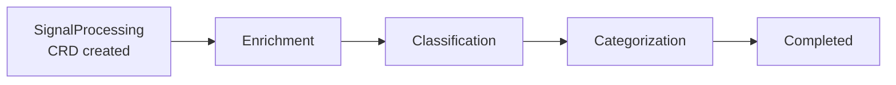
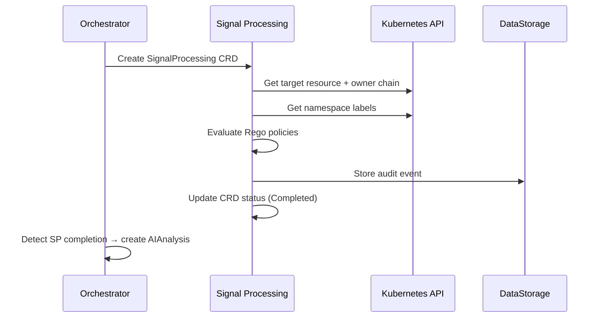

# Signal Processing

The Signal Processing pipeline transforms raw alerts and events into enriched, classified signals ready for AI analysis.

## Pipeline Stages



### Phases

| Phase | Description |
|---|---|
| `Pending` | CRD created by Orchestrator, awaiting pickup |
| `Enriching` | Gathering Kubernetes context for the target resource |
| `Classifying` | Evaluating Rego policies for severity, priority, environment |
| `Categorizing` | Determining signal mode (reactive vs proactive) |
| `Completed` | Enrichment complete, results stored in status |
| `Failed` | An error occurred during processing |

## Enrichment

The enrichment stage gathers Kubernetes context about the target resource:

### Owner Chain Resolution

Traces the ownership hierarchy to find the controlling resource:

```
Pod → ReplicaSet → Deployment
Pod → StatefulSet
Pod → DaemonSet
Pod → Job → CronJob
```

This identifies the resource to remediate (e.g., the Deployment, not the individual Pod).

### Namespace Context

Extracts metadata from the target namespace:

- Namespace labels (environment, team, tier)
- Namespace annotations
- Resource quotas and limits

### Resource State

Captures the current state of the target resource:

- Pod conditions and container statuses
- Recent events (Warning events in the last hour)
- Resource requests and limits

## Classification (Rego Policies)

Rego policies evaluate the enriched signal to produce structured labels:

| Policy | Output | Description |
|---|---|---|
| `environment` | `production`, `staging`, `development` | Based on namespace labels |
| `severity` | `critical`, `high`, `medium`, `low`, `unknown` | Normalized from external severity via Rego (DD-SEVERITY-001 v1.1) |
| `priority` | `high`, `medium`, `low` | Business impact based on environment + severity |
| `business` | Custom labels | Organization-specific classification |
| `customlabels` | Custom labels | Extension point for additional classification |

!!! note "Policy Files"
    Rego policy files are located at `/etc/signalprocessing/policies/` inside the container. The Helm chart embeds all 5 policies (`environment.rego`, `severity.rego`, `priority.rego`, `business.rego`, `customlabels.rego`) inline in the ConfigMap. The `deploy/signalprocessing/policies/` directory contains only 3 of these (environment, priority, business) for non-Helm deployments.

### Signal Mode Classification

Signal mode is determined by a **YAML-based configuration** (`proactive-signal-mappings.yaml` per BR-SP-106), not a Rego policy. The `SignalModeClassifier` evaluates alert names against proactive signal patterns.

| Mode | Indicators | Examples |
|---|---|---|
| **Reactive** | Active alerts, failed health checks, crash loops | `KubePodCrashLooping`, `KubePodOOMKilled` |
| **Proactive** | Predictive alerts, threshold approaches | `PredictDiskFull` (`predict_linear()`), `MemoryApproaching90Percent` |

## Deduplication

Deduplication is handled at two levels:

1. **Gateway level** — The Gateway computes an **owner-chain-based fingerprint** (`SHA256(namespace:Kind:name)`) for the top-level owning resource (e.g., Deployment, not Pod). It then performs a CRD-based check: if an active RemediationRequest with the same fingerprint exists, the signal is dropped. The owner chain is resolved via a metadata informer cache with direct API (`apiReader`) fallbacks: on cache miss (#282) the resolver fetches the resource directly; on stale cache entries missing ownerReferences (#284) the resolver re-verifies via the direct API before deciding whether the resource is a genuine standalone Pod or a stale entry. If the resource is confirmed deleted, the signal is dropped.
2. **Signal Processing level** — Additional dedup based on enriched context (same root cause, different symptoms)

## Data Flow



## Next Steps

- [AI Analysis](ai-analysis.md) — How the enriched signal is analyzed
- [Architecture Overview](overview.md) — System topology
