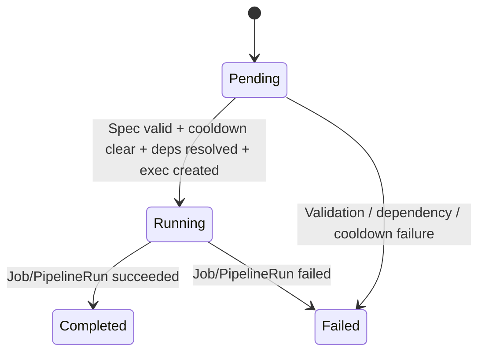
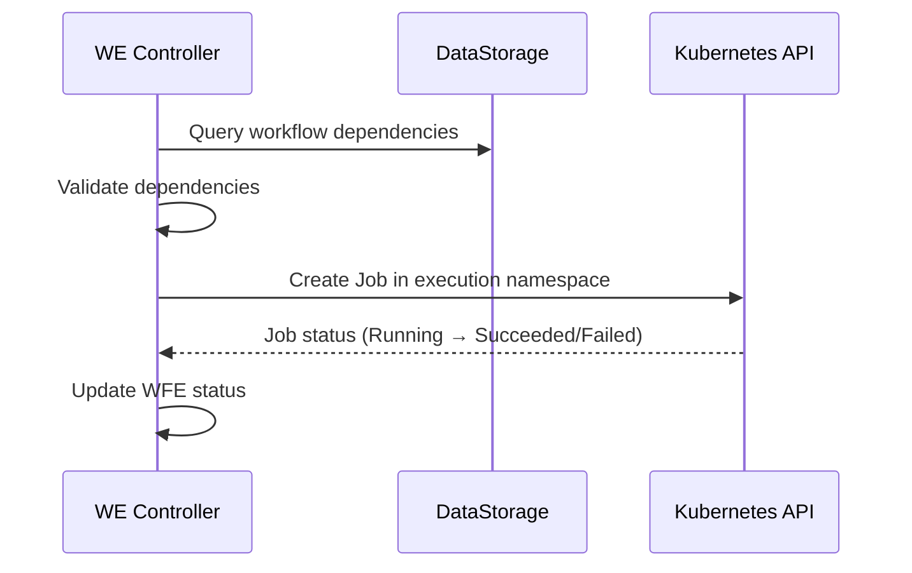
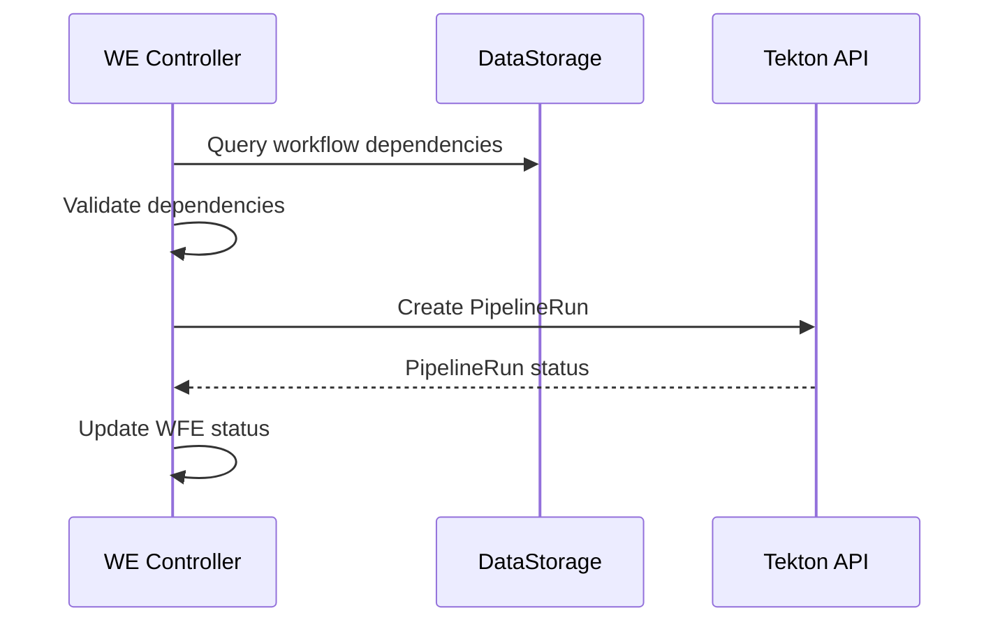

# Workflow Execution

The Workflow Execution controller runs remediation workflows via **Kubernetes Jobs** or **Tekton Pipelines**. It manages spec validation, dependency resolution, cooldown enforcement, deterministic locking, and failure reporting.

## CRD Specification

### Spec (Immutable)

| Field | Type | Description |
|---|---|---|
| `RemediationRequestRef` | `ObjectReference` | Back-reference to the parent RR |
| `WorkflowRef.WorkflowID` | `string` | Workflow identifier from DataStorage |
| `WorkflowRef.Version` | `string` | Workflow version |
| `WorkflowRef.ExecutionBundle` | `string` | OCI image reference for the workflow bundle |
| `WorkflowRef.ExecutionBundleDigest` | `string` | OCI digest for integrity verification |
| `TargetResource` | `string` | Target in `namespace/kind/name` or `kind/name` format |
| `Parameters` | `map[string]string` | Parameters from LLM workflow selection |
| `Confidence` | `float64` | LLM confidence score |
| `Rationale` | `string` | LLM reasoning for workflow selection |
| `ExecutionEngine` | `string` | `tekton`, `job`, or `ansible` (default: `tekton`) |
| `ExecutionConfig.Timeout` | `*metav1.Duration` | Per-execution timeout |
| `ExecutionConfig.ServiceAccountName` | `string` | ServiceAccount override |

### Status

| Field | Type | Description |
|---|---|---|
| `ObservedGeneration` | `int64` | For idempotency |
| `Phase` | `WorkflowExecutionPhase` | Current phase |
| `StartTime` | `*metav1.Time` | When execution started |
| `CompletionTime` | `*metav1.Time` | When execution completed |
| `Duration` | `*metav1.Duration` | Total execution time |
| `ExecutionRef` | `string` | Name of the Job or PipelineRun |
| `ExecutionStatus` | `string` | Raw status from the executor |
| `FailureReason` | `string` | Failure category (see below) |
| `FailureDetails` | `*FailureDetails` | Detailed failure information |
| `BlockClearance` | `*BlockClearance` | Audit fields for lock release (BR-WE-013) |
| `Conditions` | `[]metav1.Condition` | Standard conditions |

### Failure Categories

| Reason | Description |
|---|---|
| `OOMKilled` | Container killed by OOM |
| `DeadlineExceeded` | Execution timeout |
| `Forbidden` | RBAC error during execution |
| `ResourceExhausted` | Cluster resources unavailable |
| `ConfigurationError` | Spec validation or dependency failure |
| `ImagePullBackOff` | Bundle image pull failure |
| `TaskFailed` | Tekton task or Job step failure |
| `Unknown` | Unclassified failure |

### FailureDetails

| Field | Type | Description |
|---|---|---|
| `FailedTaskIndex` | `int32` | Index of the failed Tekton task |
| `FailedTaskName` | `string` | Name of the failed task |
| `FailedStepName` | `string` | Name of the failed step |
| `Reason` | `string` | Kubernetes reason string |
| `Message` | `string` | Human-readable message |
| `ExitCode` | `int32` | Container exit code |
| `FailedAt` | `*metav1.Time` | When the failure occurred |
| `ExecutionTimeBeforeFailure` | `*metav1.Duration` | Time elapsed before failure |
| `NaturalLanguageSummary` | `string` | LLM-friendly failure description |
| `WasExecutionFailure` | `bool` | `true` if the workflow ran; `false` for pre-execution failures |

## Phase State Machine



| Phase | Terminal | Description |
|---|---|---|
| **Pending** | No | Spec validation, cooldown check, dependency resolution, execution creation |
| **Running** | No | Job or PipelineRun is active, polled every 10 seconds |
| **Completed** | Yes | Execution succeeded |
| **Failed** | Yes | Execution failed (pre-execution or runtime) |

## Pending Phase

The Pending phase performs several checks before creating an execution resource:

### 1. Spec Validation

Validates required fields:

- `ExecutionBundle` is non-empty
- `TargetResource` matches the expected format (`namespace/kind/name` or `kind/name`)

Failure → `MarkFailed` with `ConfigurationError`.

### 2. Cooldown Check

Before creating a new execution, the controller checks for recently completed WFEs on the same target resource:

- Lists WFEs using a field index on `spec.targetResource`
- If a Completed or Failed WFE exists with `CompletionTime` within the cooldown window → **block**
- Returns the remaining cooldown time for requeue

**Default cooldown**: 5 minutes. Prevents rapid re-execution of the same workflow on the same target.

### 3. Dependency Resolution

Fetches workflow dependencies from DataStorage and validates them in the execution namespace:

1. **Query DataStorage** via `WorkflowQuerier.GetWorkflowDependencies(ctx, workflowID)` for declared Secrets and ConfigMaps
2. **Validate** via `DependencyValidator.ValidateDependencies` that each declared dependency exists in the execution namespace
3. **Failure modes**:
    - DataStorage fetch failure → non-fatal, continue without dependency data
    - Dependency validation failure → `MarkFailed` with `ConfigurationError`

### 4. Execution Creation

Creates a Kubernetes Job or Tekton PipelineRun based on `ExecutionEngine`:

- The executor registry dispatches to the appropriate engine (`tekton` or `job`)
- **AlreadyExists handling**: If the resource already exists and belongs to this WFE, adopt it (idempotent). If it belongs to another WFE, mark as `Failed` (race condition).

### Audit Events

- `workflow.selection.completed` -- Emitted after spec validation
- `execution.workflow.started` -- Emitted after execution resource creation

## Running Phase

The Running phase polls the executor status every **10 seconds**:

1. Call `exec.GetStatus(ctx, wfe, namespace)`
2. If `Completed` → `MarkCompleted` with `CompletionTime` and `Duration`
3. If `Failed` → `MarkFailed` with `FailureReason`, `FailureDetails`, and `WasExecutionFailure=true`
4. If still running → requeue after 10s

## Terminal Phase (Cooldown and Cleanup)

After reaching `Completed` or `Failed`, the controller does not immediately clean up:

1. **Wait for cooldown** (default 5m) after `CompletionTime`
2. **Cleanup** -- `exec.Cleanup(ctx, wfe, namespace)` deletes the Job or PipelineRun
3. **Emit** `LockReleased` Kubernetes event

The cooldown period serves two purposes:

- Prevents immediate re-execution of the same workflow on the same target
- Allows the Orchestrator to read execution results before the resource is deleted

## Execution Engines

### Kubernetes Jobs

For single-step remediations:



### Tekton Pipelines

For multi-step remediations with step ordering, retries, and artifact passing:



## Deterministic Locking (DD-WE-003)

To prevent concurrent execution on the same target resource, the controller uses deterministic naming:

```
PipelineRun/Job name = wfe-{sha256(targetResource)[:16]}
```

The same target resource always produces the same execution resource name. If two WFEs attempt to run on the same target:

- The first one creates the resource successfully
- The second receives `AlreadyExists` → if the existing resource belongs to another WFE, it fails with a race condition error

## Execution Namespace and RBAC

All Jobs and PipelineRuns execute in the dedicated `kubernaut-workflows` namespace. In v1.0, they share a common ServiceAccount (`kubernaut-workflow-runner`) managed by the controller. Per-workflow scoped RBAC is planned for v1.1.

## Parameter Injection

The executor injects system variables and passes through all parameters from the workflow selection:

| Variable | Source |
|---|---|
| `TARGET_RESOURCE` | `wfe.Spec.TargetResource` (system-injected) |
| Custom parameters | All entries from `wfe.Spec.Parameters` (from LLM selection) |

Custom parameters use `UPPER_SNAKE_CASE` names and are injected as environment variables (Jobs) or Tekton params (PipelineRuns).

## Handoff

The WFE controller reports status back to the Orchestrator through the CRD status:

```
WFE Completed → RO creates EffectivenessAssessment → Verifying phase
WFE Failed    → RO creates EA (for tracking) + NotificationRequest → Failed phase
```

## Next Steps

- [Effectiveness Assessment](effectiveness.md) -- Post-execution health evaluation
- [Remediation Workflows](../user-guide/workflows.md) -- Writing workflow schemas
- [Remediation Routing](remediation-routing.md) -- How the Orchestrator manages the lifecycle
