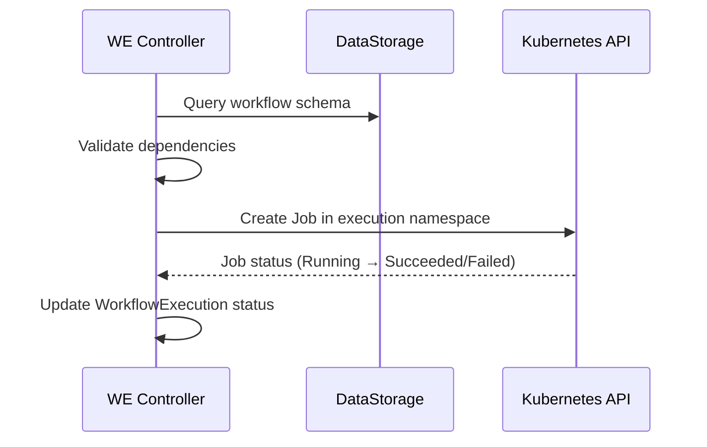
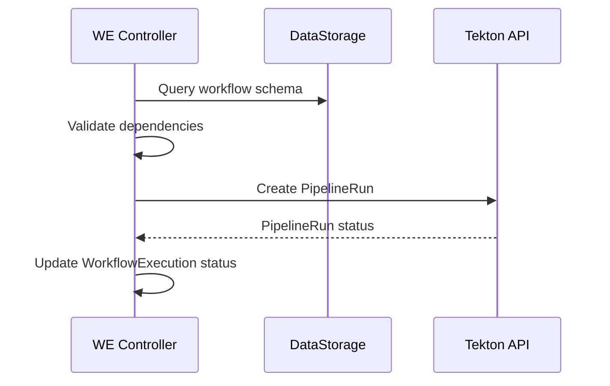

# Workflow Execution

The Workflow Execution controller runs remediation workflows via **Kubernetes Jobs** or **Tekton Pipelines**, managing RBAC, parameter injection, and dependency validation.

## Execution Engines

### Kubernetes Jobs

For single-step remediations:

### Tekton Pipelines

For multi-step remediations with step ordering, retries, and artifact passing:

## Dependency Validation

Before creating a Job or PipelineRun, the controller validates that required dependencies declared in the workflow schema exist in the execution namespace:

- **Secrets** — Credentials required by the workflow (e.g., registry credentials, API keys)
- **ConfigMaps** — Configuration files required by the workflow

If any declared dependency is missing, the WorkflowExecution fails with a descriptive error before the Job/PipelineRun is created. This prevents runtime failures from missing mounts.

## Execution Namespace and RBAC

All Jobs and PipelineRuns execute in the dedicated `kubernaut-workflows` namespace. In v1.0, they share a common ServiceAccount (`kubernaut-workflow-runner`) managed by the Workflow Execution controller. Per-workflow scoped RBAC (individual ServiceAccounts per workflow) is planned for v1.1.

## Parameter Injection

Parameters from the workflow schema and RemediationRequest are injected as environment variables into the Job/PipelineRun:

| Variable | Source |
|---|---|
| `NAMESPACE` | Target namespace from RemediationRequest |
| `RESOURCE_NAME` | Target resource name |
| `ALERT_NAME` | Triggering alert |
| Custom | Workflow schema parameters |

## Phases

| Phase | Description |
|---|---|
| `Pending` | CRD created, awaiting execution |
| `Running` | Job or PipelineRun is active |
| `Completed` | Execution succeeded |
| `Failed` | Execution failed |

## Next Steps

- [Effectiveness Assessment](effectiveness.md) — Post-execution health evaluation
- [Remediation Workflows](../user-guide/workflows.md) — Writing workflow schemas
- [Remediation Routing](remediation-routing.md) — How the Orchestrator manages the lifecycle
