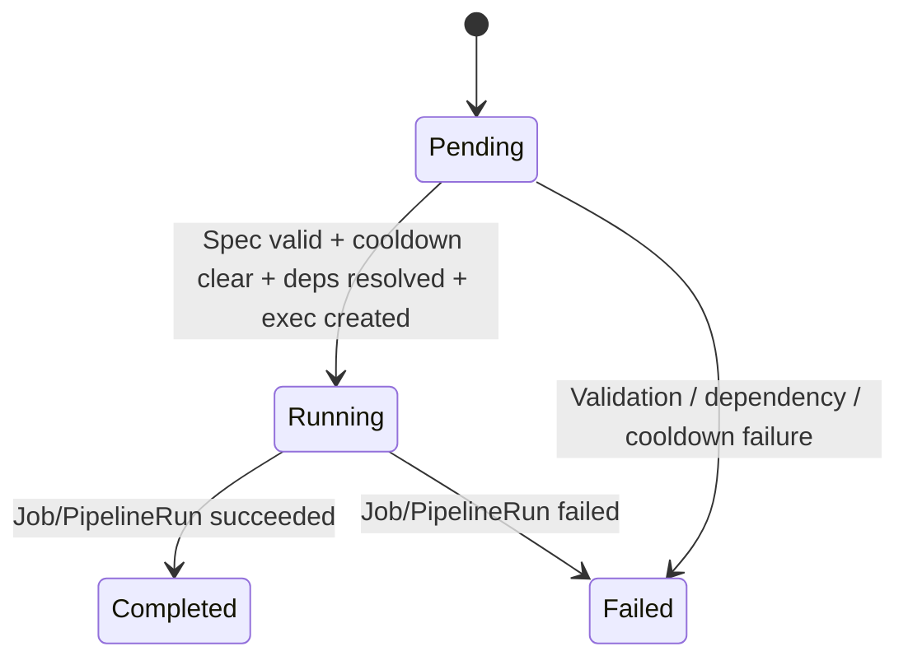
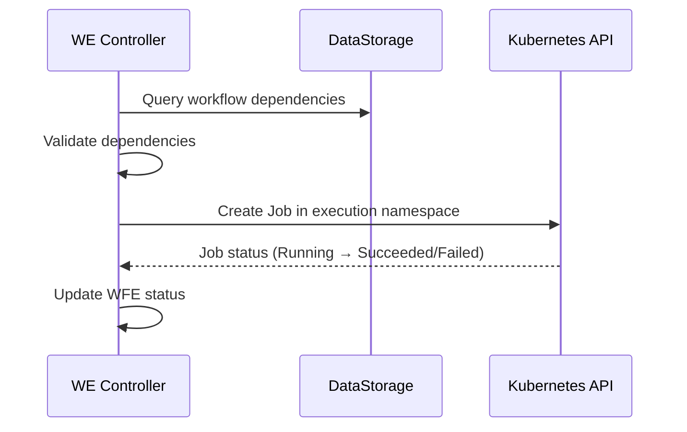
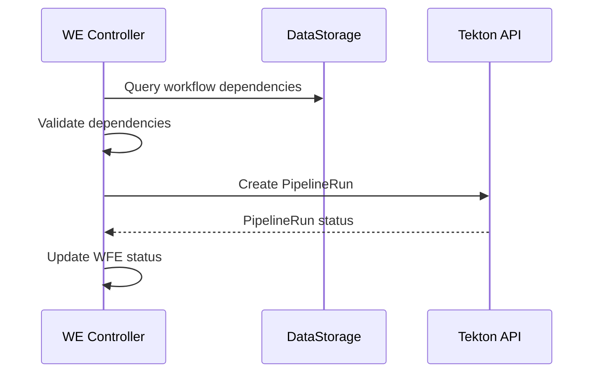
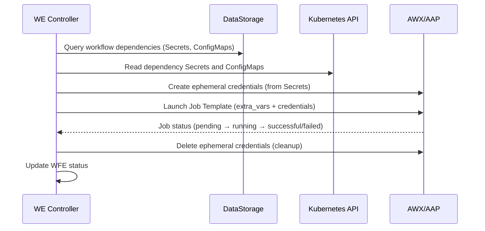

# Workflow Execution

!!! abstract "CRD Reference"
    For the complete WorkflowExecution CRD specification, see [API Reference: CRDs](../api-reference/crds.md#workflowexecution).

The Workflow Execution controller runs remediation workflows via **Kubernetes Jobs**, **Tekton Pipelines**, or **Ansible (AWX/AAP)**. It manages spec validation, dependency resolution, cooldown enforcement, deterministic locking, and failure reporting.

## CRD Specification

### Spec (Immutable)

For the complete field specification, see [WorkflowExecution in the CRD Reference](../api-reference/crds.md#workflowexecution).

### Status

For the complete field specification, see [WorkflowExecution in the CRD Reference](../api-reference/crds.md#workflowexecution).

### Failure Categories

| Reason | Description |
|---|---|
| `OOMKilled` | Container killed by OOM |
| `DeadlineExceeded` | Execution timeout |
| `Forbidden` | RBAC error during execution |
| `ResourceExhausted` | Cluster resources unavailable |
| `ConfigurationError` | Spec validation or dependency failure |
| `ImagePullBackOff` | Bundle image pull failure |
| `TaskFailed` | Tekton task or Job step failure |
| `Unknown` | Unclassified failure |

### FailureDetails

For the complete field specification, see [WorkflowExecution in the CRD Reference](../api-reference/crds.md#workflowexecution).

## Phase State Machine



| Phase | Terminal | Description |
|---|---|---|
| **Pending** | No | Spec validation, cooldown check, dependency resolution, execution creation |
| **Running** | No | Job or PipelineRun is active, polled every 10 seconds |
| **Completed** | Yes | Execution succeeded |
| **Failed** | Yes | Execution failed (pre-execution or runtime) |

## Pending Phase

The Pending phase performs several checks before creating an execution resource:

### 1. Spec Validation

Validates required fields:

- `ExecutionBundle` is non-empty
- `TargetResource` matches the expected format (`namespace/kind/name` or `kind/name`)

Failure → `MarkFailed` with `ConfigurationError`.

### 2. Cooldown Check

Before creating a new execution, the controller checks for recently completed WFEs on the same target resource:

- Lists WFEs using a field index on `spec.targetResource`
- If a Completed or Failed WFE exists with `CompletionTime` within the cooldown window → **block**
- Returns the remaining cooldown time for requeue

**Default cooldown**: 5 minutes. Prevents rapid re-execution of the same workflow on the same target.

### 3. Dependency Resolution

Fetches workflow dependencies from DataStorage and validates them in the execution namespace:

1. **Query DataStorage** via `WorkflowQuerier.GetWorkflowDependencies(ctx, workflowID)` for declared Secrets and ConfigMaps
2. **Validate** via `DependencyValidator.ValidateDependencies` that each declared dependency exists in the execution namespace
3. **Failure modes**:
    - DataStorage fetch failure → non-fatal, continue without dependency data
    - Dependency validation failure → `MarkFailed` with `ConfigurationError`

### 4. Execution Creation

Creates a Kubernetes Job, Tekton PipelineRun, or AWX Job based on `ExecutionEngine`:

- The executor registry dispatches to the appropriate engine (`tekton`, `job`, or `ansible`)
- **AlreadyExists handling** (Job/Tekton only): If the resource already exists and belongs to this WFE, adopt it (idempotent). If it belongs to another WFE, mark as `Failed` (race condition).

### Audit Events

- `workflow.selection.completed` -- Emitted after spec validation
- `execution.workflow.started` -- Emitted after execution resource creation

## Running Phase

The Running phase polls the executor status every **10 seconds**:

1. Call `exec.GetStatus(ctx, wfe, namespace)`
2. If `Completed` → `MarkCompleted` with `CompletionTime` and `Duration`
3. If `Failed` → `MarkFailed` with `FailureReason`, `FailureDetails`, and `WasExecutionFailure=true`
4. If still running → requeue after 10s

## Terminal Phase (Cooldown and Cleanup)

After reaching `Completed` or `Failed`, the controller does not immediately clean up:

1. **Wait for cooldown** (default 5m) after `CompletionTime`
2. **Cleanup** -- `exec.Cleanup(ctx, wfe, namespace)` deletes the Job or PipelineRun
3. **Emit** `LockReleased` Kubernetes event

The cooldown period serves two purposes:

- Prevents immediate re-execution of the same workflow on the same target
- Allows the Orchestrator to read execution results before the resource is deleted

## Execution Engines

### Kubernetes Jobs

For single-step remediations:



### Tekton Pipelines

For multi-step remediations with step ordering, retries, and artifact passing:



### Ansible (AWX/AAP)

For remediations that use Ansible playbooks managed via AWX or Ansible Automation Platform (BR-WE-015):



The Ansible executor:

1. **Resolves the Job Template** by name via the AWX REST API (`engineConfig.jobTemplateName`)
2. **Builds `extra_vars`** from workflow parameters (with automatic type coercion for integers, booleans, floats, and JSON) plus four auto-injected context variables:

    | Variable | Source | Purpose |
    |---|---|---|
    | `WFE_NAME` | `wfe.Name` | WorkflowExecution identity for audit/logging |
    | `WFE_NAMESPACE` | `wfe.Namespace` | WorkflowExecution namespace |
    | `RR_NAME` | `wfe.Spec.RemediationRequestRef.Name` | Parent RemediationRequest identity |
    | `RR_NAMESPACE` | `wfe.Spec.RemediationRequestRef.Namespace` | Parent RemediationRequest namespace |

3. **Injects dependency ConfigMaps** as `extra_vars` with a `KUBERNAUT_CONFIGMAP_{NAME}_{KEY}` prefix (non-sensitive data)
4. **Injects dependency Secrets** as ephemeral AWX credentials with `KUBERNAUT_SECRET_{NAME}_{KEY}` environment variables (sensitive data, never in `extra_vars`)
5. **Launches the AWX Job** with the combined `extra_vars` and credential IDs
6. **Polls job status** via `GET /api/v2/jobs/{id}/` mapping AWX states (`pending`, `waiting`, `running`, `successful`, `failed`, `error`, `canceled`) to WFE phases
7. **Cleans up** ephemeral credentials after execution completes (stored in the `kubernaut.ai/awx-ephemeral-credentials` annotation)

The credential lifecycle ensures Kubernetes Secret data is never persisted in AWX `extra_vars` (which are logged). Instead, each Secret gets a dynamic AWX credential type with `env` injectors, and an ephemeral credential is created per execution and deleted on cleanup.

## Deterministic Locking (DD-WE-003)

To prevent concurrent execution on the same target resource, the controller uses deterministic naming:

```
PipelineRun/Job name = wfe-{sha256(targetResource)[:16]}
```

The same target resource always produces the same execution resource name. If two WFEs attempt to run on the same target:

- The first one creates the resource successfully
- The second receives `AlreadyExists` → the controller checks:
    1. **Ownership check**: Does the existing resource have a `kubernaut.ai/workflow-execution` label matching another WFE? If so, it fails with a race condition error (concurrent lock held by another WFE).
    2. **Completed check**: Is the existing resource in a terminal state (completed or failed)? If so, it is cleaned up and creation is retried (stale lock from a previous execution).
    3. **Running check**: If the resource is still running and owned by another WFE, the current WFE waits.

This pre-execution cleanup resolves the stale lock problem where a completed Job from a previous WFE would permanently block new executions on the same target.

### Ownership-Verified Cleanup

During cooldown cleanup, both `JobExecutor` and `TektonExecutor` verify the `kubernaut.ai/workflow-execution` label matches the WFE name before deleting execution resources. This prevents WFE1's cooldown cleanup from destroying WFE2's newly created Job or PipelineRun when they share deterministic names.

### Engine Configuration Resolution

When a WFE spec omits `engineConfig`, the controller resolves it from the workflow catalog in DataStorage. This prevents nil-pointer panics when workflow registration did not include engine-specific configuration.

## Execution Namespace and RBAC

All Jobs and PipelineRuns execute in the dedicated `kubernaut-workflows` namespace. They share a common ServiceAccount (`kubernaut-workflow-runner`) managed by the controller. See [Security & RBAC -- Workflow Execution](security-rbac.md#workflow-execution) for the full list of permissions granted to this ServiceAccount. Per-workflow scoped RBAC is planned for v1.2.

## Parameter Injection

The executor injects system variables and passes through all parameters from the workflow selection:

### Kubernetes Jobs and Tekton Pipelines

| Variable | Source |
|---|---|
| `TARGET_RESOURCE` | `wfe.Spec.TargetResource` (system-injected) |
| Custom parameters | All entries from `wfe.Spec.Parameters` (from LLM selection) |

Custom parameters use `UPPER_SNAKE_CASE` names and are injected as environment variables (Jobs) or Tekton params (PipelineRuns).

### Ansible (AWX/AAP)

| Variable | Source |
|---|---|
| `WFE_NAME` | `wfe.Name` (auto-injected) |
| `WFE_NAMESPACE` | `wfe.Namespace` (auto-injected) |
| `RR_NAME` | `wfe.Spec.RemediationRequestRef.Name` (auto-injected) |
| `RR_NAMESPACE` | `wfe.Spec.RemediationRequestRef.Namespace` (auto-injected) |
| `KUBERNAUT_CONFIGMAP_{NAME}_{KEY}` | Dependency ConfigMap data (auto-injected) |
| `KUBERNAUT_SECRET_{NAME}_{KEY}` | Dependency Secret data (via ephemeral AWX credentials) |
| Custom parameters | All entries from `wfe.Spec.Parameters` (type-coerced into `extra_vars`) |

## Handoff

The WFE controller reports status back to the Orchestrator through the CRD status:

```
WFE Completed → RO creates EffectivenessAssessment → Verifying phase
WFE Failed    → RO creates EA (for tracking) + NotificationRequest → Failed phase
```

For Ansible executions, the handoff is identical -- the AWX job status is mapped to the same WFE phases (`Completed`/`Failed`), so the Orchestrator does not need to distinguish between execution engines.

## Next Steps

- [Effectiveness Assessment](effectiveness.md) -- Post-execution health evaluation
- [Remediation Workflows](../user-guide/workflows.md) -- Writing workflow schemas
- [Remediation Routing](remediation-routing.md) -- How the Orchestrator manages the lifecycle
