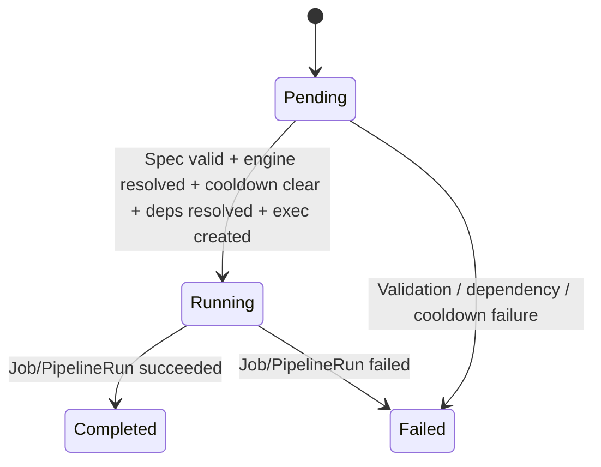
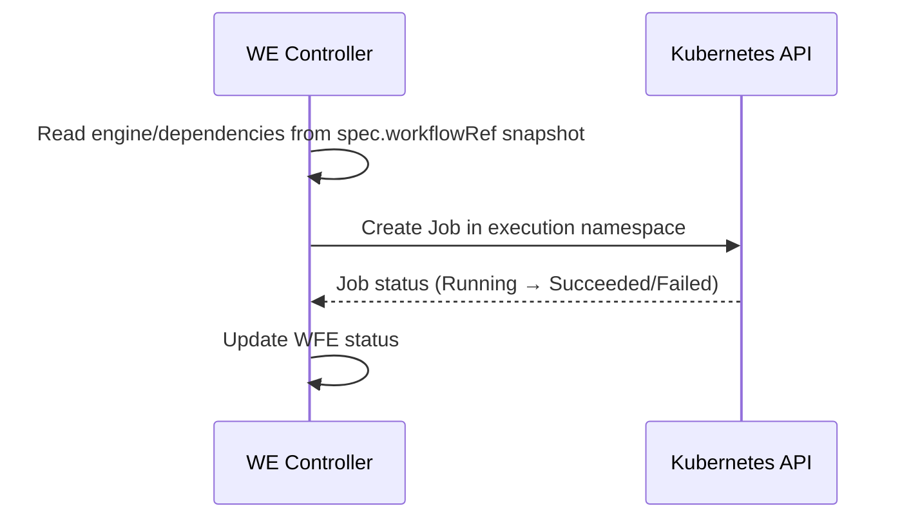
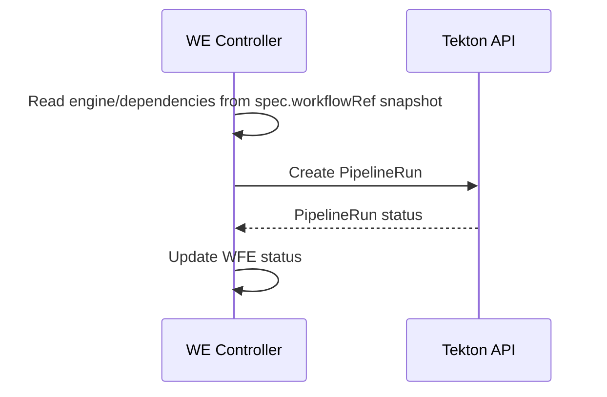
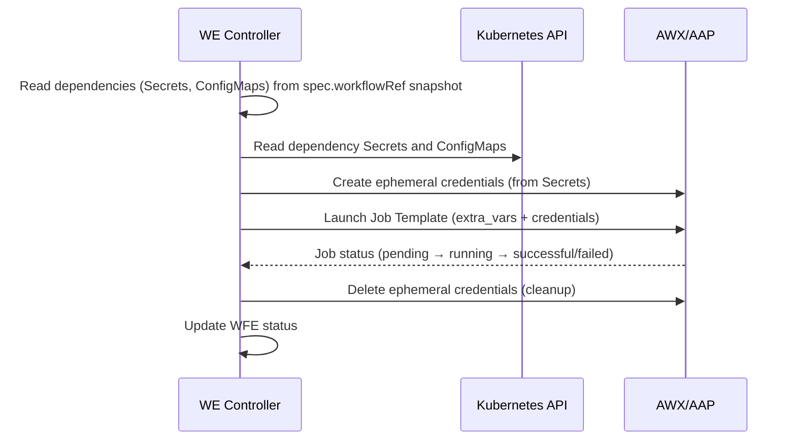

# Workflow Execution

!!! abstract "CRD Reference"
    For the complete WorkflowExecution CRD specification, see [API Reference: CRDs](../api-reference/crds.md#workflowexecution).

The Workflow Execution controller runs remediation workflows via **Kubernetes Jobs**, **Tekton Pipelines**, or **Ansible (AWX/AAP)**. It manages spec validation, dependency resolution, cooldown enforcement, deterministic locking, and failure reporting.

!!! note "CRD-aware engine registration (v1.4)"
    Engine registration verifies that **required CRDs** exist for each backend (Job, Tekton, Ansible/WF). When mandatory CRDs are missing, registration reports **degraded** status rather than behaving as if the engine is fully available (#868).

## CRD Specification

### Spec (Immutable)

For the complete field specification, see [WorkflowExecution in the CRD Reference](../api-reference/crds.md#workflowexecution).

### Status

For the complete field specification, see [WorkflowExecution in the CRD Reference](../api-reference/crds.md#workflowexecution).

### Failure Categories

| Reason | Description |
|---|---|
| `OOMKilled` | Container killed by OOM |
| `DeadlineExceeded` | Execution timeout |
| `Forbidden` | RBAC error during execution |
| `ResourceExhausted` | Cluster resources unavailable |
| `ConfigurationError` | Spec validation or dependency failure |
| `ImagePullBackOff` | Bundle image pull failure |
| `TaskFailed` | Tekton task or Job step failure |
| `UnsupportedEngine` | The execution engine is not registered (CRD-aware engine registration, v1.4) |
| `Deduplicated` | Execution-time resource collision — another WFE already owns the target execution resource |
| `Unknown` | Unclassified failure |

### FailureDetails

For the complete field specification, see [WorkflowExecution in the CRD Reference](../api-reference/crds.md#workflowexecution).

## Phase State Machine


```mermaid
stateDiagram-v2
    [*] --> Pending
    Pending --> Running : Spec valid + engine resolved + cooldown clear + deps resolved + exec created
    Pending --> Failed : Validation / dependency / cooldown failure
    Running --> Completed : Job/PipelineRun succeeded
    Running --> Failed : Job/PipelineRun failed
```

| Phase | Terminal | Description |
|---|---|---|
| **Pending** | No | Spec validation, engine resolution, cooldown check, dependency resolution, execution creation |
| **Running** | No | Job or PipelineRun is active, polled every 10 seconds |
| **Completed** | Yes | Execution succeeded |
| **Failed** | Yes | Execution failed (pre-execution or runtime) |

## Pending Phase

The Pending phase performs several checks before creating an execution resource:

### 1. Spec Validation

Validates required fields:

- `ExecutionBundle` is non-empty
- `TargetResource` matches the expected format (`namespace/kind/name` or `kind/name`)

Failure → `MarkFailed` with `ConfigurationError`.

### 2. Engine Resolution

The execution engine (`tekton`, `job`, or `ansible`) is read directly off the immutable `spec.workflowRef.executionEngine` field -- the Remediation Orchestrator's already-validated, CRD-embedded snapshot copied verbatim from `AIAnalysis.Status.SelectedWorkflow`. There is no DataStorage catalog lookup at runtime (Issue #1661 Change 11f removed the former `resolveWorkflowCatalog` Spec→Status mirror entirely). `validateExecutionEngineResolved` runs immediately after validation, before the cooldown check, as a defensive fail-closed guard against a `workflowRef` that somehow lacks an execution engine -- this should be unreachable in practice since RO's `validateSelectedWorkflow` already enforces it before the WFE is ever created.

Failure → `MarkFailed` with `ConfigurationError`.

### 3. Cooldown Check

Before creating a new execution, the controller checks for recently completed WFEs on the same target resource:

- Lists WFEs using a field index on `spec.targetResource`
- If a Completed or Failed WFE exists with `CompletionTime` within the cooldown window → **block**
- Returns the remaining cooldown time for requeue

**Default cooldown**: 1 minute (configurable via `workflowexecution.config.execution.cooldownPeriod`). Prevents rapid re-execution of the same workflow on the same target.

### Audit: `workflowexecution.selection.completed`

Emitted after validation + engine resolution + cooldown check pass, **before** dependency resolution and execution creation.

### 4. Dependency Resolution

`spec.workflowRef.dependencies` (declared Secrets/ConfigMaps) is part of the same immutable snapshot as `executionEngine`/`engineConfig` -- there is no DataStorage query at this step (Issue #1661 Change 11e consolidated the former 3-round-trip DataStorage schema fetch into RO's single upfront snapshot).

!!! info "v1.6 (Issue #1481): pre-execution dependency existence is no longer validated"
    Earlier versions validated that each declared Secret/ConfigMap actually existed in the execution namespace before creating the Job/PipelineRun, failing the WFE with `ConfigurationError` if not. This pre-flight check was removed: a schema-declared dependency is now mounted as-is, and Kubernetes itself validates existence at runtime when the Job/PipelineRun attempts to mount the volume (`CreateContainerConfigError`/similar pod events). This is a fail-fast, not fail-closed, trade-off -- see BR-WORKFLOW-008 for the resulting observability guarantees.

### 5. Execution Creation

Creates a Kubernetes Job, Tekton PipelineRun, or AWX Job using the engine resolved in Step 2:

- The executor registry dispatches to the appropriate engine
- **AlreadyExists handling** (Job/Tekton only): If the resource already exists and belongs to this WFE, adopt it (idempotent). If it belongs to another WFE, mark as `Failed` (race condition).

### Audit: `workflowexecution.execution.started`

Emitted after execution resource creation succeeds.

## Running Phase

The Running phase polls the executor status every **10 seconds**:

1. Call `exec.GetStatus(ctx, wfe, namespace)`
2. If `Completed` → `MarkCompleted` with `CompletionTime` and `Duration`
3. If `Failed` → `MarkFailed` with `FailureReason`, `FailureDetails`, and `WasExecutionFailure=true`
4. If still running → requeue after 10s

## Terminal Phase (Cooldown and Cleanup)

After reaching `Completed` or `Failed`, the controller does not immediately clean up:

1. **Wait for cooldown** (default 1m) after `CompletionTime`
2. **Cleanup** -- `exec.Cleanup(ctx, wfe, namespace)`:
    - **Job/Tekton**: Deletes the Job or PipelineRun
    - **Ansible**: Deletes ephemeral AWX credentials via `cleanupEphemeralCredentials` and cancels the AWX job if still running
3. **Emit** `LockReleased` Kubernetes event

The cooldown period serves two purposes:

- Prevents immediate re-execution of the same workflow on the same target
- Allows the Orchestrator to read execution results before the resource is deleted

## Execution Engines

### Kubernetes Jobs

For single-step remediations:


```mermaid
sequenceDiagram
    participant WE as WE Controller
    participant K8s as Kubernetes API

    WE->>WE: Read engine/dependencies from spec.workflowRef snapshot
    WE->>K8s: Create Job in execution namespace
    K8s-->>WE: Job status (Running → Succeeded/Failed)
    WE->>WE: Update WFE status
```

### Tekton Pipelines

For multi-step remediations with step ordering, retries, and artifact passing:


```mermaid
sequenceDiagram
    participant WE as WE Controller
    participant Tekton as Tekton API

    WE->>WE: Read engine/dependencies from spec.workflowRef snapshot
    WE->>Tekton: Create PipelineRun
    Tekton-->>WE: PipelineRun status
    WE->>WE: Update WFE status
```

### Ansible (AWX/AAP)

For remediations that use Ansible playbooks managed via AWX or Ansible Automation Platform (BR-WE-015):


```mermaid
sequenceDiagram
    participant WE as WE Controller
    participant K8s as Kubernetes API
    participant AWX as AWX/AAP

    WE->>WE: Read dependencies (Secrets, ConfigMaps) from spec.workflowRef snapshot
    WE->>K8s: Read dependency Secrets and ConfigMaps
    WE->>AWX: Create ephemeral credentials (from Secrets)
    WE->>AWX: Launch Job Template (extra_vars + credentials)
    AWX-->>WE: Job status (pending → running → successful/failed)
    WE->>AWX: Delete ephemeral credentials (cleanup)
    WE->>WE: Update WFE status
```

The Ansible executor:

1. **Resolves the Job Template** by name via the AWX REST API (`engineConfig.jobTemplateName`)
2. **Builds `extra_vars`** from workflow parameters (with automatic type coercion for integers, booleans, floats, and JSON) plus four auto-injected context variables:

    | Variable | Source | Purpose |
    |---|---|---|
    | `WFE_NAME` | `wfe.Name` | WorkflowExecution identity for audit/logging |
    | `WFE_NAMESPACE` | `wfe.Namespace` | WorkflowExecution namespace |
    | `RR_NAME` | `wfe.Spec.RemediationRequestRef.Name` | Parent RemediationRequest identity |
    | `RR_NAMESPACE` | `wfe.Spec.RemediationRequestRef.Namespace` | Parent RemediationRequest namespace |

3. **Injects dependency ConfigMaps** as `extra_vars` with a `KUBERNAUT_CONFIGMAP_{NAME}_{KEY}` prefix (non-sensitive data)
4. **Injects dependency Secrets** as ephemeral AWX credentials with `KUBERNAUT_SECRET_{NAME}_{KEY}` environment variables (sensitive data, never in `extra_vars`)
5. **Injects K8s API credentials** -- reads the controller's in-cluster ServiceAccount token and creates an ephemeral AWX credential that injects `K8S_AUTH_HOST`, `K8S_AUTH_API_KEY`, and `K8S_AUTH_SSL_CA_CERT` into the Execution Environment. Playbooks using `kubernetes.core` modules authenticate automatically. If the in-cluster environment is unavailable, the job proceeds without K8s credentials.
6. **Launches the AWX Job** with the combined `extra_vars` and credential IDs. When ephemeral credentials are present, the executor also fetches the job template's pre-configured credentials and merges them (deduplicated, template-first ordering) so AWX receives the full union.
7. **Polls job status** via `GET /api/v2/jobs/{id}/` mapping AWX states (`pending`, `waiting`, `running`, `successful`, `failed`, `error`, `canceled`) to WFE phases
8. **Cleans up** ephemeral credentials (including K8s credentials) after execution completes (credential IDs are persisted in `status.ephemeralCredentialIDs` via the status subresource)

The credential lifecycle ensures Kubernetes Secret data is never persisted in AWX `extra_vars` (which are logged). Instead, each Secret gets a dynamic AWX credential type with `env` injectors, and an ephemeral credential is created per execution and deleted on cleanup.

## Deterministic Locking (DD-WE-003)

To prevent concurrent execution on the same target resource, the controller uses deterministic naming:

```
PipelineRun/Job name = wfe-{sha256(targetResource)[:16]}
```

The same target resource always produces the same execution resource name. If two WFEs attempt to run on the same target:

- The first one creates the resource successfully
- The second receives `AlreadyExists` → the controller checks:
    1. **Ownership check**: Does the existing resource have a `kubernaut.ai/workflow-execution` label matching another WFE? If so, it fails with a race condition error (concurrent lock held by another WFE).
    2. **Completed check**: Is the existing resource in a terminal state (completed or failed)? If so, it is cleaned up and creation is retried (stale lock from a previous execution).
    3. **Running check**: If the resource is still running and owned by another WFE, the current WFE waits.

This pre-execution cleanup resolves the stale lock problem where a completed Job from a previous WFE would permanently block new executions on the same target.

### Ownership-Verified Cleanup

During cooldown cleanup, both `JobExecutor` and `TektonExecutor` verify the `kubernaut.ai/workflow-execution` label matches the WFE name before deleting execution resources. This prevents WFE1's cooldown cleanup from destroying WFE2's newly created Job or PipelineRun when they share deterministic names.

### Engine Configuration Resolution

`engineConfig` is part of the immutable `spec.workflowRef` snapshot the Remediation Orchestrator embeds at WFE-creation time -- there is no runtime resolution or DataStorage catalog lookup. A workflow that needs engine-specific configuration (e.g. an Ansible `playbookPath`) must declare it on the `RemediationWorkflow` CRD so RO can copy it into the snapshot; there is no fallback path if it's omitted.

## Execution Namespace and RBAC

All Jobs and PipelineRuns execute in the dedicated `kubernaut-workflows` namespace. Each workflow declares its own ServiceAccount via `spec.execution.serviceAccountName` on the `RemediationWorkflow` CRD (propagated to `WorkflowExecution.spec.serviceAccountName`). This enables least-privilege RBAC per workflow. If omitted, the execution namespace default ServiceAccount is used.

- Job/Tekton: the service account name is set directly on the created Job/PipelineRun.
- Ansible: the controller requests a short-lived token via the Kubernetes TokenRequest API for AWX credential injection.

See [Security & RBAC -- Per-Workflow ServiceAccount](security-rbac.md#per-workflow-serviceaccount-v12) for details on TokenRequest scope, TTL validation, and fallback behavior.

## Parameter Injection

The executor injects system variables and passes through all parameters from the workflow selection:

### Kubernetes Jobs and Tekton Pipelines

| Variable | Source |
|---|---|
| `TARGET_RESOURCE` | `wfe.Spec.TargetResource` (system-injected by WFE controller) |
| `TARGET_RESOURCE_NAME` | `wfe.Spec.Parameters` (KA-injected from K8s root_owner) |
| `TARGET_RESOURCE_KIND` | `wfe.Spec.Parameters` (KA-injected from K8s root_owner) |
| `TARGET_RESOURCE_NAMESPACE` | `wfe.Spec.Parameters` (KA-injected from K8s root_owner; empty for cluster-scoped) |
| `TARGET_RESOURCE_API_VERSION` | `wfe.Spec.Parameters` (KA-injected; auto-resolved via ScopeResolver) |
| Custom parameters | All remaining entries from `wfe.Spec.Parameters` (LLM-populated) |

Custom parameters use `UPPER_SNAKE_CASE` names and are injected as environment variables (Jobs) or Tekton params (PipelineRuns).

### Ansible (AWX/AAP)

| Variable | Source |
|---|---|
| `TARGET_RESOURCE_NAME` | `wfe.Spec.Parameters` (KA-injected from K8s root_owner) |
| `TARGET_RESOURCE_KIND` | `wfe.Spec.Parameters` (KA-injected from K8s root_owner) |
| `TARGET_RESOURCE_NAMESPACE` | `wfe.Spec.Parameters` (KA-injected from K8s root_owner; empty for cluster-scoped) |
| `TARGET_RESOURCE_API_VERSION` | `wfe.Spec.Parameters` (KA-injected; auto-resolved via ScopeResolver) |
| `WFE_NAME` | `wfe.Name` (auto-injected) |
| `WFE_NAMESPACE` | `wfe.Namespace` (auto-injected) |
| `RR_NAME` | `wfe.Spec.RemediationRequestRef.Name` (auto-injected) |
| `RR_NAMESPACE` | `wfe.Spec.RemediationRequestRef.Namespace` (auto-injected) |
| `KUBERNAUT_CONFIGMAP_{NAME}_{KEY}` | Dependency ConfigMap data (auto-injected) |
| `KUBERNAUT_SECRET_{NAME}_{KEY}` | Dependency Secret data (via ephemeral AWX credentials) |
| `K8S_AUTH_HOST` | WE controller in-cluster SA (ephemeral AWX credential) |
| `K8S_AUTH_API_KEY` | WE controller in-cluster SA (ephemeral AWX credential) |
| `K8S_AUTH_SSL_CA_CERT` | WE controller in-cluster SA (ephemeral AWX credential) |
| Custom parameters | All remaining entries from `wfe.Spec.Parameters` (type-coerced into `extra_vars`) |

## Handoff

The WFE controller reports status back to the Orchestrator through the CRD status:

```
WFE Completed → RO creates EffectivenessAssessment → Verifying phase
WFE Failed    → WFE handler creates ManualReview NR → RO transitionToFailed → Failed phase
```

In v1.3, when a WorkflowExecution enters `PhaseFailed`, the WFE handler creates a **ManualReview NR** (`nr-manual-review-<rr-name>`) with `reviewSource=WorkflowExecution` and `priority=Critical` **before** calling `transitionToFailed`. The subsequent `transitionToFailed` Escalation NR is suppressed by the double-NR guard (a ManualReview NR already exists for this RR).

For Ansible executions, the handoff is identical -- the AWX job status is mapped to the same WFE phases (`Completed`/`Failed`), so the Orchestrator does not need to distinguish between execution engines.

## Next Steps

- [Effectiveness Assessment](effectiveness.md) -- Post-execution health evaluation
- [Remediation Workflows](../user-guide/workflows.md) -- Writing workflow schemas
- [Remediation Routing](remediation-routing.md) -- How the Orchestrator manages the lifecycle
