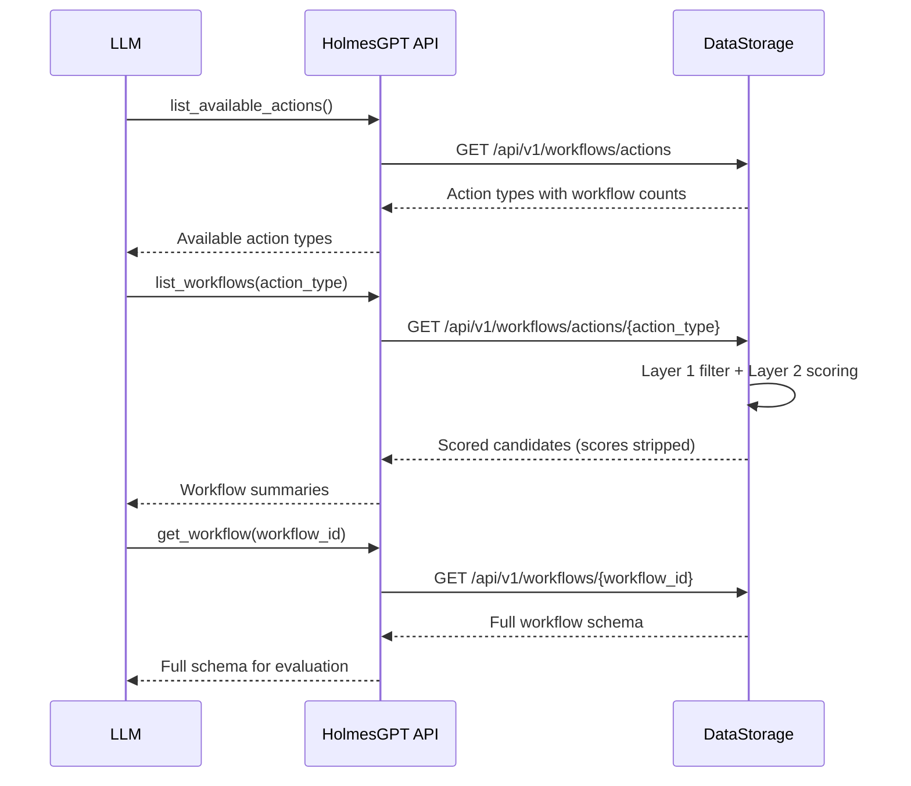

# Workflow Selection

Workflow selection is the process of finding the best remediation workflow for an incident. It uses a three-step discovery protocol (DD-HAPI-017) where HolmesGPT queries DataStorage, which applies mandatory filtering and semantic scoring before the LLM makes the final selection decision.

!!! abstract "CRD Reference"
    For the complete CRD specifications, see [RemediationWorkflow](../api-reference/crds.md#remediationworkflow) and [ActionType](../api-reference/crds.md#actiontype) in the API Reference.

## Three-Step Discovery Protocol



### Step 1: List Action Types

The LLM calls `list_available_actions()` to discover what types of remediations are available. DataStorage returns action types from the `action_type_taxonomy` table, filtered to only include types that have at least one active workflow matching the signal context.

```sql
SELECT t.action_type, t.description, COUNT(w.workflow_id) AS workflow_count
FROM action_type_taxonomy t
INNER JOIN remediation_workflow_catalog w ON w.action_type = t.action_type
WHERE w.status = 'active' AND w.is_latest_version = true
  AND t.status = 'active'
  AND [context filters]
GROUP BY t.action_type, t.description
ORDER BY t.action_type
```

Each action type includes a structured description (`what`, `whenToUse`, `whenNotToUse`, `preconditions`) that the LLM uses to choose the appropriate action category based on the root cause analysis.

### Step 2: List Workflows by Action Type

The LLM calls `list_workflows(action_type)` to get candidate workflows. DataStorage applies **Layer 1** mandatory filtering and **Layer 2** semantic scoring, returning results ordered by score. Scores are stripped before reaching the LLM -- they are used only for ordering.

### Step 3: Get Full Workflow Schema

The LLM calls `get_workflow(workflow_id)` to retrieve the full schema for detailed evaluation. A context filter security gate ensures the workflow still matches the signal context.

## Signal Context Propagation

HAPI propagates signal context from the investigation session to all DataStorage queries:

| Parameter | Source | Purpose |
|---|---|---|
| `severity` | SP classification | Mandatory filter |
| `component` | RCA target resource kind | Mandatory filter |
| `environment` | SP classification | Mandatory filter |
| `priority` | SP classification | Mandatory filter |
| `custom_labels` | SP custom labels | Layer 2 scoring boost |
| `detected_labels` | HAPI `LabelDetector` (post-RCA) | Layer 2 scoring boost + penalty |
| `remediation_id` | Parent RR name | Audit correlation |

Detected labels are computed by HAPI for the RCA target resource (ADR-056). Labels with `failedDetections` entries are stripped before propagation to DataStorage.

## Layer 1: Mandatory Filtering

Every workflow declares four mandatory labels. DataStorage applies these as hard filters -- a workflow must match all four to be a candidate.

| Label | Type | Values | SQL Pattern |
|---|---|---|---|
| `severity` | `string[]` | `critical`, `high`, `medium`, `low`, `"*"` | `labels->'severity' ? $val OR labels->'severity' ? '*'` |
| `component` | `string` | `pod`, `deployment`, `node`, `"*"` | `LOWER(labels->>'component') = LOWER($val) OR labels->>'component' = '*'` |
| `environment` | `string[]` | `production`, `staging`, `development`, `test`, `"*"` | `labels->'environment' ? $val OR labels->'environment' ? '*'` |
| `priority` | `string` | `P0`, `P1`, `P2`, `P3`, `"*"` | JSONB scalar or array containment |

Labels support:

- **Exact match** -- `component: deployment`
- **Wildcard** -- `component: "*"` (matches any value)
- **Multi-value** -- `severity: [critical, high]` (matches if any value overlaps)

### Detected Label Filters

Detected labels use **inclusive filtering** (Issue #197) -- workflows that don't declare a detected label are included, not excluded:

- **Boolean labels** (e.g., `gitOpsManaged`): `detected_labels->>'field' = 'true' OR detected_labels->>'field' IS NULL`
- **String labels** (e.g., `gitOpsTool`): `detected_labels->>'field' = $val OR detected_labels->>'field' = '*' OR detected_labels->>'field' IS NULL`

This ensures newly registered workflows are not excluded simply because they haven't declared detected labels yet.

### Why Business Classification Is Not a Layer 1 Filter

Business classification labels (`businessUnit`, `serviceOwner`, `criticality`, `SLARequirement`) are **not** part of mandatory filtering. This is by design:

1. **Optional labels** -- Business labels are derived from namespace labels that may not be configured. Making them mandatory would exclude workflows for uncategorized namespaces.
2. **Deployment flexibility** -- Early-stage deployments may not have business classification set up. Workflows should still be discoverable.
3. **Broad applicability** -- Most remediation workflows (restart, scale, rollback) are not business-unit-specific. A `RestartPod` workflow works the same regardless of business unit.
4. **Rego policy connection** -- Signal Processing Rego policies determine severity, environment, and priority, which directly feed into Layer 1. Business classification feeds into Layer 2 scoring as a refinement signal, not a hard gate.

!!! note "`signalName` is not a matching label"
    `signalName` is optional metadata in the workflow schema (DD-WORKFLOW-016). It is **not** used for filtering or matching. The LLM selects workflows by `actionType`, not by `signalName`.

## Layer 2: Semantic Scoring

DataStorage computes a `final_score` for each candidate to **order** results (DD-WORKFLOW-004 v1.5). Scores are used only for ordering and are stripped before reaching the LLM.

### Scoring Formula

```
final_score = LEAST((5.0 + detected_label_boost + custom_label_boost - label_penalty) / 10.0, 1.0)
```

- **Base score**: 5.0 out of 10.0 (normalized to 0.50)
- **Range**: 0.0 -- 1.0 (clamped via `LEAST(..., 1.0)`)
- **Ordering**: `ORDER BY final_score DESC, workflow_id ASC`

### Detected Label Weights

| Label | Boost (exact match) | Penalty (mismatch) |
|---|---|---|
| `gitOpsManaged` | +0.10 | -0.10 |
| `gitOpsTool` | +0.10 | -0.10 |
| `pdbProtected` | +0.05 | -- |
| `serviceMesh` | +0.05 | -- |
| `networkIsolated` | +0.03 | -- |
| `helmManaged` | +0.02 | -- |
| `stateful` | +0.02 | -- |
| `hpaEnabled` | +0.02 | -- |

**Maximum boost**: +0.39 (all labels exact match)
**Maximum penalty**: -0.20 (GitOps mismatch only)

### Wildcard Weighting

- **Exact match**: Full weight (e.g., `gitOpsManaged=true` matches `true` → +0.10)
- **Workflow declares wildcard** (`"*"`): Half weight (e.g., +0.05)
- **Query has wildcard** (`"*"`): Half weight

### Custom Label Boost

Custom labels from Signal Processing's Rego policy output contribute additional scoring (DD-WORKFLOW-004 v2.1):

- **Exact match**: +0.15 per key
- **Wildcard match**: +0.075 per key
- SQL: `custom_labels->'key' @> 'value'::jsonb`

### Score Connection to SP Rego Policies

The mandatory filter labels (`severity`, `environment`, `priority`) are determined by Signal Processing's Rego classification policies. This creates a direct connection:

- SP **Severity Rego policy** → determines which severity values filter workflows in Layer 1
- SP **Environment Rego policy** → determines which environment value is used for filtering
- SP **Priority Engine** → determines the priority level for filtering
- SP **Custom Labels Rego policy** → produces labels that boost scores in Layer 2

Accurate Rego policy configuration is critical for workflow discovery -- incorrect severity or environment classification can exclude the correct workflow entirely.

## LLM Selection

The LLM makes the final selection decision based on information available in the workflow schema:

1. **Action type description** -- `what`, `whenToUse`, `whenNotToUse`, and `preconditions`
2. **Workflow description** -- The workflow's own `what` and `whenToUse` fields
3. **Detected infrastructure context** -- Prefer git-based workflows when `gitOpsManaged=true`, respect PDB constraints when `pdbProtected=true`
4. **Remediation history** -- Avoid workflows that recently failed on the same target (formatted warnings in the prompt)
5. **Root cause alignment** -- How well the action type and parameters match the RCA

## Action Type Taxonomy

Action types provide a stable vocabulary for categorizing remediation actions. They are provisioned as Kubernetes CRDs (`ActionType`) and synced to the `action_type_taxonomy` PostgreSQL table by the Auth Webhook admission handler.

### Built-In Types

Kubernaut ships with 24 built-in action types:

`ScaleReplicas`, `RestartPod`, `IncreaseCPULimits`, `IncreaseMemoryLimits`, `RollbackDeployment`, `DrainNode`, `CordonNode`, `RestartDeployment`, `CleanupNode`, `DeletePod`, `GitRevertCommit`, `ProvisionNode`, `GracefulRestart`, `CleanupPVC`, `RemoveTaint`, `PatchHPA`, `RelaxPDB`, `ProactiveRollback`, `CordonDrainNode`, `FixCertificate`, `HelmRollback`, `FixAuthorizationPolicy`, `FixStatefulSetPVC`, `FixNetworkPolicy`

### User-Extensible

Action types are fully configurable. Operators register custom types by applying an `ActionType` CRD:

```yaml
apiVersion: kubernaut.ai/v1alpha1
kind: ActionType
metadata:
  name: rotate-certificates
spec:
  name: RotateCertificates
  description:
    what: "Rotates TLS certificates for services"
    whenToUse: "When certificate expiry is approaching or certificates are invalid"
    whenNotToUse: "When the issue is DNS resolution, not certificate validity"
    preconditions: "cert-manager must be installed and the Certificate resource must exist"
```

The Auth Webhook intercepts the CREATE, registers the action type in the DataStorage taxonomy, captures the operator identity for SOC2 audit, and updates the CRD status. Deleting the CRD disables the action type in the catalog (soft delete).

The description fields are presented to the LLM during Step 1 of the discovery protocol, so accurate, unambiguous descriptions are essential. Follow these guidelines:

- **`what`** -- One sentence describing the action
- **`whenToUse`** -- Specific conditions that warrant this action
- **`whenNotToUse`** -- Conditions where this action would be wrong (prevents misselection)
- **`preconditions`** -- What must be true for the action to succeed

### Lifecycle

Action types support `active` and `disabled` states. Disabled action types and their associated workflows are excluded from the discovery protocol (`t.status = 'active'` filter). Re-applying a previously deleted `ActionType` CRD re-enables the existing taxonomy entry.

### Validation

Workflow creation validates that the declared `action_type` exists and is active in the taxonomy. Unknown or disabled action types are rejected.

## Confidence Thresholds

After selection, the confidence score determines the next step:

| Threshold | Action |
|---|---|
| **>= 0.7** | Workflow selection accepted (investigation threshold) |
| **>= 0.8** | Auto-approved for execution (approval threshold, configurable via Rego) |
| **< 0.7** | Low-confidence; escalated to human review or no workflow selected |

## API Endpoints

| Endpoint | Method | Purpose |
|---|---|---|
| `GET /api/v1/workflows/actions` | GET | Step 1: List action types with counts |
| `GET /api/v1/workflows/actions/{action_type}` | GET | Step 2: Scored candidates for action type |
| `GET /api/v1/workflows/{workflow_id}` | GET | Step 3: Full schema with security gate |
| `GET /api/v1/workflows` | GET | Catalog listing (no scoring) |
| `POST /api/v1/workflows` | POST | Create from OCI schema |
| `PATCH /api/v1/workflows/{id}/disable` | PATCH | Disable workflow |
| `PATCH /api/v1/workflows/{id}/enable` | PATCH | Enable workflow |
| `PATCH /api/v1/workflows/{id}/deprecate` | PATCH | Deprecate workflow |

## Next Steps

- [Workflow Execution](workflow-execution.md) -- How selected workflows are run
- [Investigation Pipeline](hapi-investigation.md) -- The HAPI investigation and selection process
- [Remediation Workflows](../user-guide/workflows.md) -- Writing workflow schemas
- [Signal Processing](signal-processing.md) -- How classification feeds into workflow filtering
