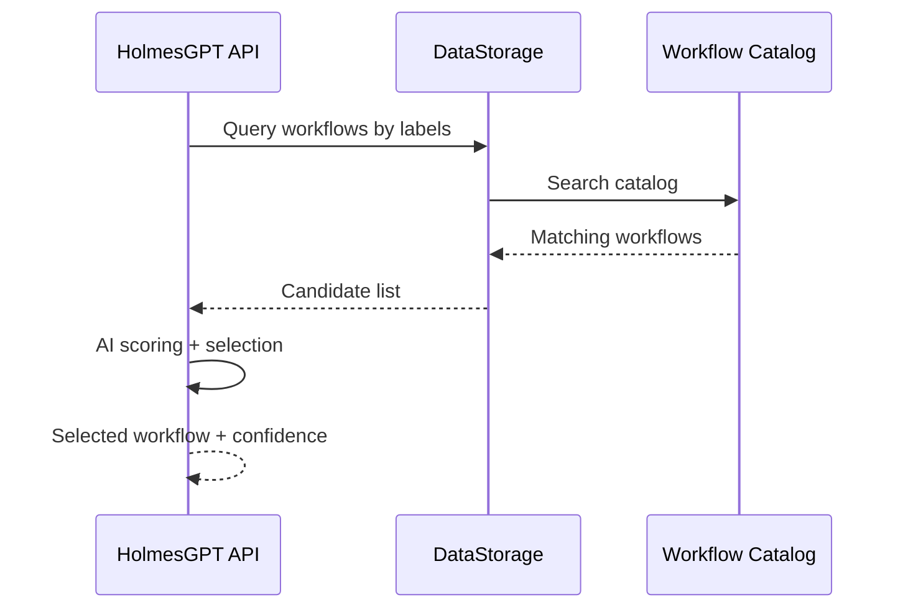

# Workflow Selection

Workflow selection is the process of finding the best remediation workflow for an incident. It combines label-based catalog queries with AI confidence scoring.

## Selection Flow

## Label Matching

Workflows in the catalog have structured labels that describe when they apply:

| Label | Type | Example Values | Purpose |
|---|---|---|---|
| `signalName` | string | `KubePodCrashLooping` | Alert or event name (metadata) |
| `severity` | string[] | `[critical, high]` | Severity levels |
| `environment` | string[] | `[production, staging, "*"]` | Target environments |
| `component` | string | `deployment`, `pod`, `"*"` | Kubernetes resource kind |
| `priority` | string | `P0`, `P1`, `"*"` | Business priority |

The catalog query matches enriched signal labels against workflow labels. Wildcards (`"*"`) match any value, and array fields match if any element overlaps.

## Scoring

When multiple workflows match, the AI evaluates each candidate and assigns a confidence score based on:

1. **Label specificity** — More specific label matches rank higher than wildcards
2. **RCA alignment** — How well the workflow's description matches the root cause analysis
3. **Historical effectiveness** — Past success rates for this workflow on similar incidents

The workflow with the highest confidence score is selected.

## Confidence Thresholds

After selection, the confidence score determines the next step:

- **>= 0.7** — Workflow selection is accepted (investigation threshold)
- **>= 0.8** — Auto-approved for execution (approval threshold, configurable)
- **< 0.7** — Selection rejected as low-confidence; escalated to human review

## Next Steps

- [Workflow Execution](workflow-execution.md) — How selected workflows are run
- [AI Analysis](ai-analysis.md) — The investigation and selection process
- [Remediation Workflows](../user-guide/workflows.md) — Writing workflow schemas
