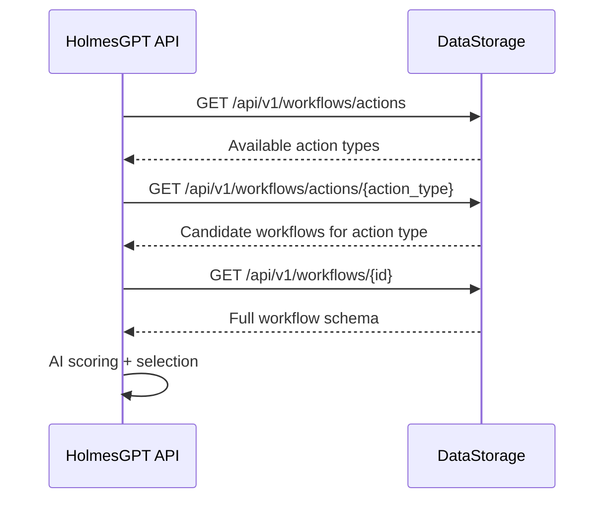

# Workflow Selection

Workflow selection is the process of finding the best remediation workflow for an incident. It uses a three-step discovery protocol (DD-HAPI-017) via DataStorage, combined with AI scoring.

## Three-Step Discovery



1. **List action types** — HAPI queries DataStorage for available action types (e.g., `RestartPod`, `ScaleReplicas`, `DrainNode`). The LLM chooses the action type based on the root cause analysis.
2. **Get candidates** — HAPI fetches workflows for the selected action type, filtered by mandatory labels.
3. **Get full schema** — HAPI retrieves the full workflow schema for detailed evaluation.

## Mandatory Labels

Every workflow declares 4 mandatory labels that DataStorage uses to filter candidates:

| Label | Type | Values | Purpose |
|---|---|---|---|
| `severity` | `string[]` | `critical`, `high`, `medium`, `low` | Severity levels this workflow handles |
| `component` | `string` | `pod`, `deployment`, `node`, `"*"` | Kubernetes resource kind |
| `environment` | `string[]` | `production`, `staging`, `development`, `test`, `"*"` | Target environments |
| `priority` | `string` | `P0`, `P1`, `P2`, `P3`, `"*"` | Business priority level |

Labels support:

- **Exact match** — `component: deployment`
- **Wildcard** — `component: "*"` (matches any value)
- **Multi-value** — `severity: [critical, high]` (matches if any value overlaps)

!!! note "`signalName` is not a matching label"
    `signalName` is optional metadata in the workflow schema (DD-WORKFLOW-016). It is **not** used for filtering or matching. The LLM selects workflows by `actionType`, not by `signalName`.

## Detected Labels

In addition to mandatory labels, workflows can declare **detected labels** — infrastructure-awareness fields that the AI uses for finer-grained selection:

```yaml
detectedLabels:
  hpaEnabled: "true"
  pdbProtected: "true"
  gitOpsManaged: "true"
```

These are matched against `DetectedLabels` produced by the HAPI `LabelDetector` during post-RCA analysis (ADR-056). They come from the investigation context, not from Signal Processing.

## Scoring and Selection

Workflow selection involves two layers:

### DataStorage Ordering

DataStorage computes a `final_score` for each candidate to **order** results (DD-WORKFLOW-004 v1.5):

- **Base score**: 5.0 / 10.0
- **Detected label boost**: Exact matches on infrastructure labels (e.g., `gitOpsManaged` +0.10, `pdbProtected` +0.05)
- **Custom label boost**: Matches on signal context labels
- **Penalty**: GitOps mismatch (query expects GitOps but workflow is not GitOps-aware)

Scores are used **only for ordering** — they are stripped from the response and never exposed to the LLM.

### LLM Selection

The LLM makes the final selection decision based on:

1. **Workflow descriptions** — `what`, `whenToUse`, `whenNotToUse`, and preconditions
2. **Detected infrastructure context** — e.g., prefer git-based workflows when `gitOpsManaged=true`
3. **Remediation history** — Avoid workflows that recently failed on the same target
4. **Root cause alignment** — How well the action type and parameters match the RCA

## Confidence Thresholds

After selection, the confidence score determines the next step:

- **>= 0.7** — Workflow selection is accepted (investigation threshold)
- **>= 0.8** — Auto-approved for execution (approval threshold, configurable)
- **< 0.7** — Selection rejected as low-confidence; escalated to human review

## Next Steps

- [Workflow Execution](workflow-execution.md) — How selected workflows are run
- [AI Analysis](ai-analysis.md) — The investigation and selection process
- [Remediation Workflows](../user-guide/workflows.md) — Writing workflow schemas
