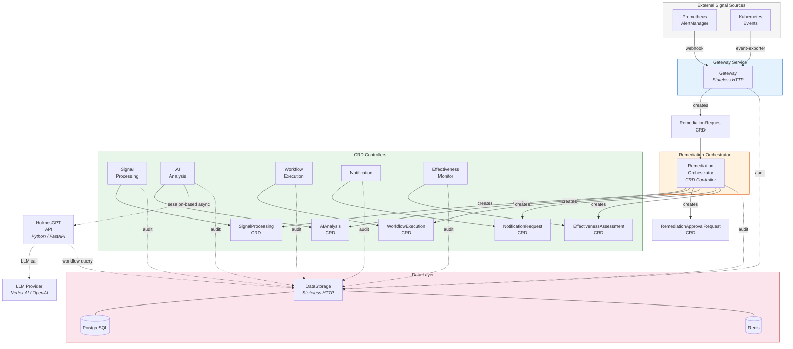
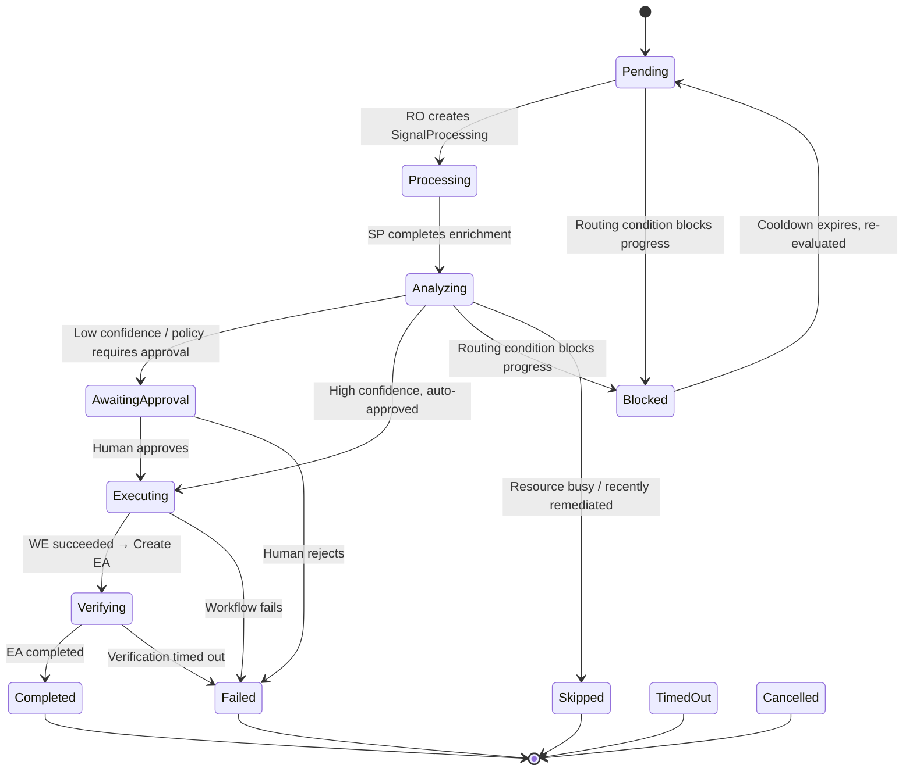

# Architecture Overview

Kubernaut is a microservices platform with 10 services that communicate through Kubernetes Custom Resources (CRDs). This page provides a high-level view of how the services work together.

## System Diagram

## Services

Kubernaut runs **10 services**: 6 CRD controllers, 3 stateless HTTP services, and 1 Python API service.

### CRD Controllers

These services watch Kubernetes Custom Resources and reconcile state:

| Service | Watches | Creates | Role |
|---|---|---|---|
| **Remediation Orchestrator** | RemediationRequest + all child CRDs | SignalProcessing, AIAnalysis, WorkflowExecution, NotificationRequest, EffectivenessAssessment, RemediationApprovalRequest | Coordinates the full remediation lifecycle with routing engine (blocking conditions, exponential backoff, resource locks) |
| **Signal Processing** | SignalProcessing | — | Enriches signals with K8s context (owner chain, namespace, workload), environment classification, priority assignment, business classification, severity normalization, and signal mode |
| **AI Analysis** | AIAnalysis | — | Submits session-based async investigations to HolmesGPT API for RCA, evaluates approval via Rego policy |
| **Workflow Execution** | WorkflowExecution | Tekton PipelineRun or Job | Validates dependencies (Secrets, ConfigMaps), runs remediation workflows via Tekton or K8s Jobs |
| **Notification** | NotificationRequest | — | Delivers notifications via Slack, console, file, or log channels with retry backoff |
| **Effectiveness Monitor** | EffectivenessAssessment | — | Four-dimensional assessment: health checks (K8s), alert resolution (AlertManager), metric comparison (Prometheus), and spec hash drift detection |

### Stateless Services

| Service | Role |
|---|---|
| **Gateway** | HTTP entry point for AlertManager webhooks and K8s events; validates resource scope, resolves owner chains, performs fingerprint-based deduplication, and creates RemediationRequest CRDs |
| **DataStorage** | PostgreSQL-backed REST API for audit events, workflow catalog, remediation history, and effectiveness data (Redis for DLQ) |
| **HolmesGPT API** | Python FastAPI service that orchestrates LLM-driven root cause analysis using Kubernetes inspection tools and configurable observability toolsets (Prometheus, Grafana Loki/Tempo); detects infrastructure labels (GitOps, Helm, service mesh, HPA, PDB) that influence workflow selection and catalog search; fetches remediation history so the LLM avoids repeating failed remediations |

## Communication Pattern

All inter-service communication in the remediation pipeline uses **Kubernetes CRDs**. The HTTP exceptions are: all controllers emit audit events to DataStorage, WFE queries DataStorage for the workflow catalog, RO queries DataStorage for remediation history, AA calls HolmesGPT API for AI investigation, and EM queries AlertManager and Prometheus for effectiveness assessment.

This architecture provides:

- **Resilience** — If a controller restarts, it picks up from the CRD's current state
- **Observability** — Every stage is visible as a Kubernetes resource (`kubectl get`)
- **Auditability** — CRD status transitions are tracked; full audit events go to PostgreSQL
- **Scalability** — Each controller scales independently

## Custom Resources

Kubernaut defines 7 CRD types:

| CRD | API Group | Created By | Watched By |
|---|---|---|---|
| `RemediationRequest` | `kubernaut.ai` | Gateway | Remediation Orchestrator |
| `RemediationApprovalRequest` | `kubernaut.ai` | Remediation Orchestrator | Remediation Orchestrator (RAR audit) |
| `SignalProcessing` | `kubernaut.ai` | Remediation Orchestrator | Signal Processing |
| `AIAnalysis` | `kubernaut.ai` | Remediation Orchestrator | AI Analysis |
| `WorkflowExecution` | `kubernaut.ai` | Remediation Orchestrator | Workflow Execution |
| `NotificationRequest` | `kubernaut.ai` | Remediation Orchestrator | Notification |
| `EffectivenessAssessment` | `kubernaut.ai` | Remediation Orchestrator | Effectiveness Monitor |

## Remediation Lifecycle

A `RemediationRequest` progresses through these phases:

After reaching a terminal phase (Completed, Failed, TimedOut, Skipped, or Cancelled), the Orchestrator creates:

- A **NotificationRequest** to inform the team
- An **EffectivenessAssessment** to evaluate whether the fix worked

## Data Flow

Every service emits audit events to DataStorage as it processes its CRD. These events capture the full context: what happened, when, why, and who was involved. The long-term record of every remediation lives in **PostgreSQL** via the audit pipeline, so even if CRDs are removed from the cluster, the complete data is preserved. A `RemediationRequest` can be [reconstructed from audit data](../user-guide/data-lifecycle.md) at any time.

## Next Steps

- [Core Concepts](../user-guide/concepts.md) — Detailed explanation of each stage
- [System Overview](../architecture/overview.md) — Deep-dive architecture documentation
- [CRD Reference](../api-reference/crds.md) — Complete CRD spec/status definitions
