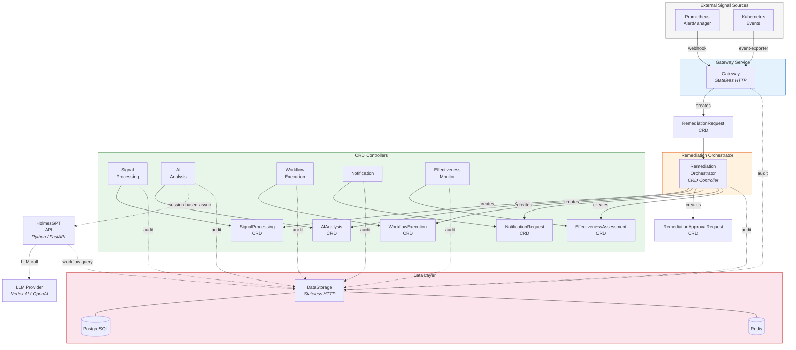
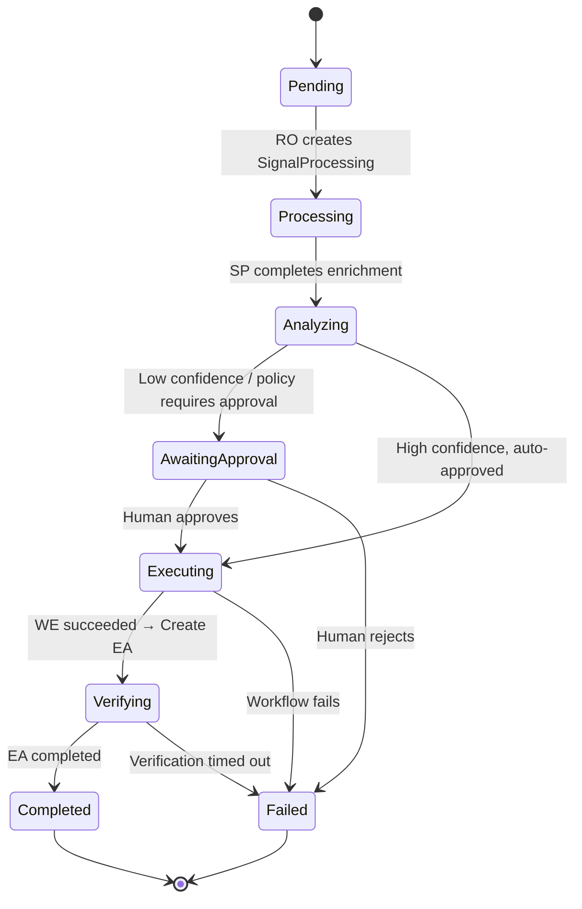

# Architecture Overview

Kubernaut is a microservices platform with 10 services that communicate through Kubernetes Custom Resources (CRDs). This page provides a high-level view of how the services work together.

## System Diagram

## Services

Kubernaut runs **10 services**: 6 CRD controllers, 3 stateless HTTP services, and 1 Python API service.

### CRD Controllers

These services watch Kubernetes Custom Resources and reconcile state:

| Service | Watches | Creates | Role |
|---|---|---|---|
| **Remediation Orchestrator** | RemediationRequest + all child CRDs | SignalProcessing, AIAnalysis, WorkflowExecution, NotificationRequest, EffectivenessAssessment, RemediationApprovalRequest | Coordinates the full remediation lifecycle |
| **Signal Processing** | SignalProcessing | — | Enriches signals with K8s context, classifies severity and signal mode |
| **AI Analysis** | AIAnalysis | — | Calls HolmesGPT for RCA, evaluates approval via Rego policy |
| **Workflow Execution** | WorkflowExecution | Tekton PipelineRun or Job | Runs remediation workflows via Tekton or K8s Jobs |
| **Notification** | NotificationRequest | — | Delivers notifications via Slack, console, file, or log channels |
| **Effectiveness Monitor** | EffectivenessAssessment | — | Assesses whether the remediation fixed the problem |

### Stateless Services

| Service | Role |
|---|---|
| **Gateway** | HTTP entry point for AlertManager webhooks and K8s events; creates RemediationRequest CRDs |
| **DataStorage** | PostgreSQL-backed REST API for audit events, workflow catalog, and action history |
| **HolmesGPT API** | Python FastAPI service that wraps LLM calls for root cause analysis with live `kubectl` access |

## Communication Pattern

All inter-service communication uses **Kubernetes CRDs**. There are no service-to-service HTTP calls in the remediation pipeline (except to DataStorage for audit and to HolmesGPT for LLM calls).

This architecture provides:

- **Resilience** — If a controller restarts, it picks up from the CRD's current state
- **Observability** — Every stage is visible as a Kubernetes resource (`kubectl get`)
- **Auditability** — CRD status transitions are tracked; full audit events go to PostgreSQL
- **Scalability** — Each controller scales independently

## Custom Resources

Kubernaut defines 7 CRD types:

| CRD | API Group | Created By | Watched By |
|---|---|---|---|
| `RemediationRequest` | `kubernaut.ai` | Gateway | Remediation Orchestrator |
| `RemediationApprovalRequest` | `kubernaut.ai` | Remediation Orchestrator | Remediation Orchestrator (RAR audit) |
| `SignalProcessing` | `kubernaut.ai` | Remediation Orchestrator | Signal Processing |
| `AIAnalysis` | `kubernaut.ai` | Remediation Orchestrator | AI Analysis |
| `WorkflowExecution` | `kubernaut.ai` | Remediation Orchestrator | Workflow Execution |
| `NotificationRequest` | `kubernaut.ai` | Remediation Orchestrator | Notification |
| `EffectivenessAssessment` | `kubernaut.ai` | Remediation Orchestrator | Effectiveness Monitor |

## Remediation Lifecycle

A `RemediationRequest` progresses through these phases:

After reaching a terminal phase (Completed, Failed, or TimedOut), the Orchestrator creates:

- A **NotificationRequest** to inform the team
- An **EffectivenessAssessment** to evaluate whether the fix worked

## Data Flow

CRDs are **ephemeral** — they have a 24-hour TTL after completion. The long-term record of every remediation lives in **PostgreSQL** via the audit pipeline.

Every service emits audit events to DataStorage as it processes its CRD. These events capture the full context: what happened, when, why, and who was involved. A complete `RemediationRequest` can be [reconstructed from audit data](../user-guide/data-lifecycle.md) at any time, even after the CRD has expired.

## Next Steps

- [Core Concepts](../user-guide/concepts.md) — Detailed explanation of each stage
- [System Overview](../architecture/overview.md) — Deep-dive architecture documentation
- [CRD Reference](../api-reference/crds.md) — Complete CRD spec/status definitions
