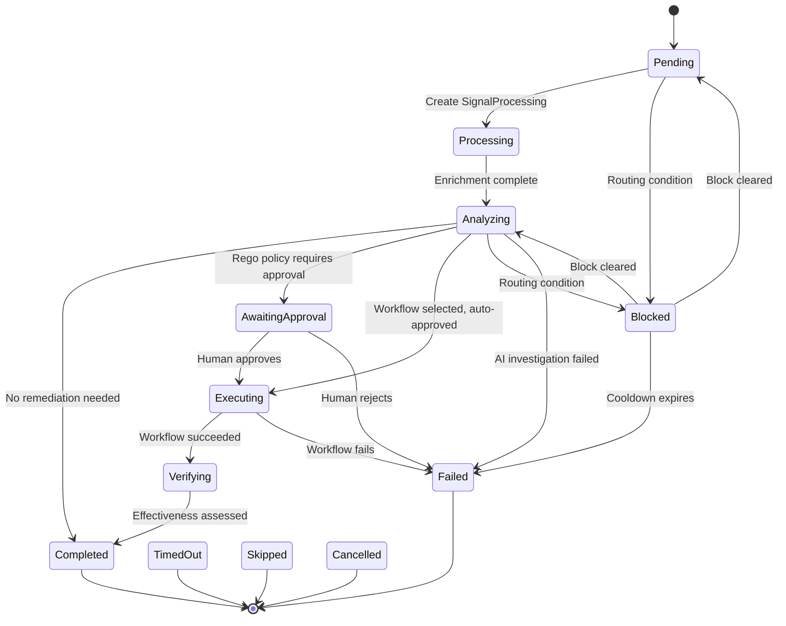

# Architecture Overview

Kubernaut is a microservices platform with 10 services that communicate through Kubernetes Custom Resources (CRDs). This page provides a high-level view of how the services work together.

## System Diagram

<figure markdown="span">
  { width="100%" }
</figure>

The **Gateway** receives signals (Prometheus alerts, Kubernetes events) and creates RemediationRequest CRDs. The **Remediation Orchestrator** coordinates the pipeline, creating child CRDs for each phase. Five phase controllers -- Signal Processing, AI Analysis, Workflow Execution, Effectiveness Monitor, and Notification -- each handle one phase. The **DataStorage** foundation layer persists audit events, the workflow catalog, and remediation history to PostgreSQL (with Valkey for the DLQ). All services emit audit events to DataStorage over HTTP. AI Analysis delegates to HolmesGPT API for LLM-driven investigation, and HolmesGPT API queries DataStorage for the workflow catalog and remediation history.

## Services

Kubernaut runs **10 services**: 6 CRD controllers, 2 stateless HTTP services, 1 admission webhook, and 1 Python API service.

### CRD Controllers

Each CRD is owned by a dedicated controller. See [System Overview](../architecture/overview.md) for the complete service topology and CRD ownership model.

### Stateless Services

See [System Overview](../architecture/overview.md) for the complete service topology including Gateway, DataStorage, Auth Webhook, and HolmesGPT API.

## Communication Pattern

All inter-service communication in the remediation pipeline uses **Kubernetes CRDs**. The HTTP exceptions are: all controllers emit audit events to DataStorage, WFE queries DataStorage for the workflow catalog, RO queries DataStorage for remediation history, AA calls HolmesGPT API for AI investigation, and EM queries AlertManager and Prometheus for effectiveness assessment.

This architecture provides:

- **Resilience** — If a controller restarts, it picks up from the CRD's current state
- **Observability** — Every stage is visible as a Kubernetes resource (`kubectl get`)
- **Auditability** — CRD status transitions are tracked; full audit events go to PostgreSQL
- **Scalability** — Each controller scales independently

## Custom Resources

Kubernaut defines 9 CRD types. Each CRD is owned by a dedicated controller. See [System Overview](../architecture/overview.md) for the complete service topology and CRD ownership model.

## Remediation Lifecycle

A `RemediationRequest` progresses through these phases:

### AI Analysis Outcomes

The **Analyzing** phase represents the LLM investigation via HolmesGPT API. The AI produces one of these outcomes:

| Outcome | RR Transition | Description |
|---|---|---|
| **No remediation needed** | Completed (NoActionRequired) | LLM determines the issue does not require remediation — either the problem self-resolved (e.g., pod recovered) or the condition is benign (e.g., dangling PVC that doesn't warrant action) |
| **Workflow selected** | Executing or AwaitingApproval | LLM identified root cause and selected a workflow; Rego policy determines if approval is required |
| **Investigation inconclusive** | Failed (ManualReviewRequired) | LLM could not produce a reliable RCA (low confidence, incomplete analysis) |
| **No matching workflow** | Failed (ManualReviewRequired) | RCA succeeded but no workflow matches the detected labels |
| **Infrastructure failure** | Failed | API error, timeout, or max retries exceeded communicating with the LLM |

### Blocked Phase

The **Blocked** phase is non-terminal and covers 6 routing scenarios managed by the Orchestrator (not the LLM). See [Core Concepts](../user-guide/concepts.md#blocked-phase) for all block reasons, cooldowns, and exit conditions.

On successful workflow execution, the Orchestrator creates an **EffectivenessAssessment** to evaluate whether the fix worked. Once the assessment completes (or times out), it creates a **NotificationRequest** that includes the remediation outcome and effectiveness results. On failure or escalation, a notification is created directly.

## Data Flow

Every service emits audit events to DataStorage as it processes its CRD. These events capture the full context: what happened, when, why, and who was involved. The long-term record of every remediation lives in **PostgreSQL** via the audit pipeline, so even if CRDs are removed from the cluster, the complete data is preserved. A `RemediationRequest` can be [reconstructed from audit data](../user-guide/data-lifecycle.md) at any time.

## Next Steps

- [Core Concepts](../user-guide/concepts.md) — Detailed explanation of each stage
- [System Overview](../architecture/overview.md) — Deep-dive architecture documentation
- [CRD Reference](../api-reference/crds.md) — Complete CRD spec/status definitions
