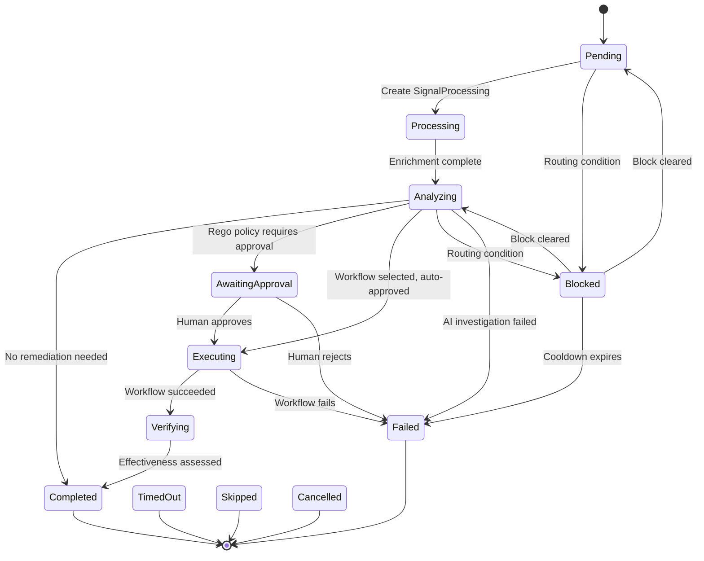

# Architecture Overview

Kubernaut is a microservices platform with 11 services (v1.5+; 10 in v1.4) that communicate through Kubernetes Custom Resources (CRDs). This page provides a high-level view of how the services work together.

## System Diagram

<svg xmlns="http://www.w3.org/2000/svg" viewBox="0 0 820 270" font-family="Inter, -apple-system, BlinkMacSystemFont, 'Segoe UI', sans-serif" style="width:100%;height:auto">
  <defs>
    <marker id="ka" markerWidth="7" markerHeight="5" refX="6" refY="2.5" orient="auto">
      <polygon points="0 0, 7 2.5, 0 5" fill="#B0B0B0"/>
    </marker>
  </defs>
  <rect width="820" height="270" fill="white"/>
  <!-- Gateway (entry point) -->
  <rect x="16" y="16" width="148" height="48" rx="8" fill="#F5F5F5" stroke="#E0E0E0"/>
  <rect x="16" y="16" width="148" height="5" rx="3" fill="#0891B2"/>
  <text x="90" y="40" text-anchor="middle" font-size="12" font-weight="700" fill="#1a1a1a">Gateway</text>
  <text x="90" y="54" text-anchor="middle" font-size="9" fill="#888">Webhook intake + dedup</text>
  <!-- Arrow: Gateway -> RO -->
  <line x1="168" y1="40" x2="192" y2="40" stroke="#B0B0B0" stroke-width="1.5" marker-end="url(#ka)"/>
  <text x="180" y="34" text-anchor="middle" font-size="8" fill="#B0B0B0">RR</text>
  <!-- RO Hub -->
  <rect x="196" y="10" width="410" height="60" rx="10" fill="white" stroke="#0F172A" stroke-width="2"/>
  <rect x="196" y="10" width="410" height="6" rx="3" fill="#0F172A"/>
  <text x="401" y="38" text-anchor="middle" font-size="14" font-weight="700" fill="#0F172A">Remediation Orchestrator</text>
  <text x="401" y="54" text-anchor="middle" font-size="9" fill="#888">Owns RR lifecycle &#x2014; creates child CRDs for each phase</text>
  <!-- Spoke lines: RO bottom (y=70) to box top (y=108) -->
  <line x1="250" y1="70" x2="106" y2="104" stroke="#B0B0B0" stroke-width="1.3" marker-end="url(#ka)"/>
  <line x1="325" y1="70" x2="258" y2="104" stroke="#B0B0B0" stroke-width="1.3" marker-end="url(#ka)"/>
  <line x1="401" y1="70" x2="410" y2="104" stroke="#B0B0B0" stroke-width="1.3" marker-end="url(#ka)"/>
  <line x1="477" y1="70" x2="562" y2="104" stroke="#B0B0B0" stroke-width="1.3" marker-end="url(#ka)"/>
  <line x1="552" y1="70" x2="714" y2="104" stroke="#B0B0B0" stroke-width="1.3" marker-end="url(#ka)"/>
  <!-- Order numbers on spokes -->
  <circle cx="172" cy="84" r="8" fill="white" stroke="#B0B0B0" stroke-width="1"/>
  <text x="172" y="88" text-anchor="middle" font-size="8" font-weight="700" fill="#888">1</text>
  <circle cx="286" cy="84" r="8" fill="white" stroke="#B0B0B0" stroke-width="1"/>
  <text x="286" y="88" text-anchor="middle" font-size="8" font-weight="700" fill="#888">2</text>
  <circle cx="406" cy="84" r="8" fill="white" stroke="#B0B0B0" stroke-width="1"/>
  <text x="406" y="88" text-anchor="middle" font-size="8" font-weight="700" fill="#888">3</text>
  <circle cx="524" cy="84" r="8" fill="white" stroke="#B0B0B0" stroke-width="1"/>
  <text x="524" y="88" text-anchor="middle" font-size="8" font-weight="700" fill="#888">4</text>
  <circle cx="640" cy="84" r="8" fill="white" stroke="#B0B0B0" stroke-width="1"/>
  <text x="640" y="88" text-anchor="middle" font-size="8" font-weight="700" fill="#888">5</text>
  <!-- Spoke 1: Signal Processor -->
  <rect x="38" y="108" width="136" height="52" rx="8" fill="#F5F5F5" stroke="#E0E0E0"/>
  <rect x="38" y="108" width="136" height="5" rx="3" fill="#0891B2"/>
  <text x="106" y="132" text-anchor="middle" font-size="12" font-weight="700" fill="#1a1a1a">Signal Processor</text>
  <text x="106" y="148" text-anchor="middle" font-size="9" fill="#888">Rego classification</text>
  <!-- Spoke 2: AI Analysis -->
  <rect x="190" y="108" width="136" height="52" rx="8" fill="#F5F5F5" stroke="#E0E0E0"/>
  <rect x="190" y="108" width="136" height="5" rx="3" fill="#6366F1"/>
  <text x="258" y="132" text-anchor="middle" font-size="12" font-weight="700" fill="#1a1a1a">AI Analysis</text>
  <text x="258" y="148" text-anchor="middle" font-size="9" fill="#888">LLM investigation + selection</text>
  <!-- Spoke 3: Workflow Execution -->
  <rect x="342" y="108" width="136" height="52" rx="8" fill="#F5F5F5" stroke="#E0E0E0"/>
  <rect x="342" y="108" width="136" height="5" rx="3" fill="#D97706"/>
  <text x="410" y="132" text-anchor="middle" font-size="12" font-weight="700" fill="#1a1a1a">Workflow Exec.</text>
  <text x="410" y="148" text-anchor="middle" font-size="9" fill="#888">Tekton / Job / Ansible</text>
  <!-- Spoke 4: Effectiveness -->
  <rect x="494" y="108" width="136" height="52" rx="8" fill="#F5F5F5" stroke="#E0E0E0"/>
  <rect x="494" y="108" width="136" height="5" rx="3" fill="#059669"/>
  <text x="562" y="132" text-anchor="middle" font-size="12" font-weight="700" fill="#1a1a1a">Effectiveness</text>
  <text x="562" y="148" text-anchor="middle" font-size="9" fill="#888">Health scoring + drift</text>
  <!-- Spoke 5: Notification -->
  <rect x="646" y="108" width="136" height="52" rx="8" fill="#F5F5F5" stroke="#E0E0E0"/>
  <rect x="646" y="108" width="136" height="5" rx="3" fill="#DC2626"/>
  <text x="714" y="132" text-anchor="middle" font-size="12" font-weight="700" fill="#1a1a1a">Notification</text>
  <text x="714" y="148" text-anchor="middle" font-size="9" fill="#888">Slack / PagerDuty / Teams</text>
  <!-- API Frontend (v1.5+) -->
  <rect x="624" y="16" width="180" height="48" rx="8" fill="#F5F5F5" stroke="#E0E0E0"/>
  <rect x="624" y="16" width="180" height="5" rx="3" fill="#8B5CF6"/>
  <text x="714" y="40" text-anchor="middle" font-size="12" font-weight="700" fill="#1a1a1a">API Frontend</text>
  <text x="714" y="54" text-anchor="middle" font-size="9" fill="#888">MCP / A2A / REST (v1.5+)</text>
  <!-- Support Services -->
  <rect x="30" y="182" width="760" height="80" rx="10" fill="white" stroke="#E0E0E0" stroke-width="1"/>
  <rect x="30" y="182" width="6" height="80" rx="3" fill="#64748B"/>
  <text x="50" y="200" font-size="11" font-weight="700" fill="#64748B">Support Services</text>
  <rect x="42" y="210" width="240" height="42" rx="8" fill="#F5F5F5" stroke="#E0E0E0"/>
  <rect x="42" y="210" width="5" height="42" rx="2" fill="#64748B"/>
  <text x="60" y="228" font-size="12" font-weight="600" fill="#1a1a1a">DataStorage</text>
  <text x="60" y="242" font-size="9" fill="#888">PostgreSQL + Valkey</text>
  <rect x="298" y="210" width="240" height="42" rx="8" fill="#F5F5F5" stroke="#E0E0E0"/>
  <rect x="298" y="210" width="5" height="42" rx="2" fill="#64748B"/>
  <text x="316" y="228" font-size="12" font-weight="600" fill="#1a1a1a">AuthWebhook</text>
  <text x="316" y="242" font-size="9" fill="#888">RAR override validation</text>
  <rect x="554" y="210" width="224" height="42" rx="8" fill="#F5F5F5" stroke="#E0E0E0"/>
  <rect x="554" y="210" width="5" height="42" rx="2" fill="#64748B"/>
  <text x="572" y="228" font-size="12" font-weight="600" fill="#1a1a1a">Kubernaut Agent</text>
  <text x="572" y="242" font-size="9" fill="#888">LLM investigation (Go)</text>
</svg>

The **Gateway** receives signals (Prometheus alerts, Kubernetes events) and creates RemediationRequest CRDs. The **Remediation Orchestrator** coordinates the pipeline, creating child CRDs for each phase. Five phase controllers -- Signal Processing, AI Analysis, Workflow Execution, Effectiveness Monitor, and Notification -- each handle one phase. The **DataStorage** foundation layer persists audit events, the workflow catalog, and remediation history to PostgreSQL (with Valkey for the DLQ). All services emit audit events to DataStorage over HTTP. AI Analysis delegates to Kubernaut Agent for LLM-driven investigation, and Kubernaut Agent queries DataStorage for the workflow catalog and remediation history.

## Remediation Pipeline

The pipeline processes signals through five CRD-native phases:

| Phase | What it does | CRD |
|---|---|---|
| **1. Signal Processing** | Ingest alerts (AlertManager, K8s Events), classify severity via OPA/Rego, map to workflow categories | `SignalProcessing` |
| **2. AI Analysis** | Two-invocation LLM pipeline: first invocation investigates with 36 Go tools; second selects workflow from catalog | `AIAnalysis` |
| **3. Approval** | Policy-gated review — auto-approve low-risk, manual review via Slack/Console, operator param override | `RemediationApprovalRequest` |
| **4. Execution** | Run remediation via Tekton Pipelines, Kubernetes Jobs, or Ansible (AWX/AAP) with per-workflow SA | `WorkflowExecution` |
| **5. Effectiveness** | Verify fix via alert resolution, spec drift detection, cooldown monitoring; health score feeds future RCA | `EffectivenessAssessment` |

For a detailed breakdown of all sub-phases and tools, see the [Architecture: Investigation Pipeline](../architecture/kubernaut-agent-investigation.md).

## Services

Kubernaut runs **11 services** (v1.5+): 6 CRD controllers, 2 stateless HTTP services, 1 admission webhook, 1 Go API service, and the API Frontend.

### CRD Controllers

Each CRD is owned by a dedicated controller. See [System Overview](../architecture/overview.md) for the complete service topology and CRD ownership model.

### Stateless Services

See [System Overview](../architecture/overview.md) for the complete service topology including Gateway, DataStorage, Auth Webhook, and Kubernaut Agent.

## Pipeline Modes (v1.5+)

Kubernaut supports two pipeline modes simultaneously:

| | Autonomous | Interactive |
|---|---|---|
| **Trigger** | Alert webhook (Prometheus, K8s Event) | Operator connects via MCP through API Frontend |
| **Workflow selection** | LLM selects automatically | Operator chooses from LLM-populated alternatives |
| **Approval** | Rego policy + RAR gate | Operator's selection is the approval |
| **Visibility** | Post-hoc via kubectl, notifications | Real-time SSE streaming |

Both modes use the same CRDs, audit events, and effectiveness assessments. An investigation started autonomously can be joined mid-flight by an operator via the API Frontend. See [Interactive Sessions](../user-guide/interactive-sessions.md) for the operator guide.

## Communication Pattern

All inter-service communication in the remediation pipeline uses **Kubernetes CRDs**. The HTTP exceptions are: all controllers emit audit events to DataStorage, WFE queries DataStorage for the workflow catalog, RO queries DataStorage for remediation history, AA calls Kubernaut Agent for AI investigation, EM queries AlertManager and Prometheus for effectiveness assessment, and the API Frontend proxies MCP/A2A calls to Kubernaut Agent and DataStorage.

This architecture provides:

- **Resilience** — If a controller restarts, it picks up from the CRD's current state
- **Observability** — Every stage is visible as a Kubernetes resource (`kubectl get`)
- **Auditability** — CRD status transitions are tracked; full audit events go to PostgreSQL
- **Scalability** — Each controller scales independently

## Custom Resources

Kubernaut defines 9 CRD types. Each CRD is owned by a dedicated controller. See [System Overview](../architecture/overview.md) for the complete service topology and CRD ownership model.

## Remediation Lifecycle

A `RemediationRequest` progresses through these phases:

```mermaid
stateDiagram-v2
    [*] --> Pending
    Pending --> Processing: Create SignalProcessing
    Pending --> Blocked: Routing condition
    Processing --> Analyzing: Enrichment complete
    Analyzing --> Completed: No remediation needed
    Analyzing --> AwaitingApproval: Rego policy requires approval
    Analyzing --> Executing: Workflow selected, auto-approved
    Analyzing --> Blocked: Routing condition
    Analyzing --> Failed: AI investigation failed
    AwaitingApproval --> Executing: Human approves
    AwaitingApproval --> Failed: Human rejects
    Executing --> Verifying: Workflow succeeded
    Executing --> Failed: Workflow fails
    Verifying --> Completed: Effectiveness assessed
    Blocked --> Failed: Cooldown expires
    Blocked --> Analyzing: Block cleared
    Blocked --> Pending: Block cleared
    Completed --> [*]
    Failed --> [*]
    TimedOut --> [*]
    Skipped --> [*]
    Cancelled --> [*]
```

### AI Analysis Outcomes

The **Analyzing** phase represents the LLM investigation via Kubernaut Agent. The AI produces one of these outcomes:

| Outcome | RR Transition | Description |
|---|---|---|
| **No remediation needed** | Completed (NoActionRequired) | LLM determines the issue does not require remediation — either the problem self-resolved (e.g., pod recovered) or the condition is benign (e.g., dangling PVC that doesn't warrant action) |
| **Workflow selected** | Executing or AwaitingApproval | LLM identified root cause and selected a workflow; Rego policy determines if approval is required |
| **Investigation inconclusive** | Failed (ManualReviewRequired) | LLM could not produce a reliable RCA (low confidence, incomplete analysis) |
| **No matching workflow** | Failed (ManualReviewRequired) | RCA succeeded but no workflow matches the detected labels |
| **Infrastructure failure** | Failed | API error, timeout, or max retries exceeded communicating with the LLM |

### Blocked Phase

The **Blocked** phase is non-terminal and covers 6 routing scenarios managed by the Orchestrator (not the LLM). See [Core Concepts](../user-guide/concepts.md#blocked-phase) for all block reasons, cooldowns, and exit conditions.

On successful workflow execution, the Orchestrator creates an **EffectivenessAssessment** to evaluate whether the fix worked. Once the assessment completes (or times out), it creates a **NotificationRequest** that includes the remediation outcome and effectiveness results. On failure or escalation, a notification is created directly.

## Data Flow

Every service emits audit events to DataStorage as it processes its CRD. These events capture the full context: what happened, when, why, and who was involved. The long-term record of every remediation lives in **PostgreSQL** via the audit pipeline, so even if CRDs are removed from the cluster, the complete data is preserved. A `RemediationRequest` can be [reconstructed from audit data](../user-guide/data-lifecycle.md) at any time.

## Next Steps

- [Core Concepts](../user-guide/concepts.md) — Detailed explanation of each stage
- [System Overview](../architecture/overview.md) — Deep-dive architecture documentation
- [CRD Reference](../api-reference/crds.md) — Complete CRD spec/status definitions
