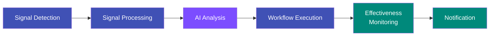

---
hide:
  - navigation
  - toc
---

# Kubernaut

## AIOps Platform for Intelligent Kubernetes Remediation

Kubernaut is an open-source AIOps platform that closes the loop from Kubernetes alert to automated remediation — without a human in the middle. When something goes wrong in your cluster (an OOMKill, a CrashLoopBackOff, node pressure), Kubernaut detects the signal, enriches it with context, sends it to an LLM for live root cause investigation, matches a remediation workflow from a searchable catalog, and executes the fix — or escalates to a human with a full RCA when it can't.

**Mean time to resolution drops from 60 minutes to under 5**, while humans stay in control through approval gates, configurable confidence thresholds, and SOC2-compliant audit trails.

---

-   :material-rocket-launch:{ .lg .middle } **Getting Started**

    ---

    Install Kubernaut with Helm and run your first automated remediation in under 5 minutes.

    [:octicons-arrow-right-24: Installation](getting-started/installation.md)

-   :material-book-open-variant:{ .lg .middle } **User Guide**

    ---

    Learn core concepts — signals, workflows, approval gates, effectiveness monitoring, and audit trails.

    [:octicons-arrow-right-24: Core Concepts](user-guide/concepts.md)

-   :material-sitemap:{ .lg .middle } **Architecture**

    ---

    Understand the 10-service microservices architecture, CRD communication patterns, and data flows.

    [:octicons-arrow-right-24: Architecture Overview](getting-started/architecture-overview.md)

-   :material-api:{ .lg .middle } **API Reference**

    ---

    CRD specifications, DataStorage REST API, and HolmesGPT API reference.

    [:octicons-arrow-right-24: API Reference](api-reference/index.md)

---

## How It Works

Kubernaut automates the entire incident response lifecycle through a six-stage pipeline:

1. **Signal Detection** — Receives alerts from Prometheus AlertManager and Kubernetes Events, validates resource scope, and creates a `RemediationRequest`.
2. **Signal Processing** — Enriches the signal with Kubernetes context (owner chain, namespace labels, workload details), environment classification, priority assignment, business classification, severity normalization, and signal mode.
3. **AI Analysis** — HolmesGPT investigates the incident live using Kubernetes inspection tools (logs, events, resource state, live metrics) and optionally Prometheus, Grafana Loki, and other configured toolsets. It produces a root cause analysis, resolves the target resource's owner chain and remediation history, detects infrastructure labels (GitOps, Helm, service mesh, HPA, PDB), and searches the workflow catalog for a matching remediation.
4. **Workflow Execution** — Runs the selected remediation via Tekton Pipelines or Kubernetes Jobs, with optional human approval gates.
5. **Effectiveness Monitoring** — Evaluates whether the fix actually worked via spec hash comparison, health checks, alert resolution, and effectiveness scoring.
6. **Notification** — Notifies the team with the full remediation outcome, including the effectiveness assessment results.

---

## Key Capabilities

| Capability | Description |
|---|---|
| **Multi-Source Signal Ingestion** | Prometheus alerts (reactive and proactive), Kubernetes events, fingerprint-based deduplication at the Gateway, signal mode classification |
| **AI-Powered Root Cause Analysis** | HolmesGPT with LLM providers (Vertex AI, OpenAI, LiteLLM), Kubernetes inspection tools, and configurable observability toolsets (Prometheus, Grafana Loki/Tempo, and more) |
| **Workflow Catalog** | Searchable OCI-containerized workflows with label-based matching and confidence scoring |
| **Flexible Execution** | Tekton Pipelines (multi-step) or Kubernetes Jobs (single-step) with optional human approval gates |
| **Resource Scope Management** | Label-based opt-in (`kubernaut.ai/managed=true`) controls which resources Kubernaut manages |
| **Safety-First Design** | Admission webhooks, human approval gates, configurable confidence thresholds, effectiveness tracking |
| **SOC2 Compliance** | Full audit trails with 7-year retention, CRD reconstruction from audit events, operator attribution |
| **Effectiveness Tracking** | Four-dimensional assessment (health, alert resolution, metrics, spec drift) with weighted scoring; remediation history feeds into HolmesGPT so the LLM avoids repeating failed remediations |

---

## Project Links

- [:fontawesome-brands-github: GitHub Repository](https://github.com/jordigilh/kubernaut)
- [:fontawesome-brands-github: Issues & Feature Requests](https://github.com/jordigilh/kubernaut/issues)
- [:fontawesome-brands-github: Discussions](https://github.com/jordigilh/kubernaut/discussions)
