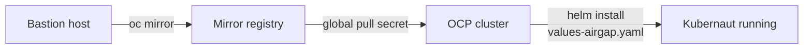

# Disconnected (Air-Gapped) Installation

Install Kubernaut on a disconnected OpenShift cluster by mirroring all container images to a private registry and layering the `values-airgap.yaml` Helm overlay. The chart deploys ~12 microservices plus PostgreSQL, Valkey, and several hook Jobs -- all of which require pre-mirrored images.

## Prerequisites

| Requirement | Details |
|-------------|---------|
| **Bastion host** | A machine with access to both the public internet and your mirror registry. Used to run `oc mirror`. |
| **Mirror registry** | A container registry accessible from the disconnected cluster (Quay, Harbor, Nexus, or the OCP integrated registry). |
| **`oc` CLI + `oc mirror` plugin** | OpenShift CLI 4.13+. Install the mirror plugin per [OCP documentation](https://docs.openshift.com/container-platform/latest/installing/disconnected_install/installing-mirroring-disconnected.html). |
| **`helm` CLI** | Helm 3.12 or later. |
| **Cluster admin access** | `cluster-admin` privileges on the target disconnected cluster. |
| **Kubernaut chart source** | A clone of [github.com/jordigilh/kubernaut](https://github.com/jordigilh/kubernaut) on the bastion host. |

!!! info "LLM endpoint"
    Kubernaut's AI analysis service (HolmesGPT) requires an LLM. In a disconnected environment, deploy a locally hosted LLM accessible from inside the cluster (e.g., [LiteLLM](https://docs.litellm.ai/) or any OpenAI-compatible endpoint). Configure the endpoint in your SDK config file (see [HolmesGPT SDK Config](../user-guide/configmap-holmesgpt.md)).

---

## Step 1: Identify all images

### Kubernaut service images

All published under `quay.io/kubernaut-ai/` with a tag matching the chart version:

| Image | Description |
|-------|-------------|
| `quay.io/kubernaut-ai/gateway` | Signal ingestion webhook |
| `quay.io/kubernaut-ai/datastorage` | Audit trail and workflow catalog persistence |
| `quay.io/kubernaut-ai/aianalysis` | Root cause analysis controller |
| `quay.io/kubernaut-ai/signalprocessing` | Signal deduplication and enrichment |
| `quay.io/kubernaut-ai/remediationorchestrator` | Remediation workflow orchestration |
| `quay.io/kubernaut-ai/workflowexecution` | Job / Tekton execution engine |
| `quay.io/kubernaut-ai/notification` | Notification delivery (Slack, console) |
| `quay.io/kubernaut-ai/effectivenessmonitor` | Post-remediation effectiveness verification |
| `quay.io/kubernaut-ai/holmesgpt-api` | LLM integration service |
| `quay.io/kubernaut-ai/authwebhook` | Admission controller for CRD authorization |

### Infrastructure images

| Image | Description |
|-------|-------------|
| `registry.redhat.io/rhel10/postgresql-16` | PostgreSQL 16 (Red Hat RHEL10) |
| `registry.redhat.io/rhel10/valkey-8` | Valkey 8 (Red Hat RHEL10) |
| `registry.redhat.io/openshift4/ose-cli-rhel9:v4.17` | OCP CLI for TLS certificate hook Jobs |
| `quay.io/kubernaut-ai/db-migrate:{{ image_tag }}` | Database migrations (goose + psql on UBI9) |

### Automated image list

Use the included script to extract the exact images from the chart templates:

```bash
./hack/airgap/generate-image-list.sh \
  --set global.image.tag={{ image_tag }} \
  -f charts/kubernaut/values-ocp.yaml
```

This outputs one image per line -- the authoritative list of everything to mirror.

---

## Step 2: Mirror images to your registry

### 2a. Prepare the ImageSetConfiguration

Copy the template and replace the version placeholder:

```bash
cp hack/airgap/imageset-config.yaml.tmpl imageset-config.yaml
sed -i 's/<VERSION>/{{ image_tag }}/g' imageset-config.yaml
```

The resulting file lists every image under `mirror.additionalImages`:

```yaml
kind: ImageSetConfiguration
apiVersion: mirror.openshift.io/v1alpha2
storageConfig:
  local:
    path: ./kubernaut-mirror
mirror:
  additionalImages:
    - name: quay.io/kubernaut-ai/gateway:{{ image_tag }}
    - name: quay.io/kubernaut-ai/datastorage:{{ image_tag }}
    # ... all 10 Kubernaut services ...
    - name: quay.io/kubernaut-ai/db-migrate:{{ image_tag }}
    - name: registry.redhat.io/rhel10/postgresql-16
    - name: registry.redhat.io/rhel10/valkey-8
    - name: registry.redhat.io/openshift4/ose-cli-rhel9:v4.17
```

### 2b. Run oc mirror

From the bastion host:

```bash
oc mirror --config=imageset-config.yaml \
  docker://<mirror-registry>
```

Replace `<mirror-registry>` with your private registry hostname (e.g., `mirror.corp.example.com:5000`). Multi-architecture manifests (amd64 + arm64) are handled automatically.

!!! tip "Alternative: skopeo"
    For individual images (nested registry):

    ```bash
    skopeo copy \
      docker://quay.io/kubernaut-ai/gateway:{{ image_tag }} \
      docker://harbor.corp/kubernaut-ai/gateway:{{ image_tag }}
    ```

    For flat registries (quay.io, Docker Hub) use dash-joined names:

    ```bash
    skopeo copy \
      docker://quay.io/kubernaut-ai/gateway:{{ image_tag }} \
      docker://quay.io/myorg/kubernaut-ai-gateway:{{ image_tag }}
    ```

    `oc mirror` is preferred because it processes all images in one pass and preserves multi-arch manifests.

!!! warning "OCP internal registry and multi-arch images"
    The OCP integrated registry does not support multi-arch manifest pushes via `skopeo copy --all` (returns HTTP 500). When mirroring to the OCP internal registry with skopeo, use single-arch copies:

    ```bash
    skopeo copy --override-arch=amd64 --override-os=linux \
      docker://quay.io/kubernaut-ai/gateway:{{ image_tag }} \
      docker://<ocp-registry>/kubernaut-system/kubernaut-ai-gateway:{{ image_tag }}
    ```

    This limitation does not affect `oc mirror`, which handles the OCP registry natively.

---

## Step 3: Configure the global pull secret

Add your mirror registry credentials to the OCP global pull secret so every node can pull from it.

### 3a. Export the current pull secret

```bash
oc get secret/pull-secret -n openshift-config \
  -o jsonpath='{.data.\.dockerconfigjson}' | base64 -d > pull-secret.json
```

### 3b. Add mirror registry credentials

```bash
oc registry login --registry=<mirror-registry> \
  --auth-basic=<username>:<password> \
  --to=pull-secret.json
```

### 3c. Update the cluster

```bash
oc set data secret/pull-secret -n openshift-config \
  --from-file=.dockerconfigjson=pull-secret.json
```

!!! warning
    Updating the global pull secret triggers a rolling restart of all nodes via the Machine Config Operator. This can take 15-30 minutes depending on cluster size.

---

## Step 4: Install the Kubernaut Helm chart

### 4a. Provision secrets

The chart auto-generates PostgreSQL, DataStorage, and Valkey credentials. For disconnected environments where you want explicit control over passwords, create them before install:

```bash
kubectl create namespace kubernaut-system

kubectl create secret generic postgresql-secret \
  --from-literal=POSTGRES_USER=slm_user \
  --from-literal=POSTGRES_PASSWORD=<password> \
  --from-literal=POSTGRES_DB=action_history \
  -n kubernaut-system

kubectl create secret generic datastorage-db-secret \
  --from-literal=db-secrets.yaml=$'username: slm_user\npassword: <password>' \
  -n kubernaut-system

kubectl create secret generic valkey-secret \
  --from-literal=valkey-secrets.yaml=$'password: <password>' \
  -n kubernaut-system

kubectl create secret generic llm-credentials \
  --from-literal=OPENAI_API_KEY=<your-local-llm-key> \
  -n kubernaut-system
```

See the [secret provisioning](../getting-started/installation.md#2-provision-secrets) reference for details. If you prefer auto-generated credentials, omit the first three secrets — only `llm-credentials` is required.

### 4b. Edit the air-gap overlay

Replace every `<mirror-registry>` placeholder in `values-airgap.yaml` with your actual registry hostname:

```bash
sed -i 's/<mirror-registry>/mirror.corp.example.com:5000/g' \
  charts/kubernaut/values-airgap.yaml
```

The overlay overrides all image references:

```yaml
global:
  image:
    registry: <mirror-registry>
    namespace: kubernaut-ai
    separator: "/"   # use "-" for flat registries (quay.io, Docker Hub)

postgresql:
  image: <mirror-registry>/rhel10/postgresql-16

valkey:
  image: <mirror-registry>/rhel10/valkey-8

hooks:
  tlsCerts:
    image: <mirror-registry>/openshift4/ose-cli-rhel9:v4.17
```

The `db-migrate` image tag is derived from `global.image.*`, so no separate override is needed.

The `separator` field controls how the namespace is joined to the service name:

| Separator | Result for gateway | Compatible registries |
|-----------|-------------------|----------------------|
| `/` (default) | `<mirror>/kubernaut-ai/gateway:tag` | Harbor, Artifactory, generic Docker v2 |
| `-` | `<mirror>/kubernaut-ai-gateway:tag` | quay.io, Docker Hub, OCP internal |

### 4c. Install with layered overlays

The three value files must be layered in this order:

| Order | File | Purpose |
|-------|------|---------|
| 1 | `values-ocp.yaml` | Red Hat images, OCP monitoring endpoints |
| 2 | `values-airgap.yaml` | Overrides all image refs to point at your mirror registry |

!!! important "Layering order"
    `values-airgap.yaml` **must** come after `values-ocp.yaml`. It overrides the `registry.redhat.io` image references with your mirror registry. The `postgresql.variant: ocp` setting from `values-ocp.yaml` is preserved, ensuring correct PostgreSQL environment variable names and data directory paths.

Prepare your SDK config file with the local LLM endpoint (see [HolmesGPT SDK Config](../user-guide/configmap-holmesgpt.md)):

```yaml
# my-sdk-config.yaml
llm:
  provider: litellm
  model: gpt-4o
  endpoint: http://litellm.internal.svc:4000
```

**Nested registry** (Harbor, Artifactory):

```bash
helm install kubernaut charts/kubernaut/ \
  --namespace kubernaut-system \
  -f charts/kubernaut/values-ocp.yaml \
  -f charts/kubernaut/values-airgap.yaml \
  --set global.image.registry=harbor.corp \
  --set-file holmesgptApi.sdkConfigContent=my-sdk-config.yaml
```

**Flat registry** (quay.io, OCP internal):

```bash
helm install kubernaut charts/kubernaut/ \
  --namespace kubernaut-system \
  -f charts/kubernaut/values-ocp.yaml \
  -f charts/kubernaut/values-airgap.yaml \
  --set global.image.registry=quay.io/myorg \
  --set global.image.separator=- \
  --set-file holmesgptApi.sdkConfigContent=my-sdk-config.yaml
```

If you created secrets manually in step 4a, add the corresponding `--set` flags:

```bash
  --set postgresql.auth.existingSecret=postgresql-secret \
  --set datastorage.dbExistingSecret=datastorage-db-secret \
  --set valkey.existingSecret=valkey-secret
```

---

## Step 5: Verify the installation

### Pod status

```bash
kubectl get pods -n kubernaut-system
```

All pods should reach `1/1 Running` within a few minutes.

### Image pull errors

If any pod is stuck in `ImagePullBackOff` or `ErrImagePull`:

```bash
kubectl describe pod <pod-name> -n kubernaut-system | grep -A5 "Events:"
```

Common causes:

- Image not mirrored -- re-run `oc mirror`
- Mirror credentials missing from global pull secret -- re-run [Step 3](#step-3-configure-the-global-pull-secret)
- Typo in registry hostname in `values-airgap.yaml`

Verify the actual image reference a pod is using:

```bash
kubectl get pod <pod-name> -n kubernaut-system \
  -o jsonpath='{.spec.containers[0].image}'
```

### Migration Job

The database migration runs as a post-install Helm hook:

```bash
kubectl get jobs -n kubernaut-system | grep migration
```

The job should show `1/1` completions. If it failed:

```bash
kubectl logs job/<release-name>-db-migration -n kubernaut-system
```

### Service health

```bash
kubectl port-forward -n kubernaut-system svc/holmesgpt-api 8080:8080
curl -s http://localhost:8080/health | jq '.'
```

---

## Optional: ImageDigestMirrorSet (IDMS)

As an alternative to `values-airgap.yaml`, an `ImageDigestMirrorSet` configures OCP to transparently redirect image pulls from source registries to your mirror at the CRI-O level. This is useful when multiple applications in the cluster pull from the same source registries.

!!! note
    IDMS requires OCP 4.13+. For older versions, use the deprecated `ImageContentSourcePolicy` (ICSP) with the same mirror mappings.

```yaml
apiVersion: config.openshift.io/v1
kind: ImageDigestMirrorSet
metadata:
  name: kubernaut-mirror
spec:
  imageDigestMirrors:
    - source: quay.io/kubernaut-ai
      mirrors:
        - <mirror-registry>/kubernaut-ai   # nested; or <mirror-registry> for flat naming
    - source: registry.redhat.io
      mirrors:
        - <mirror-registry>
```

```bash
oc apply -f idms-kubernaut.yaml
```

When using IDMS, install with just `values-ocp.yaml` (no `values-airgap.yaml`). However, IDMS only redirects **digest-based** references -- not tags. To use digest references with the chart, set `global.image.digest`:

```bash
helm install kubernaut charts/kubernaut/ \
  --namespace kubernaut-system \
  -f charts/kubernaut/values-ocp.yaml \
  --set global.image.digest=sha256:<digest> \
  --set-file holmesgptApi.sdkConfigContent=my-sdk-config.yaml
```

!!! tip "Recommendation"
    For most disconnected installs, `values-airgap.yaml` (direct mirror pull) is simpler and more predictable than IDMS. Use IDMS when you have cluster-wide registry redirection policies already in place.

---

## Troubleshooting

### TLS certificate hook fails

The `tls-cert-gen` Job uses `ose-cli-rhel9` to generate self-signed certificates. If this image wasn't mirrored, pods that depend on TLS (e.g., authwebhook) won't start.

Mirror `registry.redhat.io/openshift4/ose-cli-rhel9:v4.17` and retry:

```bash
helm upgrade kubernaut charts/kubernaut/ \
  --namespace kubernaut-system \
  -f charts/kubernaut/values-ocp.yaml \
  -f charts/kubernaut/values-airgap.yaml \
  --set-file holmesgptApi.sdkConfigContent=my-sdk-config.yaml
```

### Migration Job fails connecting to PostgreSQL

If the `db-migration` Job logs show `pg_isready` failures or `goose` connection refused errors, the PostgreSQL pod likely hasn't started. Check whether its image was mirrored:

```bash
kubectl get pod -l app=postgresql -n kubernaut-system
```

If the PostgreSQL pod is in `ImagePullBackOff`, mirror `registry.redhat.io/rhel10/postgresql-16` and delete the failed Job so the next `helm upgrade` recreates it.

### Verifying mirror registry contents

```bash
# Nested registry (separator="/"):
skopeo list-tags docker://<mirror-registry>/kubernaut-ai/gateway
skopeo inspect docker://<mirror-registry>/kubernaut-ai/gateway:{{ image_tag }}

# Flat registry (separator="-"):
skopeo list-tags docker://<mirror-registry>/kubernaut-ai-gateway
skopeo inspect docker://<mirror-registry>/kubernaut-ai-gateway:{{ image_tag }}
```

---

## Summary



1. **Mirror** all images from public registries to your private mirror using `oc mirror`
2. **Configure** the OCP global pull secret with mirror registry credentials
3. **Install** the chart layering `values-ocp.yaml` + `values-airgap.yaml` with `--set-file` for mandatory configs
4. **Verify** pods are running and pulling from the correct registry
