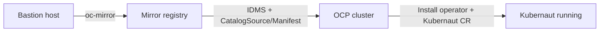

# Disconnected (Air-Gapped) Installation

This guide covers deploying Kubernaut in a disconnected OpenShift cluster. The **Kubernaut Operator** is the production method; the **Helm chart** is available for development and testing only.

| Method | Mirroring | Image redirection | Install |
|---|---|---|---|
| **Operator (OLM)** | `oc-mirror` reads the operator catalog and discovers all images automatically from `relatedImages` | IDMS — transparent CRI-O rewrite | OperatorHub / `Subscription` CR |
| **Operator (Direct Manifest)** | Manual `ImageSetConfiguration` listing every image by `@sha256:` digest | IDMS — transparent CRI-O rewrite | `oc apply -f install.yaml` |
| **Helm chart** | Manual `ImageSetConfiguration` listing every image | `values-airgap.yaml` overlay overriding image refs | `helm install` with layered overlays |

!!! warning "Production deployments"
    The Kubernaut Operator (OLM or direct manifest) is the only supported production deployment method for disconnected environments. The Helm chart path is retained for development and testing only.

## Prerequisites

| Requirement | Details |
|---|---|
| **Bastion host** | Access to both the public internet and the mirror registry |
| **Mirror registry** | Quay, Harbor, Nexus, or OCP internal registry accessible from the disconnected cluster |
| **`oc` CLI + `oc-mirror` v2** | OpenShift CLI 4.16+. `oc-mirror` v1 is deprecated as of OCP 4.18; use v2. |
| **Cluster admin access** | `cluster-admin` privileges on the target disconnected cluster |
| **PostgreSQL 15+** | **BYO** — the operator does not deploy a database. Provide connection details via `spec.postgresql` in the Kubernaut CR. **Must have a PVC for production** (see [Step 3.3](#step-33-provision-persistent-storage)). |
| **Valkey / Redis 7+** | **BYO** — provide connection details via `spec.valkey`. **Must have a PVC for production** (see [Step 3.3](#step-33-provision-persistent-storage)). |

!!! info "LLM endpoint"
    The Kubernaut Agent requires an LLM. In a disconnected environment, deploy a locally hosted LLM accessible from inside the cluster — either **Ollama** or any **OpenAI-compatible endpoint** (vLLM, LocalAI, TGI). See [LLM Configuration Reference](#llm-configuration-reference) for all supported providers.

---

## Operator (OLM) — Production {: #operator-olm }

The operator catalog contains the bundle metadata (CSV, CRDs) and declares every operand image in `relatedImages`. The `oc-mirror` tool reads the catalog, discovers all images, and mirrors them in one pass. On the disconnected cluster, an `ImageDigestMirrorSet` (IDMS) transparently redirects image pulls from the source registries to your mirror at the CRI-O level.

### Images

The operator catalog embeds references to all required images. You do **not** need to maintain a manual image list — `oc-mirror` discovers them automatically from the CSV `relatedImages` section.

For reference, the full set (19 images) is:

| Layer | Image | Purpose |
|---|---|---|
| **Catalog** | `quay.io/kubernaut-ai/kubernaut-operator-catalog@sha256:...` | OLM index — makes the operator visible in OperatorHub |
| **Bundle** | `quay.io/kubernaut-ai/kubernaut-operator-bundle@sha256:...` | CSV + CRDs + metadata for a specific version |
| **Operator** | `quay.io/kubernaut-ai/kubernaut-operator@sha256:...` | Controller manager binary |
| **Operands** | | |
| | `quay.io/kubernaut-ai/gateway` | Signal ingestion webhook |
| | `quay.io/kubernaut-ai/datastorage` | Audit trail and workflow catalog persistence |
| | `quay.io/kubernaut-ai/aianalysis` | Root cause analysis controller |
| | `quay.io/kubernaut-ai/signalprocessing` | Signal deduplication and enrichment |
| | `quay.io/kubernaut-ai/remediationorchestrator` | Remediation workflow orchestration |
| | `quay.io/kubernaut-ai/workflowexecution` | Job / Tekton execution engine |
| | `quay.io/kubernaut-ai/notification` | Notification delivery (Slack, Teams, PagerDuty) |
| | `quay.io/kubernaut-ai/effectivenessmonitor` | Post-remediation effectiveness verification |
| | `quay.io/kubernaut-ai/kubernautagent` | LLM integration service |
| | `quay.io/kubernaut-ai/authwebhook` | Admission controller for CRD authorization |
| | `quay.io/kubernaut-ai/apifrontend` | API Frontend service (v1.5+) |
| | `quay.io/kubernaut-ai/db-migrate` | Database schema migration |
| | `quay.io/kubernaut-ai/kubernaut-console` | Console web UI (v1.5.1+) |
| | `quay.io/oauth2-proxy/oauth2-proxy` | Console authentication sidecar |
| **Init images** | | |
| | `registry.redhat.io/rhel10/postgresql-16` | PostgreSQL client for init containers |
| | `registry.access.redhat.com/ubi10/ubi-minimal` | Minimal UBI for CA-bundle init containers |

### Step 1: Get the ImageSetConfiguration

The operator repository provides a ready-to-use `ImageSetConfiguration` with all images pinned by digest at [`hack/airgap/imageset-config.yaml`](https://github.com/jordigilh/kubernaut-operator/blob/main/hack/airgap/imageset-config.yaml). Download it to the bastion host:

```bash
curl -fsSL \
  https://raw.githubusercontent.com/jordigilh/kubernaut-operator/main/hack/airgap/imageset-config.yaml \
  -o imageset-config.yaml
```

!!! tip "Why digests instead of tags?"
    IDMS only redirects **digest-based** image references — not tags. The operator CSV `relatedImages` already pins all operand images by digest. Using the upstream manifest ensures your mirror contains the exact images the operator expects, and IDMS can redirect them transparently.

### Step 2: Mirror images

From the bastion host:

```bash
oc-mirror --config imageset-config.yaml \
  docker://<mirror-registry>
```

Replace `<mirror-registry>` with your private registry hostname (e.g., `mirror.corp.example.com:5000`).

`oc-mirror` v2 supports three workflows depending on your network topology:

| Workflow | Use case |
|---|---|
| `mirrorToMirror` (default) | Bastion has access to both internet and mirror registry |
| `mirrorToDisk` + `diskToMirror` | Bastion has internet only; transfer archive to disconnected side via removable media |

For the two-step workflow:

```bash
# On bastion (internet access):
oc-mirror --config imageset-config.yaml \
  file://kubernaut-archive

# Transfer kubernaut-archive/ to disconnected side, then:
oc-mirror --from kubernaut-archive \
  docker://<mirror-registry>
```

### Step 3: Apply mirroring artifacts

`oc-mirror` generates IDMS (or ICSP for OCP < 4.13) and CatalogSource manifests in the results directory:

```bash
oc apply -f oc-mirror-workspace/results-*/
```

This creates:

- An `ImageDigestMirrorSet` that tells CRI-O to redirect pulls from `quay.io/kubernaut-ai/*` and `registry.redhat.io/*` to your mirror registry
- A `CatalogSource` pointing at the mirrored operator catalog in your internal registry

Verify:

```bash
oc get imagedigestmirrorset
```

### Step 4: Configure the global pull secret

Add your mirror registry credentials so every node can pull from it:

```bash
oc get secret/pull-secret -n openshift-config \
  -o jsonpath='{.data.\.dockerconfigjson}' | base64 -d > pull-secret.json

oc registry login --registry=<mirror-registry> \
  --auth-basic=<username>:<password> \
  --to=pull-secret.json

oc set data secret/pull-secret -n openshift-config \
  --from-file=.dockerconfigjson=pull-secret.json
```

!!! warning
    Updating the global pull secret triggers a rolling restart of all nodes via the Machine Config Operator. This can take 15--30 minutes depending on cluster size.

### Step 5: Install the operator

The operator now appears in OperatorHub. Install it the same way as on a connected cluster:

**Option A: OpenShift Console**

Navigate to **Operators > OperatorHub**, search for "Kubernaut", and click **Install**. Select the target namespace and approval strategy.

**Option B: CLI**

```bash
oc create namespace kubernaut

cat <<EOF | oc apply -f -
apiVersion: operators.coreos.com/v1
kind: OperatorGroup
metadata:
  name: kubernaut-operator
  namespace: kubernaut
spec:
  targetNamespaces:
    - kubernaut
EOF

cat <<EOF | oc apply -f -
apiVersion: operators.coreos.com/v1alpha1
kind: Subscription
metadata:
  name: kubernaut-operator
  namespace: kubernaut
spec:
  channel: alpha
  name: kubernaut-operator
  source: cs-kubernaut-operator-catalog
  sourceNamespace: openshift-marketplace
  installPlanApproval: Automatic
EOF
```

!!! tip
    The `source` name matches the CatalogSource created by `oc-mirror`. Check the exact name with `oc get catalogsource -n openshift-marketplace`.

Wait for the operator to reach `Succeeded`:

```bash
oc get csv -n kubernaut -w
```

Then proceed to [Step 3: Provision Prerequisites](#step-3-provision-prerequisites) below.

### Per-component image overrides (optional)

If you need to override individual component images without cluster-wide IDMS (e.g., testing a custom build), use `spec.image.overrides` in the Kubernaut CR:

```yaml
spec:
  image:
    overrides:
      gateway: "<mirror-registry>/kubernaut-ai/gateway@sha256:..."
      datastorage: "<mirror-registry>/kubernaut-ai/datastorage@sha256:..."
      apifrontend: "<mirror-registry>/kubernaut-ai/apifrontend@sha256:..."
```

The operator resolves images in this order:

1. `spec.image.overrides[componentName]` — CR-level override (highest priority)
2. `RELATED_IMAGE_<SUFFIX>` env var — set by OLM, rewritten by IDMS
3. Error if neither is set

---

## Operator (Direct Manifest) — Production {: #operator-direct }

For environments where OLM is not available or not desired, the operator can be installed directly from a manifest file. This method has been **validated on OCP 4.18+ with operator v1.5.1** in fully air-gapped environments.

When using `oc mirror`, the generated `ImageDigestMirrorSet` (IDMS) instructs CRI-O to transparently redirect image pulls to your mirror registry. This means you do **not** need to manually rewrite image references in manifests or `RELATED_IMAGE_*` env vars — the original image references work as-is once IDMS is applied.

### Image Inventory (v1.5.1)

#### Operator Image

| Component | Source Image |
|---|---|
| kubernaut-operator | `quay.io/kubernaut-ai/kubernaut-operator@sha256:586e5344ec3897fa2e80bab5207f1eca1611fdc4c6db80113247a1539c7941b7` |

#### Kubernaut v1.5.1 Component Images

| Component | Source Image |
|---|---|
| gateway | `quay.io/kubernaut-ai/gateway@sha256:8ef1d69db4508bfa0ab86e7f22100952ddae85c6e22d81293580d9defaf94004` |
| datastorage | `quay.io/kubernaut-ai/datastorage@sha256:f10d8c98017c7df35133dc98f0e26e36054ec4584ac5c230b0252d3a5c9a0b44` |
| aianalysis | `quay.io/kubernaut-ai/aianalysis@sha256:b31b8aaba5f4f3d5df1639213bca23c63438e257704ee0ac6d5f1d9ec82314b0` |
| signalprocessing | `quay.io/kubernaut-ai/signalprocessing@sha256:de7393f8d0cbd07fadacf13ae0b9504cec321c09e1614c6839ccf1c65ec4d86e` |
| remediationorchestrator | `quay.io/kubernaut-ai/remediationorchestrator@sha256:54778cdfd8e3a7fcef4cd871479c6101e566be0aa8fd0d5e37ed1a0c685eecb8` |
| workflowexecution | `quay.io/kubernaut-ai/workflowexecution@sha256:47369cf7ab80bf398edca84ff4097028988303cfcc94a8a760cd4235faa7f008` |
| effectivenessmonitor | `quay.io/kubernaut-ai/effectivenessmonitor@sha256:96aa70fcbd7d752632f18cd7ee57c009c99ab5667d7f070fbf33fd4e163e9752` |
| notification | `quay.io/kubernaut-ai/notification@sha256:e1c4a270651fe05ca4c2d8e9588ebfb723584d5d0e80620af0cf7cf27ad643dd` |
| kubernautagent | `quay.io/kubernaut-ai/kubernautagent@sha256:e4bf7bfbe1a3351266b9045ae19b4b012e12fd5a52b9f6559824918215dac184` |
| authwebhook | `quay.io/kubernaut-ai/authwebhook@sha256:67b4093ca3d686077dd7816de88ce97ce729a32513e8e9fbe93433dae1434688` |
| apifrontend | `quay.io/kubernaut-ai/apifrontend@sha256:54b57237ddbaa9d39cd6d7abf4fdabbc55406f1ef824fc020154ec5d20789946` |
| db-migrate | `quay.io/kubernaut-ai/db-migrate@sha256:d94cdefac33c895524743697575425d3a458a97dc9c544deaa72b852b61637b3` |

#### Infrastructure Dependencies (BYO PostgreSQL & Valkey)

| Component | Source Image |
|---|---|
| postgresql-16 | `registry.redhat.io/rhel10/postgresql-16@sha256:877ac0f8207ada1559ef73b70e92616255b95d3b6ef6a1af314c0f67edfde96e` |
| valkey-8 | `registry.redhat.io/rhel10/valkey-8@sha256:7b478930b2d186a61c3af408c3228f3da5104c759b8bd52d62c683e33bdb9ee2` |

> The `postgresql-16` image is also used as a `wait-for-postgres` init container by the operator.

#### Init Container Images

| Component | Source Image |
|---|---|
| ubi-minimal | `registry.access.redhat.com/ubi10/ubi-minimal@sha256:7dc60d7777e010c50f5e041ff069112b379c3d5eef2823d20871c67cf663f10c` |

### Step 1: Mirror All Images

#### 1.1 Create the ImageSetConfiguration

Save the following as `imageset-config.yaml`:

```yaml
kind: ImageSetConfiguration
apiVersion: mirror.openshift.io/v2alpha1
mirror:
  additionalImages:
    # Operator
    - name: quay.io/kubernaut-ai/kubernaut-operator@sha256:586e5344ec3897fa2e80bab5207f1eca1611fdc4c6db80113247a1539c7941b7
    # Kubernaut v1.5.1 components
    - name: quay.io/kubernaut-ai/gateway@sha256:8ef1d69db4508bfa0ab86e7f22100952ddae85c6e22d81293580d9defaf94004
    - name: quay.io/kubernaut-ai/datastorage@sha256:f10d8c98017c7df35133dc98f0e26e36054ec4584ac5c230b0252d3a5c9a0b44
    - name: quay.io/kubernaut-ai/aianalysis@sha256:b31b8aaba5f4f3d5df1639213bca23c63438e257704ee0ac6d5f1d9ec82314b0
    - name: quay.io/kubernaut-ai/signalprocessing@sha256:de7393f8d0cbd07fadacf13ae0b9504cec321c09e1614c6839ccf1c65ec4d86e
    - name: quay.io/kubernaut-ai/remediationorchestrator@sha256:54778cdfd8e3a7fcef4cd871479c6101e566be0aa8fd0d5e37ed1a0c685eecb8
    - name: quay.io/kubernaut-ai/workflowexecution@sha256:47369cf7ab80bf398edca84ff4097028988303cfcc94a8a760cd4235faa7f008
    - name: quay.io/kubernaut-ai/effectivenessmonitor@sha256:96aa70fcbd7d752632f18cd7ee57c009c99ab5667d7f070fbf33fd4e163e9752
    - name: quay.io/kubernaut-ai/notification@sha256:e1c4a270651fe05ca4c2d8e9588ebfb723584d5d0e80620af0cf7cf27ad643dd
    - name: quay.io/kubernaut-ai/kubernautagent@sha256:e4bf7bfbe1a3351266b9045ae19b4b012e12fd5a52b9f6559824918215dac184
    - name: quay.io/kubernaut-ai/authwebhook@sha256:67b4093ca3d686077dd7816de88ce97ce729a32513e8e9fbe93433dae1434688
    - name: quay.io/kubernaut-ai/apifrontend@sha256:54b57237ddbaa9d39cd6d7abf4fdabbc55406f1ef824fc020154ec5d20789946
    - name: quay.io/kubernaut-ai/db-migrate@sha256:d94cdefac33c895524743697575425d3a458a97dc9c544deaa72b852b61637b3
    # Infrastructure dependencies (PostgreSQL, Valkey)
    - name: registry.redhat.io/rhel10/postgresql-16@sha256:877ac0f8207ada1559ef73b70e92616255b95d3b6ef6a1af314c0f67edfde96e
    - name: registry.redhat.io/rhel10/valkey-8@sha256:7b478930b2d186a61c3af408c3228f3da5104c759b8bd52d62c683e33bdb9ee2
    # Init containers
    - name: registry.access.redhat.com/ubi10/ubi-minimal@sha256:7dc60d7777e010c50f5e041ff069112b379c3d5eef2823d20871c67cf663f10c
```

#### 1.2 Configure Registry Authentication

Ensure `~/.docker/config.json` (or `${XDG_RUNTIME_DIR}/containers/auth.json`) includes credentials for **all** source registries (`quay.io`, `registry.redhat.io`, `registry.access.redhat.com`) and the target mirror registry:

```bash
oc registry login --registry=<MIRROR> \
  --auth-basic=<username>:<password> \
  --to=${XDG_RUNTIME_DIR}/containers/auth.json
```

#### 1.3 Mirror the Images

Choose the workflow matching your network topology:

**Option A: Partially Disconnected** (bastion can reach both internet and mirror):

```bash
oc mirror -c imageset-config.yaml docker://<MIRROR> --v2
```

**Option B: Fully Disconnected** (air-gapped transfer required):

```bash
# On the internet-connected bastion — mirror to disk:
oc mirror -c imageset-config.yaml file:///path/to/archive --v2

# Transfer /path/to/archive to the disconnected side (USB, S3, sneakernet)

# On the disconnected bastion — load from disk to mirror:
oc mirror -c imageset-config.yaml --from file:///path/to/archive docker://<MIRROR> --v2
```

#### 1.4 Apply the Generated IDMS

After mirroring, `oc mirror` generates `ImageDigestMirrorSet` manifests in the results directory:

```bash
oc apply -f oc-mirror-workspace/results-*/
```

Verify:

```bash
oc get imagedigestmirrorset
```

#### 1.5 Update the Global Pull Secret (if needed)

If your mirror registry requires authentication from cluster nodes:

```bash
oc get secret/pull-secret -n openshift-config \
  -o jsonpath='{.data.\.dockerconfigjson}' | base64 -d > pull-secret.json

oc registry login --registry=<MIRROR> \
  --auth-basic=<username>:<password> \
  --to=pull-secret.json

oc set data secret/pull-secret -n openshift-config \
  --from-file=.dockerconfigjson=pull-secret.json
```

!!! warning
    Updating the global pull secret triggers a rolling restart of all nodes (MCO rollout, 15--30 min).

### Step 2: Install the Operator

#### 2.1 Download the Install Manifest

From the bastion host, download the operator install manifest:

```bash
curl -fsSL \
  https://raw.githubusercontent.com/jordigilh/kubernaut-operator/v1.5.1/dist/install.yaml \
  -o install.yaml
```

#### 2.2 Apply the Manifest

With IDMS in place, the original image references in the manifest are transparently redirected to the mirror. No `sed` patching is needed:

```bash
oc apply -f install.yaml
```

This creates:

- `kubernaut-operator-system` namespace
- 11 CRDs (all under `kubernaut.ai`)
- ServiceAccount, RBAC (ClusterRole, ClusterRoleBinding)
- Operator Deployment

#### 2.3 Wait for the Operator

```bash
oc rollout status deployment/kubernaut-operator-controller-manager \
  -n kubernaut-operator-system --timeout=120s
```

!!! note
    If the operator pod shows `ImagePullBackOff`, verify the IDMS is applied (`oc get imagedigestmirrorset`) and that the global pull secret includes the mirror credentials. The `RELATED_IMAGE_*` env vars do **not** need to be changed — IDMS handles the redirect at the CRI-O level.

---

## Step 3: Provision Prerequisites {: #step-3-provision-prerequisites }

These steps apply to both OLM and direct manifest installs.

### 3.1 Create the Kubernaut Namespace

```bash
oc create namespace kubernaut-system
```

### 3.2 Create Secrets

#### PostgreSQL

```bash
oc create secret generic postgresql-secret \
  --from-literal=POSTGRES_USER=<pg-user> \
  --from-literal=POSTGRES_PASSWORD=<pg-password> \
  --from-literal=POSTGRES_DB=action_history \
  -n kubernaut-system
```

!!! note
    The operator validates that the secret contains keys `POSTGRES_USER`, `POSTGRES_PASSWORD`, and `POSTGRES_DB`. The RHEL PostgreSQL 16 container image expects different env var names (`POSTGRESQL_USER`, `POSTGRESQL_PASSWORD`, `POSTGRESQL_DATABASE`), so the PostgreSQL deployment must map these keys via `secretKeyRef` (see [Step 3.5](#step-35-deploy-postgresql-and-valkey)). The operator automatically derives a `datastorage-db-secret` from this secret with the full connection details.

#### Valkey

```bash
oc create secret generic valkey-secret \
  --from-literal=valkey-secrets.yaml="$(printf 'password: %s' '<valkey-password>')" \
  -n kubernaut-system
```

#### LLM Credentials

The LLM provider and credentials are configured by the operator team. Create a secret matching the provider's expected format:

```bash
# Example for OpenAI-compatible endpoint:
oc create secret generic llm-credentials \
  --from-literal=OPENAI_API_KEY=<your-llm-key> \
  -n kubernaut-system

# Example for Vertex AI with service account JSON:
oc create secret generic llm-credentials \
  --from-file=credentials.json=<path-to-service-account-json> \
  -n kubernaut-system
```

See [LLM Configuration Reference](#llm-configuration-reference) for the full credential format per provider.

#### Slack Webhook (Optional)

```bash
oc create secret generic slack-webhook \
  --from-literal=webhook-url=https://hooks.slack.com/services/YOUR/WEBHOOK/URL \
  -n kubernaut-system
```

### 3.3 Provision Persistent Storage {: #step-33-provision-persistent-storage }

!!! warning "Production requirement"
    PostgreSQL and Valkey are BYO preconditions. The operator does **not** manage their storage. Without PVCs, data is lost on every pod restart (`emptyDir`), requiring a full database migration cycle.

Create PVCs using the StorageClass available on your cluster:

```bash
oc get storageclass
```

Common StorageClass names by platform:

| Platform | StorageClass |
|---|---|
| AWS (EBS) | `gp3-csi`, `gp2-csi` |
| vSphere | `thin-csi` |
| Bare metal (LVMS) | `lvms-vg1` |
| ODF/OCS | `ocs-storagecluster-ceph-rbd` |
| Azure | `managed-premium`, `managed-csi` |

If your cluster has a default StorageClass (marked `(default)` in the output), you can omit the `storageClassName` field.

```bash
oc apply -f - <<'EOF'
apiVersion: v1
kind: PersistentVolumeClaim
metadata:
  name: postgresql-data
  namespace: kubernaut-system
  labels:
    app: postgresql
spec:
  accessModes: [ReadWriteOnce]
  resources:
    requests:
      storage: 10Gi
  storageClassName: <STORAGE_CLASS>     # e.g. gp3-csi, lvms-vg1, thin-csi
---
apiVersion: v1
kind: PersistentVolumeClaim
metadata:
  name: valkey-data
  namespace: kubernaut-system
  labels:
    app: valkey
spec:
  accessModes: [ReadWriteOnce]
  resources:
    requests:
      storage: 2Gi
  storageClassName: <STORAGE_CLASS>
EOF
```

### 3.4 Create Rego Policy ConfigMaps

Kubernaut uses OPA/Rego policies for signal classification and remediation approval. These must be created **before** applying the Kubernaut CR.

#### Signal Processing Policy

```bash
oc apply -f - <<'POLICYEOF'
apiVersion: v1
kind: ConfigMap
metadata:
  name: signalprocessing-policy
  namespace: kubernaut-system
data:
  policy.rego: |
    package signalprocessing
    import rego.v1

    # Environment Classification
    default environment := {"environment": "Unknown", "source": "default"}
    environment := {"environment": "Production", "source": "namespace-labels"} if {
        env := input.namespace.labels["kubernaut.ai/environment"]
        lower(env) == "production"
    }
    environment := {"environment": "Staging", "source": "namespace-labels"} if {
        env := input.namespace.labels["kubernaut.ai/environment"]
        lower(env) == "staging"
    }
    environment := {"environment": "Development", "source": "namespace-labels"} if {
        env := input.namespace.labels["kubernaut.ai/environment"]
        lower(env) == "development"
    }
    environment := {"environment": "Production", "source": "namespace-name"} if {
        not input.namespace.labels["kubernaut.ai/environment"]
        lower(input.namespace.name) == "production"
    }
    environment := {"environment": "Production", "source": "namespace-name"} if {
        not input.namespace.labels["kubernaut.ai/environment"]
        lower(input.namespace.name) == "prod"
    }

    # Severity Normalization
    default severity := "unknown"
    severity := "critical" if { lower(input.signal.severity) == "critical" }
    severity := "high"     if { lower(input.signal.severity) == "high" }
    severity := "warning"  if { lower(input.signal.severity) == "warning" }
    severity := "warning"  if { lower(input.signal.severity) == "medium" }
    severity := "info"     if { lower(input.signal.severity) == "info" }
    severity := "info"     if { lower(input.signal.severity) == "low" }

    # Priority Assignment
    default priority := {"priority": "P3", "policy_name": "default"}
    priority := {"priority": "P0", "policy_name": "production-critical"} if {
        environment.environment == "Production"
        severity == "critical"
    }
    priority := {"priority": "P1", "policy_name": "production-high"} if {
        environment.environment == "Production"
        severity == "high"
    }
    priority := {"priority": "P1", "policy_name": "staging-critical"} if {
        environment.environment == "Staging"
        severity == "critical"
    }
    priority := {"priority": "P2", "policy_name": "staging-any"} if {
        environment.environment == "Staging"
        severity != "critical"
    }

    # Custom Labels
    default labels := {}
    labels := {"team": [team], "tier": [tier]} if {
        team := input.namespace.labels["kubernaut.ai/team"]
        team != ""
        tier := input.namespace.labels["kubernaut.ai/tier"]
        tier != ""
    }
    labels := {"team": [team]} if {
        team := input.namespace.labels["kubernaut.ai/team"]
        team != ""
        not input.namespace.labels["kubernaut.ai/tier"]
    }
POLICYEOF
```

#### AI Analysis Approval Policy

```bash
oc apply -f - <<'POLICYEOF'
apiVersion: v1
kind: ConfigMap
metadata:
  name: aianalysis-policies
  namespace: kubernaut-system
data:
  approval.rego: |
    package aianalysis.approval
    import rego.v1

    default require_approval := false
    default reason := "Auto-approved"
    default confidence_threshold := 0.8

    confidence_threshold := input.confidence_threshold if {
        input.confidence_threshold
    }

    is_high_confidence if { input.confidence >= confidence_threshold }
    is_production if { lower(input.environment) == "production" }
    has_remediation_target if {
        input.remediation_target
        input.remediation_target.kind != ""
    }
    is_sensitive_resource if { input.remediation_target.kind == "Node" }
    is_sensitive_resource if { input.remediation_target.kind == "StatefulSet" }
    is_sensitive_resource if { input.target_resource.kind == "Node" }
    is_sensitive_resource if { input.target_resource.kind == "StatefulSet" }

    require_approval if { is_sensitive_resource }
    require_approval if { not has_remediation_target }
    require_approval if { count(input.warnings) > 0 }
    require_approval if {
        is_production
        not is_high_confidence
    }

    risk_factors contains {"score": 90, "reason": "Missing remediation target"} if {
        not has_remediation_target
    }
    risk_factors contains {"score": 80, "reason": "Sensitive resource kind requires manual approval"} if {
        is_sensitive_resource
    }
    risk_factors contains {"score": 75, "reason": "LLM raised warnings — human review recommended"} if {
        count(input.warnings) > 0
    }
    risk_factors contains {"score": 70, "reason": "Production environment requires manual approval"} if {
        is_production
        not is_high_confidence
    }

    all_scores contains f.score if { some f in risk_factors }
    max_risk_score := max(all_scores) if { count(all_scores) > 0 }
    reason := f.reason if { some f in risk_factors; f.score == max_risk_score }
POLICYEOF
```

### 3.5 Deploy PostgreSQL and Valkey (if not BYO) {: #step-35-deploy-postgresql-and-valkey }

If PostgreSQL and Valkey are not already available, deploy them in the `kubernaut-system` namespace. The operator expects them at:

- PostgreSQL: `postgresql.kubernaut-system.svc.cluster.local:5432`
- Valkey: `valkey.kubernaut-system.svc.cluster.local:6379`

#### PostgreSQL

```bash
oc apply -f - <<'EOF'
apiVersion: v1
kind: Service
metadata:
  name: postgresql
  namespace: kubernaut-system
  annotations:
    service.beta.openshift.io/serving-cert-secret-name: postgresql-tls
spec:
  ports:
  - port: 5432
    targetPort: 5432
  selector:
    app: postgresql
---
apiVersion: apps/v1
kind: Deployment
metadata:
  name: postgresql
  namespace: kubernaut-system
spec:
  replicas: 1
  strategy:
    type: Recreate
  selector:
    matchLabels:
      app: postgresql
  template:
    metadata:
      labels:
        app: postgresql
    spec:
      containers:
      - name: postgresql
        image: registry.redhat.io/rhel9/postgresql-16:latest
        env:
        - name: POSTGRESQL_USER
          valueFrom:
            secretKeyRef:
              name: postgresql-secret
              key: POSTGRES_USER
        - name: POSTGRESQL_PASSWORD
          valueFrom:
            secretKeyRef:
              name: postgresql-secret
              key: POSTGRES_PASSWORD
        - name: POSTGRESQL_DATABASE
          valueFrom:
            secretKeyRef:
              name: postgresql-secret
              key: POSTGRES_DB
        ports:
        - containerPort: 5432
        volumeMounts:
        - name: data
          mountPath: /var/lib/pgsql/data
        - name: tls
          mountPath: /etc/tls
          readOnly: true
        - name: ssl-config
          mountPath: /opt/app-root/src/postgresql-cfg
          readOnly: true
        resources:
          requests:
            cpu: 100m
            memory: 256Mi
          limits:
            cpu: 500m
            memory: 512Mi
      volumes:
      - name: data
        persistentVolumeClaim:
          claimName: postgresql-data
      - name: tls
        secret:
          secretName: postgresql-tls
          optional: true
          defaultMode: 0600
      - name: ssl-config
        configMap:
          name: postgresql-ssl-config
EOF
```

!!! warning "TLS key permissions"
    The TLS secret volume **must** use `defaultMode: 0600`. PostgreSQL refuses to start if the private key file has group or world access permissions. Without this setting, the pod will crash with `FATAL: private key file "/etc/tls/tls.key" has group or world access`.

!!! note "Env var mapping"
    The `env` section maps the operator's secret keys (`POSTGRES_USER`, `POSTGRES_PASSWORD`, `POSTGRES_DB`) to the RHEL PostgreSQL container's expected names (`POSTGRESQL_USER`, `POSTGRESQL_PASSWORD`, `POSTGRESQL_DATABASE`) via `secretKeyRef`. The `service.beta.openshift.io/serving-cert-secret-name` annotation tells OpenShift's service-CA to auto-provision a `postgresql-tls` TLS secret.

#### Valkey

```bash
oc apply -f - <<'EOF'
apiVersion: v1
kind: Service
metadata:
  name: valkey
  namespace: kubernaut-system
spec:
  ports:
  - port: 6379
    targetPort: 6379
  selector:
    app: valkey
---
apiVersion: apps/v1
kind: Deployment
metadata:
  name: valkey
  namespace: kubernaut-system
spec:
  replicas: 1
  strategy:
    type: Recreate
  selector:
    matchLabels:
      app: valkey
  template:
    metadata:
      labels:
        app: valkey
    spec:
      containers:
      - name: valkey
        image: docker.io/valkey/valkey:8
        command: ["sh", "-c", "valkey-server --requirepass $(cat /etc/valkey/secrets/valkey-secrets.yaml | grep password | awk '{print $2}') --save 60 1000 --dir /data"]
        ports:
        - containerPort: 6379
        volumeMounts:
        - name: data
          mountPath: /data
        - name: secrets
          mountPath: /etc/valkey/secrets
          readOnly: true
        resources:
          requests:
            cpu: 100m
            memory: 128Mi
          limits:
            cpu: 250m
            memory: 256Mi
      volumes:
      - name: data
        persistentVolumeClaim:
          claimName: valkey-data
      - name: secrets
        secret:
          secretName: valkey-secret
EOF
```

Wait for both to become ready:

```bash
oc rollout status deployment/postgresql deployment/valkey \
  -n kubernaut-system --timeout=120s
```

### 3.6 PostgreSQL TLS Configuration {: #postgresql-tls }

The CR field `spec.postgresql.sslMode` controls how operator components connect to PostgreSQL:

| Value | When to use |
|---|---|
| `require` | PostgreSQL has TLS enabled (self-signed or CA-signed). Encrypts the connection but does not verify the server certificate. **Recommended for most deployments.** |
| `verify-ca` | PostgreSQL has TLS with a CA certificate. Verifies the server certificate against the CA but does not check the hostname. |
| `verify-full` | PostgreSQL has TLS with a CA certificate trusted by the pods. Verifies both the CA and the hostname. |

Create the PostgreSQL SSL configuration ConfigMap:

```bash
oc apply -f - <<'EOF'
apiVersion: v1
kind: ConfigMap
metadata:
  name: postgresql-ssl-config
  namespace: kubernaut-system
data:
  postgresql-ssl.conf: |
    ssl = on
    ssl_cert_file = '/etc/tls/tls.crt'
    ssl_key_file = '/etc/tls/tls.key'
EOF
```

Provision TLS certificates:

```bash
# Option A: Let OCP service-CA auto-provision the cert (annotate the service)
oc annotate service postgresql \
  service.beta.openshift.io/serving-cert-secret-name=postgresql-tls \
  -n kubernaut-system

# Option B: Provide your own TLS cert
oc create secret tls postgresql-tls \
  --cert=<path-to-cert.pem> \
  --key=<path-to-key.pem> \
  -n kubernaut-system
```

!!! note
    PostgreSQL requires single quotes around file paths in its configuration. Use the YAML ConfigMap manifest above. TLS is required — the CRD only supports `sslMode` values `require`, `verify-ca`, and `verify-full`. Use the service-CA annotation (Option A) for the simplest setup, then set `spec.postgresql.sslMode: require` in the Kubernaut CR.

---

## Step 4: Create the Kubernaut CR {: #step-4-create-kubernaut-cr }

!!! warning "Environment-Specific Values"
    The following fields **must match your target cluster's identity infrastructure**. Mismatched values cause silent authentication failures (401 Unauthorized):

    | Field | What to set | How to verify |
    |---|---|---|
    | `spec.apiFrontend.auth.audience` | Keycloak realm URL (e.g. `https://<host>/realms/kagenti`) | Decode a JWT: `echo $TOKEN \| cut -d. -f2 \| base64 -d \| jq '.aud'` |
    | `spec.apiFrontend.auth.issuerURL` | External Keycloak realm URL | Must match the `iss` claim in tokens |
    | `spec.apiFrontend.auth.jwksURL` | Cluster-internal Keycloak JWKS endpoint | `curl` from inside the cluster should return a JSON key set |
    | `spec.apiFrontend.spire.className` | SPIRE class name deployed by kagenti | `oc get spireclusterconfig` |
    | `spec.apiFrontend.spire.enabled` | `true` when kagenti is installed | Must be `true` for A2A integration |

Apply the Kubernaut custom resource. Replace `<KEYCLOAK_HOST>` and `<llm-*>` placeholders:

```yaml
apiVersion: kubernaut.ai/v1alpha1
kind: Kubernaut
metadata:
  name: kubernaut
  namespace: kubernaut-system
spec:
  image:
    pullPolicy: IfNotPresent

  postgresql:
    host: postgresql.kubernaut-system.svc.cluster.local
    port: 5432
    secretName: postgresql-secret
    sslMode: require

  valkey:
    host: valkey.kubernaut-system.svc.cluster.local
    port: 6379
    secretName: valkey-secret

  kubernautAgent:
    llm:
      provider: "<llm-provider>"          # e.g. openai, vertex_ai, ollama, anthropic
      model: "<model-name>"               # e.g. llama3, gpt-4o, claude-sonnet-4-6
      endpoint: "<llm-endpoint>"          # e.g. http://ollama.internal.svc:11434
      credentialsSecretName: llm-credentials
      maxRetries: 3
      timeoutSeconds: 120
    logging:
      level: debug
    maxTurns: 40
    audit:
      enabled: true
    interactive:
      enabled: true
      inactivityTimeout: 10m
      maxConcurrentSessions: 10
      rateLimitPerUser: 10
      sessionTTL: 30m
    safety:
      anomaly:
        maxRepeatedFailures: 3
        maxToolCallsPerTool: 10
        maxTotalToolCalls: 40
      sanitization:
        credentialScrubEnabled: true
        injectionPatternsEnabled: true
    summarizer:
      maxToolOutputSize: 100000
      threshold: 8000
    alignmentCheck:
      enabled: false
    session:
      ttl: 30m
    shutdown:
      drainSeconds: 15

  apiFrontend:
    enabled: true
    auth:
      issuerURL: "https://<KEYCLOAK_HOST>/realms/kagenti"
      audience: "https://<KEYCLOAK_HOST>/realms/kagenti"
      jwksURL: "http://keycloak-service.keycloak:8080/realms/kagenti/protocol/openid-connect/certs"
    logging:
      level: debug
    rateLimit:
      ipRequestsPerSec: 50
      userRequestsPerSec: 20
      toolCallsPerMinute: 60
      maxConcurrentSessions: 100
    route:
      enabled: false
    shutdown:
      drainSeconds: 15
    spire:
      enabled: true
      className: zero-trust-workload-identity-manager-spire
    rbac:
      sarCacheTTL: "30s"
      roleBindings:
        - role: sre
          groups: ["platform-engineering"]
        - role: ai-orchestrator
          groups: ["platform-engineering"]
        - role: cicd
          groups: ["platform-engineering"]
        - role: observability
          groups: ["platform-engineering"]
        - role: l3-audit
          groups: ["platform-engineering"]
        - role: remediation-approver
          groups: ["platform-engineering"]

  gateway:
    enabled: true
    logging:
      level: info
    route:
      enabled: true
    config:
      deduplicationCooldown: 5m
      k8sRequestTimeout: 15s
      cors:
        allowCredentials: false
        maxAge: 300

  dataStorage:
    endpointPropagationDelay: 10s
    logging:
      level: info

  aiAnalysis:
    logging:
      level: info
    policy:
      configMapName: aianalysis-policies

  signalProcessing:
    logging:
      level: info
    policy:
      configMapName: signalprocessing-policy

  remediationOrchestrator:
    dryRun: false
    dryRunHoldPeriod: 1h
    logging:
      level: info
    retention:
      period: 24h
    effectivenessAssessment:
      stabilizationWindow: 5m
    notifications:
      notifySelfResolved: false
    timeouts:
      global: 1h
      processing: 5m
      analyzing: 10m
      awaitingApproval: 15m
      executing: 30m
      verifying: 30m

  workflowExecution:
    cooldownPeriod: 1m
    logging:
      level: info
    workflowNamespace: kubernaut-workflows

  effectivenessMonitor:
    logging:
      level: info
    assessment:
      stabilizationWindow: 30s
      validityWindow: 300s

  notification:
    logging:
      level: info
    slack:
      channel: "#kubernaut-alerts"
      secretName: slack-webhook

  authWebhook:
    logging:
      level: info

  monitoring:
    enabled: true

  networkPolicies:
    enabled: true

  ansible:
    enabled: false
```

Apply:

```bash
oc apply -f kubernaut-cr.yaml
```

The operator will reconcile the CR and create all component deployments, services, ConfigMaps, RBAC, and the `kubernaut-workflows` namespace automatically.

---

## Step 5: kagenti Integration {: #kagenti-integration }

The operator is validated with **kagenti `0.2.0-alpha.36`**. This version uses an envoy-based authbridge sidecar with iptables interception.

!!! note "Prerequisite"
    kagenti must be installed and healthy before deploying Kubernaut. Verify:

    ```bash
    oc get pods -n kagenti-system
    oc get spireclusterconfig    # for kagenti 0.3.x+ with SPIRE CRDs
    ```

    The SPIRE class name must match `spec.apiFrontend.spire.className` in the Kubernaut CR. The default is `zero-trust-workload-identity-manager-spire`.

### 5.1 Namespace Label and AgentRuntime CR

When `spec.apiFrontend.spire.enabled: true`, the kubernaut-operator automatically:

1. **Labels the namespace** — adds `kagenti-enabled=true` to `kubernaut-system`, triggering the kagenti mutating webhook to inject the authbridge sidecar into API Frontend pods.
2. **Creates an `AgentRuntime` CR** — provisions an `AgentRuntime` custom resource named `apifrontend` in the `kubernaut-system` namespace, telling the kagenti operator to provision all required resources.

Verify:

```bash
oc get agentruntime -n kubernaut-system
# Expected: NAME=apifrontend, PHASE=Active
```

### 5.2 SecurityContextConstraints

The kagenti sidecar requires the `kagenti-authbridge` SCC:

```bash
oc patch scc kagenti-authbridge --type=json -p '[
  {"op": "add", "path": "/groups/-", "value": "system:serviceaccounts:kubernaut-system"}
]'
```

### 5.3 Keycloak Group Mapper for Tool Authorization

The API Frontend uses Kubernetes SubjectAccessReview (SAR) to authorize tool access based on OIDC group claims in the user's JWT. Keycloak must include group membership in issued tokens.

**Create a `groups` client scope with a group-membership mapper:**

1. In the Keycloak admin console, navigate to the `kagenti` realm
2. Go to **Client scopes** > **Create client scope**: name `groups`, protocol `openid-connect`
3. Under the new scope, go to **Mappers** > **Create mapper**:

| Setting | Value |
|---|---|
| Name | `groups` |
| Mapper type | `Group Membership` |
| Token claim name | `groups` |
| Full group path | `off` |
| Add to ID token | `on` |
| Add to access token | `on` |
| Add to userinfo | `on` |

4. Go to **Clients** > `kagenti` > **Client scopes** > **Add client scope** > add `groups` as a **Default** scope

**Create a group for Kubernaut users** (or use an existing one):

```
Group name: platform-engineering
```

Assign users to this group in Keycloak. The group name must match the `groups` array in `spec.apiFrontend.rbac.roleBindings` in the CR.

!!! warning "Stale tokens"
    Users must log out and log back in after being added to a group (or after the `groups` scope is first created) to receive a fresh token with the `groups` claim. Stale tokens issued before the scope was added will have an empty groups array and SAR checks will fail.

### 5.4 Keycloak Audience Mapper

For kagenti to successfully authenticate with the API Frontend, add an `oidc-audience-mapper` protocol mapper:

| Setting | Value |
|---|---|
| `included.custom.audience` | `spiffe://<trust-domain>/ns/kubernaut-system/sa/apifrontend` |
| `access.token.claim` | `true` |
| `id.token.claim` | `false` |

Assign this scope as a default scope to the `kagenti` client.

### 5.5 Port Configuration

The operator automatically detects the kagenti version:

- **kagenti 0.2.x** (envoy sidecar): AF keeps its listen port at `8443`; metrics shifts to `9092`, health to `8082` to avoid conflict with envoy's `ext_proc` on `:9090`.
- **kagenti 0.3.x+** (authbridge-proxy): AF shifts to `8444`; the authbridge-proxy takes `8443`.

No manual configuration is needed — the operator detects the version via CRD discovery.

---

## Step 6: Configure AlertManager (OCP) {: #alertmanager-ocp }

To enable alert-driven scenarios, configure OCP AlertManager to route alerts to the Kubernaut Gateway webhook.

!!! note
    This step requires `spec.gateway.enabled: true` in the Kubernaut CR.

```bash
oc -n openshift-monitoring create secret generic alertmanager-main \
  --from-file=alertmanager.yaml=/dev/stdin \
  --dry-run=client -o yaml <<'EOF' | oc apply -f -
global:
  resolve_timeout: 1m

route:
  receiver: default
  group_wait: 5s
  group_interval: 5s
  repeat_interval: 1m
  routes:
    - match_re:
        namespace: "demo-.*"
      receiver: gateway-webhook
      group_by: [alertname, namespace]
      continue: false
    - match:
        alertname: KubeNodeNotReady
      receiver: gateway-webhook
      continue: false

receivers:
  - name: default
  - name: gateway-webhook
    webhook_configs:
      - url: "https://gateway-service.kubernaut-system.svc.cluster.local:8443/api/v1/signals/prometheus"
        send_resolved: false
        http_config:
          authorization:
            type: Bearer
            credentials_file: /var/run/secrets/kubernetes.io/serviceaccount/token
          tls_config:
            insecure_skip_verify: true
EOF
```

This routes alerts from `demo-*` namespaces and `KubeNodeNotReady` cluster alerts to the Kubernaut Gateway.

---

## Step 7: Seed Demo Workflows {: #seed-demo-workflows }

### 7.1 Clone the Demo Scenarios Repository

```bash
git clone https://github.com/jordigilh/kubernaut-demo-scenarios.git
cd kubernaut-demo-scenarios
```

### 7.2 Apply ActionType CRDs

```bash
oc apply -f deploy/action-types/ -n kubernaut-system
```

This creates ~34 ActionType CRs (e.g. `RollbackDeployment`, `CordonDrainNode`, `ExpandPersistentVolumeClaim`).

### 7.3 Seed RemediationWorkflows

```bash
./scripts/seed-workflows.sh
```

Verify:

```bash
oc get remediationworkflows -n kubernaut-system
```

You should see ~28 workflows seeded (ansible and gitea-dependent workflows are skipped if those services are not present).

### 7.4 Run a Demo Scenario

```bash
# Trigger a CrashLoopBackOff scenario
./scenarios/crashloop/run.sh

# Watch Kubernaut investigate and remediate
oc get remediationrequests -n kubernaut-system -w

# Clean up
./scenarios/crashloop/cleanup.sh
```

---

## Step 8: Verify the Installation {: #verify-installation }

```bash
# Operator
oc get pods -n kubernaut-operator-system

# Kubernaut CR status
oc get kubernaut -n kubernaut-system

# All pods should be Running (db-migrate will show Completed)
oc get pods -n kubernaut-system

# Check CR phase
oc get kubernaut kubernaut -n kubernaut-system -o jsonpath='{.status.phase}'
```

Expected output: all pods `Running` (or `Completed` for db-migrate), CR phase `Running`.

### Verify API Frontend with kagenti

```bash
# Check AF pod has sidecar containers (3/3 for kagenti 0.2.x)
oc get pods -n kubernaut-system -l app=apifrontend

# Check kagenti agent card sync
oc get agentcard -n kubernaut-system
```

The `SYNCED` column should show `True` for the `apifrontend-deployment-card`.

---

## LLM Configuration Reference {: #llm-configuration-reference }

Kubernaut has two components that consume LLM configuration:

- **Kubernaut Agent (KA)** — the investigation/analysis engine. Supports 9 providers.
- **API Frontend (AF)** — the MCP/A2A gateway. Supports 4 providers (subset of KA).

By default, AF's LLM config resolves from the same profile as KA (`spec.kubernautAgent.llmProfileRef`). Set `spec.apiFrontend.llmProfileRef` to point AF at a different profile in `spec.llmProfiles` when it needs distinct credentials or a different provider than KA.

### Supported Providers

| Provider value | Backend | KA | AF | Notes |
|---|---|---|---|---|
| `openai` | OpenAI API | Yes | Yes | Works with any OpenAI-compatible endpoint (vLLM, LiteLLM, etc.); `endpoint` **required** |
| `ollama` | Ollama | Yes | No | `endpoint` **required** (e.g. `http://ollama.svc:11434`) |
| `azure` | Azure OpenAI | Yes | No | Requires `azureApiVersion`; `endpoint` = Azure resource URL |
| `vertex` | Google Vertex AI (Gemini) | Yes | No | Gemini models via GCP; requires `vertexProject` |
| `vertex_ai` | Anthropic Claude on Vertex AI | Yes | Yes | Claude models on GCP; requires `vertexProject`, `vertexLocation` |
| `anthropic` | Anthropic API | Yes | Yes | Direct Anthropic API; API key required |
| `gemini` | Google Gemini API | No | Yes | Gemini models via API key (not Vertex); AF only |
| `bedrock` | AWS Bedrock | Yes | No | Uses AWS IAM/ADC; `bedrockRegion` optional |
| `huggingface` | HuggingFace Inference | Yes | No | API token required |
| `mistral` | Mistral API | Yes | No | API key required; `endpoint` optional |

!!! note "`vertex` vs `vertex_ai`"
    `vertex` = Gemini models on Vertex AI (LangChainGo); `vertex_ai` = Claude models on Vertex AI (Anthropic SDK). These are different code paths.

### CR Fields (`spec.llmProfiles[<name>]`, referenced by `spec.kubernautAgent.llmProfileRef`)

| Field | Type | Required | Default | Description |
|---|---|---|---|---|
| `provider` | string | Yes | — | Provider name from the table above |
| `model` | string | Yes | — | Model name (e.g. `gpt-4o`, `claude-sonnet-4-6`, `llama3`) |
| `credentialsSecretName` | string | Yes | — | Secret name containing API credentials |
| `endpoint` | string | Depends | — | API endpoint URL. Required for `openai`, `ollama`, `azure`, `mistral`. Optional for others. |
| `temperature` | string | No | `"0.7"` | Sampling temperature (string to avoid CRD float issues) |
| `maxRetries` | int | No | `3` | Maximum retry attempts for API calls |
| `timeoutSeconds` | int | No | `120` | Timeout per API call in seconds |
| `vertexProject` | string | Vertex/Vertex AI | — | GCP project ID |
| `vertexLocation` | string | Vertex/Vertex AI | `us-central1` | GCP region |
| `bedrockRegion` | string | Bedrock | — | AWS region |
| `azureApiVersion` | string | Azure | — | Azure OpenAI API version (e.g. `2024-02-01`) |
| `tlsCaFile` | string | No | — | Path to CA cert for TLS to LLM endpoint |
| `oauth2` | object | No | disabled | OAuth2 client credentials auth (see below) |

`spec.kubernautAgent.runtimeConfigMapName` (a sibling of `llmProfileRef`, not a profile field) names a pre-existing ConfigMap for hot-reloadable runtime config.

### Credential Secret Format

| Provider | Expected Secret Key | Example |
|---|---|---|
| `openai` | `OPENAI_API_KEY` | API key string |
| `anthropic` | `ANTHROPIC_API_KEY` | API key string |
| `vertex_ai` / `vertex` | `GOOGLE_APPLICATION_CREDENTIALS` | GCP service account JSON. Falls back to Workload Identity / ADC if empty |
| `azure` | `OPENAI_API_KEY` | Azure API key |
| `ollama` | *(any key or empty)* | Usually not needed |
| `bedrock` | *(empty)* | Uses AWS IAM; no secret key required |
| `mistral` | `MISTRAL_API_KEY` | API key string |
| `huggingface` | `HUGGINGFACEHUB_API_TOKEN` | HuggingFace token |

### OAuth2 Configuration (`spec.llmProfiles[<name>].oauth2`)

For LLM endpoints behind OAuth2 (client credentials grant):

| Field | Type | Required | Description |
|---|---|---|---|
| `enabled` | bool | No | Enable OAuth2 auth (default `false`) |
| `tokenURL` | string | When enabled | Token endpoint URL |
| `scopes` | []string | No | OAuth2 scopes |
| `credentialsSecretRef` | string | When enabled | Secret name with keys `client-id` and `client-secret` |

!!! note
    OAuth2 is **not supported** for `vertex_ai` (uses GCP ADC internally).

### AF LLM Limitations

The AF supports `openai`, `vertex_ai`, `gemini`, and `anthropic`. If the KA is configured with a provider not supported by AF (e.g. `ollama`, `azure`), the AF's A2A endpoint returns `501 Not Implemented` for direct LLM-powered operations. MCP tool proxying to the KA still works regardless.

!!! note "OpenAI provider translation (v1.5.2+)"
    When the CR specifies `provider: openai`, the operator translates this to `openai_compatible` in the AF config and appends `/v1` to the endpoint automatically. The `endpoint` field is **required** when using the `openai` provider — the operator validates this at CR apply time.

---

## Helm Chart — Development/Testing Only {: #helm-chart }

!!! warning
    The Helm chart is intended for development and testing only. For production disconnected deployments, use the [Operator](#operator-olm) method above.

The Helm-based airgap flow requires manually listing all images, mirroring them, and overriding image references via `values-airgap.yaml`. This section is retained for environments where the operator is not available.

### Prerequisites (Helm)

| Requirement | Details |
|---|---|
| **`helm` CLI** | Helm 3.12 or later |
| **Kubernaut chart source** | A clone of [github.com/jordigilh/kubernaut](https://github.com/jordigilh/kubernaut) on the bastion host |

### Step 1: Identify all images

All published under `quay.io/kubernaut-ai/` with a tag matching the chart version. Use the included script to extract the exact images:

```bash
./hack/airgap/generate-image-list.sh \
  --set global.image.tag={{ image_tag }} \
  -f charts/kubernaut/values-ocp.yaml
```

### Step 2: Mirror images

```bash
cp hack/airgap/imageset-config.yaml.tmpl imageset-config.yaml
sed -i 's/<VERSION>/{{ image_tag }}/g' imageset-config.yaml

oc mirror --config=imageset-config.yaml \
  docker://<mirror-registry>
```

### Step 3: Configure the global pull secret

Same as the operator path — see [Step 4 above](#step-4-configure-the-global-pull-secret).

### Step 4: Install with Helm

#### Provision secrets

```bash
kubectl create namespace kubernaut-system

PG_PASSWORD=$(openssl rand -base64 24)
kubectl create secret generic postgresql-secret \
  --from-literal=POSTGRES_USER=slm_user \
  --from-literal=POSTGRES_PASSWORD="$PG_PASSWORD" \
  --from-literal=POSTGRES_DB=action_history \
  --from-literal=db-secrets.yaml="$(printf 'username: slm_user\npassword: %s' "$PG_PASSWORD")" \
  -n kubernaut-system

kubectl create secret generic valkey-secret \
  --from-literal=valkey-secrets.yaml="$(printf 'password: %s' "$(openssl rand -base64 24)")" \
  -n kubernaut-system

kubectl create secret generic llm-credentials \
  --from-literal=OPENAI_API_KEY=<your-local-llm-key> \
  -n kubernaut-system
```

#### Edit the air-gap overlay

Replace every `<mirror-registry>` placeholder in `values-airgap.yaml`:

```bash
sed -i 's/<mirror-registry>/mirror.corp.example.com:5000/g' \
  charts/kubernaut/values-airgap.yaml
```

#### Install

```bash
helm install kubernaut charts/kubernaut/ \
  --namespace kubernaut-system \
  -f charts/kubernaut/values-ocp.yaml \
  -f charts/kubernaut/values-airgap.yaml \
  --set-file kubernautAgent.sdkConfigContent=my-sdk-config.yaml
```

!!! important "Layering order"
    `values-airgap.yaml` **must** come after `values-ocp.yaml`. It overrides the `registry.redhat.io` image references with your mirror registry.

### Step 5: Verify

```bash
kubectl get pods -n kubernaut-system
```

All pods should reach `1/1 Running` within a few minutes.

---

## Troubleshooting

### ImagePullBackOff

```bash
oc describe pod <pod-name> -n kubernaut-system | grep -A5 "Events:"
oc get pod <pod-name> -n kubernaut-system -o jsonpath='{.spec.containers[0].image}'
```

Common causes:

- Image not mirrored — re-run `oc mirror`
- Mirror credentials not in global pull secret
- IDMS not applied — run `oc apply -f oc-mirror-workspace/results-*/`
- Verify IDMS: `oc get imagedigestmirrorset`

### API Frontend CrashLoopBackOff with kagenti sidecar

If the AF pod shows `CrashLoopBackOff` after the first 1-2 restarts, this is normal — the AF starts before envoy is ready, causing transient K8s API connection failures. It self-heals after 2-3 restarts.

If it persists, check:

- `oc logs -c envoy-proxy` for authbridge errors
- `oc logs -c apifrontend` for application errors
- SCC is correctly configured ([Step 5.2](#52-securitycontextconstraints))
- kagenti ConfigMaps exist

### 401 Unauthorized — "invalid token audience" {: #troubleshoot-401 }

The API Frontend validates the JWT `aud` claim against `spec.apiFrontend.auth.audience`. A 401 with `"invalid token audience"` means the token's `aud` array does not contain the expected audience string.

**Diagnosis:**

```bash
oc logs <af-pod> -c envoy-proxy | grep -E "authorized|rejected"
oc logs <af-pod> -c apifrontend | grep "auth failed"
```

**Common causes and fixes:**

1. **CR audience does not match Keycloak realm URL.** Tokens issued by the `kagenti` client have the realm issuer URL in `aud` by default. Set the CR audience to the realm URL:

    ```bash
    oc patch kubernaut kubernaut -n kubernaut-system --type merge -p '{
      "spec": {"apiFrontend": {"auth": {"audience": "https://<keycloak-host>/realms/kagenti"}}}
    }'
    ```

2. **Missing audience mapper.** If you prefer a specific audience string, add an `oidc-audience-mapper` protocol mapper to the `kagenti` client.

3. **Missing `groups` client scope.** Without it, the authwebhook's SAR cannot match OIDC groups to ClusterRoleBindings:

    ```bash
    echo "$TOKEN" | cut -d. -f2 | base64 -d 2>/dev/null | jq '.groups'
    ```

    If `groups` is null, add the `groups` client scope as a default scope to the Keycloak client.

4. **AF pod not restarted after CR patch.** The AF reads config at startup. After patching the CR, delete the AF pod:

    ```bash
    oc delete pod -n kubernaut-system -l app=apifrontend
    ```

### 401 Unauthorized — Missing tool persona RBAC bindings

If tool calls return 403/401 after token validates, add `roleBindings` to the CR:

```yaml
spec:
  apiFrontend:
    rbac:
      roleBindings:
      - role: sre
        groups: ["platform-engineering"]
      - role: ai-orchestrator
        groups: ["platform-engineering"]
```

Verify CRBs are created:

```bash
oc get clusterrolebinding -l app.kubernetes.io/part-of=kubernaut | grep tool
```

### PostgreSQL data loss after pod restart (emptyDir)

If Data Storage fails with `ERROR: relation "audit_events" does not exist` after a PostgreSQL pod restart, the database was using `emptyDir` and all data was lost.

**Fix:** Provision PVCs as described in [Step 3.3](#step-33-provision-persistent-storage). After mounting the PVC, delete and re-create the Kubernaut CR to re-run migrations.

### Migration Job Failure

```bash
oc logs job/kubernaut-db-migration -n kubernaut-system
```

Common causes:

- **`configmap "kubernaut-migrations" not found`**: The operator creates this during reconciliation. Ensure the Kubernaut CR has been reconciled first.
- **`secret "postgresql-secret" not found`**: Create the secret before the CR. Required keys: `POSTGRES_USER`, `POSTGRES_PASSWORD`, `POSTGRES_DB`.
- **SSL errors**: Check `spec.postgresql.sslMode` matches the PostgreSQL server configuration.

### Verifying IDMS is active

```bash
oc get imagedigestmirrorset
oc debug node/<node-name> -- chroot /host crictl pull quay.io/kubernaut-ai/gateway@sha256:<digest> 2>&1
```

---

## Summary

### Operator (Production)


```mermaid
flowchart LR
    A["Bastion host"] -->|"oc-mirror"| B["Mirror registry"]
    B -->|"IDMS + CatalogSource/Manifest"| C["OCP cluster"]
    C -->|"Install operator + Kubernaut CR"| D["Kubernaut running"]
```

1. **Mirror** all images (OLM catalog auto-discovery or manual ImageSetConfiguration)
2. **Apply** the generated IDMS on the disconnected cluster
3. **Configure** the global pull secret with mirror registry credentials
4. **Install** the operator (OLM or direct manifest) and provision prerequisites
5. **Create** the Kubernaut CR with environment-specific values
6. **Integrate** kagenti for A2A/SPIRE (if applicable)
7. **Verify** pods are running and pulling from the mirror registry
