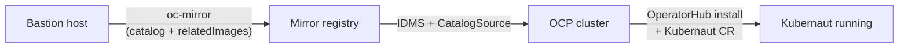
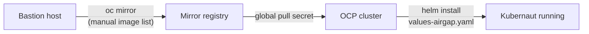

# Disconnected (Air-Gapped) Installation

Kubernaut supports two deployment methods for disconnected OpenShift clusters. The **Kubernaut Operator** (OLM) is the production method; the **Helm chart** is available for development and testing only.

| Method | Mirroring | Image redirection | Install |
|---|---|---|---|
| **Operator (OLM)** | `oc-mirror` reads the operator catalog and discovers all images automatically from `relatedImages` | IDMS/ICSP — transparent CRI-O rewrite, no application-level changes | OperatorHub / `Subscription` CR |
| **Helm chart** | Manual `ImageSetConfiguration` listing every image | `values-airgap.yaml` overlay overriding image refs | `helm install` with layered overlays |

!!! warning "Production deployments"
    The Kubernaut Operator is the only supported production deployment method for disconnected environments. The Helm chart path is retained for development and testing only.

## Prerequisites

| Requirement | Details |
|---|---|
| **Bastion host** | A machine with access to both the public internet and your mirror registry. Used to run `oc-mirror`. |
| **Mirror registry** | A container registry accessible from the disconnected cluster (Quay, Harbor, Nexus, or the OCP integrated registry). |
| **`oc` CLI + `oc-mirror` v2** | OpenShift CLI 4.18+. `oc-mirror` v1 is deprecated as of OCP 4.18; use v2. Install per [OCP documentation](https://docs.redhat.com/en/documentation/openshift_container_platform/4.21/html/disconnected_environments/installing-mirroring-disconnected). |
| **Cluster admin access** | `cluster-admin` privileges on the target disconnected cluster. |
| **PostgreSQL 15+** | **BYO** — the operator does not deploy a database. Provide connection details via `spec.postgresql` in the Kubernaut CR. |
| **Valkey / Redis 7+** | **BYO** — provide connection details via `spec.valkey` in the Kubernaut CR. |

!!! info "LLM endpoint"
    The Kubernaut Agent requires an LLM. In a disconnected environment, deploy a locally hosted LLM accessible from inside the cluster — either **Ollama** or any **OpenAI-compatible endpoint** (vLLM, LocalAI, TGI). Configure the endpoint in your SDK config file (see [Kubernaut Agent SDK Config](../user-guide/configmap-kubernaut-agent.md)). LangChainGo subprocess mode (`local`) is explicitly not supported for security reasons.

---

## Operator (OLM) — Production

The operator catalog contains the bundle metadata (CSV, CRDs) and declares every operand image in `relatedImages`. The `oc-mirror` tool reads the catalog, discovers all images, and mirrors them in one pass. On the disconnected cluster, an `ImageDigestMirrorSet` (IDMS) transparently redirects image pulls from the source registries to your mirror at the CRI-O level.

### Images

The operator catalog embeds references to all required images. You do **not** need to maintain a manual image list — `oc-mirror` discovers them automatically from the CSV `relatedImages` section.

For reference, the full set (17 images) is:

| Layer | Image | Purpose |
|---|---|---|
| **Catalog** | `quay.io/kubernaut-ai/kubernaut-operator-catalog@sha256:...` | OLM index — makes the operator visible in OperatorHub |
| **Bundle** | `quay.io/kubernaut-ai/kubernaut-operator-bundle@sha256:...` | CSV + CRDs + metadata for a specific version |
| **Operator** | `quay.io/kubernaut-ai/kubernaut-operator@sha256:...` | Controller manager binary |
| **Operands** | | |
| | `quay.io/kubernaut-ai/gateway` | Signal ingestion webhook |
| | `quay.io/kubernaut-ai/datastorage` | Audit trail and workflow catalog persistence |
| | `quay.io/kubernaut-ai/aianalysis` | Root cause analysis controller |
| | `quay.io/kubernaut-ai/signalprocessing` | Signal deduplication and enrichment |
| | `quay.io/kubernaut-ai/remediationorchestrator` | Remediation workflow orchestration |
| | `quay.io/kubernaut-ai/workflowexecution` | Job / Tekton execution engine |
| | `quay.io/kubernaut-ai/notification` | Notification delivery (Slack, Teams, PagerDuty) |
| | `quay.io/kubernaut-ai/effectivenessmonitor` | Post-remediation effectiveness verification |
| | `quay.io/kubernaut-ai/kubernautagent` | LLM integration service |
| | `quay.io/kubernaut-ai/authwebhook` | Admission controller for CRD authorization |
| | `quay.io/kubernaut-ai/apifrontend` | API Frontend service (new in v1.5) |
| | `quay.io/kubernaut-ai/db-migrate` | Database schema migration |
| **Init images** | | |
| | `registry.redhat.io/rhel10/postgresql-16` | PostgreSQL client for init containers |
| | `registry.access.redhat.com/ubi10/ubi-minimal` | Minimal UBI for init containers |

### Step 1: Get the ImageSetConfiguration

The operator repository provides a ready-to-use `ImageSetConfiguration` with all images pinned by digest at [`hack/airgap/imageset-config.yaml`](https://github.com/jordigilh/kubernaut-operator/blob/main/hack/airgap/imageset-config.yaml). Download it to the bastion host:

```bash
curl -fsSL \
  https://raw.githubusercontent.com/jordigilh/kubernaut-operator/main/hack/airgap/imageset-config.yaml \
  -o imageset-config.yaml
```

The manifest references the operator catalog and all operand images by `@sha256:` digest, which is required for IDMS redirection. `oc-mirror` reads the catalog index, finds the bundle for the specified channel, parses the CSV, and discovers every image from `relatedImages` automatically.

!!! tip "Why digests instead of tags?"
    IDMS only redirects **digest-based** image references — not tags. The operator CSV `relatedImages` already pins all operand images by digest. Using the upstream manifest ensures your mirror contains the exact images the operator expects, and IDMS can redirect them transparently.

### Step 2: Mirror images

From the bastion host:

```bash
oc-mirror --config imageset-config.yaml \
  docker://<mirror-registry>
```

Replace `<mirror-registry>` with your private registry hostname (e.g., `mirror.corp.example.com:5000`).

`oc-mirror` v2 supports three workflows depending on your network topology:

| Workflow | Use case |
|---|---|
| `mirrorToMirror` (default) | Bastion has access to both internet and mirror registry |
| `mirrorToDisk` + `diskToMirror` | Bastion has internet only; transfer archive to disconnected side via removable media |

For the two-step workflow:

```bash
# On bastion (internet access):
oc-mirror --config imageset-config.yaml \
  file://kubernaut-archive

# Transfer kubernaut-archive/ to disconnected side, then:
oc-mirror --from kubernaut-archive \
  docker://<mirror-registry>
```

### Step 3: Apply mirroring artifacts

`oc-mirror` generates IDMS (or ICSP for OCP < 4.13) and CatalogSource manifests in the results directory:

```bash
oc apply -f oc-mirror-workspace/results-*/
```

This creates:

- An `ImageDigestMirrorSet` that tells CRI-O to redirect pulls from `quay.io/kubernaut-ai/*` and `registry.redhat.io/*` to your mirror registry
- A `CatalogSource` pointing at the mirrored operator catalog in your internal registry

!!! note
    IDMS only redirects **digest-based** image references. All images in the operator CSV use `@sha256:` digests, so this works transparently.

### Step 4: Configure the global pull secret

Add your mirror registry credentials so every node can pull from it:

```bash
# Export current pull secret
oc get secret/pull-secret -n openshift-config \
  -o jsonpath='{.data.\.dockerconfigjson}' | base64 -d > pull-secret.json

# Add mirror registry credentials
oc registry login --registry=<mirror-registry> \
  --auth-basic=<username>:<password> \
  --to=pull-secret.json

# Update the cluster
oc set data secret/pull-secret -n openshift-config \
  --from-file=.dockerconfigjson=pull-secret.json
```

!!! warning
    Updating the global pull secret triggers a rolling restart of all nodes via the Machine Config Operator. This can take 15--30 minutes depending on cluster size.

### Step 5: Install the operator

The operator now appears in OperatorHub. Install it the same way as on a connected cluster:

**Option A: OpenShift Console**

Navigate to **Operators > OperatorHub**, search for "Kubernaut", and click **Install**. Select the target namespace and approval strategy.

**Option B: CLI**

```bash
# Create the operator namespace
oc create namespace kubernaut

# Create the OperatorGroup
cat <<EOF | oc apply -f -
apiVersion: operators.coreos.com/v1
kind: OperatorGroup
metadata:
  name: kubernaut-operator
  namespace: kubernaut
spec:
  targetNamespaces:
    - kubernaut
EOF

# Create the Subscription
cat <<EOF | oc apply -f -
apiVersion: operators.coreos.com/v1alpha1
kind: Subscription
metadata:
  name: kubernaut-operator
  namespace: kubernaut
spec:
  channel: alpha
  name: kubernaut-operator
  source: cs-kubernaut-operator-catalog
  sourceNamespace: openshift-marketplace
  installPlanApproval: Automatic
EOF
```

!!! tip
    The `source` name matches the CatalogSource created by `oc-mirror`. Check the exact name with `oc get catalogsource -n openshift-marketplace`.

Wait for the operator to reach `Succeeded`:

```bash
oc get csv -n kubernaut -w
```

### Step 6: Provision secrets and create the Kubernaut CR

Pre-create the required secrets for your BYO PostgreSQL, Valkey, and LLM:

```bash
oc create namespace kubernaut-system

# PostgreSQL connection
oc create secret generic kubernaut-postgresql \
  --from-literal=username=slm_user \
  --from-literal=password=<your-pg-password> \
  --from-literal=db-secrets.yaml="$(printf 'username: slm_user\npassword: %s' "<your-pg-password>")" \
  -n kubernaut-system

# Valkey connection
oc create secret generic kubernaut-valkey \
  --from-literal=valkey-secrets.yaml="$(printf 'password: %s' "<your-valkey-password>")" \
  -n kubernaut-system

# LLM credentials (for local LLM, the key may be a placeholder)
oc create secret generic kubernaut-llm \
  --from-literal=OPENAI_API_KEY=<your-local-llm-key> \
  -n kubernaut-system
```

Create the Kubernaut CR:

```yaml
apiVersion: kubernaut.ai/v1alpha1
kind: Kubernaut
metadata:
  name: kubernaut
  namespace: kubernaut-system
spec:
  postgresql:
    host: postgres.database.svc.cluster.local
    secretName: kubernaut-postgresql
  valkey:
    host: valkey.cache.svc.cluster.local
    secretName: kubernaut-valkey
  kubernautAgent:
    llm:
      provider: openai
      model: llama3
      endpoint: http://ollama.internal.svc:11434
      credentialsSecretName: kubernaut-llm
  signalProcessing:
    policy:
      configMapName: signalprocessing-policy   # must contain key: policy.rego
  aiAnalysis:
    policy:
      configMapName: aianalysis-policies        # must contain key: approval.rego
```

No image overrides are needed — the operator reads `RELATED_IMAGE_*` env vars set by OLM, and IDMS transparently redirects them to the mirror registry.

!!! note "PostgreSQL TLS"
    The default `sslMode` is `verify-full` (v1.5+). If your PostgreSQL instance does not use TLS, set `spec.postgresql.sslMode: disable` in the CR.

### Per-component image overrides (optional)

If you need to override individual component images without cluster-wide IDMS (e.g., testing a custom build), use `spec.image.overrides` in the Kubernaut CR:

```yaml
spec:
  image:
    overrides:
      gateway: "<mirror-registry>/kubernaut-ai/gateway@sha256:..."
      datastorage: "<mirror-registry>/kubernaut-ai/datastorage@sha256:..."
      apifrontend: "<mirror-registry>/kubernaut-ai/apifrontend@sha256:..."
```

The operator resolves images in this order:

1. `spec.image.overrides[componentName]` — CR-level override (highest priority)
2. `RELATED_IMAGE_<SUFFIX>` env var — set by OLM, rewritten by IDMS
3. Error if neither is set

### Step 7: Verify the installation

```bash
# Operator status
oc get csv -n kubernaut

# Kubernaut CR status
oc get kubernaut -n kubernaut-system

# All pods should be Running
oc get pods -n kubernaut-system
```

If any pod is stuck in `ImagePullBackOff`:

```bash
oc describe pod <pod-name> -n kubernaut-system | grep -A5 "Events:"
```

Common causes:

- Image not mirrored — re-run `oc-mirror`
- Mirror credentials missing from global pull secret — re-run [Step 4](#step-4-configure-the-global-pull-secret)
- IDMS not applied — check `oc get imagedigestmirrorset`

Verify the actual image reference a pod is using:

```bash
oc get pod <pod-name> -n kubernaut-system \
  -o jsonpath='{.spec.containers[0].image}'
```

---

## Helm Chart — Development/Testing Only

!!! warning
    The Helm chart is intended for development and testing only. For production disconnected deployments, use the [Operator (OLM)](#operator-olm-production) method above.

The Helm-based airgap flow requires manually listing all images, mirroring them, and overriding image references via `values-airgap.yaml`. This section is retained for environments where OLM is not available.

### Prerequisites (Helm)

| Requirement | Details |
|---|---|
| **`helm` CLI** | Helm 3.12 or later |
| **Kubernaut chart source** | A clone of [github.com/jordigilh/kubernaut](https://github.com/jordigilh/kubernaut) on the bastion host |

### Step 1: Identify all images

#### Kubernaut service images

All published under `quay.io/kubernaut-ai/` with a tag matching the chart version:

| Image | Description |
|---|---|
| `quay.io/kubernaut-ai/gateway` | Signal ingestion webhook |
| `quay.io/kubernaut-ai/datastorage` | Audit trail and workflow catalog persistence |
| `quay.io/kubernaut-ai/aianalysis` | Root cause analysis controller |
| `quay.io/kubernaut-ai/signalprocessing` | Signal deduplication and enrichment |
| `quay.io/kubernaut-ai/remediationorchestrator` | Remediation workflow orchestration |
| `quay.io/kubernaut-ai/workflowexecution` | Job / Tekton execution engine |
| `quay.io/kubernaut-ai/notification` | Notification delivery (Slack, Teams, PagerDuty) |
| `quay.io/kubernaut-ai/effectivenessmonitor` | Post-remediation effectiveness verification |
| `quay.io/kubernaut-ai/kubernautagent` | LLM integration service |
| `quay.io/kubernaut-ai/authwebhook` | Admission controller for CRD authorization |
| `quay.io/kubernaut-ai/apifrontend` | API Frontend service (new in v1.5) |
| `quay.io/kubernaut-ai/db-migrate` | Database schema migration (pre-upgrade hook) |
| `quay.io/kubernaut-ai/must-gather` | Diagnostic data collection for support |

#### Infrastructure images

| Image | Description |
|---|---|
| `registry.redhat.io/rhel10/postgresql-16` | PostgreSQL 16 (Red Hat RHEL10) |
| `registry.redhat.io/rhel10/valkey-8` | Valkey 8 (Red Hat RHEL10) |
| `registry.redhat.io/openshift4/ose-cli-rhel9:v4.17` | OCP CLI for TLS certificate hook Jobs |

#### Automated image list

Use the included script to extract the exact images from the chart templates:

```bash
./hack/airgap/generate-image-list.sh \
  --set global.image.tag={{ image_tag }} \
  -f charts/kubernaut/values-ocp.yaml
```

### Step 2: Mirror images

Prepare the `ImageSetConfiguration`:

```bash
cp hack/airgap/imageset-config.yaml.tmpl imageset-config.yaml
sed -i 's/<VERSION>/{{ image_tag }}/g' imageset-config.yaml
```

The resulting file lists every image under `mirror.additionalImages`:

```yaml
kind: ImageSetConfiguration
apiVersion: mirror.openshift.io/v1alpha2
storageConfig:
  local:
    path: ./kubernaut-mirror
mirror:
  additionalImages:
    - name: quay.io/kubernaut-ai/gateway:{{ image_tag }}
    - name: quay.io/kubernaut-ai/datastorage:{{ image_tag }}
    # ... all Kubernaut services ...
    - name: quay.io/kubernaut-ai/db-migrate:{{ image_tag }}
    - name: registry.redhat.io/rhel10/postgresql-16
    - name: registry.redhat.io/rhel10/valkey-8
    - name: registry.redhat.io/openshift4/ose-cli-rhel9:v4.17
```

Run the mirror:

```bash
oc mirror --config=imageset-config.yaml \
  docker://<mirror-registry>
```

!!! tip "Alternative: skopeo"
    For individual images (nested registry):

    ```bash
    skopeo copy \
      docker://quay.io/kubernaut-ai/gateway:{{ image_tag }} \
      docker://harbor.corp/kubernaut-ai/gateway:{{ image_tag }}
    ```

    `oc mirror` is preferred because it processes all images in one pass and preserves multi-arch manifests.

!!! warning "OCP internal registry and multi-arch images"
    The OCP integrated registry does not support multi-arch manifest pushes via `skopeo copy --all` (returns HTTP 500). When mirroring to the OCP internal registry with skopeo, use single-arch copies:

    ```bash
    skopeo copy --override-arch=amd64 --override-os=linux \
      docker://quay.io/kubernaut-ai/gateway:{{ image_tag }} \
      docker://<ocp-registry>/kubernaut-system/kubernaut-ai-gateway:{{ image_tag }}
    ```

### Step 3: Configure the global pull secret

Same as the operator path — see [Step 4 above](#step-4-configure-the-global-pull-secret).

### Step 4: Install with Helm

#### Provision secrets

```bash
kubectl create namespace kubernaut-system

PG_PASSWORD=$(openssl rand -base64 24)
kubectl create secret generic postgresql-secret \
  --from-literal=POSTGRES_USER=slm_user \
  --from-literal=POSTGRES_PASSWORD="$PG_PASSWORD" \
  --from-literal=POSTGRES_DB=action_history \
  --from-literal=db-secrets.yaml="$(printf 'username: slm_user\npassword: %s' "$PG_PASSWORD")" \
  -n kubernaut-system

kubectl create secret generic valkey-secret \
  --from-literal=valkey-secrets.yaml="$(printf 'password: %s' "$(openssl rand -base64 24)")" \
  -n kubernaut-system

kubectl create secret generic llm-credentials \
  --from-literal=OPENAI_API_KEY=<your-local-llm-key> \
  -n kubernaut-system
```

See the [secret provisioning](../getting-started/installation.md#2-provision-secrets) reference for the full secret schema.

#### Edit the air-gap overlay

Replace every `<mirror-registry>` placeholder in `values-airgap.yaml`:

```bash
sed -i 's/<mirror-registry>/mirror.corp.example.com:5000/g' \
  charts/kubernaut/values-airgap.yaml
```

The overlay overrides all image references:

```yaml
global:
  image:
    registry: <mirror-registry>
    namespace: kubernaut-ai
    separator: "/"   # use "-" for flat registries (quay.io, Docker Hub)

postgresql:
  image: <mirror-registry>/rhel10/postgresql-16

valkey:
  image: <mirror-registry>/rhel10/valkey-8

hooks:
  tlsCerts:
    image: <mirror-registry>/openshift4/ose-cli-rhel9:v4.17
```

The `separator` field controls how the namespace is joined to the service name:

| Separator | Result for gateway | Compatible registries |
|---|---|---|
| `/` (default) | `<mirror>/kubernaut-ai/gateway:tag` | Harbor, Artifactory, generic Docker v2 |
| `-` | `<mirror>/kubernaut-ai-gateway:tag` | quay.io, Docker Hub, OCP internal |

#### Install

The two overlay files must be layered in this order:

| Order | File | Purpose |
|---|---|---|
| 1 | `values-ocp.yaml` | Red Hat images, OCP monitoring endpoints |
| 2 | `values-airgap.yaml` | Overrides all image refs to point at your mirror registry |

!!! important "Layering order"
    `values-airgap.yaml` **must** come after `values-ocp.yaml`. It overrides the `registry.redhat.io` image references with your mirror registry.

Prepare your SDK config file with the local LLM endpoint (see [Kubernaut Agent SDK Config](../user-guide/configmap-kubernaut-agent.md)):

```yaml
# my-sdk-config.yaml
llm:
  provider: ollama
  model: llama3
  endpoint: http://ollama.internal.svc:11434
```

Install:

```bash
helm install kubernaut charts/kubernaut/ \
  --namespace kubernaut-system \
  -f charts/kubernaut/values-ocp.yaml \
  -f charts/kubernaut/values-airgap.yaml \
  --set-file kubernautAgent.sdkConfigContent=my-sdk-config.yaml
```

### Step 5: Verify

```bash
kubectl get pods -n kubernaut-system
```

All pods should reach `1/1 Running` within a few minutes. If any pod is stuck in `ImagePullBackOff`, see [Troubleshooting](#troubleshooting).

---

## Troubleshooting

### Image pull errors

If any pod is stuck in `ImagePullBackOff` or `ErrImagePull`:

```bash
oc describe pod <pod-name> -n kubernaut-system | grep -A5 "Events:"
```

Common causes:

- Image not mirrored — re-run `oc-mirror`
- Mirror credentials missing from global pull secret
- IDMS not applied (operator path) or typo in `values-airgap.yaml` (Helm path)

Verify the actual image reference:

```bash
oc get pod <pod-name> -n kubernaut-system \
  -o jsonpath='{.spec.containers[0].image}'
```

### Verifying IDMS is active (operator path)

```bash
oc get imagedigestmirrorset
oc get imagedigestmirrorset kubernaut-mirror -o yaml
```

Verify CRI-O is applying the redirect:

```bash
oc debug node/<node-name> -- chroot /host crictl pull quay.io/kubernaut-ai/gateway@sha256:<digest> 2>&1
```

### Migration Job fails connecting to PostgreSQL

If the db-migration Job logs show connection errors, check that your BYO PostgreSQL is reachable from the cluster and the secret credentials are correct:

```bash
oc logs job/db-migration -n kubernaut-system
```

### Verifying mirror registry contents

```bash
skopeo list-tags docker://<mirror-registry>/kubernaut-ai/gateway
skopeo inspect docker://<mirror-registry>/kubernaut-ai/gateway:{{ image_tag }}
```

---

## Summary

### Operator (Production)


```mermaid
flowchart LR
    A["Bastion host"] -->|"oc-mirror<br/>(catalog + relatedImages)"| B["Mirror registry"]
    B -->|"IDMS + CatalogSource"| C["OCP cluster"]
    C -->|"OperatorHub install<br/>+ Kubernaut CR"| D["Kubernaut running"]
```

1. **Mirror** the operator catalog — `oc-mirror` discovers and mirrors all 17 images automatically
2. **Apply** the generated IDMS and CatalogSource on the disconnected cluster
3. **Configure** the global pull secret with mirror registry credentials
4. **Install** the operator from OperatorHub and create the Kubernaut CR
5. **Verify** pods are running and pulling from the mirror registry

### Helm (Dev/Testing)


```mermaid
flowchart LR
    A["Bastion host"] -->|"oc mirror<br/>(manual image list)"| B["Mirror registry"]
    B -->|"global pull secret"| C["OCP cluster"]
    C -->|"helm install<br/>values-airgap.yaml"| D["Kubernaut running"]
```

1. **Mirror** all images using a manually maintained `ImageSetConfiguration`
2. **Configure** the global pull secret with mirror registry credentials
3. **Install** the chart layering `values-ocp.yaml` + `values-airgap.yaml`
4. **Verify** pods are running and pulling from the correct registry
