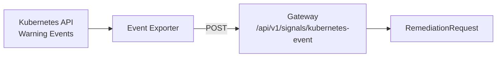

# Event Exporter

Kubernaut uses the [Resmo Kubernetes Event Exporter](https://github.com/resmoio/kubernetes-event-exporter) to forward Kubernetes `Warning` events to the Gateway as signals. This enables Kubernaut to detect issues like `BackOff`, `OOMKilled`, and `FailedScheduling` without requiring a Prometheus alerting rule for each case.

## How It Works

The Event Exporter watches the Kubernetes Event API and forwards matching events to the Gateway via a webhook:



## Deployment

The Event Exporter is deployed automatically as part of the Kubernaut Helm chart when `eventExporter.enabled=true` (default). It runs as a single-replica Deployment with a ConfigMap-based configuration.

Set `eventExporter.enabled=false` to skip deploying the Event Exporter. This is recommended on OpenShift (OCP) where no Red Hat-supported equivalent image exists. The `values-ocp.yaml` overlay disables it by default. Users should provide their own Kubernetes event forwarding mechanism when the Event Exporter is disabled.

### Helm Values

| Parameter | Default | Description |
|---|---|---|
| `eventExporter.enabled` | `true` | Deploy the Event Exporter |
| `eventExporter.image` | `ghcr.io/resmoio/kubernetes-event-exporter` | Container image |
| `eventExporter.resources` | See `values.yaml` | CPU and memory requests/limits |

## Configuration

The ConfigMap `event-exporter-config` controls which events are forwarded:

```yaml
logLevel: debug
logFormat: json
maxEventAgeSeconds: 300
kubeQPS: 50
kubeBurst: 100
namespace: "{{ .Release.Namespace }}"
route:
  routes:
    - match:
        - receiver: gateway-webhook
      drop:
        - type: "Normal"
        - kind: "RemediationRequest"
        - kind: "SignalProcessing"
        - kind: "AIAnalysis"
        - kind: "EffectivenessAssessment"
        - kind: "NotificationRequest"
receivers:
  - name: gateway-webhook
    webhook:
      endpoint: "http://gateway-service.kubernaut-system.svc.cluster.local:8080/api/v1/signals/kubernetes-event"
      headers:
        Content-Type: application/json
```

### Key Settings

| Setting | Description |
|---|---|
| `namespace` | Kubernetes namespace to watch for events (defaults to the Helm release namespace) |
| `maxEventAgeSeconds` | Ignore events older than this (prevents replay on restart) |
| `route.routes[].drop` | Filter rules: drops `Normal` events and Kubernaut's own CRD events to prevent feedback loops |
| `receivers[].webhook.endpoint` | Gateway endpoint for Kubernetes event signals |

## Customization

To watch multiple namespaces, modify the `namespace` field in the ConfigMap or remove it entirely to watch all namespaces. Note that `kubernaut.ai/managed=true` labels on namespaces/resources are still enforced by the Gateway — the Event Exporter simply forwards events, and the Gateway decides whether to act on them.

## Next Steps

- [Signals & Alert Routing](../user-guide/signals.md) — How signals are ingested
- [Configuration Reference](../user-guide/configuration.md) — Full Helm configuration
- [Monitoring](monitoring.md) — Service health and metrics
