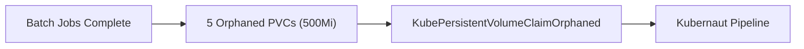
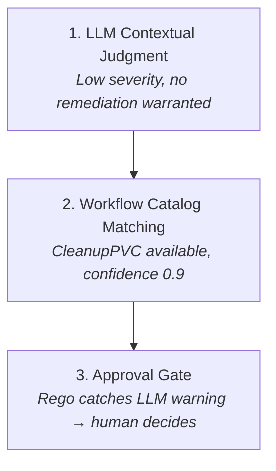
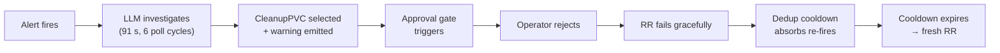

# LLM Judgment and the Approval Gate: When "Can" Doesn't Mean "Should"

## Summary

During OCP validation of the **orphaned-pvc-no-action** scenario, removing a test
workaround revealed two distinct LLM behaviors when a matching `CleanupPVC` workflow is
available in the catalog. In some runs the LLM concludes no action is needed outright. In
others, it selects the workflow with high confidence (0.9) but simultaneously warns
*"Alert not actionable — no remediation warranted"* — presenting the option while
flagging that automated execution is not warranted.

The second behavior is the more compelling demo: it shows contextual judgment, catalog
matching, and the human-in-the-loop approval gate working together.

!!! info "Observed on a live cluster"
    This behavior was captured during OCP validation of `kubernaut-demo-scenarios#122`
    across 3 runs with Claude Sonnet 4 via Vertex AI. The LLM produced Path A
    (NotActionable) in 1 run and Path B (workflow + warning) in 2 runs. The scenario was
    originally designed to test the `NoActionRequired` path by removing the
    `cleanup-pvc-v1` workflow before execution. The behaviors described here occur when
    that workflow **remains** in the catalog.

## The Scenario

**orphaned-pvc-no-action**: Five PVCs from completed batch jobs are left behind, consuming
500Mi of storage. No pods reference them. Prometheus fires `KubePersistentVolumeClaimOrphaned`.



### Three Outcomes, One Scenario

The LLM's decision depends on the workflow catalog state — and even with the same catalog
state, the LLM may reach different conclusions across runs:

| Catalog State | LLM Decision | RR Outcome | Observed |
|---|---|---|---|
| `cleanup-pvc-v1` **removed** | No matching workflow | Completed (NoActionRequired) | Original design |
| `cleanup-pvc-v1` **available** | **Path A:** NotActionable, no workflow selected | Completed (NoActionRequired) | Run 2 |
| `cleanup-pvc-v1` **available** | **Path B:** Selects workflow + emits warning | AwaitingApproval | Runs 1 & 3 |

Path A is a clean "no action needed" decision — the LLM doesn't even present the
workflow. Path B is the more interesting behavior: the LLM finds and presents the
workflow but simultaneously warns against using it.

## Path A: NotActionable (Run 2)

In one of the three runs, the LLM concluded no action was needed outright. No workflow
was selected and no warnings were raised:

```yaml
actionability: NotActionable
selectedWorkflow: null
warnings: []
rootCauseAnalysis:
  severity: low
  summary: >
    Orphaned PVCs from completed batch jobs detected in demo-orphaned-pvc namespace.
    Five PVCs remain after their associated batch jobs completed. The data-processor
    deployment is healthy and unaffected.
  contributing_factors:
    - Completed batch jobs cleanup
    - PVC lifecycle independence
    - Normal Kubernetes resource lifecycle
```

The RR auto-completed as `NoActionRequired` — no approval gate, no human involvement.
This is the simpler story: *"Kubernaut's LLM correctly identifies orphaned PVCs as
benign housekeeping and takes no action — even when a cleanup workflow is available."*

## Path B: Workflow Selected with Warning (Runs 1 & 3)

Path B is the stronger demo. The LLM finds a matching workflow but raises a warning,
and the Rego policy escalates to human review.

### Root Cause Assessment

The LLM correctly characterized the situation as low-priority housekeeping:

> "Five orphaned PVCs from completed batch jobs are consuming 500Mi of storage space.
> These PVCs (batch-output-job-1 through batch-output-job-5) are labeled as
> 'batch-run=completed' and are not mounted by any running pods. The data-processor
> deployment is healthy and unaffected."

- **Severity:** `low`
- **Contributing factors:** "Completed batch jobs without automatic PVC cleanup",
  "Missing storage lifecycle management"

The LLM recognized that this is not an operational incident — no workloads are degraded,
no alerts indicate service impact. It is leftover infrastructure from completed work.

### Workflow Selection with Reservations

Despite assessing the situation as low-severity, the LLM found and selected a matching
workflow:

- **Selected:** `CleanupPVC` (confidence 0.9)
- **Rationale:** "The workflow specifically targets orphaned PVCs from completed batch
  jobs, which exactly matches our scenario. The PVCs are confirmed orphaned (not mounted
  by any pods) and labeled with 'batch-run=completed'."
- **Parameters:** `LABEL_SELECTOR=batch-run=completed`, `TARGET_NAMESPACE=demo-orphaned-pvc`

But the LLM also emitted a warning alongside the selection:

```
warnings: ["Alert not actionable — no remediation warranted"]
```

The LLM is effectively saying: *"I found a matching workflow and here it is, but I don't
think this actually warrants automated action."*

### The Full AA Status

```json
{
  "actionability": "Actionable",
  "selectedWorkflow": {
    "actionType": "CleanupPVC",
    "confidence": 0.9,
    "parameters": {
      "LABEL_SELECTOR": "batch-run=completed",
      "TARGET_NAMESPACE": "demo-orphaned-pvc"
    },
    "rationale": "The workflow specifically targets orphaned PVCs from completed batch jobs..."
  },
  "rootCauseAnalysis": {
    "severity": "low",
    "summary": "Five orphaned PVCs from completed batch jobs consuming 500Mi...",
    "contributingFactors": [
      "Completed batch jobs without automatic PVC cleanup",
      "Missing storage lifecycle management"
    ]
  },
  "approvalRequired": true,
  "approvalReason": "Production environment - requires manual approval",
  "warnings": ["Alert not actionable — no remediation warranted"]
}
```

## Why This Matters

### Three Capabilities Working Together

This scenario demonstrates the interplay between three layers of the Kubernaut pipeline:



**1. LLM contextual judgment** — The LLM correctly identifies the issue as low-severity
housekeeping, not an operational problem. It understands that orphaned PVCs from completed
batch jobs are a cleanup concern, not a service-impacting incident.

**2. Workflow catalog matching** — Even when the LLM is ambivalent about whether action is
warranted, it still presents the available option. The catalog match is accurate (correct
action type, correct parameters, high confidence), giving the operator a ready-to-execute
remediation if they choose to proceed.

**3. Human-in-the-loop approval** — The Rego policy catches the LLM's warning via the
`has_warnings` rule and requires manual approval. The operator receives the full context:
the LLM's RCA (low severity), the matched workflow (CleanupPVC), and the warning (no
remediation warranted). They can make an informed decision: clean up now, or leave it for
the next maintenance window.

### Contrast with Other Scenarios

This scenario fills a gap in the decision-making spectrum demonstrated by existing use cases:

| Scenario | Confidence | Approval | LLM Stance |
|---|---|---|---|
| memory-leak | High | Auto-approved | Clear action needed |
| hpa-maxed | High | Auto-approved | Clear action needed |
| cert-failure-gitops | 0.85 | [Approval required](multi-path-remediation.md) | Action needed, uncertain which path |
| resource-quota-exhaustion | -- | [Escalated to human](remediation-history-feedback.md) | First attempt failed, refuses to repeat |
| **orphaned-pvc** | **0.9** | **Approval required** | **Action available but not warranted** |

The orphaned PVC case is unique: the LLM has **high confidence** in the workflow match
but **low conviction** that action should be taken. This is a qualitatively different
kind of uncertainty — not "I'm unsure which fix to apply" but "I know the fix, I just
don't think it's needed."

### Why Was Approval Required?

The answer depends on the Rego policy in effect. Across the 3 runs, two different
policies were used:

=== "Run 1: Default policy (production)"

    ```
    "approvalReason": "Production environment - requires manual approval"
    ```

    The default `approval.rego` always requires approval for production namespaces,
    regardless of confidence or warnings. The LLM's warning was coincidentally caught
    — but by the environment rule, not the warning itself.

=== "Run 3: Patched policy (staging)"

    ```
    "approvalReason": "LLM raised warnings — human review recommended"
    ```

    With the `has_warnings` rule added to the policy, the warning triggered approval
    in a staging namespace where the default policy would have auto-approved.

### The Gap in the Default Policy

The default `approval.rego` defines a `has_warnings` helper but **never uses it** in
any `require_approval` rule. This means:

| Environment | Default Policy | LLM Warning Effect |
|---|---|---|
| Production | Approval required | Warning visible but irrelevant (caught by environment rule) |
| Staging / Dev | **Auto-approved** | **Warning ignored** — workflow executes silently |

!!! warning "Silent execution in non-production"
    Without a policy fix, Path B in a staging or development namespace would
    **auto-execute** the `CleanupPVC` workflow. The LLM's "no remediation warranted"
    warning would only appear in the audit trail after the PVCs are already deleted.

This gap is tracked in [kubernaut#439](https://github.com/jordigilh/kubernaut/issues/439)
for inclusion in the default Helm chart policy.

### Making the Warning Trigger Approval

Adding the `has_warnings` rule to the policy ensures the LLM's warning triggers the
approval gate in **any** environment. This was confirmed in Run 3 (staging namespace):

```rego
package aianalysis.approval

import rego.v1

default require_approval := false
default reason := "Auto-approved"

has_warnings if {
  count(input.warnings) > 0
}

require_approval if {
  has_warnings
}

reason := "LLM raised warnings — human review recommended" if {
  has_warnings
}
```

This policy can be combined with the default environment and affected-resource rules.
Deploy it via Helm:

```bash
helm upgrade kubernaut charts/kubernaut/ \
  --set-file aianalysis.policies.content=my-approval.rego \
  --reuse-values
```

See [AIAnalysis Approval Policy](../user-guide/configmap-approval.md) for the full input
contract and [Rego Policy Reference](../user-guide/rego-reference.md) for more examples.

## End-to-End Walkthrough

The complete lifecycle, confirmed on a live OCP cluster:



### 1. Alert fires

`KubePersistentVolumeClaimOrphaned` — 5 orphaned PVCs from completed batch jobs (500Mi
total).

### 2. LLM investigates

Over 91 seconds (6 poll cycles), the LLM identifies low-severity housekeeping.
Contributing factors: "completed batch jobs without automatic PVC cleanup", "missing
storage lifecycle management."

### 3. Workflow matched with warning

`CleanupPVC` selected (confidence 0.9) with parameters
`LABEL_SELECTOR=batch-run=completed`. The LLM simultaneously emits: *"Alert not
actionable — no remediation warranted."*

### 4. Approval gate triggers

Production environment requires manual review. A `RemediationApprovalRequest` is created.

### 5. Operator reviews and rejects

The operator sees the low severity, the 0.9-confidence workflow match, and the "no
remediation warranted" warning. They reject the cleanup:

```bash
kubectl patch rar rar-rr-4deb88d0bae3-9418f0bc -n kubernaut-system \
  --type=merge --subresource=status \
  -p '{"status":{"decision":"Rejected","decidedBy":"operator",
       "decisionMessage":"Low-severity housekeeping — deferring to next maintenance window"}}'
```

### 6. RR fails gracefully

| Field | Value |
|---|---|
| `overallPhase` | `Failed` |
| `failureReason` | "Low-severity housekeeping — deferring to next maintenance window" |
| PVCs remaining | 5 (untouched) |
| WorkflowExecution created | No |

The operator's rejection message is carried through as the `failureReason`, providing a
clear audit trail of why no action was taken. No workflow was ever executed — the PVCs
remain exactly as they were.

### 7. Dedup cooldown absorbs re-fires

After the rejection, the alert continues firing (the PVCs still exist), but the Gateway
does not create a new RR. The deduplication cooldown is in effect:

```yaml
deduplication:
  firstSeenAt: 2026-03-18T21:14:50Z
  lastSeenAt:  2026-03-18T21:21:50Z
  occurrenceCount: 4
nextAllowedExecution: 2026-03-18T21:25:39Z
```

Subsequent alerts with the same fingerprint increment `occurrenceCount` on the terminal
RR but don't create a new one. This creates a natural "snooze" effect — rejecting an
action doesn't silence the alert forever, but it prevents the platform from immediately
nagging the operator again.

### 8. After cooldown expires

Once `nextAllowedExecution` passes, the next alert with the same fingerprint creates a
fresh RR with a new investigation. The cycle repeats: alert → LLM → approval gate →
operator decision. This continues until the PVCs are cleaned up (manually or via an
approved workflow) and the alert resolves.

The operator's options during the cooldown window:

- **Clean up the PVCs manually** during the next maintenance window — the alert resolves,
  no new RR is created
- **Do nothing** — after cooldown expires, a new RR is created and the LLM re-evaluates

### When Would Approval Make Sense?

The decision to reject was contextual. Approval would be appropriate if:

- Storage pressure is a concern or the team wants a clean namespace
- The orphaned PVCs are consuming quota needed by other workloads
- Organizational policy requires automated cleanup of completed batch artifacts

In all cases, the operator starts with a complete picture — not just "there's an alert"
but "here's what's happening, here's what we could do, and here's why we might not need to."

## Key Takeaway

Kubernaut's value is not limited to executing remediations. It also surfaces situations
where remediation is *available but not necessary* — and gives a human the context to
make that call. The approval gate is not just a safety mechanism for risky actions; it is
a decision support system for ambiguous ones.
