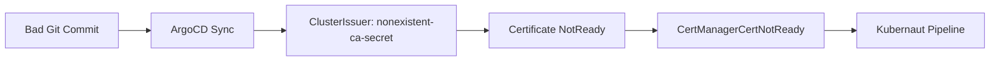

# Multiple Remediation Paths: AIOps vs Rule-Based Systems

## Summary

During live validation of the **cert-failure-gitops** scenario (#134), the LLM chose an
alternative remediation workflow (`FixCertificate`) instead of the designed path
(`GitRevertCommit`). Both approaches successfully remediated the alert and restored
certificate issuance. This use case demonstrates a fundamental advantage of AIOps over
rule-based remediation: the ability to reason about the problem and choose the most
appropriate fix, rather than following a rigid playbook.

!!! info "Kubernaut's Mission: Reduce MTTR"
    Kubernaut's goal is to reduce Mean Time To Remediate (MTTR) -- restore service health
    and silence the alert. Providing a permanent long-term fix is the responsibility of the
    engineering team during post-incident review. Both remediation paths observed here
    fulfill Kubernaut's mission.

## The Scenario

**Scenario #134: cert-manager Certificate Failure with GitOps**

A bad Git commit changes a cert-manager `ClusterIssuer` to reference a non-existent CA
Secret (`nonexistent-ca-secret`). ArgoCD syncs the broken configuration. When the TLS
certificate needs renewal, cert-manager fails to issue it, and the `CertManagerCertNotReady`
alert fires.

## Two Valid Remediation Paths

### Path A: GitRevertCommit (Designed)

The workflow clones the Gitea repository, reverts the bad commit, and pushes. ArgoCD
detects the new commit, syncs the reverted `ClusterIssuer` back to the correct CA Secret
reference, and cert-manager successfully re-issues the certificate.

### Path B: FixCertificate (Observed)

The workflow identifies that the `ClusterIssuer` references a Secret named
`nonexistent-ca-secret` that does not exist, generates a new self-signed CA key pair,
and creates the Secret directly in the cluster. cert-manager picks up the new CA and
re-issues the certificate.

### Comparison

| Aspect | GitRevertCommit | FixCertificate |
|--------|:-:|:-:|
| Alert remediated | Yes | Yes |
| Certificate restored | Yes | Yes |
| MTTR | ~3 min (clone, revert, push, ArgoCD sync) | ~10 sec (create Secret) |
| Git state | Clean (bad commit reverted) | Dirty (broken commit remains) |
| ArgoCD drift | None | Possible on next sync |
| Long-term stability | Stable | Fragile until git is fixed |

Both paths achieve Kubernaut's goal: the alert is remediated and service health is restored.

## LLM Reasoning Analysis

The LLM's decision reveals three layers of reasoning that distinguish AIOps from rule-based
systems:

### 1. Correct Root Cause Identification

The LLM correctly diagnosed the root cause:

> Missing CA Secret 'nonexistent-ca-secret' prevents cert-manager ClusterIssuer from signing
> certificates, causing demo-app-cert to remain NotReady

### 2. Trade-Off Awareness

The LLM acknowledged the GitOps context but prioritized infrastructure recovery:

> "Despite GitOps management, this is an infrastructure-level certificate issue requiring
> direct remediation."

A rule-based system would apply a simple conditional: `if GitOps then revert commit`.
The LLM reasoned that the immediate problem (missing Secret) is an infrastructure concern
that can be fixed directly, regardless of how the configuration is managed.

### 3. Confidence Calibration

The LLM set confidence to **0.85** -- high enough to act, but below the auto-approve
threshold. This triggered a human approval request.

The LLM was aware that choosing direct remediation in a GitOps environment is a
consequential decision. Rather than auto-executing, it deferred to a human operator
for confirmation. This is situational awareness, not just pattern matching.

## The Recurrence Test

After the first remediation, the `nonexistent-ca-secret` was deleted to simulate the
problem recurring. The second alert fired, and the LLM was presented with the same
problem.

**Result**: The LLM chose `FixCertificate` again with the same confidence (0.85) and
the same rationale. This demonstrates consistent behavior -- the LLM's reasoning is
stable and reproducible, not random.

## AIOps vs Rule-Based Systems

| Capability | Rule-Based | AIOps (Kubernaut) |
|------------|:----------:|:-----------------:|
| Fixed playbook per alert type | Yes | No -- reasons per incident |
| Multiple valid remediation paths | No -- one rule, one action | Yes -- selects best fit |
| Trade-off awareness | No | Yes -- weighs alternatives |
| Confidence signaling | No | Yes -- flags uncertainty |
| Adapts to environment context | Limited (if/else chains) | Yes -- reads cluster state |
| Requests human input when unsure | No (fails or proceeds) | Yes -- approval workflow |

The key insight is that Kubernaut does not enforce a single correct answer. It provides
an answer that works -- one that remediates the alert and restores service health. The
engineering team retains responsibility for the permanent fix, informed by Kubernaut's
audit trail of what was done and why.

## Key Takeaway

Kubernaut reduces MTTR by any valid path. The LLM is free to choose the approach it
judges most appropriate for each incident. This flexibility is a strength of AIOps:
real-world problems rarely have a single correct solution, and the ability to reason
about alternatives -- while flagging uncertainty for human review -- is what separates
intelligent remediation from scripted automation.
