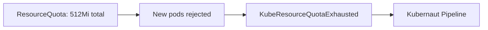

# Remediation History Feedback Loop: Self-Correcting Workflow Selection

## Summary

During live validation of the **resource-quota-exhaustion** scenario, the LLM demonstrated
self-correcting behavior enabled by Kubernaut's remediation history feedback loop. On the
first attempt, the LLM selected an inappropriate workflow (`IncreaseMemoryLimits`) for a
quota exhaustion problem. When the workflow failed and the alert re-fired, the LLM received
the failure history, recognized the pattern, and **deliberately refused to select the same
workflow** -- escalating to human review instead.

This is closed-loop learning within a single incident lifecycle. No model retraining, no
configuration changes -- just feedback from prior failure influencing the LLM's next decision.

!!! info "Observed on a live cluster"
    This behavior was captured on a Kind multi-node cluster running Kubernaut demo v1.9.
    LLM: `vertex_ai/claude-sonnet-4`. All log excerpts are from actual DataStorage and HAPI
    service logs.

## The Scenario

**resource-quota-exhaustion**: A namespace has a `ResourceQuota` limiting total memory to
512Mi. A deployment requests scaling that would exceed the quota. Prometheus fires
`KubeResourceQuotaExhausted`.



## First Attempt: The Semantic Similarity Trap

The LLM performed the 3-step discovery protocol and encountered a common challenge:
**semantic similarity between the problem description and an inappropriate workflow**.

Both "quota exhaustion" and "OOMKill" involve the phrase "memory limits" in their
descriptions. The LLM selected `IncreaseMemoryLimits` -- the closest semantic match
available, despite it being the wrong fix.

The LLM acknowledged the mismatch in its rationale:

> "While this workflow increases memory limits, the root issue is quota exhaustion rather
> than OOMKills. However, this is the most relevant available workflow."

**What happened:**

1. Workflow executed: patched deployment memory limits to 256Mi
2. Rollout timed out -- the `ResourceQuota` (512Mi total) prevented creating new pods
   with higher limits
3. RemediationRequest outcome: **Failed**

This is exactly the kind of mistake a rule-based system would also make -- and keep
making, indefinitely. What happened next is where Kubernaut diverges.

## Second Attempt: History-Informed Self-Correction

When the alert re-fired, a new RemediationRequest was created. This time, the HAPI
investigation pipeline served the LLM additional context: **remediation history** for
the target resource.

### What DataStorage Served

```
Remediation history context served
  target_resource: demo-quota/Deployment/api-server
  tier1_count: 2
  regression_detected: true
```

The LLM received:

- **Prior workflow**: `IncreaseMemoryLimits` was tried for this exact resource
- **Prior outcome**: Failed
- **Regression flag**: The problem recurred after the remediation attempt

### What the LLM Did

The LLM performed the full 3-step discovery again. In Step 2 (`list_workflows`),
DataStorage returned the same `IncreaseMemoryLimits` workflow:

```
Workflows listed by action type
  action_type: IncreaseMemoryLimits
  total_count: 1
  returned_count: 1
```

The workflow was **found**. The LLM did not fail to find it.

But this time, the LLM **deliberately chose not to select it**:

> "The issue is not actually an OOMKill scenario that would benefit from increasing
> memory limits -- it's a resource quota exhaustion problem."

The LLM returned no selected workflow. HAPI mapped this to the `no_matching_workflows`
outcome:

```
incident_analysis_completed
  has_workflow: false
  needs_human_review: true
  validation_attempts: 1
```

RemediationRequest outcome: **ManualReviewRequired** -- escalated to a human operator.

## Why This Matters

### The Self-Correction Mechanism

The LLM's decision changed between the two attempts because of a single input difference:
**remediation history**. On the first attempt, the LLM had no history and made its best
guess based on semantic similarity. On the second attempt, the history told it:

- "You tried this approach before on this resource"
- "It failed"
- "The problem came back"

This is enough for the LLM to reconsider its reasoning and reach a different conclusion.
The history doesn't tell the LLM what to do -- it provides **evidence** that the LLM
incorporates into its decision-making.

### Comparison with Rule-Based Systems

| Behavior | Rule-Based | Kubernaut |
|----------|:----------:|:---------:|
| First attempt: select closest match | Same | Same |
| Workflow fails | Retry same workflow (or give up) | Record failure in history |
| Alert re-fires | Select same workflow again | Serve history to LLM; LLM reconsiders |
| Self-correction | Never (rules don't learn) | Yes (history influences reasoning) |
| Escalation when stuck | Manual intervention or timeout | LLM decides to escalate with rationale |

A rule-based system would either retry `IncreaseMemoryLimits` indefinitely or require a
human to manually update the rule. Kubernaut's LLM recognized the failure pattern and
made a different decision -- without any configuration change.

### The Escalation Decision

The LLM's final decision -- `ManualReviewRequired` -- is the correct outcome. A namespace
`ResourceQuota` is a **policy constraint**, not a workload configuration issue. The right
fix depends on organizational context:

- Increase the quota (if the team is authorized)
- Move the workload to a different namespace
- Reduce resource requests on other pods in the namespace
- Escalate to the platform team

The LLM cannot know which of these is appropriate. By escalating with the full context
(root cause analysis, failed remediation history, and reasoning for why automated
remediation is not viable), it gives the operator everything needed to make the decision
quickly.

## The Semantic Similarity Trap

This case study illustrates a general challenge in LLM-driven workflow selection:
**semantic similarity between problem descriptions and inappropriate workflows**.

"Quota exhaustion" and "OOMKill" share vocabulary:

- Both reference "memory limits"
- Both involve resource constraints
- Both affect pod scheduling

The LLM's initial selection was reasonable given the available information. The key
insight is that **the system recovered from the mistake** -- the feedback loop enabled
the LLM to distinguish between superficially similar problems after observing the
outcome.

### Mitigations

Two improvements reduce the likelihood of this trap:

1. **Workflow description engineering**: The `IncreaseMemoryLimits` action type was
   updated to explicitly exclude quota exhaustion in its `whenNotToUse` field
   ([#315](https://github.com/jordigilh/kubernaut/issues/315)):

    > "When the deployment is constrained by a ResourceQuota -- increasing individual
    > container limits does not increase the namespace's total allocation."

2. **Remediation history**: Even when descriptions aren't perfect, the history feedback
   loop provides a safety net. The LLM learns from failure within the same incident.

Neither mitigation alone is sufficient. Description engineering reduces first-attempt
errors; remediation history catches them when they occur. Together, they form a
defense-in-depth approach to workflow selection quality.

## Operator Takeaway

Kubernaut's value proposition is not "always selects the right workflow on the first try."
It is:

1. **Try**: Select the best available workflow based on current evidence
2. **Fail gracefully**: Record the outcome with full context
3. **Learn**: Serve the failure history to the LLM on the next attempt
4. **Escalate**: When no automated fix is viable, escalate to a human with the complete
   reasoning chain

Operators receive both the failure context (what was tried, why it failed) and the LLM's
reasoning for escalation (why automated remediation is not appropriate). This reduces
Mean Time To Remediate even when the first automated attempt fails -- the operator starts
with a diagnosis, not a blank slate.
