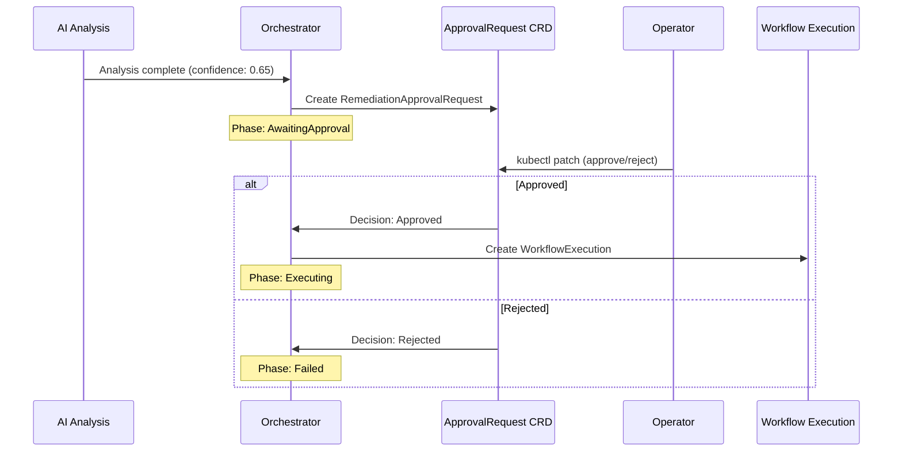

# Human Approval

Kubernaut supports human-in-the-loop approval gates to ensure that remediations are reviewed before execution when confidence is low or policy requires it.

## When Approval Is Required

Approval is determined by a **Rego policy** evaluated during the AI Analysis phase. The policy considers:

- **Confidence score** — The LLM's confidence in the root cause analysis and workflow selection
- **Configurable threshold** — Defaults to 0.8 (80%); configurable via Helm values

When confidence is **at or above** the threshold, the remediation is auto-approved. When below, a `RemediationApprovalRequest` CRD is created and the remediation enters the `AwaitingApproval` phase.

## Confidence Thresholds

Kubernaut uses two confidence thresholds at different stages:

| Stage | Threshold | Configurable | Purpose |
|---|---|---|---|
| **Investigating** (response processor) | 0.7 (70%) | Not yet (V1.1, per BR-HAPI-198; see `pkg/aianalysis/handlers/response_processor.go`) | Rejects workflow selections with very low confidence; detects "problem already resolved" scenarios |
| **Analyzing** (Rego approval policy) | 0.8 (80%) | Yes, via Helm | Controls whether human approval is required before execution |

### Configuring the Approval Threshold

```yaml
# values.yaml
aianalysis:
  rego:
    confidenceThreshold: 0.85  # require 85% confidence for auto-approval
```

When `confidenceThreshold` is `null` (default), the Rego policy's built-in default of 0.8 applies.

## The Approval Flow



## Approving or Rejecting

Operators approve or reject via `kubectl`:

```bash
# List pending approvals
kubectl get remediationapprovalrequests -n kubernaut-system

# Approve
kubectl patch remediationapprovalrequest <name> -n kubernaut-system \
  --type merge -p '{"status":{"decision":"Approved","decisionMessage":"RCA looks correct"}}'

# Reject
kubectl patch remediationapprovalrequest <name> -n kubernaut-system \
  --type merge -p '{"status":{"decision":"Rejected","decisionMessage":"Wrong root cause identified"}}'
```

## Approval Context

When a `RemediationApprovalRequest` is created, it includes rich context to help the operator decide:

- **Investigation summary** — The LLM's root cause analysis results
- **Recommended workflow** — Which remediation was proposed and why
- **Confidence score and level** — How confident the system is
- **Why approval is required** — The policy reason for requiring human review
- **Evidence collected** — Supporting data from the investigation
- **Alternatives considered** — Other workflows the system evaluated

## Audit Trail

All approval decisions are captured in the audit trail:

- **Who** approved or rejected (operator identity via admission webhook)
- **When** the decision was made
- **What** reason was provided
- The full context at the time of decision

See [Audit & Observability](audit-and-observability.md) for details.

## Next Steps

- [Effectiveness Monitoring](effectiveness.md) — How Kubernaut evaluates the outcome
- [Configuration Reference](configuration.md) — Tuning confidence thresholds
- [Audit & Observability](audit-and-observability.md) — Compliance and audit trails
