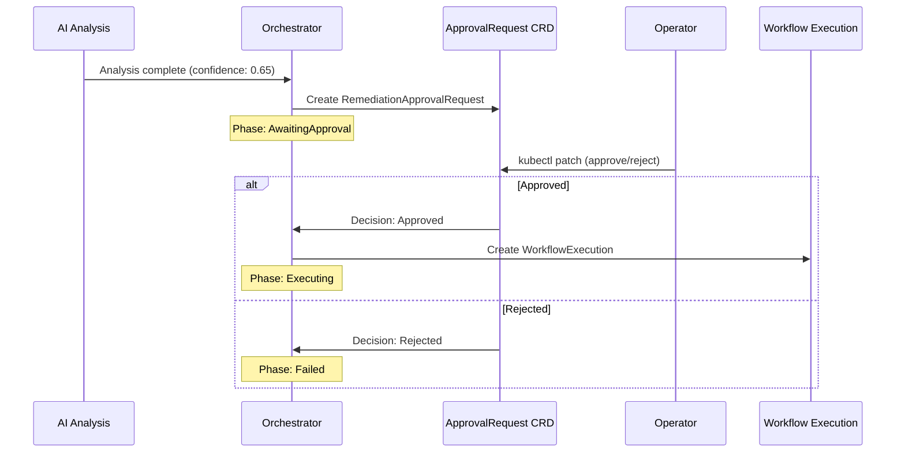

# Human Approval

Kubernaut supports human-in-the-loop approval gates to ensure that remediations are reviewed before execution when confidence is low or policy requires it.

!!! abstract "CRD Reference"
    For the complete RemediationApprovalRequest CRD specification, see [API Reference: CRDs](../api-reference/crds.md#remediationapprovalrequest).

## When Approval Is Required

Approval is determined by a **user-replaceable Rego policy** evaluated during the AI Analysis phase. Operators control approval behavior by editing the Rego policy in the `aianalysis-rego` ConfigMap -- the policy is not hardcoded.

### Default Policy Behavior

The shipped `approval.rego` makes decisions based on **environment** and **affected resource presence**:

- **Production namespaces** (`kubernaut.ai/environment=production`) — always require approval, regardless of confidence
- **Non-production namespaces** (`staging`, `development`, `qa`, `test`) — auto-approved when `affected_resource` is present
- **Missing affected resource** — always requires approval (default-deny safety per ADR-055)

When approval is required, a `RemediationApprovalRequest` CRD is created and the remediation enters the `AwaitingApproval` phase.

### Custom Policies

The Rego policy receives a rich input context (see [Rego Policy Evaluation](#rego-policy-evaluation) below), including `confidence`, `confidence_threshold`, `environment`, `detected_labels`, `affected_resource`, `custom_labels`, and `business_classification`. Operators can write policies that use any combination of these inputs -- for example, a confidence-gated policy that auto-approves high-confidence analyses in production.

The default policy defines an `is_high_confidence` helper but does not use it in its approval rules. This is a building block for custom policies.

## Confidence Thresholds

Kubernaut uses two confidence thresholds at different stages:

| Stage | Threshold | Configurable | Purpose |
|---|---|---|---|
| **Investigating** (response processor) | 0.7 (70%) | Not yet (v1.2, per BR-HAPI-198; see `pkg/aianalysis/handlers/response_processor.go`) | Rejects workflow selections with very low confidence; detects "problem already resolved" scenarios |
| **Analyzing** (Rego approval policy) | 0.8 (default in Rego) | Yes, via Helm | Passed as `input.confidence_threshold` to the Rego policy |

### Configuring the Confidence Threshold

```yaml
# values.yaml
aianalysis:
  rego:
    confidenceThreshold: 0.85
```

When `confidenceThreshold` is `null` (default), the Rego policy's built-in default of 0.8 applies.

!!! note "Default policy does not use confidence for approval"
    The shipped `approval.rego` defines `is_high_confidence` but does not reference it in any approval rule. Setting `confidenceThreshold` has no effect unless you customize the policy to use `is_high_confidence` or `input.confidence` in your approval rules.

## The Approval Flow



## Approving or Rejecting

Operators approve or reject via `kubectl`. The RAR uses a Kubernetes **status subresource**, so the `--subresource=status` flag is required for patch commands.

```bash
# List pending approvals
kubectl get rar -n kubernaut-system

# Approve
kubectl patch rar <name> -n kubernaut-system \
  --subresource=status --type=merge \
  -p '{"status":{"decision":"Approved","decidedBy":"operator-name","decisionMessage":"RCA looks correct"}}'

# Reject
kubectl patch rar <name> -n kubernaut-system \
  --subresource=status --type=merge \
  -p '{"status":{"decision":"Rejected","decidedBy":"operator-name","decisionMessage":"Wrong root cause identified"}}'
```

!!! warning "Use `--subresource=status`"
    Omitting `--subresource=status` targets the main resource spec, which is immutable. The decision must be written to the status subresource for the Orchestrator to detect it.

## Walkthrough: Reviewing a RemediationApprovalRequest

This section walks through a complete approval lifecycle.

### 1. List Pending RARs

```bash
$ kubectl get rar -n kubernaut-system
NAMESPACE          NAME                           AIANALYSIS                    CONFIDENCE   DECISION   EXPIRED   REQUIREDBY             AGE
kubernaut-system   rar-rr-b4f71c8b83b7-5e9c6266   ai-rr-b4f71c8b83b7-5e9c6266   0.85                              2026-03-10T01:13:44Z   44s
```

A blank `DECISION` column indicates a pending RAR awaiting operator action.

### 2. Inspect the RAR

```bash
kubectl get rar rar-rr-b4f71c8b83b7-5e9c6266 -n kubernaut-system -o yaml
```

```yaml
apiVersion: kubernaut.ai/v1alpha1
kind: RemediationApprovalRequest
metadata:
  name: rar-rr-b4f71c8b83b7-5e9c6266
  namespace: kubernaut-system
  ownerReferences:
    - apiVersion: kubernaut.ai/v1alpha1
      blockOwnerDeletion: true
      controller: true
      kind: RemediationRequest
      name: rr-b4f71c8b83b7-5e9c6266
      uid: 0b6599e5-d8fa-4fef-8ae6-e118c6977372
spec:
  remediationRequestRef:
    apiVersion: kubernaut.ai/v1alpha1
    kind: RemediationRequest
    name: rr-b4f71c8b83b7-5e9c6266
    namespace: kubernaut-system
    uid: 0b6599e5-d8fa-4fef-8ae6-e118c6977372
  aiAnalysisRef:
    name: ai-rr-b4f71c8b83b7-5e9c6266
  confidence: 0.85
  confidenceLevel: high
  reason: "Production environment with sensitive resource kind - requires manual approval"
  investigationSummary: >-
    StatefulSet replica mismatch caused by missing StorageClass
    'broken-storage-class' preventing PVC provisioning for pod kv-store-2
  recommendedWorkflow:
    workflowId: f2ed351f-ccc5-41d2-bcf5-de999ed55528
    version: "1.0.2"
    executionBundle: quay.io/kubernaut-cicd/test-workflows/fix-statefulset-pvc-job@sha256:d5b0c73ab0fb4093e1e291974013660dd2e5d8e0b2016eaf94d78cf9759be500
    rationale: >-
      The workflow can recreate the missing PVC with proper StorageClass
      configuration to resolve the scheduling issue for kv-store-2
  evidenceCollected:
    - "StorageClass 'broken-storage-class' does not exist in the cluster"
    - "PVC kv-store-data-kv-store-2 is Pending with ProvisioningFailed event"
    - "StatefulSet kv-store has 2/3 ready replicas; pod kv-store-2 unschedulable"
  alternativesConsidered:
    - approach: "Manual PVC creation with existing StorageClass"
      prosCons: "Pros: Immediate fix. Cons: Diverges from volumeClaimTemplate; future scale-ups repeat the issue"
  recommendedActions:
    - action: "Review the recommended workflow and approve if appropriate"
      rationale: "Production environment with sensitive resource kind - requires manual approval"
  whyApprovalRequired: >-
    Production environment with sensitive resource kind - requires manual approval
  policyEvaluation:
    policyName: "aianalysis.approval"
    matchedRules:
      - "is_production"
    decision: "manual_review_required"
  requiredBy: "2026-03-10T01:13:44Z"
status:
  createdAt: "2026-03-10T00:58:44Z"
  timeRemaining: "14m29s"
  conditions:
    - type: ApprovalPending
      status: "True"
      lastTransitionTime: "2026-03-10T00:58:44Z"
      reason: AwaitingDecision
      message: "Awaiting decision, expires 2026-03-10T01:13:44Z"
    - type: ApprovalDecided
      status: "False"
      lastTransitionTime: "2026-03-10T00:58:44Z"
      reason: PendingDecision
      message: "No decision yet"
    - type: ApprovalExpired
      status: "False"
      lastTransitionTime: "2026-03-10T00:58:44Z"
      reason: NotExpired
      message: "Approval has not expired"
```

### 3. Review the Key Fields

| Field | What to Check |
|---|---|
| `spec.investigationSummary` | Does the root cause analysis make sense? |
| `spec.recommendedWorkflow` | Is the proposed workflow appropriate for the problem? |
| `spec.evidenceCollected` | Does the evidence support the diagnosis? |
| `spec.alternativesConsidered` | Were alternative approaches reasonably dismissed? |
| `spec.confidence` / `confidenceLevel` | How confident is the system? (low < 0.6 < medium < 0.8 < high) |
| `spec.whyApprovalRequired` | What policy or condition triggered the approval gate? |
| `spec.policyEvaluation` | Which Rego policy rules matched? |
| `spec.recommendedActions` | What is the operator expected to do? |
| `spec.requiredBy` / `status.timeRemaining` | How much time is left before the RAR expires? |

### 4. Approve or Reject

```bash
# Approve with rationale
kubectl patch rar rar-rr-b4f71c8b83b7-5e9c6266 -n kubernaut-system \
  --subresource=status --type=merge \
  -p '{"status":{"decision":"Approved","decidedBy":"jgil","decisionMessage":"RCA confirmed: StorageClass issue matches PVC events"}}'

# Or reject
kubectl patch rar rar-rr-b4f71c8b83b7-5e9c6266 -n kubernaut-system \
  --subresource=status --type=merge \
  -p '{"status":{"decision":"Rejected","decidedBy":"jgil","decisionMessage":"Wrong root cause — issue is node affinity, not StorageClass"}}'
```

!!! tip "Quick approval of the first pending RAR"
    To approve the first pending RAR without copy-pasting the name:

    ```bash
    kubectl patch rar $(kubectl get rar -n kubernaut-system -o name | head -1) \
      -n kubernaut-system --type=merge --subresource=status \
      -p '{"status":{"decision":"Approved","decidedBy":"operator","decisionMessage":"Approved after review"}}'
    ```

### 5. Verify the Decision

```bash
$ kubectl get rar -n kubernaut-system
NAMESPACE          NAME                           AIANALYSIS                    CONFIDENCE   DECISION   EXPIRED   REQUIREDBY             AGE
kubernaut-system   rar-rr-b4f71c8b83b7-5e9c6266   ai-rr-b4f71c8b83b7-5e9c6266   0.85         Approved             2026-03-10T01:13:44Z   5m
```

After approval, the Orchestrator transitions the `RemediationRequest` from `AwaitingApproval` to `Executing` and creates a `WorkflowExecution` CRD.

## Expiration

If no decision is made before `requiredBy`, the RAR expires:

- `status.expired` is set to `true`
- `status.decision` becomes `Expired`
- `status.decidedBy` is set to `system`
- The Orchestrator transitions the `RemediationRequest` to `Failed`

The default expiration window is **15 minutes**, configurable per signal hierarchy via Helm values.

## Rego Policy Evaluation

The approval decision is governed by the `aianalysis.approval` Rego policy. The policy receives the following input context:

| Input Field | Source | Description |
|---|---|---|
| `confidence` | AI Analysis result | LLM confidence score (0.0--1.0) |
| `confidence_threshold` | Helm values (default: 0.8) | Auto-approval threshold |
| `environment` | Signal Processing classification | `production`, `staging`, `development`, `qa`, `test` |
| `detected_labels` | HAPI label detection | Infrastructure labels (e.g., `stateful`, `gitOpsManaged`) |
| `failed_detections` | HAPI label detection | Labels where detection failed |
| `affected_resource` | AI Analysis RCA result | Target resource `kind` and `name` |
| `warnings` | HAPI investigation | Non-fatal investigation warnings |

The built-in policy behavior:

- **Production namespaces** (`kubernaut.ai/environment=production`): Always require approval, regardless of confidence
- **Non-production namespaces**: Auto-approved unless critical safety conditions (missing `affected_resource`)
- **Missing affected resource**: Always requires approval (default-deny safety)

Operators can customize approval behavior by modifying the Rego policy in the `aianalysis-rego` ConfigMap.

## Approval Context

When a `RemediationApprovalRequest` is created, it includes rich context to help the operator decide:

- **Investigation summary** — The LLM's root cause analysis results
- **Recommended workflow** — Which remediation was proposed and why
- **Confidence score and level** — How confident the system is
- **Why approval is required** — The policy reason for requiring human review
- **Evidence collected** — Supporting data from the investigation
- **Alternatives considered** — Other workflows the system evaluated

## Audit Trail

All approval decisions are captured in the audit trail:

- **Who** approved or rejected (operator identity via admission webhook)
- **When** the decision was made
- **What** reason was provided
- The full context at the time of decision

See [Audit & Observability](audit-and-observability.md) for details.

## Next Steps

- [Effectiveness Monitoring](effectiveness.md) — How Kubernaut evaluates the outcome
- [Configuration Reference](configuration.md) — Tuning confidence thresholds
- [Audit & Observability](audit-and-observability.md) — Compliance and audit trails
