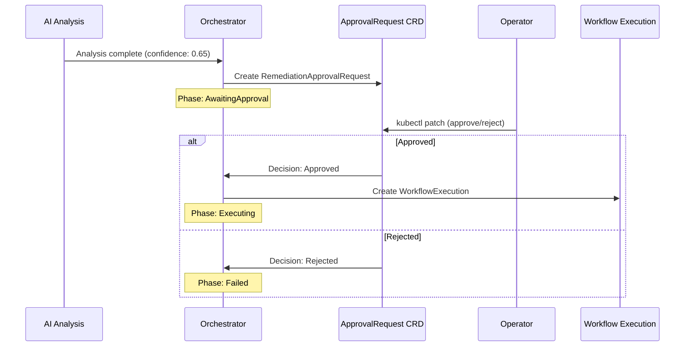

# Human Approval

Kubernaut supports human-in-the-loop approval gates to ensure that remediations are reviewed before execution when confidence is low or policy requires it.

## When Approval Is Required

Approval is determined by a **Rego policy** evaluated during the AI Analysis phase. The policy considers:

- **Confidence score** — The LLM's confidence in the root cause analysis and workflow selection
- **Configurable threshold** — Defaults to 0.8 (80%); configurable via Helm values

When confidence is **at or above** the threshold, the remediation is auto-approved. When below, a `RemediationApprovalRequest` CRD is created and the remediation enters the `AwaitingApproval` phase.

## Confidence Thresholds

Kubernaut uses two confidence thresholds at different stages:

| Stage | Threshold | Configurable | Purpose |
|---|---|---|---|
| **Investigating** (response processor) | 0.7 (70%) | Not yet (V1.1, per BR-HAPI-198; see `pkg/aianalysis/handlers/response_processor.go`) | Rejects workflow selections with very low confidence; detects "problem already resolved" scenarios |
| **Analyzing** (Rego approval policy) | 0.8 (80%) | Yes, via Helm | Controls whether human approval is required before execution |

### Configuring the Approval Threshold

```yaml
# values.yaml
aianalysis:
  rego:
    confidenceThreshold: 0.85  # require 85% confidence for auto-approval
```

When `confidenceThreshold` is `null` (default), the Rego policy's built-in default of 0.8 applies.

## The Approval Flow



## Approving or Rejecting

Operators approve or reject via `kubectl`. The RAR uses a Kubernetes **status subresource**, so the `--subresource=status` flag is required for patch commands.

```bash
# List pending approvals
kubectl get rar -n kubernaut-system

# Approve
kubectl patch rar <name> -n kubernaut-system \
  --subresource=status --type=merge \
  -p '{"status":{"decision":"Approved","decidedBy":"operator-name","decisionMessage":"RCA looks correct"}}'

# Reject
kubectl patch rar <name> -n kubernaut-system \
  --subresource=status --type=merge \
  -p '{"status":{"decision":"Rejected","decidedBy":"operator-name","decisionMessage":"Wrong root cause identified"}}'
```

!!! warning "Use `--subresource=status`"
    Omitting `--subresource=status` targets the main resource spec, which is immutable. The decision must be written to the status subresource for the Orchestrator to detect it.

## Walkthrough: Reviewing a RemediationApprovalRequest

This section walks through a complete approval lifecycle.

### 1. List Pending RARs

```bash
$ kubectl get rar -n kubernaut-system
NAMESPACE          NAME                                   AIANALYSIS                            CONFIDENCE   DECISION   EXPIRED   REQUIREDBY               AGE
kubernaut-system   rar-rr-b0c0f4e80a71-49f643a4          ai-rr-b0c0f4e80a71-49f643a4          0.9                               2026-03-10T00:06:48Z     2m
```

A blank `DECISION` column indicates a pending RAR awaiting operator action.

### 2. Inspect the RAR

```bash
kubectl get rar rar-rr-b0c0f4e80a71-49f643a4 -n kubernaut-system -o yaml
```

```yaml
apiVersion: kubernaut.ai/v1alpha1
kind: RemediationApprovalRequest
metadata:
  name: rar-rr-b0c0f4e80a71-49f643a4
  namespace: kubernaut-system
  ownerReferences:
    - apiVersion: kubernaut.ai/v1alpha1
      kind: RemediationRequest
      name: rr-b0c0f4e80a71
      uid: ...
spec:
  remediationRequestRef:
    name: rr-b0c0f4e80a71
    namespace: kubernaut-system
  aiAnalysisRef:
    name: ai-rr-b0c0f4e80a71-49f643a4
  confidence: 0.9
  confidenceLevel: high
  reason: "Production environment - requires manual approval"
  investigationSummary: |
    Root Cause: The pod nginx-deployment-xyz is in CrashLoopBackOff due to
    an invalid configuration file mounted from ConfigMap 'app-config'. The
    container exits with code 1 during startup when parsing /etc/nginx/nginx.conf.
  recommendedWorkflow:
    workflowId: "crashloop-config-fix-v1"
    version: "1.0.0"
    rationale: "ConfigMap-based fix is appropriate because the deployment is healthy
      except for the configuration error. A rolling restart after fixing the ConfigMap
      will restore service."
  evidenceCollected:
    - "Pod logs show: nginx: [emerg] unknown directive 'proxy_passs' in /etc/nginx/nginx.conf:42"
    - "ConfigMap 'app-config' was last modified 15 minutes ago"
    - "Previous replica was healthy before ConfigMap update"
  alternativesConsidered:
    - workflow: "rollback-deployment-v1"
      reason: "Rejected: config change is in ConfigMap, not in image"
  whyApprovalRequired: "Production environment with high-confidence analysis requires
    human verification before automated remediation"
  policyEvaluation:
    policyName: "aianalysis.approval"
    matchedRules:
      - "Production environment - requires manual approval"
    decision: "require_approval"
  requiredBy: "2026-03-10T00:06:48Z"
status:
  timeRemaining: "12m34s"
  conditions:
    - type: Pending
      status: "True"
      reason: AwaitingDecision
      message: "Waiting for operator approval or rejection"
```

### 3. Review the Key Fields

| Field | What to Check |
|---|---|
| `spec.investigationSummary` | Does the root cause make sense? |
| `spec.recommendedWorkflow` | Is the proposed workflow appropriate? |
| `spec.evidenceCollected` | Does the evidence support the diagnosis? |
| `spec.alternativesConsidered` | Were alternatives reasonably dismissed? |
| `spec.confidence` / `confidenceLevel` | How confident is the system? |
| `spec.policyEvaluation.matchedRules` | Why was approval required? |
| `spec.requiredBy` | How much time is left before expiration? |

### 4. Approve or Reject

```bash
# Approve with rationale
kubectl patch rar rar-rr-b0c0f4e80a71-49f643a4 -n kubernaut-system \
  --subresource=status --type=merge \
  -p '{"status":{"decision":"Approved","decidedBy":"jgil","decisionMessage":"RCA confirmed: ConfigMap typo matches pod logs"}}'

# Or reject
kubectl patch rar rar-rr-b0c0f4e80a71-49f643a4 -n kubernaut-system \
  --subresource=status --type=merge \
  -p '{"status":{"decision":"Rejected","decidedBy":"jgil","decisionMessage":"Root cause is upstream DNS, not config"}}'
```

### 5. Verify the Decision

```bash
$ kubectl get rar -n kubernaut-system
NAMESPACE          NAME                                   AIANALYSIS                            CONFIDENCE   DECISION   EXPIRED   REQUIREDBY               AGE
kubernaut-system   rar-rr-b0c0f4e80a71-49f643a4          ai-rr-b0c0f4e80a71-49f643a4          0.9          Approved             2026-03-10T00:06:48Z     5m
```

After approval, the Orchestrator transitions the `RemediationRequest` from `AwaitingApproval` to `Executing` and creates a `WorkflowExecution` CRD.

## Expiration

If no decision is made before `requiredBy`, the RAR expires:

- `status.expired` is set to `true`
- `status.decision` becomes `Expired`
- `status.decidedBy` is set to `system`
- The Orchestrator transitions the `RemediationRequest` to `Failed`

The default expiration window is **15 minutes**, configurable per signal hierarchy via Helm values.

## Rego Policy Evaluation

The approval decision is governed by the `aianalysis.approval` Rego policy. The policy receives the following input context:

| Input Field | Source | Description |
|---|---|---|
| `confidence` | AI Analysis result | LLM confidence score (0.0--1.0) |
| `confidence_threshold` | Helm values (default: 0.8) | Auto-approval threshold |
| `environment` | Signal Processing classification | `production`, `staging`, `development`, `qa`, `test` |
| `detected_labels` | HAPI label detection | Infrastructure labels (e.g., `stateful`, `gitOpsManaged`) |
| `failed_detections` | HAPI label detection | Labels where detection failed |
| `affected_resource` | AI Analysis RCA result | Target resource `kind` and `name` |
| `warnings` | HAPI investigation | Non-fatal investigation warnings |

The built-in policy behavior:

- **Production namespaces** (`kubernaut.ai/environment=production`): Always require approval, regardless of confidence
- **Non-production namespaces**: Auto-approved unless critical safety conditions (missing `affected_resource`)
- **Missing affected resource**: Always requires approval (default-deny safety)

Operators can customize approval behavior by modifying the Rego policy in the `aianalysis-rego` ConfigMap.

## Approval Context

When a `RemediationApprovalRequest` is created, it includes rich context to help the operator decide:

- **Investigation summary** — The LLM's root cause analysis results
- **Recommended workflow** — Which remediation was proposed and why
- **Confidence score and level** — How confident the system is
- **Why approval is required** — The policy reason for requiring human review
- **Evidence collected** — Supporting data from the investigation
- **Alternatives considered** — Other workflows the system evaluated

## Audit Trail

All approval decisions are captured in the audit trail:

- **Who** approved or rejected (operator identity via admission webhook)
- **When** the decision was made
- **What** reason was provided
- The full context at the time of decision

See [Audit & Observability](audit-and-observability.md) for details.

## Next Steps

- [Effectiveness Monitoring](effectiveness.md) — How Kubernaut evaluates the outcome
- [Configuration Reference](configuration.md) — Tuning confidence thresholds
- [Audit & Observability](audit-and-observability.md) — Compliance and audit trails
